# 00. Master Comparative Matrix & Architectural Scorecard

This document synthesizes findings across all 12 reference implementations analyzed in the `ref/` directory. It evaluates their engineering decisions, communication protocols, terminal management strategies, client modalities, and security boundaries.

---

## 1. System Overview & Taxonomy

| Project | Primary Purpose | Primary Target Agent | Client Modalities | Backend Stack | Protocol Paradigm |
| :--- | :--- | :--- | :--- | :--- | :--- |
| **[247-claude-code-remote](file:///c:/Users/W/Documents/GitHub/OpenRemote/ref/docs/repos/247-claude-code-remote.md)** | 24/7 Autonomous Mobile PWA Shell | Claude Code | Web PWA (Mobile/Desktop) | Next.js 16 + React 19 + Node.js | Dual WS (Raw PTY Stream + Session RPC) |
| **[TeleClaude](file:///c:/Users/W/Documents/GitHub/OpenRemote/ref/docs/repos/TeleClaude.md)** | Lightweight Telegram Bot Bridge | Claude Code | Telegram Bot (Inline UI) | Python 3.11 + python-telegram-bot + SQLite | Non-interactive Batch CLI (`-p stream-json`) |
| **[claude-code-cli-ui](file:///c:/Users/W/Documents/GitHub/OpenRemote/ref/docs/repos/claude-code-cli-ui.md)** | Fullstack Web IDE & Agent Studio | Claude Code | Web App (Nuxt 3 + Vue 3) | Bun / Node.js + Nitro Server | Dual WS (`/api/cli/ws` PTY + `/api/v2/chat/ws`) |
| **[claude-code-telegram](file:///c:/Users/W/Documents/GitHub/OpenRemote/ref/docs/repos/claude-code-telegram.md)** | Enterprise Telegram Bot & Topics Hub | Claude Code | Telegram Bot (Forum Topics) | Python 3.11 + Claude Agent SDK + FastAPI | Native SDK IPC + Webhooks + FastMCP |
| **[claudecodeui](file:///c:/Users/W/Documents/GitHub/OpenRemote/ref/docs/repos/claudecodeui.md)** | Multi-Agent Web IDE & Shell | Claude, Codex, OpenCode | Web App (Next.js 15 + React 18) | Node.js + Express + `@modelcontextprotocol` | Held Stdin Stream + WS PTY + Monotonic Seq |
| **[cortextos](file:///c:/Users/W/Documents/GitHub/OpenRemote/ref/docs/repos/cortextos.md)** | Context-Handoff OS & Telemetry Engine | Claude, Codex, OpenCode | Web Dashboard (Next.js 15) | Node.js + Chokidar + SQLite WAL + SSE | PTY Supervision + Atomic File Bus + SSE |
| **[oc-remote](file:///c:/Users/W/Documents/GitHub/OpenRemote/ref/docs/repos/oc-remote.md)** | Native Android Control Plane | OpenCode | Android Native (Jetpack Compose) | Kotlin + Ktor + In-tree VT100 Canvas | REST + SSE Stream + Binary WS PTY |
| **[opencode-remote](file:///c:/Users/W/Documents/GitHub/OpenRemote/ref/docs/repos/opencode-remote.md)** | Cross-Platform Mobile Chat Companion | OpenCode | Mobile App (React Native + Expo) | TypeScript + Node.js (opencode serve) | Dual-Channel (SSE Push + HTTP Polling Loop) |
| **[opencode-remote-android](file:///c:/Users/W/Documents/GitHub/OpenRemote/ref/docs/repos/opencode-remote-android.md)** | Local-First Mobile TaskDesk (Harness) | OpenCode, Claude, Codex, Pi | Android Hybrid (Capacitor + React) | Node.js Daemon (port 4097) + Java SSE | Multi-Agent Loopback HTTP + Stdio ACP v1 |
| **[paseo](file:///c:/Users/W/Documents/GitHub/OpenRemote/ref/docs/repos/paseo.md)** | Multi-Workspace Agent Orchestrator | Claude, Codex, OpenCode, Pi | Cross-Platform (Expo RN + Electron) | Node.js + Express + Worker Subprocesses | Multiplexed Binary WS (`[Opcode, Slot, Data]`) |
| **[remote-cli](file:///c:/Users/W/Documents/GitHub/OpenRemote/ref/docs/repos/remote-cli.md)** | High-Resilience Remote CLI Supervisor | Claude Code | Telegram Bot + Web Recovery Portal | Node.js + C# WinForms Supervisor | SDK Async Generators + Win32 Bitmap Probe |
| **[remote-opencode](file:///c:/Users/W/Documents/GitHub/OpenRemote/ref/docs/repos/remote-opencode.md)** | Discord Gateway & Voice Interface | OpenCode | Discord Bot (Threads & Voice STT) | Node.js + TypeScript + `discord.js` | Discord Gateway + HTTP/SSE (`opencode serve`) |

---

## 2. Deep Comparative Feature Matrix

```
Legend:
  ✅ Full native support / First-class implementation
  ⚠️ Partial / Primitive / Experimental implementation
  ❌ Not supported / Missing
```

| Architectural Dimension | 247-remote | TeleClaude | cli-ui | claude-tg | claudecodeui | cortextos | oc-remote | opencode-rn | android-harness | paseo | remote-cli | remote-opencode |
| :--- | :---: | :---: | :---: | :---: | :---: | :---: | :---: | :---: | :---: | :---: | :---: | :---: |
| **Execution Engine** | | | | | | | | | | | | |
| True PTY Emulation (`node-pty`/ConPTY) | ✅ | ❌ | ✅ | ❌ | ✅ | ✅ | ✅ | ❌ | ⚠️ | ✅ | ❌ | ❌ |
| Headless SDK / JSON-RPC IPC | ❌ | ⚠️ | ✅ | ✅ | ⚠️ | ⚠️ | ❌ | ❌ | ✅ | ⚠️ | ✅ | ❌ |
| Daemon HTTP/SSE Bridge (`opencode serve`) | ❌ | ❌ | ❌ | ❌ | ❌ | ❌ | ✅ | ✅ | ✅ | ❌ | ❌ | ✅ |
| Multi-Agent Support (Claude/Codex/OpenCode/Pi) | ❌ | ❌ | ⚠️ | ❌ | ✅ | ✅ | ❌ | ❌ | ✅ | ✅ | ❌ | ❌ |
| **Terminal & Stream Handling** | | | | | | | | | | | | |
| Browser/Mobile Terminal (xterm.js / Canvas) | ✅ | ❌ | ✅ | ❌ | ✅ | ❌ | ✅ | ❌ | ❌ | ✅ | ❌ | ❌ |
| ANSI Escape Stripping / Color Parsing | ✅ | ⚠️ | ✅ | ⚠️ | ✅ | ⚠️ | ✅ | ❌ | ❌ | ✅ | ⚠️ | ❌ |
| Touch SGR Mouse Escape Translation | ✅ | ❌ | ❌ | ❌ | ❌ | ❌ | ❌ | ❌ | ❌ | ❌ | ❌ | ❌ |
| Ring Buffer / History Replay | ✅ | ❌ | ⚠️ | ❌ | ⚠️ | ⚠️ | ✅ | ❌ | ❌ | ✅ | ❌ | ⚠️ |
| Binary WebSocket Multiplexing | ❌ | ❌ | ❌ | ❌ | ❌ | ❌ | ⚠️ | ❌ | ❌ | ✅ | ❌ | ❌ |
| **Human-in-the-Loop & UX** | | | | | | | | | | | | |
| Interactive Approval Buttons / Dialogs | ❌ | ⚠️ | ✅ | ✅ | ✅ | ⚠️ | ✅ | ✅ | ✅ | ✅ | ✅ | ⚠️ |
| Structured Inline Diff Viewer | ❌ | ❌ | ⚠️ | ❌ | ✅ | ❌ | ⚠️ | ❌ | ✅ | ✅ | ❌ | ❌ |
| Clarification Prompt Interceptors | ❌ | ❌ | ❌ | ❌ | ❌ | ❌ | ✅ | ✅ | ✅ | ✅ | ❌ | ❌ |
| Mobile Accessory Bar (Esc/Tab/Ctrl+C) | ✅ | ❌ | ❌ | ❌ | ❌ | ❌ | ✅ | ❌ | ✅ | ❌ | ❌ | ❌ |
| Push Notifications (Web Push / Telegram / APNs) | ✅ | ✅ | ❌ | ✅ | ❌ | ⚠️ | ✅ | ❌ | ✅ | ⚠️ | ✅ | ⚠️ |
| Voice / Audio Message STT Processing | ❌ | ❌ | ❌ | ❌ | ❌ | ❌ | ❌ | ❌ | ❌ | ❌ | ❌ | ✅ |
| **Session Isolation & Concurrency** | | | | | | | | | | | | |
| Multi-Workspace / Opaque Session IDs | ⚠️ | ❌ | ⚠️ | ✅ | ⚠️ | ✅ | ⚠️ | ⚠️ | ✅ | ✅ | ❌ | ⚠️ |
| Ephemeral Git Worktrees | ❌ | ❌ | ❌ | ❌ | ❌ | ❌ | ❌ | ❌ | ✅ | ✅ | ❌ | ✅ |
| Immortal Process Preservation (tmux/detached) | ✅ | ❌ | ❌ | ❌ | ❌ | ❌ | ❌ | ❌ | ❌ | ⚠️ | ❌ | ❌ |
| Context Token Handoff / Auto-Compaction | ❌ | ❌ | ❌ | ❌ | ❌ | ✅ | ❌ | ❌ | ❌ | ❌ | ❌ | ❌ |
| **Security & Remote Networking** | | | | | | | | | | | | |
| Bearer Token / Password Authentication | ❌ | ❌ | ❌ | ❌ | ❌ | ❌ | ✅ | ❌ | ❌ | ✅ | ✅ | ✅ |
| User ID / Chat Allowlisting | ❌ | ✅ | ❌ | ✅ | ❌ | ❌ | ❌ | ❌ | ❌ | ❌ | ✅ | ✅ |
| Path Traversal / Directory Sandboxing | ❌ | ✅ | ⚠️ | ✅ | ✅ | ⚠️ | ❌ | ❌ | ⚠️ | ✅ | ✅ | ⚠️ |
| Zero-Knowledge E2EE Tunneling | ❌ | ❌ | ❌ | ❌ | ❌ | ❌ | ❌ | ❌ | ❌ | ✅ | ❌ | ❌ |
| Out-of-Band Supervisor / Dead-Man Watchdog | ❌ | ❌ | ❌ | ⚠️ | ❌ | ✅ | ❌ | ❌ | ❌ | ❌ | ✅ | ❌ |

---

## 3. Detailed Architectural Paradigm Comparison

```mermaid
graph TD
    subgraph Paradigm 1: Raw PTY Pass-Through
        P1_Client[Client: xterm.js / Canvas] <-->|Raw ANSI / Binary WS| P1_Daemon[Host Daemon]
        P1_Daemon <-->|node-pty / ConPTY| P1_Agent[Agent CLI / TUI]
    end

    subgraph Paradigm 2: Headless SDK & JSON-RPC
        P2_Client[Client: Chat / Cards UI] <-->|JSON Events / SSE| P2_Bridge[Host Bridge]
        P2_Bridge <-->|Async Generator / Stdio IPC| P2_Agent[Agent SDK / Runtime]
    end

    subgraph Paradigm 3: Hybrid Stream Engine OpenRemote
        P3_Client[Client: Unified Web PWA / TG / Mobile] <-->|Multiplexed Binary Frame + JSON RPC| P3_Core[OpenRemote Daemon]
        P3_Core -->|Raw Byte Stream| P3_PTY[Managed PTY Worker]
        P3_Core -->|Structured Parser| P3_Parser[ANSI Heuristic + AST Stream Parser]
        P3_Parser -->|Tool Approvals, Diffs, Questions| P3_Bus[PubSub Event Bus]
        P3_PTY <-->|ConPTY / forkpty| P3_Agent[Multi-Agent: Claude/AGY/OpenCode/Codex/Pi]
    end
```



### Paradigm Analysis:

#### 1. Raw PTY Pass-Through (`247-claude-code-remote`, `paseo`, `remote-cli`)
* **Pros**: 100% fidelity to the official CLI/TUI experience; supports full-screen curses/ink interfaces, arrow-key navigation, vim editing, and colors without modifications.
* **Cons**: Consumes high bandwidth on raw ANSI dumps; cannot easily extract structured data (e.g., diff cards, tool approvals) for mobile widgets or Telegram buttons; fragile on mobile touch screens without custom SGR translation.

#### 2. Headless SDK / Batch CLI (`TeleClaude`, `claude-code-telegram`, `remote-cli`)
* **Pros**: Clean structured events (tool name, inputs, status deltas); zero terminal formatting noise; ideal for Telegram inline keyboards and chat bubbles.
* **Cons**: Cannot interact with agents that require interactive terminal keyboard input or custom TUI workflows; locks you into specific SDK versions.

#### 3. Daemon HTTP/SSE Bridge (`oc-remote`, `opencode-remote`, `opencode-remote-android`, `remote-opencode`)
* **Pros**: Decouples UI from agent execution; handles multi-workspace routing via query parameters and HTTP headers; provides native background task resilience.
* **Cons**: Restricted to agents that implement a native daemon architecture (`opencode serve`); requires separate protocol adapters for Claude Code or Antigravity.

#### 4. The OpenRemote Synthesis: Hybrid Engine
OpenRemote adopts a **dual-layer driver**:
- **Layer A (High-Fidelity PTY Pipeline)**: Isolated worker process running `node-pty` / ConPTY streaming binary chunks to xterm.js Canvas Addons.
- **Layer B (Smart Stream Interceptor)**: Non-blocking heuristic state-machine parser that detects:
  1. *Permission Requests*: Intercepts confirmation prompts, synthesizes structured RPC events, and injects `y`/`n` keystrokes upon remote user button click.
  2. *Disambiguation Questions*: Intercepts numbered choices, generates interactive mobile/Telegram selection sheets, and injects selection numbers.
  3. *Diff Streams*: Detects unified diff headers and emits structured file patches for interactive line-by-line diff viewers.
  4. *Turn Completion*: Triggers native push notifications and audio turn alerts.

---

## 4. Top 10 Engineering Decisions to Adopt in OpenRemote

1. **Alternate-Buffer Touch-to-SGR Translation** (*from `247-claude-code-remote`*):
   - Synthesize SGR mouse wheel sequences (`\x1b[<64;1;1M`) on touch swipes to enable native scrolling in terminal alternate screen buffers (tmux / vim).
2. **Decoupled Workspace IDs vs Filesystem Paths** (*from `paseo`*):
   - Assign opaque workspace IDs (`wks_<hex>`) so multiple independent sessions can target the same directory without state collisions.
3. **Ephemeral Git Worktree Isolation** (*from `paseo` and `opencode-remote-android`*):
   - Automatically provision `git worktree add task/<hash>` directories for parallel agent tasks, completely isolating working states.
4. **2.0s Debounced Message Draft Streaming** (*from `claude-code-telegram` and `TeleClaude`*):
   - Use `sendMessageDraft` / debounced message edits to eliminate Telegram flood-wait rate limits while maintaining a live typing experience.
5. **Worker-Thread ConPTY Isolation** (*from `paseo`*):
   - Spawn `node-pty` in a dedicated worker process via Node IPC to trap asynchronous ConPTY C++ exceptions on Windows without crashing the main host daemon.
6. **Native Android SSE Engine with Infinite Read Timeout** (*from `opencode-remote-android`*):
   - Use raw Java `HttpURLConnection` on background executor threads rather than WebView `ReadableStream` to prevent mobile network dropouts during screen-off.
7. **Monotonic Sequence Event Replay (`seq`)** (*from `claudecodeui`*):
   - Tag every daemon event with a monotonic integer so mobile and web clients re-subscribing after network hops receive all missed packets without duplicates.
8. **Held Stdin Prompt Streams** (*from `claudecodeui`*):
   - Keep agent stdin handles open via async generator streams so background subprocesses (bash jobs, monitors, timers) survive turn transitions.
9. **Streaming JSON Sanitizer & Memory Offloader** (*from `oc-remote`*):
   - Extract inline Base64 data URLs into disk-backed image caches, preventing ART / V8 memory pressure on large multimodal outputs.
10. **Out-of-Band Multi-Tier Supervisor** (*from `remote-cli` and `cortextos`*):
    - Run an independent lightweight watchdog supervisor with a dead-man's switch and web restart portal to recover from crashed agent processes.
