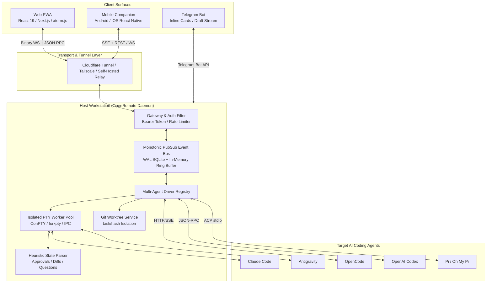
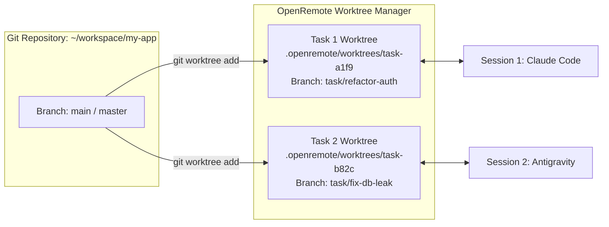

# 01. OpenRemote Master Architecture Blueprint

This document defines the production system architecture for **OpenRemote** — an agent-agnostic, multi-client remote control platform and companion interface for AI coding agents (**Claude Code, Antigravity, OpenCode, Codex, Pi**).

---

## 1. Architectural Philosophy & Design Principles



### Core Tenets:
1. **Local-First & Zero Cloud Ingress**: The host developer machine remains the sole authority for file storage, secret keys, and execution. Remote access operates over secure tunnels (Cloudflare Tunnel, Tailscale, or E2EE relays).
2. **Hybrid Stream Pipeline**: Terminal pass-through (100% ANSI/VT100 fidelity via xterm.js) runs alongside an intelligent AST/heuristic output interceptor that extracts structured tool approval cards, file diffs, and questions for mobile/Telegram surfaces.
3. **Decoupled Opaque Workspaces**: Workspace IDs (`wks_<hex>`) are independent of disk paths. Multi-agent tasks spawn ephemeral `git worktree` sandboxes to prevent working-tree collisions.
4. **Resilient Reconnectability**: Monotonic sequence numbering (`seq`) guarantees zero message loss during mobile network handoffs (WiFi to cellular).

---

## 2. Component Architecture

### A. Host Daemon Core (`openremote-daemon`)
* **Process Supervisor**: Monitors worker subprocesses, traps ConPTY/POSIX exceptions, and handles graceful restarts.
* **PubSub Event Engine**: SQLite in WAL mode with an in-memory ring buffer (10,000 events) providing persistent monotonic event streaming.
* **Worker Process Isolation**: Spawns `node-pty` instances in isolated worker child processes to isolate memory and native ABI crashes from the main server.

### B. Multi-Agent Driver Registry
An extensible interface `IAgentDriver` providing specialized behavior for each target:

```typescript
export interface IAgentDriver {
  readonly agentId: 'claude-code' | 'antigravity' | 'opencode' | 'codex' | 'pi';
  
  // Lifecycle
  startSession(config: SessionConfig): Promise<SessionHandle>;
  stopSession(sessionId: string): Promise<void>;
  
  // Streaming & Interaction
  sendInput(sessionId: string, input: string | Buffer): Promise<void>;
  sendApproval(sessionId: string, approvalId: string, approved: boolean): Promise<void>;
  sendAnswer(sessionId: string, questionId: string, answer: string | number): Promise<void>;
  
  // Capabilities & Hooks
  getCapabilities(): DriverCapabilities;
  onStreamData(callback: (chunk: Buffer) => void): void;
  onStructuredEvent(callback: (event: AgentEvent) => void): void;
}
```

### C. Hybrid Terminal & Heuristic State Interceptor

```mermaid
sequenceDiagram
    participant User as Remote Client (Mobile / Web / TG)
    participant Core as OpenRemote Core Daemon
    participant Parser as Stream Interceptor
    participant PTY as PTY Worker Subprocess
    participant Agent as Claude Code / Antigravity

    User->>Core: sendPrompt("Refactor auth middleware")
    Core->>PTY: write("Refactor auth middleware\n")
    PTY->>Agent: stdin
    Agent-->>PTY: stdout (ANSI Stream)
    PTY-->>Core: Raw Buffer Chunk
    Core-->>User: Binary WS Frame (xterm.js renders live)
    PTY->>Parser: Clone Stream Buffer
    
    rect rgb(30, 40, 60)
        Note over Parser: Heuristic State Detection
        Parser->>Parser: Detect unified diff header (--- a/ +++ b/)
        Parser->>Core: Emit Event: `diff.generated` (file, patch)
        Core->>User: Push Structured Diff Card
        
        Parser->>Parser: Detect Confirmation Prompt: "Do you want to run `npm test`? (y/n)"
        Parser->>Core: Emit Event: `approval.requested` (id, cmd)
        Core->>User: Push Interactive [Allow] [Deny] Notification
    end

    User->>Core: sendApproval(id, true)
    Core->>PTY: write("y\n")
    PTY->>Agent: stdin ("y\n")
    Agent-->>PTY: stdout ("Running tests...")
    PTY-->>User: Raw Stream Update
```



---

## 3. Multi-Surface Client Specifications

### 1. Web PWA (Desktop & Mobile Browser)
* **Stack**: Next.js 15 / React 19 + `@xterm/xterm` (Canvas Addon) + Tailwind CSS + Lucide Icons.
* **Layout**:
  - Desktop: Multi-pane IDE with side-by-side terminal, split-view git diff visualizer, file tree, and chat/task history.
  - Mobile: Full-screen terminal/chat toggle with fixed bottom accessory bar (`Esc`, `Tab`, `Ctrl+C`, `Ctrl+D`, `/approve`, `/stop`).
* **Touch Optimization**: Intercepts mobile touch drags and translates them to SGR mouse escape sequences (`\x1b[<64;1;1M` / `\x1b[<65;1;1M`) for smooth scrollback in tmux / alternate screen buffers.

### 2. Telegram Bot Companion
* **Stack**: Python 3.11 / Node.js + `python-telegram-bot` / `telegraf` + SQLite.
* **UX & Interaction**:
  - **Draft Streaming**: Streams live agent thinking and tool output using `sendMessageDraft` or debounced edits ($\ge 2.0\text{s}$).
  - **Inline Approvals**: Generates inline keyboard buttons (`✅ Approve` / `❌ Reject` / `✏️ Edit`) when tools or bash commands require user consent.
  - **Forum Topics**: Automatically maps different active projects/sessions to Telegram Forum Topics (`thread_id`), providing clean multi-project isolation.
  - **Document Attachments**: Auto-uploads files modified by the agent ($st\_mtime \ge run\_started$) as downloadable Telegram documents.

### 3. Mobile Companion (Native / React Native)
* **Stack**: React Native (Expo) + Custom Native Java/Kotlin SSE Service (`LiveEventsPlugin`).
* **Reliability Features**:
  - Native background executor service with infinite read timeout (`setReadTimeout(0)`), immune to Android WebView sleep / Doze mode.
  - 30-second stall watchdog with exponential backoff auto-reconnection.
  - Haptic feedback on tool execution and task completion alerts.

---

## 4. Worktree & Concurrency Isolation



* When a task is submitted with isolated execution enabled, OpenRemote:
  1. Creates a detached git worktree: `git worktree add .openremote/worktrees/<task-id> -b task/<slug>`.
  2. Allocates dedicated ephemeral ports for test servers/watchers.
  3. Binds the agent's working directory to the worktree path.
  4. Upon task completion and user approval, generates a clean merge/PR back into the target branch.

---

## 5. Security & Access Control

1. **Authentication Gateway**:
   - Host daemon binds to `127.0.0.1` by default.
   - All inbound WebSocket and REST requests require `Authorization: Bearer <token>` where token is a cryptographically secure 256-bit random hex string generated at daemon startup or loaded from `~/.openremote/config.json` (`0o600` permissions).
2. **Directory Sandboxing**:
   - Every file read, write, or reveal API call enforces path canonicalization (`path.resolve`) and verifies that the target path resides within an allowed workspace root, strictly preventing `../../` directory traversal attacks.
3. **Out-of-Band Watchdog & Dead-Man's Switch**:
   - An independent watchdog process monitors the main daemon PID. If the daemon process crashes or freezes (failing 3 consecutive 10s health probes), the watchdog logs the failure, sends an alert notification, and performs a clean reboot with session restoration from SQLite WAL.
