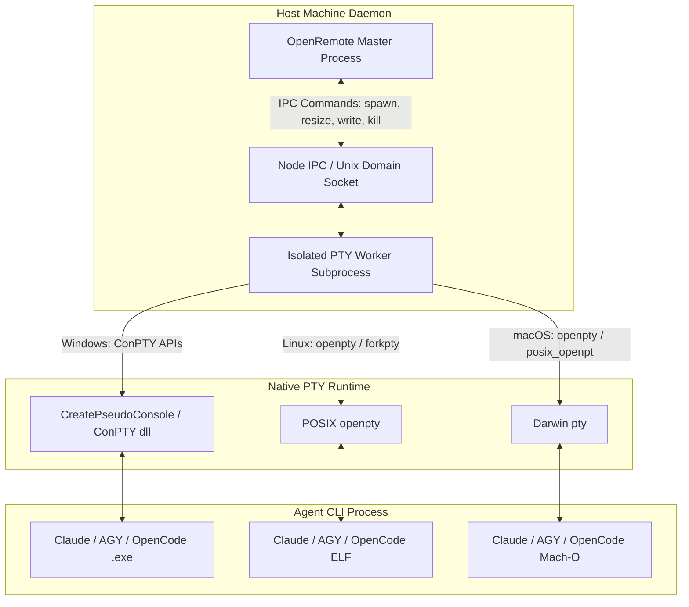

# 02. PTY Management, Streaming & Heuristic Output Parser Guide

This guide provides deep technical instructions for building a rock-solid, cross-platform pseudo-terminal (PTY) engine, WebSocket streaming pipeline, and intelligent stream parser for **OpenRemote**.

---

## 1. Cross-Platform PTY Architecture



### Why Worker Process Isolation is Mandatory

On Windows, `node-pty` utilizes Microsoft's **ConPTY** engine (`CreatePseudoConsole`). ConPTY has known asynchronous C++ exception edge cases when child processes exit abruptly or console buffers are rapidly resized (`SIGWINCH`). If `node-pty` runs on the main server thread, an unhandled C++ runtime exception immediately crashes the entire Node/Bun process.

**OpenRemote Solution**:
1. Run all PTY allocations in an isolated worker process (`pty-worker.ts`) forked via `child_process.fork()`.
2. Wrap IPC messages with timeouts. If the worker encounters a fatal ConPTY fault, the master process traps the exit, restarts the worker, and re-attaches the session without terminating the web server.

---

## 2. PTY Lifecycle & ConPTY Quirks on Windows

### ConPTY Windows Gotchas & Fixes:

```typescript
// pty-worker.ts
import * as pty from 'node-pty';
import os from 'os';

export class ManagedPTY {
  private ptyProcess: pty.IPty | null = null;
  private isWindows = os.platform() === 'win32';

  public spawn(command: string, args: string[], cwd: string, cols = 120, rows = 30) {
    const env = {
      ...process.env,
      TERM: 'xterm-256color',
      COLORTERM: 'truecolor',
      FORCE_COLOR: '3',
      // Ensure UTF-8 output on Windows
      ...(this.isWindows ? { PYTHONIOENCODING: 'utf-8', LANG: 'en_US.UTF-8' } : {})
    };

    this.ptyProcess = pty.spawn(command, args, {
      name: 'xterm-256color',
      cols,
      rows,
      cwd,
      env,
      // ConPTY backend settings
      useConpty: this.isWindows,
      conptyInheritCursor: false
    });

    this.ptyProcess.onData((data: string) => {
      // Send raw binary chunks to master daemon via IPC
      process.send?.({ type: 'pty_output', chunk: Buffer.from(data, 'utf-8') });
    });

    this.ptyProcess.onExit(({ exitCode, signal }) => {
      process.send?.({ type: 'pty_exit', exitCode, signal });
    });
  }

  public resize(cols: number, rows: number) {
    if (!this.ptyProcess) return;
    // Guard against invalid dimensions that crash ConPTY
    const safeCols = Math.max(10, Math.min(cols, 500));
    const safeRows = Math.max(5, Math.min(rows, 200));
    
    try {
      this.ptyProcess.resize(safeCols, safeRows);
    } catch (err) {
      console.error('ConPTY resize ignored due to transient state:', err);
    }
  }

  public write(data: string | Buffer) {
    if (!this.ptyProcess) return;
    this.ptyProcess.write(typeof data === 'string' ? data : data.toString('utf-8'));
  }
}
```

---

## 3. High-Performance WebSocket Streaming & Ring Buffering

### Binary Framing Protocol:
To avoid JSON serialization and Base64 encoding overhead on high-throughput terminal streams, OpenRemote uses a **2-byte header binary framing protocol**:

```
 0                   1                   2                   3
 0 1 2 3 4 5 6 7 8 9 0 1 2 3 4 5 6 7 8 9 0 1 2 3 4 5 6 7 8 9 0 1
+-+-+-+-+-+-+-+-+-+-+-+-+-+-+-+-+-+-+-+-+-+-+-+-+-+-+-+-+-+-+-+-+
|  Opcode (1B)  | Session Slot  |         Payload Bytes...      |
+-+-+-+-+-+-+-+-+-+-+-+-+-+-+-+-+-+-+-+-+-+-+-+-+-+-+-+-+-+-+-+-+
```

* **Opcode `0x01`**: Raw PTY Output (Server -> Client)
* **Opcode `0x02`**: Raw PTY Input / Keystroke (Client -> Server)
* **Opcode `0x03`**: Resize Viewport `[Cols: uint16, Rows: uint16]` (Client -> Server)
* **Opcode `0x04`**: Monotonic Catchup Request `[LastSeq: uint32]` (Client -> Server)
* **Opcode `0x05`**: Structured JSON Event Payload (Server <-> Client)

### Bounded In-Memory Ring Buffer:
```typescript
export class TerminalRingBuffer {
  private buffer: Buffer[] = [];
  private totalBytes = 0;
  private readonly maxBytes: number;

  constructor(maxMegabytes = 4) {
    this.maxBytes = maxMegabytes * 1024 * 1024;
  }

  public push(chunk: Buffer) {
    this.buffer.push(chunk);
    this.totalBytes += chunk.length;

    // Prune oldest chunks when limit exceeded
    while (this.totalBytes > this.maxBytes && this.buffer.length > 0) {
      const removed = this.buffer.shift();
      if (removed) this.totalBytes -= removed.length;
    }
  }

  public getSnapshot(): Buffer {
    return Buffer.concat(this.buffer);
  }

  public clear() {
    this.buffer = [];
    this.totalBytes = 0;
  }
}
```

---

## 4. Mobile Touch-to-SGR Mouse Escape Translation

When accessing terminal applications (e.g. `tmux`, `less`, `vim`, or interactive agent TUI logs) on mobile touchscreens, standard swipe gestures fail to scroll because alternate screen buffers capture scrolling as mouse wheel events.

**OpenRemote Touch Translator** (*inspired by `247-claude-code-remote`*):

```typescript
// Mobile Touch Drag to SGR Mouse Wheel Sequence
export function handleTouchScroll(deltaY: number, col = 1, row = 1): string {
  // SGR Mouse Protocol format: \x1b[<Btn;Col;RowM
  // Btn 64 = Mouse Wheel Up, Btn 65 = Mouse Wheel Down
  const button = deltaY < 0 ? 64 : 65;
  const repeatCount = Math.min(Math.ceil(Math.abs(deltaY) / 20), 5);
  
  let sequences = '';
  for (let i = 0; i < repeatCount; i++) {
    sequences += `\x1b[<${button};${col};${row}M`;
  }
  return sequences;
}
```

---

## 5. Intelligent Stream Interceptor & Prompt Parser

While raw terminal output streams directly to xterm.js, a lightweight non-blocking parser inspects chunks in real-time to detect agent state changes:

```typescript
export class HeuristicStreamParser {
  private lineAccumulator = '';

  // ANSI strip regex for clean matching
  private static ANSI_REGEX = /[\u001b\u009b][[()#;?]*(?:[0-9]{1,4}(?:;[0-9]{0,4})*)?[0-9A-ORZcf-nqry=><]/g;

  public feed(chunk: Buffer): ParsedStreamEvent[] {
    const text = chunk.toString('utf-8');
    this.lineAccumulator += text;
    
    // Keep last 4KB for multi-chunk regex matching
    if (this.lineAccumulator.length > 4096) {
      this.lineAccumulator = this.lineAccumulator.slice(-4096);
    }

    const cleanText = this.lineAccumulator.replace(HeuristicStreamParser.ANSI_REGEX, '');
    const events: ParsedStreamEvent[] = [];

    // 1. Detect Permission Prompt
    const permMatch = cleanText.match(/(?:Do you want to run|Allow execution of|Grant permission for)\s*[`"']([^`"']+)`?'?\s*\((?:y\/n|yes\/no)\)/i);
    if (permMatch) {
      events.push({
        type: 'permission_prompt',
        command: permMatch[1],
        promptText: permMatch[0]
      });
    }

    // 2. Detect Disambiguation / Multiple Choice Question
    const questionMatch = cleanText.match(/\?\s*Select an option:\s*\n((?:\s*\d+\)[^\n]+\n?)+)/i);
    if (questionMatch) {
      const options = questionMatch[1].split('\n')
        .map(opt => opt.trim())
        .filter(opt => /^\d+\)/.test(opt));
      
      events.push({
        type: 'selection_prompt',
        options
      });
    }

    // 3. Detect Unified Diff Patch
    if (cleanText.includes('--- a/') && cleanText.includes('+++ b/')) {
      events.push({
        type: 'diff_detected',
        rawText: cleanText
      });
    }

    return events;
  }
}
```

---

## 6. Frontend xterm.js Rendering Best Practices

```typescript
// TerminalComponent.tsx
import { Terminal } from '@xterm/xterm';
import { CanvasAddon } from '@xterm/addon-canvas';
import { FitAddon } from '@xterm/addon-fit';
import { WebLinksAddon } from '@xterm/addon-web-links';

export function initializeTerminal(container: HTMLElement, ws: WebSocket) {
  const term = new Terminal({
    cursorBlink: true,
    fontFamily: 'JetBrains Mono, Menlo, Monaco, "Courier New", monospace',
    fontSize: 13,
    lineHeight: 1.2,
    theme: {
      background: '#0e1117',
      foreground: '#e6edf3',
      cursor: '#58a6ff',
      selectionBackground: '#1f6feb44'
    },
    allowProposedApi: true
  });

  const fitAddon = new FitAddon();
  term.loadAddon(fitAddon);
  term.loadAddon(new CanvasAddon()); // 3-5x faster rendering than DOM
  term.loadAddon(new WebLinksAddon());

  term.open(container);
  fitAddon.fit();

  // Send input over Binary WebSocket
  term.onData((data) => {
    const payload = Buffer.from(data, 'utf-8');
    const frame = Buffer.concat([Buffer.from([0x02, 0x00]), payload]);
    if (ws.readyState === WebSocket.OPEN) {
      ws.send(frame);
    }
  });

  // Handle ResizeObserver
  const resizeObserver = new ResizeObserver(() => {
    fitAddon.fit();
    const frame = Buffer.alloc(6);
    frame[0] = 0x03; // Resize Opcode
    frame[1] = 0x00; // Slot
    frame.writeUInt16BE(term.cols, 2);
    frame.writeUInt16BE(term.rows, 4);
    if (ws.readyState === WebSocket.OPEN) {
      ws.send(frame);
    }
  });
  resizeObserver.observe(container);

  return { term, fitAddon, resizeObserver };
}
```
