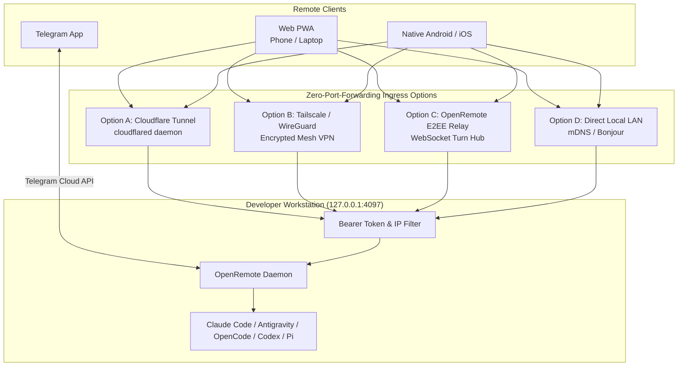

# 03. Networking, Tunneling & Security Guide

This document specifies the network architecture, remote tunneling integrations, cryptographic security model, and sandboxing rules for **OpenRemote**.

---

## 1. Remote Connectivity Topology



---

## 2. Ingress & Tunneling Options

### Option A: Cloudflare Tunnel (`cloudflared`) — Recommended for Instant Web Access
* **How it works**: Spawns an outbound HTTPS/WSS tunnel to Cloudflare's edge network without opening firewall ports or acquiring a static public IP.
* **OpenRemote Integration**:
  ```bash
  # Automatic Tunnel Spawning
  cloudflared tunnel --url http://127.0.0.1:4097 --no-autoupdate
  ```
* **Security Layer**: Protect the edge endpoint with Cloudflare Access (OAuth / GitHub / Google sign-in) or OpenRemote's built-in cryptographic bearer token.

### Option B: Tailscale / WireGuard — Recommended for Private Mesh VPN
* **How it works**: Direct peer-to-peer encrypted connection between your phone/laptop and your development workstation.
* **Advantage**: Zero cloud exposure, sub-millisecond local network latency, automatic device DNS (`my-workstation.tailnet.ts.net:4097`).

### Option C: OpenRemote Self-Hosted E2EE Relay Hub
* **How it works** (*inspired by `paseo`'s relay model*):
  - A lightweight public WebSocket relay routes encrypted frames between the host machine and mobile/web clients.
  - End-to-End Encryption uses **TweetNaCl** (Curve25519 ECDH key exchange + XSalsa20-Poly1305 symmetric encryption).
  - The relay server sees only opaque encrypted binary payloads; secrets never touch the relay.

---

## 3. Cryptographic Authentication & Access Control

### 1. Token Generation & Storage:
Upon first launch, OpenRemote generates a cryptographically secure 256-bit authentication token and writes it to `~/.openremote/config.json` with strict POSIX file permissions (`0o600`):

```typescript
import crypto from 'crypto';
import fs from 'fs';
import path from 'path';
import os from 'os';

export function getOrCreateAuthToken(): string {
  const configDir = path.join(os.homedir(), '.openremote');
  const configFile = path.join(configDir, 'config.json');

  if (!fs.existsSync(configDir)) {
    fs.mkdirSync(configDir, { recursive: true, mode: 0o700 });
  }

  if (fs.existsSync(configFile)) {
    const config = JSON.parse(fs.readFileSync(configFile, 'utf-8'));
    if (config.authToken) return config.authToken;
  }

  const token = crypto.randomBytes(32).toString('hex');
  fs.writeFileSync(configFile, JSON.stringify({ authToken: token, createdAt: new Date().toISOString() }, null, 2), {
    mode: 0o600
  });

  return token;
}
```

### 2. WebSocket & HTTP Handshake Verification:
```typescript
import { IncomingMessage } from 'http';
import url from 'url';

export function verifyRequestAuth(req: IncomingMessage, expectedToken: string): boolean {
  // 1. Check Authorization Header (Bearer token)
  const authHeader = req.headers['authorization'];
  if (authHeader && authHeader.startsWith('Bearer ')) {
    const token = authHeader.slice(7).trim();
    if (crypto.timingSafeEqual(Buffer.from(token), Buffer.from(expectedToken))) {
      return true;
    }
  }

  // 2. Check Query Parameter for WebSockets (?token=...)
  const parsedUrl = url.parse(req.url || '', true);
  const queryToken = parsedUrl.query.token;
  if (typeof queryToken === 'string') {
    if (crypto.timingSafeEqual(Buffer.from(queryToken), Buffer.from(expectedToken))) {
      return true;
    }
  }

  return false;
}
```

---

## 4. Directory Sandboxing & Path Traversal Defense

To prevent malicious remote actors from requesting system sensitive files (`/etc/passwd`, `C:\Windows\System32`, `~/.ssh/id_rsa`), OpenRemote enforces strict **path canonicalization and workspace containment checks**:

```typescript
export function validateSafePath(targetPath: string, allowedWorkspaceRoots: string[]): string {
  const resolved = path.resolve(targetPath);

  // Check that the resolved path starts within one of the approved workspace directories
  const isAllowed = allowedWorkspaceRoots.some(root => {
    const resolvedRoot = path.resolve(root);
    return resolved === resolvedRoot || resolved.startsWith(resolvedRoot + path.sep);
  });

  if (!isAllowed) {
    throw new Error(`Security Violation: Access denied to path outside active workspace: ${targetPath}`);
  }

  return resolved;
}
```

---

## 5. Telegram Bot Security Model

For the Telegram interface, OpenRemote enforces a multi-tier defense:

1. **User ID Whitelist**:
   - Compares incoming `update.message.from_user.id` against `TELEGRAM_ALLOWED_USER_IDS`.
   - Unauthorized messages are dropped silently without acknowledging commands or exposing agent status.
2. **Ephemeral PIN Verification** (*inspired by `remote-cli`*):
   - For high-risk destructive commands (`rm -rf`, `git push --force`, `drop database`), the bot prompts for a one-time 4-digit PIN generated on the host terminal.
   - The PIN self-destructs after 60 seconds or 3 incorrect attempts.
3. **Command Sanitization**:
   - Injects prompts using bracketed paste mode (`\x1b[200~` ... `\x1b[201~`) to prevent shell injection and unintended raw control character execution.
