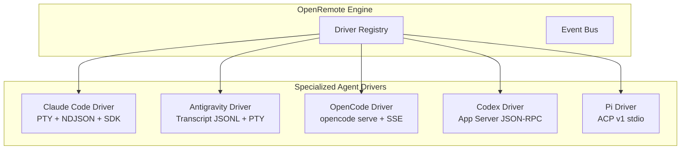

# 04. Multi-Agent Adapter Specifications & Tuning Guide

This document details the driver implementations, execution flags, communication channels, and specialized heuristics for integrating **Claude Code, Antigravity, OpenCode, Codex, and Pi** into **OpenRemote**.

---

## 1. Unified Agent Driver Architecture

---

## 2. Agent 1: Claude Code (Anthropic)

### Execution Modes:
1. **Interactive PTY Mode** (*Default for full TUI*):
   - Command: `claude` (or `claude --remote-control "<name>"` for dual terminal + web session).
   - Flags: `--no-auto-updater`, `--permission-overrides` (optional).
   - Injects input with bracketed paste mode (`\x1b[200~<prompt>\x1b[201~\n`).
2. **Headless Batch / SDK Stream Mode** (*For chat-first Telegram & Mobile surfaces*):
   - Command: `claude -p --output-format stream-json --verbose`
   - Streaming: Emits line-delimited JSON (NDJSON) events.

### Specialized Stream Parsing & Hooks:
* **Held Stdin Stream**: Maintain the stdin stream open across turns via async generators to prevent background task termination.
* **OAuth Login Detection**: Scan ANSI stream with regex `https:\/\/claude\.ai\/login\?[^\s]+` and emit structured `auth_url` toasts.
* **Tool Permissions**: Intercept `can_use_tool` callbacks or PTY confirmation prompts (`Do you want to run...`), dispatching structured approval buttons.
* **Subagent / Workflows**: Detect subagent spawn lines and group tool outputs under nested collapsibles.

---

## 3. Agent 2: Antigravity (Google DeepMind)

### Execution & Integration:
* **Interactive PTY / CLI Mode**:
  - Invokes `agy` CLI or runs inside Antigravity environment.
  - Monitors planning mode state transitions (`implementation_plan.md`, `walkthrough.md`).
* **Transcript & Artifact Bus**:
  - Taps into `<appDataDir>/brain/<conversation-id>/.system_generated/logs/transcript.jsonl` for high-fidelity structured step logs.
  - Watches `<appDataDir>/brain/<conversation-id>/` for newly generated markdown artifacts and images, rendering them immediately in the OpenRemote client UI.

---

## 4. Agent 3: OpenCode

### Architecture & Communication:
* **Daemon Supervision**:
  - Spawns `opencode serve --port <port> --hostname 127.0.0.1`.
  - Dynamic port range: `14097` to `14200`.
* **Dual-Channel Protocol**:
  - **SSE Event Stream**: `GET /event` (streams `message.part.updated`, `session.idle`, `session.error`).
  - **REST Command API**:
    - Submit Prompt: `POST /session/:id/prompt_async`
    - Permission Reply: `POST /permission/:id/reply` `{ "reply": "allow" | "deny" }`
    - Disambiguation Reply: `POST /question/:id/reply` `{ "answers": ["..."] }`
    - Abort Execution: `POST /session/:id/abort`
* **Multi-Directory Scoping**: Passes `x-opencode-directory: <path>` header to target different repositories on the same running daemon.

---

## 5. Agent 4: OpenAI Codex

### Execution & Transport:
* **App Server JSON-RPC**:
  - Spawns Codex CLI in app server mode communicating over JSON-RPC 2.0 via Unix domain sockets or loopback TCP.
* **Transcript & Multi-Writer Management**:
  - Reads `~/.codex/sessions/**/rollout-*.jsonl` with read-sharing flags to parse live tool invocations while the CLI holds thread writer locks.
* **Patch & Diff Extraction**:
  - Extracts structured file patch objects and renders line-by-line diffs with split-view syntax highlighting.

---

## 6. Agent 5: Pi / Oh My Pi

### Protocol & Stdio Communication:
* **Agent Client Protocol (ACP v1)**:
  - Spawns `pi` or `omp` over stdio with ACP v1 JSON-RPC protocol framing.
  - Capabilities negotiation: tool call authorization, markdown streaming, file edits.
* **Structured Output Cards**:
  - Maps ACP message blocks directly into OpenRemote structured UI widgets (Thinking card, Bash execution card, File patch card).
