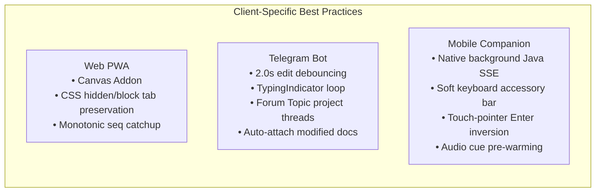

# 06. OpenRemote Engineering Best Practices & Architecture Patterns

This document establishes the definitive engineering guidelines, architectural patterns, and production checklists for building **OpenRemote** — distilled from deep code audits across 12 reference implementations.

---

## 1. Process & PTY Management Best Practices

### Rule 1.1: Always Isolate ConPTY in a Dedicated Worker Subprocess
* **Problem**: On Windows, `node-pty` / Microsoft ConPTY (`CreatePseudoConsole`) can throw uncatchable asynchronous C++ runtime exceptions when processes terminate abruptly or when rapid `SIGWINCH` resize events occur. If run in the main process, this instantly crashes your entire server.
* **Best Practice**: Fork an isolated worker process (`pty-worker.ts`) via Node IPC. If the worker crashes, the main daemon detects the exit, restarts the worker, and re-attaches the session state without dropping connected web clients or killing other active sessions.

### Rule 1.2: Enforce Strict Memory Caps on Terminal Output Ring Buffers
* **Problem**: Unbounded memory buffers (`history += chunk`) will trigger V8 heap Out-Of-Memory (OOM) crashes when an agent or bash tool dumps large build logs, package installations, or search results (e.g. 50MB+ outputs).
* **Best Practice**: Use a chunk-based **Sliding Ring Buffer** capped at 4MB to 8MB per terminal session. When new chunks arrive past the threshold, shift the oldest chunks off the queue. When clients connect or reconnect, send `Buffer.concat(ringBuffer)` as the initial snapshot.

### Rule 1.3: Convert Touch Drag Gestures to SGR Mouse Sequences on Mobile
* **Problem**: Mobile touch dragging on terminal alternate screen buffers (used by `tmux`, `less`, `vim`, or full-screen agent TUIs) fails to scroll because the terminal treats swipes as text selection instead of scrollback.
* **Best Practice**: Intercept `touchmove` events on the terminal canvas and synthesize **SGR Mouse Wheel Escape Sequences**:
  - Scroll Up: `\x1b[<64;${col};${row}M`
  - Scroll Down: `\x1b[<65;${col};${row}M`

### Rule 1.4: Guard Viewport Resizing with Dimension Clamping
* **Problem**: Sending `0`, negative, or extreme dimensions (e.g. `cols = 0`, `cols = 99999`) to `pty.resize()` crashes native PTY drivers.
* **Best Practice**: Clamp all resize inputs:
  ```typescript
  const safeCols = Math.max(10, Math.min(cols || 80, 500));
  const safeRows = Math.max(5, Math.min(rows || 24, 200));
  ptyProcess.resize(safeCols, safeRows);
  ```

---

## 2. Multi-Agent Orchestration & Parsing Best Practices

### Rule 2.1: Keep Agent Stdin Streams Held Open Across Turns
* **Problem**: Spawning a fresh CLI process per turn (`claude -p "..."`) kills background jobs (e.g., dev servers, test watchers, monitoring subagents) when the command finishes.
* **Best Practice**: Maintain a persistent interactive PTY or held async generator stream. Send prompts with bracketed paste mode (`\x1b[200~<prompt>\x1b[201~\n`) so long-running background tasks remain immortal.

### Rule 2.2: Decouple Opaque Workspace IDs from Physical Working Directories
* **Problem**: Keying agent sessions by directory path (`cwd`) prevents running multiple concurrent tasks on the same project without state collisions and file contention.
* **Best Practice**: Assign opaque workspace IDs (`wks_<random_hex>`). Partition state into:
  - **Workspace-Scoped**: Review drafts, task logs, conversation history, pending approvals (keyed by `workspaceId`).
  - **Directory-Scoped**: Git status, branch metadata, file tree cache (keyed by `cwd`).

### Rule 2.3: Automate Ephemeral Git Worktree Sandboxing for Parallel Tasks
* **Problem**: Concurrent agents editing the same branch cause Git index lock contention (`.git/index.lock`) and overwrite each other's uncommitted edits.
* **Best Practice**: For multi-agent or background tasks, automatically provision ephemeral Git worktrees:
  ```bash
  git worktree add .openremote/worktrees/task-123 -b task/feature-name
  ```
  Clean up the worktree via `git worktree remove --force` upon task completion and PR creation.

### Rule 2.4: Non-Blocking Heuristic Parsing for Human-in-the-Loop Interceptions
* **Best Practice**: While streaming raw bytes to xterm.js, pass chunks through a non-blocking regex parser to extract:
  1. **Permission Prompts**: `/(?:Do you want to run|Allow execution of|Grant permission for)\s*[`"']([^`"']+)`?'?\s*\((?:y\/n|yes\/no)\)/i` -> Dispatch interactive `[Allow]` `[Deny]` push card.
  2. **Disambiguation / Multi-Choice**: `/\?\s*Select an option:\s*\n((?:\s*\d+\)[^\n]+\n?)+)/i` -> Dispatch interactive selection sheet.
  3. **Unified Diffs**: `/^---\s+a\/.*?\n\+\+\+\s+b\//m` -> Dispatch structured side-by-side diff viewer.

---

## 3. Client Surface Best Practices (Web, Telegram, Mobile)



### Rule 3.1: Telegram Bot Rate Limiting & UI Throttling
* **Problem**: Telegram enforces a strict flood-limit of ~1 edit per second per chat. Rapidly editing messages on token stream deltas results in `429 Too Many Requests (Retry After Ns)`.
* **Best Practice**:
  - Throttle message edits to intervals of **$\ge 2.0$ seconds**.
  - Keep a background `TypingIndicator` task calling `send_chat_action("typing")` every 4.5 seconds to prevent the typing state from expiring.
  - When output exceeds 4,000 characters, seal the current message at a newline boundary and start a new message bubble.
  - Auto-upload modified files ($st\_mtime \ge run\_started$) as downloadable `.md` or `.patch` Telegram documents.

### Rule 3.2: Native Mobile Background SSE Engine
* **Problem**: Mobile operating systems (Android Doze, iOS background app refresh) freeze WebViews and terminate JavaScript `EventSource` / `fetch(ReadableStream)` connections after ~30 seconds of screen-off.
* **Best Practice**: Implement SSE streaming in a native background service (Java `HttpURLConnection` on Android with `setReadTimeout(0)` and infinite keep-alive). Forward events to the UI layer via native bridge events.

### Rule 3.3: Mobile Soft-Keyboard & Accessory Bar Design
* **Best Practice**:
  - Detect mobile touch devices (`window.matchMedia('(pointer: coarse)').matches`) and invert enter key behavior: **Enter = Newline**, **Ctrl+Enter / Send Button = Submit**.
  - Provide a fixed accessory bar above the mobile soft keyboard with critical terminal modifiers: `Esc`, `Tab`, `Ctrl+C`, `Ctrl+D`, `/approve`, `/stop`.

### Rule 3.4: Web Component State Preservation on Tab Switching
* **Best Practice**: When switching between Chat, Terminal, and File Editor tabs in the Web PWA, toggle visibility with CSS classes (`display: none` / `hidden`) rather than unmounting the React/Vue component. This preserves terminal scrollback offsets, xterm cursor state, active form inputs, and pending tool approvals.

---

## 4. Networking, Tunneling & Security Best Practices

### Rule 4.1: Bind Exclusively to Loopback (127.0.0.1) by Default
* **Best Practice**: The OpenRemote daemon must bind strictly to `127.0.0.1` (never `0.0.0.0`) unless explicitly configured with TLS certificates and authentication.

### Rule 4.2: Cryptographic Bearer Token with POSIX File Permissions
* **Best Practice**:
  - Generate a 256-bit random hex token (`crypto.randomBytes(32).toString('hex')`).
  - Store it in `~/.openremote/config.json` with `0o600` POSIX permissions (owner read/write only).
  - Verify tokens using constant-time comparison (`crypto.timingSafeEqual`) to prevent timing attacks.

### Rule 4.3: Canonical Path Verification for All File Operations
* **Best Practice**: Never trust user-supplied file paths directly. Always verify that canonicalized paths reside inside authorized workspace boundaries:
  ```typescript
  const resolved = path.resolve(targetPath);
  const isSafe = allowedRoots.some(root => resolved === root || resolved.startsWith(root + path.sep));
  if (!isSafe) throw new SecurityError("Path traversal attempt detected");
  ```

### Rule 4.4: Zero-Port-Forwarding Remote Access
* **Best Practice**: Provide one-click zero-configuration remote access using:
  1. **Cloudflare Tunnel**: `cloudflared tunnel --url http://127.0.0.1:4097` (instant public HTTPS/WSS URL with optional Cloudflare Access Zero Trust auth).
  2. **Tailscale Mesh**: Direct encrypted point-to-point WireGuard routing over `tailscale.net`.
  3. **End-to-End Encrypted Relay**: TweetNaCl (XSalsa20-Poly1305 + Curve25519) WebSocket relay for users without Cloudflare/Tailscale accounts.

---

## 5. Reliability & Fault Tolerance Checklist

| Area | Production Requirement | Failure Mode Prevented |
| :--- | :--- | :--- |
| **Monotonic Event Sequencing** | Tag every event with a strictly increasing `seq` integer. Clients send `lastSeq` on reconnect to fetch missed deltas. | Lost messages & state desynchronization during network hops (WiFi <-> Cellular). |
| **Out-of-Band Watchdog** | Independent supervisor process monitoring daemon PID via 10s heartbeat checks. | Silent process crashes or unhandled event loop freezes. |
| **Crash-Loop Circuit Breaker** | Track crashes in a sliding window (e.g. $\ge 3$ crashes within 15 minutes -> pause auto-restart and notify user). | Rapid infinite reboot loops draining battery and CPU. |
| **Streaming Memory Sanitizer** | Offload inline Base64 data URLs in LLM outputs to disk-backed image caches (`/tmp/openremote/images/`). | Android ART / V8 heap Out-Of-Memory crashes. |
| **SQLite WAL Mode** | Open SQLite with `PRAGMA journal_mode = WAL; PRAGMA synchronous = NORMAL;`. | Database lock contention under concurrent read/write loads. |
| **Terminal Viewport Sizing** | Debounce `ResizeObserver` events by 100ms before sending PTY resize frames. | ConPTY frame buffer thrashing and visual artifacts during window resize. |
