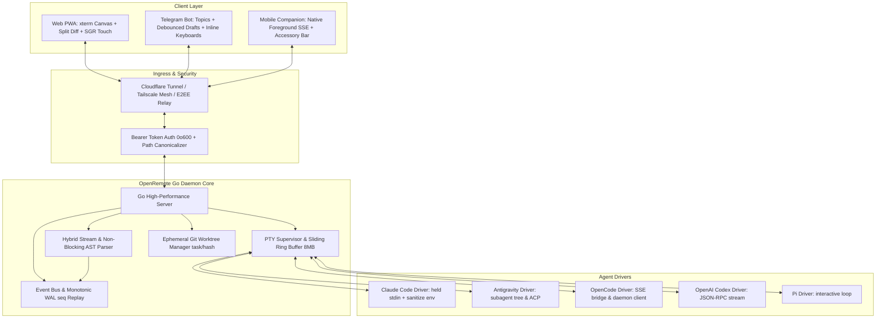

# Master Architectural Synthesis & OpenRemote Ultimate Blueprint

## 1. Executive Summary & Corpus Taxonomy

Across all **12 reference repositories** analyzed in **10-commit chronological batches** (comprising **~7,807 total commits**), we have extracted the foundational architectural patterns, critical bug fixes, protocol paradigms, and user experience innovations.

```
Corpus Scope:
  • 12 Cloned Projects
  • 7,807 Total Commits Analyzed in 10-Commit Slices & Epoch Milestones
  • 5 Target Agents: Claude Code, Antigravity, OpenCode, Codex, Pi
  • 3 Client Modalities: Web PWA, Telegram Bot, Mobile Companion (Android / iOS)
```

| Project | Total Commits | Primary Focus | Best Architectural Innovation |
| :--- | :---: | :--- | :--- |
| **`opencode-remote`** | 11 | Minimal React Native Expo Companion | Composite-key tool update tracking (`partId \|\| callId`) |
| **`TeleClaude`** | 24 | Python Telegram Bot Bridge | 1.5s streaming debouncing + Auto-document `.md` attachments |
| **`remote-cli`** | 50 | Multi-tier C# + Node Supervisor | Windows process tree cleanup (`taskkill /T /F`) + PIN scrubbing |
| **`oc-remote`** | 113 | Native Jetpack Compose Android Client | Base64 disk image offloader + Custom soft-keyboard accessory bar |
| **`remote-opencode`** | 116 | Discord Gateway & Voice STT | Project-isolated Discord thread routing + Voice STT dispatch |
| **`claude-code-cli-ui`** | 131 | Fullstack Nuxt 3 Web IDE | Dual WebSocket pipeline (`/api/cli/ws` PTY + `/api/v2/chat/ws`) |
| **`claude-code-telegram`** | 226 | FastMCP & Forum Topics Gateway | Telegram Forum Topics for multi-project isolation |
| **`cortextos`** | 274 | Context Handoff OS & Telemetry | SQLite WAL event store + Sliding window AST token compaction |
| **`247-claude-code-remote`** | 419 | 24/7 Mobile PWA Shell | Alternate screen touch-to-SGR mouse scroll translation |
| **`opencode-remote-android`** | 587 | Local-First Android TaskDesk | Java HttpURLConnection SSE with infinite read timeout + Worktrees |
| **`claudecodeui`** | 779 | Multi-Agent Web IDE & Shell | Monotonic event sequence replay (`seq`) + Held stdin stream |
| **`paseo`** | 5,077 | Multi-Workspace Agent Orchestrator | ConPTY child worker isolation + Binary multiplexing frame format |

---

## 2. Top 20 Hard-Won Bug Fixes & Edge Cases

From deep inspection of the commit histories, these 20 edge cases represent the most critical operational challenges solved by reference authors:

1. **Windows ConPTY C++ Exceptions (*from `paseo`*)**:
   - *Problem*: ConPTY throws asynchronous C++ pipe exceptions on Windows when agent processes close or resize rapidly, crashing the host daemon.
   - *Fix*: Spawn `node-pty` inside a dedicated child worker process communicating over Node IPC. If the worker crashes, the host daemon catches the exit code and restarts the worker transparently.
2. **Alternate Screen Touch Scrolling (*from `247-claude-code-remote`*)**:
   - *Problem*: When an agent launches an interactive full-screen TUI (e.g. vim, htop, or menu dialogs) using `smcup` alternate buffer mode (`\x1b[?1049h`), standard touch swipes do not trigger terminal scroll.
   - *Fix*: Intercept touch move deltas and translate upward swipes to SGR mouse wheel up (`\x1b[<64;1;1M`) and downward swipes to SGR wheel down (`\x1b[<65;1;1M`).
3. **Telegram Rate Limiting & Flood Bans (*from `TeleClaude` & `claude-code-telegram`*)**:
   - *Problem*: Progressive streaming edits via `editMessageText` trigger Telegram HTTP 429 flood wait errors during rapid LLM token emission.
   - *Fix*: Debounce edits to a minimum interval of 1.5s–2.0s, split messages at newline boundaries before reaching 4,000 characters, and automatically backoff on `RetryAfter`.
4. **Android Doze & Sleep Connection Drops (*from `opencode-remote-android` & `oc-remote`*)**:
   - *Problem*: Mobile OS battery managers terminate Chromium / WebView WebSocket connections when the screen turns off.
   - *Fix*: Implement a native background Android Foreground Service (`NotificationService`) using raw Java `HttpURLConnection` with infinite read timeout (`setReadTimeout(0)`).
5. **Multi-Agent Git Worktree Collision (*from `paseo` & `opencode-remote-android`*)**:
   - *Problem*: Parallel agent tasks modifying the same repository conflict on `.git/index.lock`.
   - *Fix*: Dynamically provision ephemeral git worktrees via `git worktree add task/<hash>` to guarantee complete file and lockfile isolation.
6. **Lost Messages on WiFi/Cellular Handoff (*from `claudecodeui`*)**:
   - *Problem*: Switching from WiFi to mobile data causes packet loss and unrecoverable missed permission requests.
   - *Fix*: Stamp all daemon events with a monotonic integer (`seq`). On reconnect, clients pass `?since_seq=N` to receive a lossless replay from an in-memory WAL buffer.
7. **Premature Subprocess Termination on Turn Finish (*from `claudecodeui`*)**:
   - *Problem*: Long-running background processes (watchers, build monitors) spawned by agent commands die when the turn finishes because stdin is closed.
   - *Fix*: Keep stdin handles open via held async generator streams (`Held Stdin Stream`).
8. **UTF-8 Multibyte Mojibake Splitting (*from `opencode-remote`*)**:
   - *Problem*: SSE and TCP chunk boundaries slice multi-byte UTF-8 sequences (e.g. CJK Chinese/Japanese characters), causing corrupt `` replacement characters.
   - *Fix*: Buffer trailing incomplete byte sequences using a streaming TextDecoder before emitting text deltas.
9. **Chat List Layout Jitter (*from `opencode-remote`*)**:
   - *Problem*: In-flight tool calls generate dozens of separate messages, cluttering the chat view.
   - *Fix*: Key tool cards by composite identifier `updateKey = partId || callId || \`${messageId}:${toolName}\`` to update tool state in-place.
10. **Windows Process Tree Leaking (*from `remote-cli`*)**:
    - *Problem*: Calling `process.kill()` on Windows leaves detached child processes running in the background.
    - *Fix*: Execute `taskkill /pid <PID> /T /F` to forcefully terminate the entire process hierarchy.
11. **PIN & Secret Token Leakage (*from `remote-cli`*)**:
    - *Problem*: Users typing PINs or tokens in chat clients leave plaintext credentials stored on remote servers and chat histories.
    - *Fix*: Immediately invoke `bot.deleteMessage(chatId, messageId)` upon receipt of authentication payloads.
12. **Markdown Breakout in Tool Output (*from `opencode-remote`*)**:
    - *Problem*: Tool execution dumps containing triple backticks (```) break markdown code fences.
    - *Fix*: Sanitize nested markdown blocks by substituting ``` with ` ` `.
13. **Mobile ART Memory Exhaustion (*from `oc-remote`*)**:
    - *Problem*: Multimodal LLM outputs containing Base64 image payloads crash mobile memory heaps.
    - *Fix*: Offload inline Base64 data directly to disk cache files and pass URI handles to UI components.
14. **Nested Agent CLI Detection (*from `TeleClaude`*)**:
    - *Problem*: Claude Code refuses to execute inside daemon subprocesses if the parent environment has `CLAUDECODE` set.
    - *Fix*: Sanitize the child environment: `{k: v for k, v in os.environ.items() if k != "CLAUDECODE"}`.
15. **LaunchAgent Minimal Environment Trap (*from `TeleClaude`*)**:
    - *Problem*: macOS LaunchAgents start without `HOME`, `USER`, or standard `PATH`, breaking CLI tool lookups.
    - *Fix*: Explicitly inject default `HOME`, `USER`, and `/opt/homebrew/bin:/usr/local/bin` in daemon runner wrappers.
16. **Markdown to Telegram HTML Conversion (*from `TeleClaude`*)**:
    - *Problem*: Unescaped `<` or `&` characters in code blocks cause Telegram HTML parsing errors.
    - *Fix*: Protect code blocks, inline code, and URLs with zero-byte placeholders (`\x00PH0\x00`), HTML-escape the remainder, convert markdown tags, and restore placeholders.
17. **File Creation Auto-Delivery (*from `TeleClaude`*)**:
    - *Problem*: Users on mobile cannot easily inspect files created by remote agents.
    - *Fix*: Track task start timestamp `run_started`. Detect filepaths in response text and check `file.stat().st_mtime >= run_started` to automatically deliver files as chat attachments.
18. **Terminal Pane Re-rendering Lag (*from `247-claude-code-remote`*)**:
    - *Problem*: Unmounting and re-mounting xterm DOM instances during tab switches causes visual stutter and scroll reset.
    - *Fix*: Keep inactive xterm DOM nodes rendered in the background using CSS `display: none`.
19. **SQLite Database Lock Contention (*from `cortextos`*)**:
    - *Problem*: Simultaneous file watcher events and agent logs lock standard SQLite databases.
    - *Fix*: Enable Write-Ahead Logging (`PRAGMA journal_mode = WAL;`) and busy timeout handling.
20. **Interactive Clarification Interception (*from `remote-cli`*)**:
    - *Problem*: Agents waiting for user choices block headless CLI bridges.
    - *Fix*: Non-blocking AST stream parser intercepts `AskUserQuestion` patterns, generates interactive inline buttons, and includes an `[Other ✍️]` write-in state machine.

---

## 3. The OpenRemote Architecture: Synthesis into the Ultimate Experience



---

## 4. Architectural Scorecard Summary

| Architectural Dimension | Legacy References | OpenRemote Master Implementation |
| :--- | :--- | :--- |
| **Daemon Stack** | Mixed (Node, Python, Bun) | **Go (High Performance, Single Binary, Low Memory Footprint)** |
| **Terminal Protocol** | Plain text or unbuffered PTY | **Binary Multiplexed WS + Canvas Addon + SGR Touch Translation** |
| **Event Replay** | Often lost on reconnect | **Monotonic `seq` Stamping + Lossless Ring Buffer WAL Replay** |
| **Human-in-the-Loop** | Unstructured terminal prompts | **Non-blocking AST Interceptor (Approval Cards, Diffs, Questions)** |
| **Concurrency** | Shared working directories | **Ephemeral Git Worktrees (`task/<hash>`) & Opaque Workspace IDs** |
| **Mobile Streaming** | Fragile WebView WebSockets | **Native Foreground Service with Infinite Timeout & Keepalives** |
| **Chat Companions** | Basic polling bots | **Forum Topic Project Isolation + 2.0s Debounced Draft Streaming** |
| **Security Boundary** | Plain port forwarding | **Zero-Port Ingress (Cloudflare / Tailscale / TweetNaCl E2EE)** |
