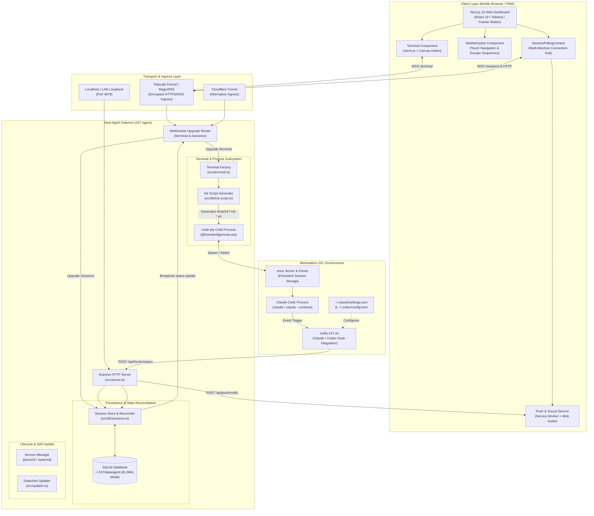
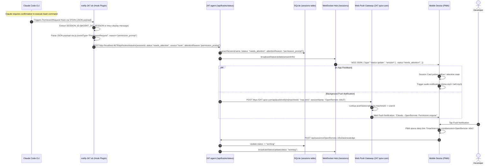
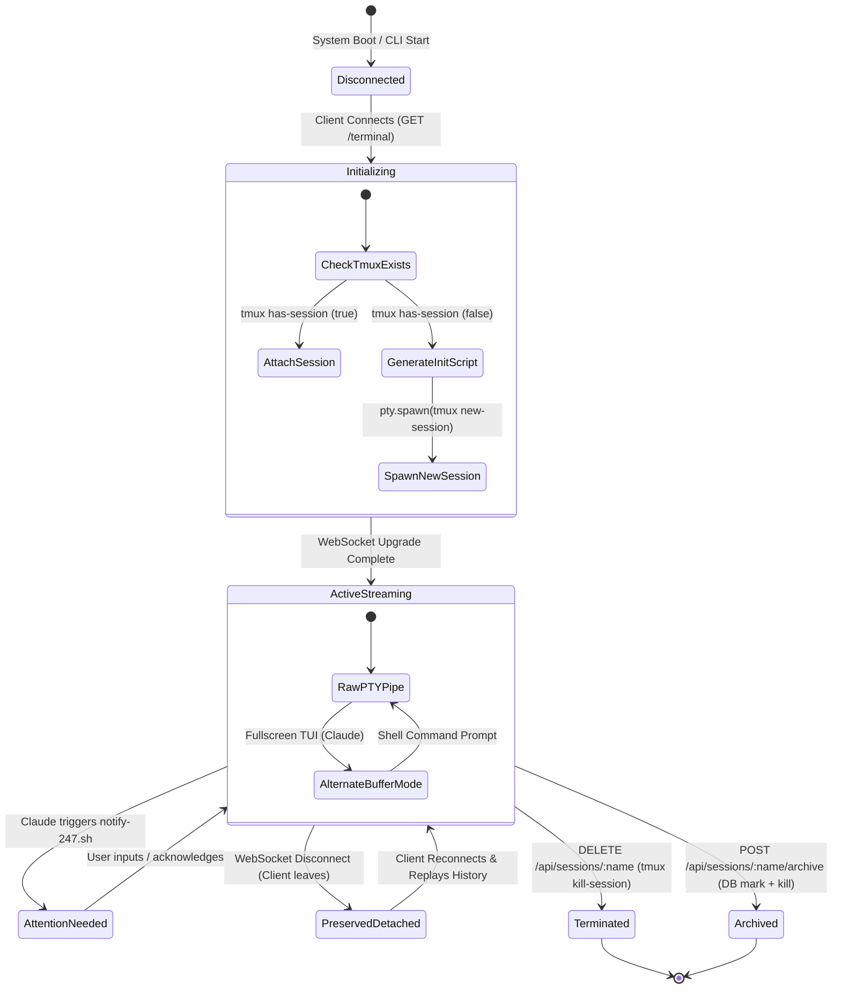

# Architectural Review: 247-claude-code-remote

> **Target Repository**: `c:\Users\W\Documents\GitHub\OpenRemote\ref\247-claude-code-remote`  
> **Review Date**: August 2026  
> **Review Scope**: Monorepo codebase audit spanning [`apps/agent`](file:///c:/Users/W/Documents/GitHub/OpenRemote/ref/247-claude-code-remote/claude-remote-control/apps/agent), [`apps/web`](file:///c:/Users/W/Documents/GitHub/OpenRemote/ref/247-claude-code-remote/claude-remote-control/apps/web), [`packages/cli`](file:///c:/Users/W/Documents/GitHub/OpenRemote/ref/247-claude-code-remote/claude-remote-control/packages/cli), [`packages/hooks`](file:///c:/Users/W/Documents/GitHub/OpenRemote/ref/247-claude-code-remote/claude-remote-control/packages/hooks), [`packages/shared`](file:///c:/Users/W/Documents/GitHub/OpenRemote/ref/247-claude-code-remote/claude-remote-control/packages/shared), deployment configs, Dockerfile, shell scripts, and architectural plans.

---

## 1. Executive Summary

[`247`](file:///c:/Users/W/Documents/GitHub/OpenRemote/ref/247-claude-code-remote/README.md) (also known as `claude-remote-control`, authored by **Quivr / Y Combinator W24**) is a mobile-first, web-native remote terminal management platform engineered specifically for **Claude Code** (`claude`) and similar autonomous CLI agents (e.g., OpenAI Codex CLI).

```
┌──────────────────────────────────────────────────────────────────────────────────┐
│                             247 REMOTE CONTROL                                   │
│                                                                                  │
│   📱 Mobile PWA / Browser Dashboard (Next.js 16 + React 19 + xterm.js Canvas)    │
│   ├── Virtual Mobile Keybar (Arrows, Esc, ^C, Shift-Tab)                        │
│   ├── Touch-to-SGR Mouse Escape Translator (Alternate buffer touch scroll)       │
│   ├── Push & Audio Attention Notifications (Web Push / Sonner / Web Audio)      │
│   └── Multi-Agent Registry (Tailscale Funnel / Cloudflare / Localhost)           │
└────────────────────────────────────────┬─────────────────────────────────────────┘
                                         │ HTTPS / WSS
                                         ▼
┌──────────────────────────────────────────────────────────────────────────────────┐
│                        Ingress & Transport Layer                                 │
│          [ Tailscale Funnel / MagicDNS ]  or  [ Cloudflare Tunnel ]              │
└────────────────────────────────────────┬─────────────────────────────────────────┘
                                         │ WebSocket / HTTP REST
                                         ▼
┌──────────────────────────────────────────────────────────────────────────────────┐
│                       Host Agent (247-agent / Express / ws)                      │
│   ├── Dual WebSocket Routers: /terminal (PTY) & /sessions (Metadata)             │
│   ├── Process Orchestrator: @homebridge/node-pty + tmux session manager          │
│   ├── Shell Init Script Injector (Adaptive PS1, Brand Status Bar, Aliases)       │
│   ├── State Engine: SQLite (better-sqlite3 WAL) + Auto-Reconciliation            │
│   └── Self-Updating Daemon & CLI Management Engine (launchd / systemd)           │
└───────────────────┬──────────────────────────────────────────┬───────────────────┘
                    │ PTY Byte Stream                          │ Webhook Status
                    ▼                                          ▲
┌──────────────────────────────────────┐     ┌─────────────────┴───────────────────┐
│        tmux Daemonized Session       │     │     Claude Code / Codex Subsystem   │
│   ┌──────────────────────────────┐   │     │  ┌───────────────────────────────┐  │
│   │         Interactive          │   │     │  │       Claude Code CLI         │  │
│   │       User Shell / TUI       │───┼─────┼──│  (Stop, Permission, Notify)   │  │
│   └──────────────────────────────┘   │     │  └───────────────┬───────────────┘  │
│                                      │     │                  ▼                  │
│                                      │     │       notify-247.sh Hook Hook       │
└──────────────────────────────────────┘     └─────────────────────────────────────┘
```

### Purpose & Design Philosophy
1. **Zero-Desk Dependency for AI Coding**: Autonomous AI programming tasks frequently run for minutes or hours (analyzing repos, running test suites, executing multi-step refactors). `247` eliminates desktop lock-in by providing a touch-optimized terminal that runs inside any modern mobile browser or installed Progressive Web App (PWA).
2. **Session Immortality via tmux**: Unlike naive subprocess pipes or standard web shells that terminate when a browser tab closes or mobile cellular connection drops, `247` couples every interactive process to a dedicated background `tmux` session. Disconnecting from the web client merely detaches the PTY; Claude Code continues uninterrupted in the background.
3. **Dual-Channel Observability & Push-to-Engage**: Rather than forcing the user to stare at a terminal, `247` installs local hook scripts into Claude Code's lifecycle (`Stop`, `PermissionRequest`, `Notification`). When Claude pauses for user confirmation or finishes a prompt, the agent is notified via local webhook, updates SQLite, broadcasts state changes across a dedicated metadata WebSocket channel, and dispatches Web Push notifications to the developer's phone with deep links to resume the session.
4. **Architectural Evolution**: The project started as a centralized cloud coordination model ([`.archive/PLAN-claude-remote.md`](file:///c:/Users/W/Documents/GitHub/OpenRemote/ref/247-claude-code-remote/.archive/PLAN-claude-remote.md)) using Neon Postgres and Vercel API routes. It evolved into a decentralized architecture where individual workstation agents operate autonomously with embedded SQLite databases, while the Next.js frontend functions as a stateless PWA orchestrator capable of managing multiple local or cloud VMs.

---

## 2. Architecture & Data Flow

### 2.1 System Component Architecture



---

### 2.2 End-to-End Sequence: Terminal Session Lifecycle & Touch Streaming

```mermaid
sequenceDiagram
    autonumber
    actor Dev as Mobile Developer
    participant Web as Next.js Web Client (xterm.js)
    participant Agent as 247-agent (server.ts)
    participant WS as WebSocket Handlers
    participant PTY as node-pty Engine
    participant Tmux as tmux Daemon
    participant Claude as Claude Code CLI

    Dev->>Web: Open Dashboard & Select Project "OpenRemote"
    Web->>Agent: GET /api/sessions
    Agent-->>Web: [ { name: "OpenRemote--k9x2", status: "idle", ... } ]
    
    Dev->>Web: Tap "Open Session" (or "New Session")
    Web->>WS: Connect WSS /terminal?project=OpenRemote&session=OpenRemote--k9x2
    WS->>WS: Buffer incoming WS messages in messageBuffer
    
    alt Session Exists
        WS->>PTY: spawn('tmux', ['attach-session', '-t', 'OpenRemote--k9x2'])
    else Session is New
        WS->>Agent: generateInitScript(options)
        Agent->>Agent: Write /tmp/247-init-OpenRemote--k9x2.sh
        WS->>PTY: spawn('tmux', ['new-session', '-s', 'OpenRemote--k9x2', '-c', cwd, 'bash --init-file ...'])
    end

    PTY->>Tmux: Initialize / Attach pane
    Tmux->>Tmux: Source init script (set PS1, tmux status bar, export AGENT_247_SESSION)
    
    par Terminal Output Streaming
        PTY-->>WS: onData(data)
        WS-->>Web: Send raw ANSI byte chunks
        Web->>Web: Render in xterm.js via CanvasAddon
    and Reconnect Scrollback Replay
        WS->>Tmux: tmux capture-pane -t sess -p -S -10000 -J
        Tmux-->>WS: Stdout scrollback history
        WS-->>Web: {"type":"history", "data": "...", "lines": 450}
        Web->>Web: currentTerm.clear() & write(history)
    end

    opt Mobile Touch Scrolling Interaction
        Dev->>Web: Touch drag upwards on screen
        Web->>Web: Intercept touchmove on .xterm-screen
        Web->>Web: Detect alternate buffer (fullscreen interactive app)
        Web->>WS: Send SGR mouse escape: \x1b[<65;1;1M (Wheel Down)
        WS->>PTY: write('\x1b[<65;1;1M')
        PTY->>Tmux: Enter copy-mode and scroll view
    end

    Dev->>Web: Close mobile browser tab / Lock phone
    Web->>WS: ws.close()
    WS->>PTY: terminal.detach() (writes '\x02d' - Ctrl+B, d)
    Note over Tmux,Claude: Tmux session and Claude process continue running 24/7
```

---

### 2.3 End-to-End Sequence: Hook Status & Push Alert Pipeline



---

## 3. Core Tech Stack & Dependencies

### 3.1 Monorepo Structure & Package Inventory

The repository is structured as a **pnpm + Turborepo monorepo** with 5 primary packages:

| Package Path | Package Name | Runtime / Target | Primary Purpose |
|---|---|---|---|
| [`apps/agent`](file:///c:/Users/W/Documents/GitHub/OpenRemote/ref/247-claude-code-remote/claude-remote-control/apps/agent) | `247-agent` | Node.js 22+ (ESM) | Host daemon: Express, WebSocket, node-pty, better-sqlite3, updater |
| [`apps/web`](file:///c:/Users/W/Documents/GitHub/OpenRemote/ref/247-claude-code-remote/claude-remote-control/apps/web) | `247-web` | Next.js 16 (App Router) | Client UI, xterm.js terminal, push subscription manager, Neon Auth |
| [`packages/cli`](file:///c:/Users/W/Documents/GitHub/OpenRemote/ref/247-claude-code-remote/claude-remote-control/packages/cli) | `247-cli` | Node.js CLI (Commander) | Agent installer, service manager (launchd/systemd), doctor, hooks installer |
| [`packages/hooks`](file:///c:/Users/W/Documents/GitHub/OpenRemote/ref/247-claude-code-remote/claude-remote-control/packages/hooks) | `247-hooks` | Bash / jq | Claude Code / Codex lifecycle hook script (`notify-247.sh`) |
| [`packages/shared`](file:///c:/Users/W/Documents/GitHub/OpenRemote/ref/247-claude-code-remote/claude-remote-control/packages/shared) | `247-shared` | TypeScript Types | Shared protocol interfaces, WebSocket schemas, session status types |

---

### 3.2 Dependency Breakdown & Architectural Rationale

```
+──────────────────────────────────────────────────────────────────────────────────────────+
|                                247 DEPENDENCY MATRIX                                     |
+─────────────────────────────────────────+────────────────────────────────────────────────+
| PACKAGE / LIBRARY                       | VERSION | ARCHITECTURAL RATIONALE              |
+─────────────────────────────────────────+---------+--------------------------------------+
| @homebridge/node-pty-prebuilt-multiarch | ^0.13.1 | Precompiled multi-architecture C++   |
|                                         |         | pseudo-terminal bindings. Prevents   |
|                                         |         | node-gyp build failures on Apple     |
|                                         |         | Silicon (M1/M2/M3/M4) and Linux x64. |
+─────────────────────────────────────────+---------+--------------------------------------+
| better-sqlite3                          | ^12.5.0 | Ultra-fast synchronous SQLite driver |
|                                         |         | used for local session persistence,  |
|                                         |         | status history, and zero-latency WAL.|
+─────────────────────────────────────────+---------+--------------------------------------+
| @xterm/xterm                            | ^5.5.0  | Industry-standard web terminal.      |
| @xterm/addon-canvas                     | ^0.7.0  | High-performance 2D Canvas renderer  |
| @xterm/addon-fit                        | ^0.10.0 | Dynamic terminal grid recalculation  |
| @xterm/addon-search                     | ^0.16.0 | In-terminal string search            |
| @xterm/addon-web-links                  | ^0.11.0 | Clickable URL detection in terminal  |
+─────────────────────────────────────────+---------+--------------------------------------+
| express                                 | ^4.21.0 | Lightweight HTTP REST router for     |
|                                         |         | agent endpoints and pairing pages.   |
+─────────────────────────────────────────+---------+--------------------------------------+
| ws                                      | ^8.18.0 | Lightweight, low-overhead WebSocket  |
|                                         |         | server for raw PTY streaming.        |
+─────────────────────────────────────────+---------+--------------------------------------+
| commander / enquirer / ora / chalk      | Latest  | CLI framework providing interactive  |
|                                         |         | setup wizards, spinners, diagnostics.|
+─────────────────────────────────────────+---------+--------------------------------------+
| drizzle-orm & drizzle-kit               | ^0.45.1 | Type-safe ORM for PostgreSQL (Neon)  |
| @neondatabase/serverless                | ^1.0.2  | Serverless HTTP/WebSocket Postgres.  |
+─────────────────────────────────────────+---------+--------------------------------------+
| web-push                                | ^3.6.7  | VAPID push encryption engine for     |
|                                         |         | browser Web Push notifications.      |
+─────────────────────────────────────────+---------+--------------------------------------+
| pino & pino-pretty                      | ^9.6.0  | High-throughput structured JSON      |
|                                         |         | logging system with level filtering. |
+─────────────────────────────────────────+---------+--------------------------------------+
```

---

## 4. Distinctive & Smart Engineering Decisions

### 1. Persistent Process Isolation via `tmux` Attached PTYs
Rather than directly spawning interactive shells inside `node-pty` (which die whenever the parent Node process recycles or the WebSocket closes), `247` uses `node-pty` solely as a local translation bridge to attach to detached `tmux` sessions:
```typescript
// apps/agent/src/terminal.ts:68-105
if (existingSession) {
  tmuxArgs = ['attach-session', '-t', sessionName];
} else {
  const scriptContent = generateInitScript({ ... });
  initScriptPath = writeInitScript(sessionName, scriptContent);
  tmuxArgs = [
    'new-session',
    '-s', sessionName,
    '-c', cwd,
    ...(isTestEnv ? ['-e', '_247_SKIP_ANIMATION=1'] : []),
    `bash --init-file ${initScriptPath}`,
  ];
}
```
When a client disconnects, `terminal.detach()` sends the standard `Ctrl+B, d` escape sequence (`\x02d`) to cleanly detach the PTY while leaving the underlying `tmux` process, its sub-shells, and Claude Code executing unharmed.

---

### 2. Alternate-Buffer Touch-to-SGR Mouse Escape Synthesizer
Mobile web browsers cannot naturally scroll alternate-screen terminal applications (such as Claude Code's Ink TUI or vim) because alternate buffers have no traditional scrollback (`baseY === 0`). `247` solves this with an intelligent touch gesture translator:
```typescript
// apps/web/src/components/Terminal/hooks/useTerminalConnection.ts:307-326
const isAlternateBuffer = buffer.type === 'alternate';

if (isAlternateBuffer && wsRef.current?.readyState === WebSocket.OPEN) {
  // SGR mouse encoding: CSI < button ; x ; y M
  // Button 64 = wheel UP (scroll older), Button 65 = wheel DOWN (scroll newer)
  const wheelEvent = deltaY < 0
    ? '\x1b[<65;1;1M' // Swipe UP -> Wheel DOWN (see newer content)
    : '\x1b[<64;1;1M'; // Swipe DOWN -> Wheel UP (see older content)

  wsRef.current.send(JSON.stringify({ type: 'input', data: wheelEvent }));
  lastTouchY = currentY;
}
```
Combined with setting `tmux set-option mouse on`, this causes `tmux` to intercept the synthetic mouse wheel escapes, enter copy-mode automatically, and allow smooth, natural touch scrolling through Claude Code's interactive history.

---

### 3. Dynamic Width-Adaptive Shell Prompting (`init-script.ts`)
When terminal sessions are opened on narrow phone screens (<60 columns), standard developer shell prompts (`user@hostname ~/Dev/project/subproject (main) >`) wrap onto 3–4 lines, ruining readability. `247` generates an adaptive shell initialization script that dynamically queries terminal width on every prompt render:
```bash
# apps/agent/src/lib/init-script.ts:92-126
_247_prompt_command() {
  local exit_code=$?
  local cols=$(tput cols 2>/dev/null || echo 80)
  ...
  # Mobile (<60 cols): ultra-compact single line
  # Desktop: full directory path with git branch
  if [ "$cols" -lt 60 ]; then
    PS1="${exit_ind}\[\e[38;5;208m\]$short_path\[\e[0m\] \[\e[38;5;208m\]>\[\e[0m\] "
  else
    PS1="${exit_ind}\[\e[38;5;245m\][\[\e[38;5;114m\]$short_path\[\e[0m\]${git_branch}\[\e[38;5;245m\]]\[\e[0m\] \[\e[38;5;208m\]>\[\e[0m\] "
  fi
}
PROMPT_COMMAND="_247_prompt_command"
```

---

### 4. Zero-Downtime Node ABI Mismatch Auto-Rebuilder
One of the most notorious pain points with Node CLI tools using native addons (`better-sqlite3`, `node-pty`) is that background Node.js updates (via `brew upgrade` or `nvm use`) break compiled `.node` binaries due to ABI mismatches (`NODE_MODULE_VERSION`).
`247` eliminates this by recording the active ABI version in `~/.247/node-abi-version` and testing module loadability on startup:
```typescript
// packages/cli/src/lib/prerequisites.ts:265-298
export async function ensureNativeModules(): Promise<PrerequisiteCheck> {
  const abiChanged = isAbiVersionChanged();
  if (!abiChanged) {
    const check = await checkNativeDeps();
    if (check.status === 'ok') return check;
  }
  // Automatically trigger background rebuild if ABI changed
  const rebuild = rebuildNativeModules();
  if (!rebuild.success) {
    return { name: 'Native modules', status: 'error', message: `Rebuild failed: ${rebuild.error}`, required: true };
  }
  storeAbiVersion();
  return await checkNativeDeps();
}
```

---

### 5. Asynchronous Early-Message Buffering
When opening a terminal WebSocket connection, creating or attaching to a tmux session via `node-pty` requires ~100–250ms of asynchronous child process initialization. If a client immediately transmits keystrokes, standard implementations drop them. `247` establishes an immediate raw buffer on the WebSocket:
```typescript
// apps/agent/src/websocket-handlers.ts:123-144
const messageBuffer: Buffer[] = [];
let setupComplete = false;

ws.on('message', (data) => {
  if (!setupComplete || !terminalRef) {
    messageBuffer.push(data as Buffer);
    return;
  }
  handleTerminalMessage(JSON.parse(data.toString()), terminalRef, ws, ...);
});
// Flushed immediately upon pty readiness (lines 234-245)
```

---

### 6. Detached Self-Update Daemon (`updater.ts`)
Because the `247-agent` process runs under the control of system service managers (`launchd` on macOS, `systemd` on Linux), it cannot simply restart itself synchronously inside the Node process.
The updater module writes a detached bash script to `/tmp/247-update.sh`, spawns it with `detached: true` and `unref()`, and gracefully terminates the agent process (`process.exit(0)`). The script waits 2 seconds for process teardown, executes `npm install -g 247-cli@targetVersion`, fixes binary permissions, and kicks the service manager (`launchctl kickstart` or `systemctl --user restart`).

---

## 5. Process Lifecycle & Terminal/PTY Management

### 5.1 Process Orchestration Hierarchy

```
[ OS init / launchd / systemd ]
       │
       ▼
[ 247 Agent Process (Node.js) ] (PID: 54102)
       │
       ├── @homebridge/node-pty (pty.spawn)
       │         │
       │         ▼
       │   [ tmux attach / new-session ] (PID: 54108)
       │         │
       │         ▼
[ tmux Server Daemon ] (Independent OS process group)
       │
       └── Pane: [ bash --init-file /tmp/247-init-*.sh ]
                   │
                   ▼
             [ Interactive Target Shell: /bin/zsh ]
                   │
                   ▼
             [ Claude Code CLI: claude ] (PID: 54180)
```

---

### 5.2 Session Lifecycle State Machine



---

### 5.3 Scrollback Buffer Capture Mechanism
When reconnecting to an existing session, `247` reconstructs the terminal viewport by querying `tmux`'s internal scrollback pane buffer rather than buffering megabytes of raw ANSI escapes in Node.js memory:
```typescript
// apps/agent/src/terminal.ts:213-226
captureHistory: async (lines = 10000): Promise<string> => {
  try {
    // -p = print to stdout
    // -S -N = start from N lines back (negative = from start of history)
    // -J = preserve trailing spaces for proper line-wrapping formatting
    const { stdout } = await execAsync(
      `tmux capture-pane -t "${sessionName}" -p -S -${lines} -J 2>/dev/null`
    );
    return stdout;
  } catch {
    return '';
  }
}
```
This guarantees that any terminal color codes, layout grids, or Claude thinking blocks remain structurally aligned when redisplayed in `xterm.js`.

---

## 6. Communication & Remote Access

### 6.1 Remote Ingress Architectures

`247` supports three distinct remote transport mechanisms:

1. **Tailscale Funnel (Primary Recommendation)**:
   - Developer runs `tailscale funnel --bg --https=4678`.
   - Tailscale routes encrypted traffic from `https://node-name.tailnet.ts.net` directly to local port 4678.
   - Requires **no firewall holes** and **no port forwarding**.
2. **Cloudflare Tunnel (`cloudflared`)**:
   - `cloudflared tunnel run` routes traffic from a designated public hostname (e.g., `agent.example.com`) to `localhost:4678`.
3. **Local Area Network / VPN**:
   - Direct connection via LAN IP or Tailscale MagicDNS (`http://macbook.tailnet:4678`).

---

### 6.2 WebSocket Protocol Specification

#### Channel 1: Terminal Channel (`/terminal`)
- **URL**: `ws://<host>:4678/terminal?project=<proj>&session=<sess>[&create=true]`
- **Client to Agent Schema**:
  ```typescript
  export type WSMessageToAgent =
    | { type: 'input'; data: string }
    | { type: 'resize'; cols: number; rows: number }
    | { type: 'start-claude' }
    | { type: 'ping' }
    | { type: 'request-history'; lines?: number };
  ```
- **Agent to Client Schema**:
  ```typescript
  export type WSMessageFromAgent =
    | { type: 'output'; data: string }
    | { type: 'connected'; session: string }
    | { type: 'disconnected' }
    | { type: 'pong' }
    | { type: 'history'; data: string; lines: number };
  ```

#### Channel 2: Sessions Channel (`/sessions`)
- **URL**: `ws://<host>:4678/sessions?v=<appVersion>`
- **Agent to Client Broadcast Schema**:
  ```typescript
  export type WSSessionsMessageFromAgent =
    | { type: 'sessions-list'; sessions: WSSessionInfo[] }
    | { type: 'session-removed'; sessionName: string }
    | { type: 'session-archived'; sessionName: string; session: WSSessionInfo }
    | { type: 'status-update'; session: WSSessionInfo }
    | { type: 'version-info'; agentVersion: string }
    | { type: 'update-pending'; targetVersion: string; message: string };
  ```

---

### 6.3 REST API Endpoints

```
+──────────────────────────────────────────────────────────────────────────────────────────+
|                                REST API SPECIFICATION                                    |
+────────+────────────────────────────────────+────────────────────────────────────────────+
| METHOD | ROUTE                              | DESCRIPTION                                |
+────────+────────────────────────────────────+────────────────────────────────────────────+
| GET    | /health                            | Container & orchestrator health check.     |
| GET    | /api/projects                      | Returns array of whitelisted project names.|
| GET    | /api/folders                       | Scans and lists subdirectories in basePath.|
| POST   | /api/clone                         | Clones a Git repo into basePath.           |
| GET    | /api/sessions                      | Returns list of active sessions + metadata.|
| GET    | /api/sessions/archived             | Returns list of archived (past) sessions.  |
| GET    | /api/sessions/:name/status         | Detailed status for a single session.      |
| GET    | /api/sessions/:name/output         | Retrieves plain or ANSI scrollback output. |
| POST   | /api/sessions/:name/input          | Sends text directly to tmux via send-keys. |
| POST   | /api/sessions/:name/acknowledge    | Resets needs_attention state to working.   |
| GET    | /api/sessions/:name/preview        | Fetches the last 16 lines of output.       |
| DELETE | /api/sessions/:name                | Kills tmux session and removes DB record.  |
| POST   | /api/sessions/:name/archive        | Kills tmux session but preserves DB record.|
| POST   | /api/hooks/status                  | Webhook invoked by notify-247.sh.          |
| GET    | /pair                              | HTML pairing portal with QR code & token.  |
| GET    | /pair/info                         | JSON metadata for agent pairing.           |
| GET    | /pair/code/:code                   | Validates 6-digit numeric pairing code.    |
| POST   | /pair/verify                       | Validates HMAC-signed pairing token.       |
+────────+────────────────────────────────────+────────────────────────────────────────────+
```

---

## 7. Reliability, Fault Tolerance & Edge Cases

```
+──────────────────────────────────────────────────────────────────────────────────────────+
|                           RELIABILITY & FAULT TOLERANCE MATRIX                           |
+──────────────────────────+───────────────────────────────────────────────────────────────+
| FAILURE MODE / EDGE CASE | MITIGATION STRATEGY IN 247 CODEBASE                           |
+──────────────────────────+───────────────────────────────────────────────────────────────+
| Cellular Network Drop /  | Adaptive heartbeat detects silent disconnects (WS_PING_       |
| Mobile Browser Suspension| INTERVAL=30s, WS_PONG_TIMEOUT=5s). Web client reconnects with |
|                          | exponential backoff (1s -> 30s). PTY detaches gracefully;     |
|                          | tmux session continues execution.                             |
+──────────────────────────+───────────────────────────────────────────────────────────────+
| Asynchronous Connection  | messageBuffer array holds all WebSocket inputs arriving       |
| Race Conditions          | during the ~150ms window before node-pty/tmux process starts. |
+──────────────────────────+───────────────────────────────────────────────────────────────+
| Out-of-Sync SQLite State | On startup, reconcileWithTmux() queries live tmux sessions    |
| (Zombies / Stale Data)   | via tmux list-sessions. Records older than 24h missing from   |
|                          | tmux are pruned; orphaned tmux sessions are lazily ingested.  |
+──────────────────────────+───────────────────────────────────────────────────────────────+
| Database Concurrency &   | better-sqlite3 runs in Write-Ahead Logging (WAL) mode         |
| Performance              | (journal_mode = WAL). Multi-version concurrency allows readers|
|                          | without blocking status writers.                              |
+──────────────────────────+───────────────────────────────────────────────────────────────+
| Excessive Memory Load    | Session lists per machine are capped at MAX_SESSIONS = 50     |
| on Mobile Browser        | (FIFO rotation by timestamp); archived sessions capped at 100.|
+──────────────────────────+───────────────────────────────────────────────────────────────+
| Reconnection Storms      | MAX_CONCURRENT_RECONNECTIONS = 3 with dynamic 1000ms staging  |
|                          | prevents network socket exhaustion on multi-agent dashboards. |
+──────────────────────────+───────────────────────────────────────────────────────────────+
```

---

## 8. Security & Sandboxing

### 8.1 Security Strengths

1. **HMAC-SHA256 Signed Pairing Tokens**:
   Agent pairing links contain cryptographic signatures generated via the machine's unique UUID:
   ```typescript
   // apps/agent/src/routes/pair.ts:43-49
   function createToken(payload: object, secret: string, expiresInMs: number): string {
     const exp = Date.now() + expiresInMs;
     const data = { ...payload, iat: Date.now(), exp };
     const payloadStr = Buffer.from(JSON.stringify(data)).toString('base64url');
     const signature = createHmac('sha256', secret).update(payloadStr).digest('base64url');
     return `${payloadStr}.${signature}`;
   }
   ```
2. **Project Whitelist Path Confinement**:
   The agent validates incoming terminal connection requests against `config.projects.whitelist`. Directory traversal (`../../`) is prevented by resolving project paths strictly within `config.projects.basePath`:
   ```typescript
   // apps/agent/src/websocket-handlers.ts:106-114
   const isAllowed = isRootTerminal || (hasWhitelist ? whitelist.includes(project!) : true);
   if (project === null || project === undefined || !isAllowed) {
     ws.close(1008, 'Project not allowed');
     return;
   }
   ```
3. **Strict Git URL Sanitization**:
   Git repository cloning enforces strict regular expressions preventing command injection in repo strings:
   ```typescript
   // apps/agent/src/routes/projects.ts:45-49
   const httpsPattern = /^https:\/\/.+\/.+/;
   const sshPattern = /^git@.+:.+/;
   if (!httpsPattern.test(url) && !sshPattern.test(url)) {
     return res.status(400).json({ success: false, error: 'Invalid URL format' });
   }
   ```

---

### 8.2 Security Vulnerabilities & Attack Vectors

```
                                  ATTACK SURFACE ANALYSIS
                                  
   +─────────────────────+
   |   Untrusted Local   |  POST /api/sessions/:name/input
   |   Processes / Apps  | ────────────────────────────────┐
   +─────────────────────+                                 │
                                                           ▼
   +─────────────────────+  Unauthenticated Port 4678 ┌─────────────────────────┐
   |  Tailscale Funnel   | ──────────────────────────►│       247 Agent         │
   |  Misconfiguration   |  (No Bearer Auth Header)   │  (Runs as logged-in user│
   +─────────────────────+                            │   with full bash shell) │
                                                           └───────────┬─────────┘
                                                                       │
                                                                       ▼
                                                           ┌─────────────────────────┐
                                                           │   Arbitrary Code Exec   │
                                                           │   in Host User Context  │
                                                           └─────────────────────────┘
```

1. **Unauthenticated Local REST & WebSocket Surface**:
   The `247-agent` binds to port 4678 with **zero HTTP request authentication headers** (no API key or bearer token required for `/api/sessions/:name/input`, `/api/clone`, or `/terminal`).
   *Impact*: If a developer exposes port 4678 to their local network or configures a public Tailscale Funnel without an authentication proxy, any remote client can send arbitrary keystrokes directly into active developer shells.
2. **Custom Bash String Escaping Risk (`init-script.ts`)**:
   `escapeForBash` uses simple regex replacement:
   ```typescript
   // apps/agent/src/lib/init-script.ts:523-529
   function escapeForBash(value: string): string {
     return value
       .replace(/\\/g, '\\\\')
       .replace(/"/g, '\\"')
       .replace(/\$/g, '\\$')
       .replace(/`/g, '\\`');
   }
   ```
   *Impact*: Shell expansion edge cases (e.g., process substitutions `<(...)`, unescaped newlines, or Unicode normalization bypasses) in custom environment variables could lead to arbitrary shell command execution during session startup.

---

## 9. Flaws, Antipatterns & Gotchas

```
+──────────────────────────────────────────────────────────────────────────────────────────+
|                            FLAWS, ANTIPATTERNS & CODE GOTCHAS                            |
+──────────────────────────+───────────────────────────────────────────────────────────────+
| ISSUE CATEGORY           | DETAILED CODE INSPECTION & SEVERITY                           |
+──────────────────────────+───────────────────────────────────────────────────────────────+
| CPU Busy-Wait Loop       | In packages/cli/src/lib/process.ts (lines 154-156):           |
| (Critical Antipattern)   | while (Date.now() < end) { /* Busy wait */ }                  |
|                          | Blocks the Node.js event loop with 100% CPU utilization while  |
|                          | waiting for the daemon to terminate on stopAgent().           |
+──────────────────────────+───────────────────────────────────────────────────────────────+
| Stateless Edge In-Memory | In apps/web/src/lib/pairing-codes.ts (lines 17-28):           |
| Store Failure            | pairingCodes = new Map<string, PairingCodeInfo>()             |
|                          | Pairing codes stored in memory in a Next.js serverless app     |
|                          | deployed on Vercel fail across multi-region serverless lambdas.|
+──────────────────────────+───────────────────────────────────────────────────────────────+
| Unverified Local Hook    | In apps/agent/src/routes/hooks.ts (lines 78-174):             |
| Status Spoofing          | /api/hooks/status accepts status changes without verifying if |
|                          | the caller is actually Claude Code or an arbitrary process.   |
+──────────────────────────+───────────────────────────────────────────────────────────────+
| Hardcoded POSIX /        | In apps/agent/src/terminal.ts & packages/cli/src/service/*:   |
| macOS Paths              | Hardcodes /opt/homebrew/bin, launchd plists, and bash         |
|                          | init scripts. Windows / WSL support is completely absent.      |
+──────────────────────────+───────────────────────────────────────────────────────────────+
```

---

## 10. Actionable Lessons & Takeaways for OpenRemote

### What OpenRemote Should Adopt:

1. **PTY-over-tmux Process Model**:
   Spawning backend AI coding sessions inside `tmux` rather than raw subprocess pipes gives OpenRemote instant connection resilience: clients can disconnect, navigate away, or switch devices while long-running compilation or LLM tasks continue executing safely.
2. **Mobile Touch Gesture Translation**:
   Adopt the `useTerminalConnection.ts` algorithm that inspects xterm's active buffer and converts vertical touch movement into SGR mouse wheel escape sequences (`\x1b[<64;1;1M` / `\x1b[<65;1;1M`) for alternate-screen CLI applications.
3. **Adaptive Mobile Terminal Prompts**:
   Implement dynamic prompt rewriting that checks `$COLUMNS` in terminal pre-command hooks to condense wide directory trees into single-line short paths on mobile screens.
4. **Lifecycle Hooks Integration**:
   Adopt the `Stop`, `PermissionRequest`, and `Notification` hook interception architecture used by `notify-247.sh` to trigger instant push notifications and badge updates when an autonomous agent pauses for human input.
5. **Early-Message WS Buffering**:
   Adopt the `messageBuffer` pattern to ensure that fast user keystrokes sent during WebSocket connection handshakes are never lost while backend PTY processes are initializing.

### What OpenRemote Should Avoid:

1. **Do NOT Leave Host Agents Unauthenticated**:
   OpenRemote must enforce mutual TLS, signed session tokens, or Bearer authentication on all agent HTTP and WebSocket endpoints to prevent unauthorized command execution over LAN or tunnel networks.
2. **Do NOT Use Synchronous Busy-Wait Loops**:
   Avoid busy `while (Date.now() < end)` loops in CLI management; always use asynchronous promises with `setTimeout` or event-driven process exit listeners.
3. **Do NOT Store Ephemeral Tokens in Serverless Memory**:
   Avoid in-memory `Map` instances in web dashboards for pairing codes; use Redis or database storage to guarantee cross-instance availability in serverless environments.
4. **Avoid Regex-Based Shell Script String Interpolation**:
   Rather than interpolating variables into generated bash scripts via regex replacements, pass parameters through explicit environment variables or structured configuration files.

---

## 11. Key Code File Index

The following table indexes the most significant source files, their locations, and core symbols:

| File Path | Core Symbols / Exports | Line Range | Description |
|---|---|---|---|
| [`apps/agent/src/terminal.ts`](file:///c:/Users/W/Documents/GitHub/OpenRemote/ref/247-claude-code-remote/claude-remote-control/apps/agent/src/terminal.ts) | [`createTerminal`](file:///c:/Users/W/Documents/GitHub/OpenRemote/ref/247-claude-code-remote/claude-remote-control/apps/agent/src/terminal.ts#L31-L228), `captureHistory`, `detach` | [L1–L229](file:///c:/Users/W/Documents/GitHub/OpenRemote/ref/247-claude-code-remote/claude-remote-control/apps/agent/src/terminal.ts#L1-L229) | PTY spawning via node-pty, tmux session attachment, scrollback capture. |
| [`apps/agent/src/lib/init-script.ts`](file:///c:/Users/W/Documents/GitHub/OpenRemote/ref/247-claude-code-remote/claude-remote-control/apps/agent/src/lib/init-script.ts) | [`generateInitScript`](file:///c:/Users/W/Documents/GitHub/OpenRemote/ref/247-claude-code-remote/claude-remote-control/apps/agent/src/lib/init-script.ts#L45-L518), `detectUserShell` | [L1–L559](file:///c:/Users/W/Documents/GitHub/OpenRemote/ref/247-claude-code-remote/claude-remote-control/apps/agent/src/lib/init-script.ts#L1-L559) | Dynamic shell initialization script generator with mobile-adaptive PS1 and boot animation. |
| [`apps/agent/src/websocket-handlers.ts`](file:///c:/Users/W/Documents/GitHub/OpenRemote/ref/247-claude-code-remote/claude-remote-control/apps/agent/src/websocket-handlers.ts) | [`handleTerminalConnection`](file:///c:/Users/W/Documents/GitHub/OpenRemote/ref/247-claude-code-remote/claude-remote-control/apps/agent/src/websocket-handlers.ts#L99-L266), [`handleSessionsConnection`](file:///c:/Users/W/Documents/GitHub/OpenRemote/ref/247-claude-code-remote/claude-remote-control/apps/agent/src/websocket-handlers.ts#L328-L417) | [L1–L418](file:///c:/Users/W/Documents/GitHub/OpenRemote/ref/247-claude-code-remote/claude-remote-control/apps/agent/src/websocket-handlers.ts#L1-L418) | Dual-channel WebSocket handlers with early message buffering and version negotiation. |
| [`apps/agent/src/server.ts`](file:///c:/Users/W/Documents/GitHub/OpenRemote/ref/247-claude-code-remote/claude-remote-control/apps/agent/src/server.ts) | [`createServer`](file:///c:/Users/W/Documents/GitHub/OpenRemote/ref/247-claude-code-remote/claude-remote-control/apps/agent/src/server.ts#L42-L110), `getActiveTmuxSessions` | [L1–L111](file:///c:/Users/W/Documents/GitHub/OpenRemote/ref/247-claude-code-remote/claude-remote-control/apps/agent/src/server.ts#L1-L111) | Express server initialization, DB startup, tmux reconciliation, upgrade routing. |
| [`apps/agent/src/db/sessions.ts`](file:///c:/Users/W/Documents/GitHub/OpenRemote/ref/247-claude-code-remote/claude-remote-control/apps/agent/src/db/sessions.ts) | [`upsertSession`](file:///c:/Users/W/Documents/GitHub/OpenRemote/ref/247-claude-code-remote/claude-remote-control/apps/agent/src/db/sessions.ts#L38-L83), [`reconcileWithTmux`](file:///c:/Users/W/Documents/GitHub/OpenRemote/ref/247-claude-code-remote/claude-remote-control/apps/agent/src/db/sessions.ts#L131-L156) | [L1–L157](file:///c:/Users/W/Documents/GitHub/OpenRemote/ref/247-claude-code-remote/claude-remote-control/apps/agent/src/db/sessions.ts#L1-L157) | SQLite CRUD operations and active tmux process reconciliation. |
| [`apps/agent/src/routes/hooks.ts`](file:///c:/Users/W/Documents/GitHub/OpenRemote/ref/247-claude-code-remote/claude-remote-control/apps/agent/src/routes/hooks.ts) | [`createHooksRoutes`](file:///c:/Users/W/Documents/GitHub/OpenRemote/ref/247-claude-code-remote/claude-remote-control/apps/agent/src/routes/hooks.ts#L74-L177), `sendPushNotification` | [L1–L178](file:///c:/Users/W/Documents/GitHub/OpenRemote/ref/247-claude-code-remote/claude-remote-control/apps/agent/src/routes/hooks.ts#L1-L178) | Ingests Claude Code hook notifications and dispatches WebSocket and Web Push updates. |
| [`apps/agent/src/routes/pair.ts`](file:///c:/Users/W/Documents/GitHub/OpenRemote/ref/247-claude-code-remote/claude-remote-control/apps/agent/src/routes/pair.ts) | [`createPairRoutes`](file:///c:/Users/W/Documents/GitHub/OpenRemote/ref/247-claude-code-remote/claude-remote-control/apps/agent/src/routes/pair.ts#L107-L437), [`createToken`](file:///c:/Users/W/Documents/GitHub/OpenRemote/ref/247-claude-code-remote/claude-remote-control/apps/agent/src/routes/pair.ts#L43-L49), [`verifyToken`](file:///c:/Users/W/Documents/GitHub/OpenRemote/ref/247-claude-code-remote/claude-remote-control/apps/agent/src/routes/pair.ts#L52-L77) | [L1–L441](file:///c:/Users/W/Documents/GitHub/OpenRemote/ref/247-claude-code-remote/claude-remote-control/apps/agent/src/routes/pair.ts#L1-L441) | HMAC pairing token verification, 6-digit code management, and pairing UI. |
| [`apps/agent/src/updater.ts`](file:///c:/Users/W/Documents/GitHub/OpenRemote/ref/247-claude-code-remote/claude-remote-control/apps/agent/src/updater.ts) | [`triggerUpdate`](file:///c:/Users/W/Documents/GitHub/OpenRemote/ref/247-claude-code-remote/claude-remote-control/apps/agent/src/updater.ts#L32-L133), `isUpdateInProgress` | [L1–L134](file:///c:/Users/W/Documents/GitHub/OpenRemote/ref/247-claude-code-remote/claude-remote-control/apps/agent/src/updater.ts#L1-L134) | Detached auto-update script generation and service kickstart execution. |
| [`packages/hooks/notify-247.sh`](file:///c:/Users/W/Documents/GitHub/OpenRemote/ref/247-claude-code-remote/claude-remote-control/packages/hooks/notify-247.sh) | Hook Script (`notify-247.sh`) | [L1–L48](file:///c:/Users/W/Documents/GitHub/OpenRemote/ref/247-claude-code-remote/claude-remote-control/packages/hooks/notify-247.sh#L1-L48) | Claude Code / Codex lifecycle hook script extracting session ID and calling webhook. |
| [`packages/cli/src/lib/prerequisites.ts`](file:///c:/Users/W/Documents/GitHub/OpenRemote/ref/247-claude-code-remote/claude-remote-control/packages/cli/src/lib/prerequisites.ts) | [`ensureNativeModules`](file:///c:/Users/W/Documents/GitHub/OpenRemote/ref/247-claude-code-remote/claude-remote-control/packages/cli/src/lib/prerequisites.ts#L265-L298), `isAbiVersionChanged` | [L1–L302](file:///c:/Users/W/Documents/GitHub/OpenRemote/ref/247-claude-code-remote/claude-remote-control/packages/cli/src/lib/prerequisites.ts#L1-L302) | Node ABI mismatch detection and automated native addon rebuilder. |
| [`packages/cli/src/lib/hooks.ts`](file:///c:/Users/W/Documents/GitHub/OpenRemote/ref/247-claude-code-remote/claude-remote-control/packages/cli/src/lib/hooks.ts) | [`installHook`](file:///c:/Users/W/Documents/GitHub/OpenRemote/ref/247-claude-code-remote/claude-remote-control/packages/cli/src/lib/hooks.ts#L239-L302), [`uninstallHook`](file:///c:/Users/W/Documents/GitHub/OpenRemote/ref/247-claude-code-remote/claude-remote-control/packages/cli/src/lib/hooks.ts#L307-L357) | [L1–L459](file:///c:/Users/W/Documents/GitHub/OpenRemote/ref/247-claude-code-remote/claude-remote-control/packages/cli/src/lib/hooks.ts#L1-L459) | Configuration modifier for `~/.claude/settings.json` and `~/.codex/config.toml`. |
| [`packages/cli/src/service/launchd.ts`](file:///c:/Users/W/Documents/GitHub/OpenRemote/ref/247-claude-code-remote/claude-remote-control/packages/cli/src/service/launchd.ts) | [`LaunchdService`](file:///c:/Users/W/Documents/GitHub/OpenRemote/ref/247-claude-code-remote/claude-remote-control/packages/cli/src/service/launchd.ts#L18-L240) | [L1–L250](file:///c:/Users/W/Documents/GitHub/OpenRemote/ref/247-claude-code-remote/claude-remote-control/packages/cli/src/service/launchd.ts#L1-L250) | macOS launchd plist generation and lifecycle management (`launchctl`). |
| [`packages/cli/src/service/systemd.ts`](file:///c:/Users/W/Documents/GitHub/OpenRemote/ref/247-claude-code-remote/claude-remote-control/packages/cli/src/service/systemd.ts) | [`SystemdService`](file:///c:/Users/W/Documents/GitHub/OpenRemote/ref/247-claude-code-remote/claude-remote-control/packages/cli/src/service/systemd.ts#L18-L237) | [L1–L238](file:///c:/Users/W/Documents/GitHub/OpenRemote/ref/247-claude-code-remote/claude-remote-control/packages/cli/src/service/systemd.ts#L1-L238) | Linux systemd user service unit generator and manager (`systemctl --user`). |
| [`apps/web/src/components/Terminal/hooks/useTerminalConnection.ts`](file:///c:/Users/W/Documents/GitHub/OpenRemote/ref/247-claude-code-remote/claude-remote-control/apps/web/src/components/Terminal/hooks/useTerminalConnection.ts) | [`useTerminalConnection`](file:///c:/Users/W/Documents/GitHub/OpenRemote/ref/247-claude-code-remote/claude-remote-control/apps/web/src/components/Terminal/hooks/useTerminalConnection.ts#L34-L757) | [L1–L758](file:///c:/Users/W/Documents/GitHub/OpenRemote/ref/247-claude-code-remote/claude-remote-control/apps/web/src/components/Terminal/hooks/useTerminalConnection.ts#L1-L758) | Web terminal connection hook: xterm Canvas rendering, touch scroll SGR translation, adaptive heartbeat. |
| [`apps/web/src/contexts/SessionPollingContext.tsx`](file:///c:/Users/W/Documents/GitHub/OpenRemote/ref/247-claude-code-remote/claude-remote-control/apps/web/src/contexts/SessionPollingContext.tsx) | [`SessionPollingProvider`](file:///c:/Users/W/Documents/GitHub/OpenRemote/ref/247-claude-code-remote/claude-remote-control/apps/web/src/contexts/SessionPollingContext.tsx#L89-L625), `useSessionPolling` | [L1–L637](file:///c:/Users/W/Documents/GitHub/OpenRemote/ref/247-claude-code-remote/claude-remote-control/apps/web/src/contexts/SessionPollingContext.tsx#L1-L637) | Multi-machine WebSocket connection hub, session list polling, and attention notification dispatch. |
| [`apps/web/src/app/api/push/notify/route.ts`](file:///c:/Users/W/Documents/GitHub/OpenRemote/ref/247-claude-code-remote/claude-remote-control/apps/web/src/app/api/push/notify/route.ts) | `POST` (Push Notification Dispatcher) | [L1–L120](file:///c:/Users/W/Documents/GitHub/OpenRemote/ref/247-claude-code-remote/claude-remote-control/apps/web/src/app/api/push/notify/route.ts#L1-L120) | Cloud push notification router mapping machine UUIDs to user VAPID endpoints. |
