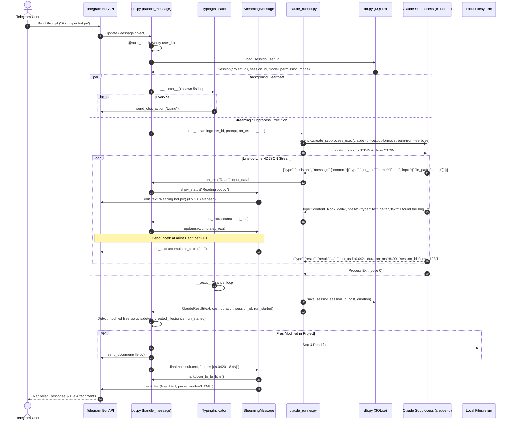
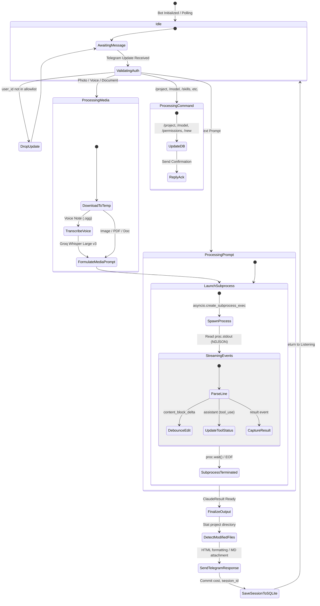

# Architectural Review: TeleClaude

> **Target Repository**: `c:\Users\W\Documents\GitHub\OpenRemote\ref\TeleClaude`  
> **Review Date**: August 2026  
> **Review Scope**: Complete codebase audit ([`bot.py`](file:///c:/Users/W/Documents/GitHub/OpenRemote/ref/TeleClaude/bot.py), [`claude_runner.py`](file:///c:/Users/W/Documents/GitHub/OpenRemote/ref/TeleClaude/claude_runner.py), [`config.py`](file:///c:/Users/W/Documents/GitHub/OpenRemote/ref/TeleClaude/config.py), [`db.py`](file:///c:/Users/W/Documents/GitHub/OpenRemote/ref/TeleClaude/db.py), [`scheduler.py`](file:///c:/Users/W/Documents/GitHub/OpenRemote/ref/TeleClaude/scheduler.py), [`skills.py`](file:///c:/Users/W/Documents/GitHub/OpenRemote/ref/TeleClaude/skills.py), [`utils.py`](file:///c:/Users/W/Documents/GitHub/OpenRemote/ref/TeleClaude/utils.py), deployment scripts, and documentation).

---

## 1. Executive Summary

[TeleClaude](file:///c:/Users/W/Documents/GitHub/OpenRemote/ref/TeleClaude/README.md) (authored by `leo919cc`) is an ultra-lightweight, personal Python bridge designed to remotely control Anthropic's **Claude Code CLI** (`claude`) via **Telegram**. 

### Design Philosophy & Purpose
Where alternative solutions in the Claude remote ecosystem scale up to 12,000–29,000 lines of code across dozens of modules (e.g., `RichardAtCT/claude-code-telegram`, `NachoSEO/claudegram`), TeleClaude is intentionally designed as an unbloated personal utility:
- **Footprint**: Exactly **1,626 lines of Python** across **7 core source files**.
- **Dependencies**: Only 4 external packages (`python-telegram-bot`, `python-dotenv`, `apscheduler`, `croniter`), plus standard `asyncio`, `sqlite3`, and `httpx`.
- **Operating Model**: Runs locally on the user's host workstation or server (primarily tested on macOS / Mac Mini). It receives Telegram messages via long polling, invokes Claude Code in print/pipe subprocess mode (`claude -p`), streams NDJSON tool events and text deltas back to Telegram, and persists per-user session IDs and project directories in SQLite.

```
+------------------+         MTProto / HTTPS         +-------------------+
|  Telegram Client | <=============================> |    TeleClaude     |
| (Mobile/Desktop) |                                 |  (Local Machine)  |
+------------------+                                 +---------+---------+
                                                               |
                                                  asyncio IPC  | claude -p / stream-json
                                                  (Subprocess) v
                                                     +-------------------+
                                                     |    Claude Code    |
                                                     | (Anthropic Agent) |
                                                     +-------------------+
```

---

## 2. Architecture & Data Flow

TeleClaude is structured as an event-driven asynchronous daemon. The `telegram.ext.Application` polling loop ingests incoming updates (`Message`, `Photo`, `Voice`, `Document`, `Command`), verifies authorization against an allowlist, coordinates media downloading, executes Claude Code via an async subprocess, debounces intermediate streaming chunks, formats markdown to Telegram HTML, and dispatches responses.

### 2.1 System Component Architecture

```mermaid
flowchart TB
    subgraph Telegram_Cloud ["Telegram Cloud Infrastructure"]
        TG_API["Telegram Bot API"]
    end

    subgraph Host_Machine ["Local Host / Workstation (Mac/Linux)"]
        subgraph Bridge_Layer ["TeleClaude Bridge Layer"]
            BOT["bot.py\n(Handlers & Polling Loop)"]
            AUTH["@auth_check\n(User Allowlist)"]
            STREAM["StreamingMessage\n(2s Debouncer & Splitter)"]
            TYPING["TypingIndicator\n(5s Async Heartbeat)"]
            UTILS["utils.py\n(Markdown->HTML, File Detect)"]
            SKILLS["skills.py\n(Frontmatter Scanner)"]
            SCHED["scheduler.py\n(APScheduler Cron Daemon)"]
            DB[("db.py\n(SQLite sessions.db)")]
            JOBS[("scheduled_jobs.json")]
        end

        subgraph Subprocess_Layer ["Process Orchestration"]
            RUNNER["claude_runner.py\n(ClaudeRunner Async Engine)"]
            CLI_PROC["claude -p Subprocess\n(--output-format stream-json)"]
        end

        subgraph Local_Storage ["Local Filesystem (~/Documents, ~/.claude)"]
            CLAUDE_HOME["~/.claude/\n(settings, skills, commands)"]
            MEDIA_TEMP["/tmp/claude-tg-media/"]
            PROJECT_WS["Project Workspace\n(ALLOWED_BASE)"]
        end
    end

    subgraph External_Services ["External Cloud Services"]
        GROQ["Groq Whisper API\n(whisper-large-v3)"]
        ANTHROPIC["Anthropic API / Claude Backend"]
    end

    TG_API <-->|Long Polling / Webhook| BOT
    BOT --> AUTH
    AUTH --> RUNNER
    BOT --> STREAM
    BOT --> TYPING
    BOT --> UTILS
    BOT <--> SKILLS
    BOT <--> SCHED
    SCHED <--> JOBS
    RUNNER <--> DB
    RUNNER -->|asyncio.create_subprocess_exec| CLI_PROC
    CLI_PROC <-->|STDIN / STDOUT (NDJSON)| RUNNER
    CLI_PROC <-->|Claude Engine| ANTHROPIC
    BOT -->|Transcribe Audio (httpx)| GROQ
    SKILLS -.->|Discover| CLAUDE_HOME
    CLI_PROC -.->|Read/Write Files| PROJECT_WS
    BOT -.->|Stage Media| MEDIA_TEMP
```

---

### 2.2 End-to-End Sequence: Text Message Execution & Streaming



---

## 3. Core Tech Stack & Dependencies

The project maintains a lean dependency profile specified in [`requirements.txt`](file:///c:/Users/W/Documents/GitHub/OpenRemote/ref/TeleClaude/requirements.txt):

| Dependency | Version Spec | Purpose in TeleClaude | Architectural Significance |
| :--- | :--- | :--- | :--- |
| **`python-telegram-bot`** | `[socks]>=21.0` | Async Telegram Bot API wrapper | Provides the async runtime (`Application`, `CommandHandler`, `MessageHandler`), update dispatching, and optional SOCKS5 proxy transport. |
| **`python-dotenv`** | `>=1.0` | Environment configuration | Implements hierarchical config loading from `~/Documents/api-keys/.env` and `./.env`. |
| **`apscheduler`** | `>=3.10` | In-process cron scheduling | Background async job scheduler (`AsyncIOScheduler`) powering recurring prompt runs. |
| **`croniter`** | Latest | Cron expression parsing | Validates 5-field cron strings for `/schedule`. |
| **`httpx`** | Std / Transitive | Async HTTP client | Handles direct HTTP multipart uploads to Groq's Whisper audio transcription endpoint. |
| **`sqlite3`** | Standard Library | Session persistence | Per-user session tracking (`sessions.db`) without requiring external database servers. |
| **`asyncio`** | Standard Library | Subprocess & Concurrency | Async process piping, stream iteration, and typing heartbeat tasks. |

---

## 4. Distinctive & Smart Engineering Decisions

### 4.1 Persistent Typing Indicator as an Asynchronous Context Manager
Telegram automatically expires the `"typing"` chat action after ~5 seconds. In long LLM tool loops (running tests, reading multiple files), the UI indicator disappears, leading users to believe the bot has hung.  
TeleClaude solves this with an elegant `async with` context manager pattern in [`bot.py:L207-234`](file:///c:/Users/W/Documents/GitHub/OpenRemote/ref/TeleClaude/bot.py#L207-L234):

```python
class TypingIndicator:
    def __init__(self, bot, chat_id: int):
        self.bot = bot
        self.chat_id = chat_id
        self._task = None

    async def __aenter__(self):
        self._task = asyncio.create_task(self._loop())
        return self

    async def __aexit__(self, *args):
        self._task.cancel()
        try:
            await self._task
        except asyncio.CancelledError:
            pass

    async def _loop(self):
        while True:
            try:
                await self.bot.send_chat_action(self.chat_id, "typing")
            except Exception:
                pass
            await asyncio.sleep(5)
```

### 4.2 Debounced Streaming with Window Sealing
Telegram imposes severe rate limits on message editing (exceeding ~1 edit per second in a single chat triggers `HTTP 429 RetryAfter`). Furthermore, single messages are hard-capped at 4,096 UTF-8 characters.  
[`StreamingMessage`](file:///c:/Users/W/Documents/GitHub/OpenRemote/ref/TeleClaude/bot.py#L108-L204) implements a stateful streaming buffer:
1. **Time-Throttled Updates**: Edits are throttled to a minimum interval of `2.0` seconds ([`bot.py:L150-152`](file:///c:/Users/W/Documents/GitHub/OpenRemote/ref/TeleClaude/bot.py#L150-L152)).
2. **Chunk Sealing / Overflow Handling**: When accumulated text exceeds `MAX_CHUNK = 4000` chars, it searches backwards for a newline boundary (`rfind("\n", 0, 4000)`), executes a final edit on the existing message ("sealing" it), updates `sent_len`, and spawns a new Telegram message for subsequent incoming text ([`bot.py:L136-148`](file:///c:/Users/W/Documents/GitHub/OpenRemote/ref/TeleClaude/bot.py#L136-L148)).
3. **Graceful Fallback**: If HTML parsing fails during `.finalize()`, it strips HTML tags via regex and re-transmits plain text ([`bot.py:L190-195`](file:///c:/Users/W/Documents/GitHub/OpenRemote/ref/TeleClaude/bot.py#L190-L195)).

### 4.3 Automated Document Conversion & Large File Delivery
When Claude generates expansive documentation or reports:
- **Heuristic Document Detection**: [`_looks_like_document`](file:///c:/Users/W/Documents/GitHub/OpenRemote/ref/TeleClaude/bot.py#L73-L77) checks if `len(text) > 1500` AND `headers >= 2`. If true, in addition to chat text, the bot automatically writes the raw markdown to a temporary file and sends it as a `.md` document attachment (`document.md`) via `send_document` ([`bot.py:L79-91`](file:///c:/Users/W/Documents/GitHub/OpenRemote/ref/TeleClaude/bot.py#L79-L91)).
- **Post-Run File Detection**: [`detect_created_files`](file:///c:/Users/W/Documents/GitHub/OpenRemote/ref/TeleClaude/utils.py#L109-L138) inspects paths mentioned in backticks or absolute path formats in Claude's text. If any file exists on disk, was modified `st_mtime >= run_started`, and is under 20 MB, it automatically uploads the generated file directly to Telegram ([`bot.py:L705-712`](file:///c:/Users/W/Documents/GitHub/OpenRemote/ref/TeleClaude/bot.py#L705-L712)).

### 4.4 Claude Code Skill Auto-Discovery & Mirroring
Instead of manually declaring bot commands, [`skills.py`](file:///c:/Users/W/Documents/GitHub/OpenRemote/ref/TeleClaude/skills.py#L79-L145) dynamically inspects the local machine's `~/.claude/` directory at startup:
- Scans `~/.claude/skills/*/SKILL.md` (custom skills).
- Scans `~/.claude/commands/*.md` (custom commands).
- Scans `~/.claude/plugins/**/commands/*.md` (plugin commands).
- Extracts YAML frontmatter (`name`, `description`, `allowed-tools`), sanitizes the command name to match Telegram's regex `^[a-z0-9_]{1,32}$`, and registers dynamic handlers in `bot.py` ([`bot.py:L775-776`](file:///c:/Users/W/Documents/GitHub/OpenRemote/ref/TeleClaude/bot.py#L775-L776)) as well as registering them with Telegram's bot command menu via `set_my_commands` ([`bot.py:L803-807`](file:///c:/Users/W/Documents/GitHub/OpenRemote/ref/TeleClaude/bot.py#L803-L807)).

### 4.5 Media Temp Staging & Sandbox Passthrough
Telegram photo and document downloads are staged in `/tmp/claude-tg-media/` ([`claude_runner.py:L15`](file:///c:/Users/W/Documents/GitHub/OpenRemote/ref/TeleClaude/claude_runner.py#L15)). When spawning `claude -p`, the runner passes `--add-dir /tmp/claude-tg-media/` ([`claude_runner.py:L78-79`](file:///c:/Users/W/Documents/GitHub/OpenRemote/ref/TeleClaude/claude_runner.py#L78-L79), [`claude_runner.py:L145-146`](file:///c:/Users/W/Documents/GitHub/OpenRemote/ref/TeleClaude/claude_runner.py#L145-L146)), granting Claude's `Read` tool explicit filesystem permissions to inspect the uploaded attachment without triggering permission errors.

### 4.6 Isolated Scheduled Execution Space
To prevent automated cron jobs from colliding with or mutating the user's active interactive conversation state, [`scheduler.py:L18`](file:///c:/Users/W/Documents/GitHub/OpenRemote/ref/TeleClaude/scheduler.py#L18) introduces a deterministic UID offset:
$$\text{sched\_uid} = \text{user\_id} + 1{,}000{,}000{,}000$$
When the cron fires, it executes inside this temporary synthetic user session, dispatches the result to the user's chat, and immediately purges the session from memory ([`scheduler.py:L92-108`](file:///c:/Users/W/Documents/GitHub/OpenRemote/ref/TeleClaude/scheduler.py#L92-L108)).

---

## 5. Process Lifecycle & Terminal / Subprocess Management

### 5.1 Subprocess Invocation Paradigm
TeleClaude executes Claude Code in headless non-interactive mode via `asyncio.create_subprocess_exec`.

```python
# Command Construction in claude_runner.py:L143-150
cmd = [CLAUDE_PATH, "-p", "--output-format", "stream-json", "--verbose"]
cmd.extend(["--permission-mode", session.permission_mode])
if MEDIA_DIR.is_dir():
    cmd.extend(["--add-dir", str(MEDIA_DIR)])
if session.model:
    cmd.extend(["--model", session.model])
if session.session_id:
    cmd.extend(["--resume", session.session_id])
```

#### Environment Sanitization
When launched via macOS LaunchAgent, the default daemon environment lacks user shell variables. [`claude_runner.py:L152-156`](file:///c:/Users/W/Documents/GitHub/OpenRemote/ref/TeleClaude/claude_runner.py#L152-L156) sanitizes and constructs the subprocess environment:
1. **Recursion Prevention**: Explicitly strips `CLAUDECODE` from the inherited environment (`{k: v for k, v in os.environ.items() if k != "CLAUDECODE"}`) to avoid nested session detection locks.
2. **Fallback Defaults**: Ensures `HOME` and `USER` are populated (`os.getlogin()`).
3. **Explicit PATH**: Overrides `PATH` to include `/opt/homebrew/bin:/usr/local/bin:/usr/bin:/bin`.

### 5.2 Input & Output Pipeline

```
Prompt Text ---> proc.stdin.write(prompt.encode()) ---> proc.stdin.drain() ---> proc.stdin.close()
                                                                                      |
Claude Engine <=======================================================================+
      |
      +---> STDOUT (NDJSON Lines) ---> async for raw_line in proc.stdout:
      |                                       |
      |                                       +--> json.loads(line)
      |                                       +--> event["type"] == "content_block_delta" -> on_text()
      |                                       +--> event["type"] == "assistant"           -> on_tool()
      |                                       +--> event["type"] == "result"              -> capture cost/duration/session_id
      |
      +---> STDERR ---> proc.stderr.read() (Captured on non-zero exit code)
```

### 5.3 NDJSON Event Stream Parser Breakdown

[`claude_runner.py:L180-218`](file:///c:/Users/W/Documents/GitHub/OpenRemote/ref/TeleClaude/claude_runner.py#L180-L218) parses three primary JSON event schemas emitted by Claude Code's `--output-format stream-json`:

1. **`content_block_delta`**:
   ```json
   {
     "type": "content_block_delta",
     "delta": {
       "type": "text_delta",
       "text": " partial text token "
     }
   }
   ```
   Accumulates text into `accumulated += delta["text"]` and triggers `await on_text(accumulated)`.

2. **`assistant` (Tool Use Notifications)**:
   ```json
   {
     "type": "assistant",
     "message": {
       "content": [
         { "type": "text", "text": "..." },
         { "type": "tool_use", "name": "Bash", "input": { "command": "pytest" } }
       ]
     }
   }
   ```
   Triggers `await on_tool("Bash", {"command": "pytest"})`, which is formatted by `_tool_status()` into `$ pytest` and displayed live in the Telegram message.

3. **`result`**:
   ```json
   {
     "type": "result",
     "result": "Final formatted markdown text",
     "cost_usd": 0.0125,
     "duration_ms": 4200,
     "session_id": "9a1b2c3d-..."
   }
   ```
   Extracts exact USD cost, elapsed duration in milliseconds, and the persistent Anthropic `session_id`.

### 5.4 Process Timeouts and Termination
Execution is wrapped in an async timeout:
```python
await asyncio.wait_for(_read_stream(), timeout=CLAUDE_TIMEOUT)
```
- Default: `CLAUDE_TIMEOUT = 300` (5 minutes), configurable via `.env`.
- On `asyncio.TimeoutError`, the runner executes `proc.kill()`, logs an error, and returns a graceful `ClaudeResult(text="Timed out (5 min limit).", is_error=True)` ([`claude_runner.py:L131-134`](file:///c:/Users/W/Documents/GitHub/OpenRemote/ref/TeleClaude/claude_runner.py#L131-L134), [`claude_runner.py:L240-245`](file:///c:/Users/W/Documents/GitHub/OpenRemote/ref/TeleClaude/claude_runner.py#L240-L245)).

---

## 6. Communication & Message Protocols

### 6.1 Telegram Bot Command Hierarchy

```
TeleClaude Command Map
├── Session & Directory Control
│   ├── /project <path>      -> Resolves relative/absolute path under ALLOWED_BASE, clears session_id
│   ├── /projects            -> Lists all subdirectories in ALLOWED_BASE
│   ├── /new                 -> Resets session_id, message_count, and total_cost in SQLite
│   └── /status              -> Outputs active project folder name and session attachment state
├── Models & Permissions
│   ├── /model <name>        -> Sets session.model (e.g., opus, sonnet, haiku, or full ID)
│   ├── /permissions          -> Toggles between 'bypassPermissions' and 'acceptEdits'
│   └── /config              -> Reads & prints ~/.claude/settings.json
├── Cost & Telemetry
│   └── /cost                -> Displays total session cost ($), cumulative duration (s), messages
├── File Transfer
│   └── /getfile <path>      -> Validates path sandboxing, downloads file to Telegram (<= 20 MB)
├── Scheduling Subsystem
│   ├── /schedule <cron> <p> -> Registers 5-field cron expression in APScheduler + JSON
│   ├── /jobs                -> Lists active scheduled jobs for the user
│   └── /canceljob <id>      -> Unregisters cron job and removes from JSON
├── Discovered Skills
│   ├── /skills              -> Lists all discovered CLI and Telegram skills
│   └── /<skill_name> [args] -> Injects YAML prompt template with optional task arguments
└── System
    ├── /start               -> Welcome banner & command documentation
    └── /help                -> Alias to /start
```

### 6.2 Database Schema (`db.py`)

TeleClaude maintains state in a single SQLite table stored in `sessions.db` ([`db.py:L11-22`](file:///c:/Users/W/Documents/GitHub/OpenRemote/ref/TeleClaude/db.py#L11-L22)):

```sql
CREATE TABLE IF NOT EXISTS sessions (
    user_id INTEGER PRIMARY KEY,
    project_dir TEXT,
    session_id TEXT,
    model TEXT,
    permission_mode TEXT DEFAULT 'bypassPermissions',
    total_cost REAL DEFAULT 0,
    total_duration REAL DEFAULT 0,
    message_count INTEGER DEFAULT 0
);
```

#### Session Schema Fields:
- `user_id` (`INTEGER PRIMARY KEY`): The 64-bit Telegram user ID.
- `project_dir` (`TEXT`): Absolute filesystem path of the current working directory.
- `session_id` (`TEXT`): Claude CLI's internal UUID for resuming context with `--resume <session_id>`.
- `model` (`TEXT`): Model override (e.g., `"opus"`, `"sonnet"`, `"claude-sonnet-4-6"`).
- `permission_mode` (`TEXT`): Subprocess flag `"bypassPermissions"` (unattended) or `"acceptEdits"` (safe mode).
- `total_cost` (`REAL`): Cumulative USD expense across the current active session.
- `total_duration` (`REAL`): Cumulative execution seconds.
- `message_count` (`INTEGER`): Number of turns completed.

### 6.3 State Machine Diagram



---

## 7. Reliability, Fault Tolerance & Edge Cases

| Challenge / Edge Case | Mechanism in TeleClaude | Code Location | Technical Evaluation |
| :--- | :--- | :--- | :--- |
| **Telegram Rate Limits (Flood Control)** | Debounces `edit_text` to $\ge 2.0\text{s}$ interval; catches `RetryAfter` exception and awaits `retry_after`. | [`bot.py:L150-160`](file:///c:/Users/W/Documents/GitHub/OpenRemote/ref/TeleClaude/bot.py#L150-L160) | **Effective**: Prevents hitting Telegram's 429 flood control during high-speed token generation. |
| **4096-Character Limit** | `split_message` splits by newlines, then spaces, then hard cuts at 4096 chars; `StreamingMessage` seals old message at 4000 chars and starts a new one. | [`utils.py:L14-40`](file:///c:/Users/W/Documents/GitHub/OpenRemote/ref/TeleClaude/utils.py#L14-L40), [`bot.py:L135-148`](file:///c:/Users/W/Documents/GitHub/OpenRemote/ref/TeleClaude/bot.py#L135-L148) | **Solid**: Preserves readability across message boundaries without dropping text. |
| **Malformed Markdown / HTML Parse Errors** | Two-tier rendering: converts markdown to Telegram HTML; if Telegram rejects entities, strips all `<...>` tags and re-sends as plain text. | [`bot.py:L61-71`](file:///c:/Users/W/Documents/GitHub/OpenRemote/ref/TeleClaude/bot.py#L61-L71), [`bot.py:L188-203`](file:///c:/Users/W/Documents/GitHub/OpenRemote/ref/TeleClaude/bot.py#L188-L203) | **Resilient**: Guarantees delivery even when Claude emits unbalanced markdown code tags. |
| **Host Process / Daemon Crashes** | `run.sh` wraps `bot.py` in a supervisor loop. On non-zero exit, invokes macOS `osascript` with a Retry dialog. `install.sh` installs macOS LaunchAgent plist. | [`run.sh:L5-31`](file:///c:/Users/W/Documents/GitHub/OpenRemote/ref/TeleClaude/run.sh#L5-L31), [`install.sh:L38-69`](file:///c:/Users/W/Documents/GitHub/OpenRemote/ref/TeleClaude/install.sh#L38-L69) | **Decent on macOS**: Survives network drops, but requires interactive AppleScript dialog on crash. |
| **Proxy / Restricted Networks** | Inspects `all_proxy` / `ALL_PROXY` and configures `Application.builder().proxy(proxy).get_updates_proxy(proxy)`. | [`bot.py:L753-758`](file:///c:/Users/W/Documents/GitHub/OpenRemote/ref/TeleClaude/bot.py#L753-L758) | **High Utility**: Essential for environments requiring corporate SOCKS5/HTTPS egress. |
| **Claude CLI Subprocess Hangs** | Async timeout (`CLAUDE_TIMEOUT`, default 300s) wraps execution; invokes `proc.kill()` on timeout. | [`claude_runner.py:L131-134`](file:///c:/Users/W/Documents/GitHub/OpenRemote/ref/TeleClaude/claude_runner.py#L131-L134) | **Safe**: Prevents orphaned zombie processes from consuming CPU/RAM indefinitely. |

---

## 8. Security & Access Control

### 8.1 User ID Allowlisting & Silent Dropping
TeleClaude implements strict identity verification:
- Configuration parses `TELEGRAM_USER_ID` as a comma-delimited set of 64-bit integer IDs (`allowed_user_ids()` in [`config.py:L34-35`](file:///c:/Users/W/Documents/GitHub/OpenRemote/ref/TeleClaude/config.py#L34-L35)).
- The `@auth_check` decorator ([`bot.py:L46-53`](file:///c:/Users/W/Documents/GitHub/OpenRemote/ref/TeleClaude/bot.py#L46-L53)) intercepts all commands and messages:
  ```python
  def auth_check(func):
      """Decorator: silently ignore unauthorized users."""
      async def wrapper(update: Update, context: ContextTypes.DEFAULT_TYPE):
          if not update.effective_user or not is_authorized(update.effective_user.id):
              return
          return await func(update, context)
      return wrapper
  ```
- **Security Benefit**: Unauthorized messages receive zero response or error message, preventing bot discovery, user enumeration, or timing attacks.

### 8.2 Filesystem Sandboxing
All directory navigation (`/project <path>`) and file downloads (`/getfile <path>`) are strictly bounded to `ALLOWED_BASE` (defaulting to `~/Documents`):
```python
# Validation in bot.py:L311-313 & bot.py:L430-432
path = path.resolve()
if not str(path).startswith(str(ALLOWED_BASE)):
    await update.message.reply_text(f"Path must be under {ALLOWED_BASE}")
    return
```
This prevents Telegram commands from traversing up to `/etc`, `~/.ssh`, or root system directories via `../../` directory traversal.

### 8.3 Permission Modes
TeleClaude surfaces Claude Code's native permission model via `/permissions` ([`bot.py:L451-459`](file:///c:/Users/W/Documents/GitHub/OpenRemote/ref/TeleClaude/bot.py#L451-L459)):
- `bypassPermissions`: Autonomous mode. Claude executes bash commands, file writes, and tool uses without interactive approval prompts.
- `acceptEdits`: Restricted mode. File edits are accepted automatically, but bash command execution is restricted by Claude CLI's safe-mode checks.

---

## 9. Flaws, Antipatterns & Gotchas

While TeleClaude is remarkably compact and functional, a deep code inspection reveals several architectural flaws and edge cases:

### 9.1 Concurrency & Session State Race Conditions
- **No Concurrency Lock per User**: If a user sends a second message while a long-running prompt is actively streaming, `handle_message` immediately spawns a second concurrent subprocess with the exact same `--resume <session_id>`.
- **Consequence**: Multiple processes reading and writing to the same Claude session storage directory can cause Claude CLI session lock collisions, corrupted state, or interleaved responses.
- **Fix Required**: Implement a per-user `asyncio.Lock()` or an active execution queue.

### 9.2 Missing Interactive PTY / Inability to Handle Mid-Run Confirmations
- TeleClaude invokes `claude -p` using standard anonymous OS pipes (`asyncio.subprocess.PIPE`).
- **Limitation**: `claude -p` is designed for headless non-interactive batch execution. If Claude encounters a situation requiring user input, password entry (e.g. `sudo`), or an interactive CLI confirmation prompt, the subprocess cannot prompt the user over Telegram and will either fail immediately or block until the 300s timeout kills it.
- **Contrast**: Full agent bridges (such as OpenRemote) use a pseudo-terminal (PTY) emulator (e.g. `node-pty` or Python `pty`/`pyte`) to stream interactive terminal sessions and inject keystrokes.

### 9.3 SQLite Connection Antipattern
In [`db.py`](file:///c:/Users/W/Documents/GitHub/OpenRemote/ref/TeleClaude/db.py#L9-L24):
```python
def _connect():
    conn = sqlite3.connect(DB_PATH)
    conn.execute("""CREATE TABLE IF NOT EXISTS sessions (...)""")
    conn.commit()
    return conn
```
- Every read, write, and delete opens a new SQLite connection, executes DDL (`CREATE TABLE IF NOT EXISTS`), and closes the connection.
- **Antipattern**: Redundant DDL execution on every query incurs filesystem overhead and risks `sqlite3.OperationalError: database is locked` if scheduled jobs and user messages execute concurrently. SQLite should be initialized once at startup with `PRAGMA journal_mode=WAL;`.

### 9.4 Fragile HTML Entity & Markdown Conversion
The custom regex parser in [`utils.py:markdown_to_tg_html`](file:///c:/Users/W/Documents/GitHub/OpenRemote/ref/TeleClaude/utils.py#L43-L106) uses null-byte placeholders (`\x00PH0\x00`):
- Nested formatting (e.g. bold text inside links, italicized text inside blockquotes, or backticks inside markdown tables) frequently produces unbalanced or invalid HTML tags (`<b><a href="...">...</b></a>`).
- Although the fallback in `send_reply` strips HTML tags, this degrades the user experience by constantly reverting complex responses to unstyled plain text.

### 9.5 Platform-Specific Hardcoding (macOS Bias)
- Default CLI path in [`config.py:L15`](file:///c:/Users/W/Documents/GitHub/OpenRemote/ref/TeleClaude/config.py#L15) is hardcoded to `/opt/homebrew/bin/claude` (macOS Apple Silicon).
- Subprocess environment in [`claude_runner.py:L90`](file:///c:/Users/W/Documents/GitHub/OpenRemote/ref/TeleClaude/claude_runner.py#L90) and [`claude_runner.py:L155`](file:///c:/Users/W/Documents/GitHub/OpenRemote/ref/TeleClaude/claude_runner.py#L155) hardcodes `env["PATH"] = "/opt/homebrew/bin:/usr/local/bin:/usr/bin:/bin"`, breaking Linux environments (where Claude might reside in `/usr/bin/claude` or `~/.nvm/versions/...`) and Windows entirely.
- Supervisor in [`run.sh:L15-22`](file:///c:/Users/W/Documents/GitHub/OpenRemote/ref/TeleClaude/run.sh#L15-L22) invokes AppleScript (`osascript`), which fails on Linux/headless servers.

### 9.6 Lack of Request Cancellation (`/cancel`)
Once a 5-minute subprocess run begins, there is no Telegram handler to issue `SIGINT` or `SIGKILL` to the running process. The user must wait for completion or timeout.

---

## 10. Actionable Lessons & Takeaways for OpenRemote

OpenRemote can extract valuable architectural lessons and UX patterns from TeleClaude while avoiding its structural limitations:

### 1. Telegram Client UX Best Practices
- **Persistent Typing Heartbeat**: Always encapsulate Telegram typing notifications in an async context manager loop ([`TypingIndicator`](file:///c:/Users/W/Documents/GitHub/OpenRemote/ref/TeleClaude/bot.py#L207-L234)) to prevent Telegram from dropping the "typing..." state during multi-second LLM tool runs.
- **Adaptive Message Chunking & Streaming Debounce**: Throttle Telegram `edit_message_text` calls to a strict $\approx 1.5\text{s} - 2.0\text{s}$ interval and maintain a sliding character window that automatically seals previous message bubbles when crossing the 4,000-character threshold.
- **Dual-Format Delivery (Text + .md File)**: When an agent produces comprehensive documentation ($>1,500$ chars with multiple section headers), automatically attach the complete markdown file alongside the chat message for easy offline reading and export.

### 2. PTY Management vs Subprocess Pipe Mode
- TeleClaude's simplicity comes at the cost of being unable to handle interactive agent prompts. OpenRemote's Telegram client should implement a **hybrid model**:
  - **Headless Mode**: Use NDJSON streaming (`--output-format stream-json`) for fast, clean autonomous execution.
  - **Interactive PTY Mode**: Maintain a persistent pseudo-terminal worker with ANSI escape sequence parsing (e.g. `pyte`) and inline Telegram approval buttons (`[Approve]`, `[Reject]`, `[Cancel]`) for commands requiring explicit confirmation.

### 3. Skill & Command Auto-Discovery
- OpenRemote should adopt TeleClaude's approach in [`skills.py`](file:///c:/Users/W/Documents/GitHub/OpenRemote/ref/TeleClaude/skills.py) of scanning workspace tools, custom prompt markdown files, and frontmatter at startup to dynamically populate Telegram's `set_my_commands` menu.

### 4. Isolated Virtual Session Space for Scheduled / Proactive Tasks
- When running background cron schedules, always isolate the runner context using an offset or virtual session namespace (as demonstrated by TeleClaude's `_SCHED_UID_OFFSET = 1_000_000_000` in [`scheduler.py:L18`](file:///c:/Users/W/Documents/GitHub/OpenRemote/ref/TeleClaude/scheduler.py#L18)) to avoid corrupting the interactive user session history.

---

## 11. Key Code File Index

| File Path | Key Classes & Functions | Lines | Purpose & Description |
| :--- | :--- | :--- | :--- |
| [`bot.py`](file:///c:/Users/W/Documents/GitHub/OpenRemote/ref/TeleClaude/bot.py) | `main()`, `handle_message()`, `StreamingMessage`, `TypingIndicator`, `send_reply()` | [L1-816](file:///c:/Users/W/Documents/GitHub/OpenRemote/ref/TeleClaude/bot.py#L1-L816) | Main entrypoint, Telegram command handlers, streaming text updates, media handlers (photo, doc, voice). |
| [`claude_runner.py`](file:///c:/Users/W/Documents/GitHub/OpenRemote/ref/TeleClaude/claude_runner.py) | `ClaudeRunner`, `Session`, `ClaudeResult`, `run_streaming()`, `run()` | [L1-266](file:///c:/Users/W/Documents/GitHub/OpenRemote/ref/TeleClaude/claude_runner.py#L1-L266) | Subprocess execution engine, NDJSON stream parsing, timeout handling, cost/duration metrics extraction. |
| [`config.py`](file:///c:/Users/W/Documents/GitHub/OpenRemote/ref/TeleClaude/config.py) | `validate()`, `allowed_user_ids()`, environment constants | [L1-36](file:///c:/Users/W/Documents/GitHub/OpenRemote/ref/TeleClaude/config.py#L1-L36) | Multi-tier `.env` configuration loading, path resolution, and Telegram user ID parsing. |
| [`db.py`](file:///c:/Users/W/Documents/GitHub/OpenRemote/ref/TeleClaude/db.py) | `_connect()`, `load_session()`, `save_session()`, `delete_session()` | [L1-74](file:///c:/Users/W/Documents/GitHub/OpenRemote/ref/TeleClaude/db.py#L1-L74) | SQLite session storage, persisting working directory, session ID, model, permissions, and cost. |
| [`scheduler.py`](file:///c:/Users/W/Documents/GitHub/OpenRemote/ref/TeleClaude/scheduler.py) | `Scheduler`, `ScheduledJob`, `add()`, `remove()`, `_execute()` | [L1-126](file:///c:/Users/W/Documents/GitHub/OpenRemote/ref/TeleClaude/scheduler.py#L1-L126) | In-process APScheduler cron daemon with JSON job persistence and isolated session offset execution. |
| [`skills.py`](file:///c:/Users/W/Documents/GitHub/OpenRemote/ref/TeleClaude/skills.py) | `_discover_skills()`, `_parse_frontmatter()`, `get_skill_prompt()`, `list_skills()` | [L1-176](file:///c:/Users/W/Documents/GitHub/OpenRemote/ref/TeleClaude/skills.py#L1-L176) | Auto-discovery of Claude Code skills and commands from `~/.claude/` with frontmatter parsing. |
| [`utils.py`](file:///c:/Users/W/Documents/GitHub/OpenRemote/ref/TeleClaude/utils.py) | `split_message()`, `markdown_to_tg_html()`, `detect_created_files()` | [L1-139](file:///c:/Users/W/Documents/GitHub/OpenRemote/ref/TeleClaude/utils.py#L1-L139) | Formatting conversions, 4096-char chunking, and post-run filesystem artifact detection. |
| [`tasks/todo.md`](file:///c:/Users/W/Documents/GitHub/OpenRemote/ref/TeleClaude/tasks/todo.md) | Feature roadmap & gap priorities | [L1-135](file:///c:/Users/W/Documents/GitHub/OpenRemote/ref/TeleClaude/tasks/todo.md#L1-L135) | Phased implementation plan (Phase 1–4) derived from competitive benchmarking. |
| [`docs/features.md`](file:///c:/Users/W/Documents/GitHub/OpenRemote/ref/TeleClaude/docs/features.md) | Feature specification | [L1-92](file:///c:/Users/W/Documents/GitHub/OpenRemote/ref/TeleClaude/docs/features.md#L1-L92) | Complete user manual and command matrix. |
| [`docs/competitive-analysis.md`](file:///c:/Users/W/Documents/GitHub/OpenRemote/ref/TeleClaude/docs/competitive-analysis.md) | Ecosystem competitive matrix | [L1-201](file:///c:/Users/W/Documents/GitHub/OpenRemote/ref/TeleClaude/docs/competitive-analysis.md#L1-L201) | Detailed feature comparison across 8 competing Claude Telegram projects. |
| [`install.sh`](file:///c:/Users/W/Documents/GitHub/OpenRemote/ref/TeleClaude/install.sh) | LaunchAgent installation script | [L1-85](file:///c:/Users/W/Documents/GitHub/OpenRemote/ref/TeleClaude/install.sh#L1-L85) | Venv setup, dependency installation, and macOS LaunchAgent plist generator. |
| [`run.sh`](file:///c:/Users/W/Documents/GitHub/OpenRemote/ref/TeleClaude/run.sh) | macOS supervisor loop | [L1-32](file:///c:/Users/W/Documents/GitHub/OpenRemote/ref/TeleClaude/run.sh#L1-L32) | Crash detection loop with AppleScript graphical notification. |
