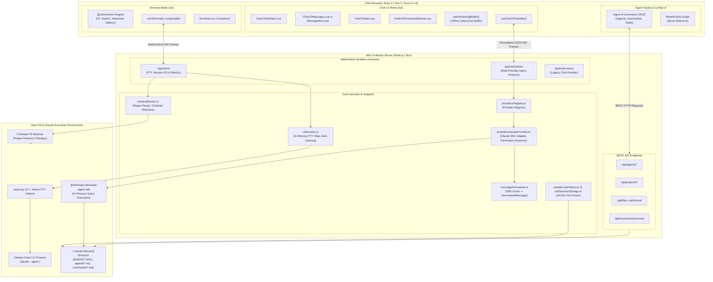
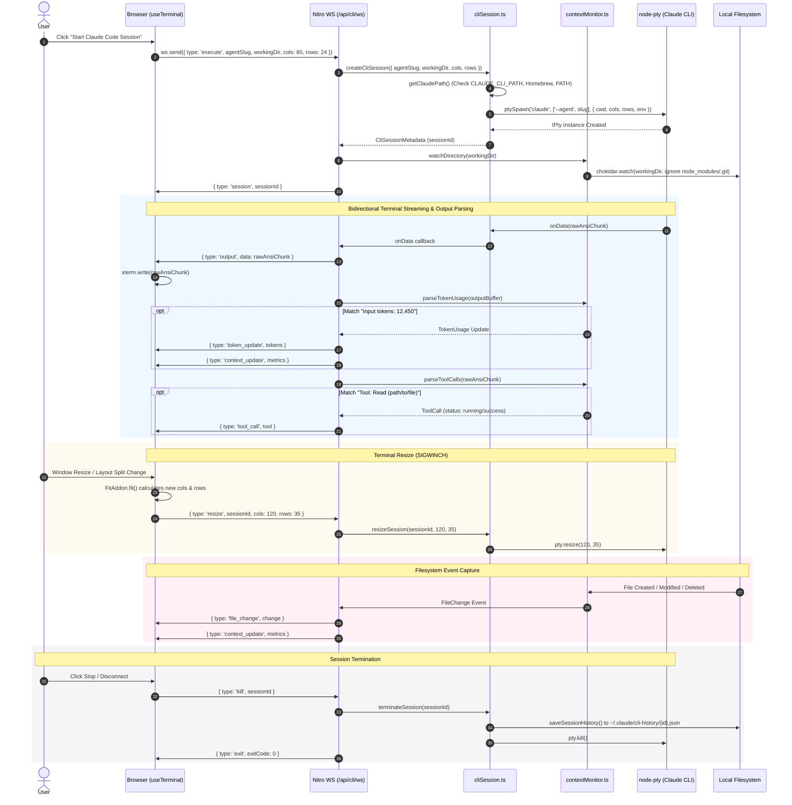
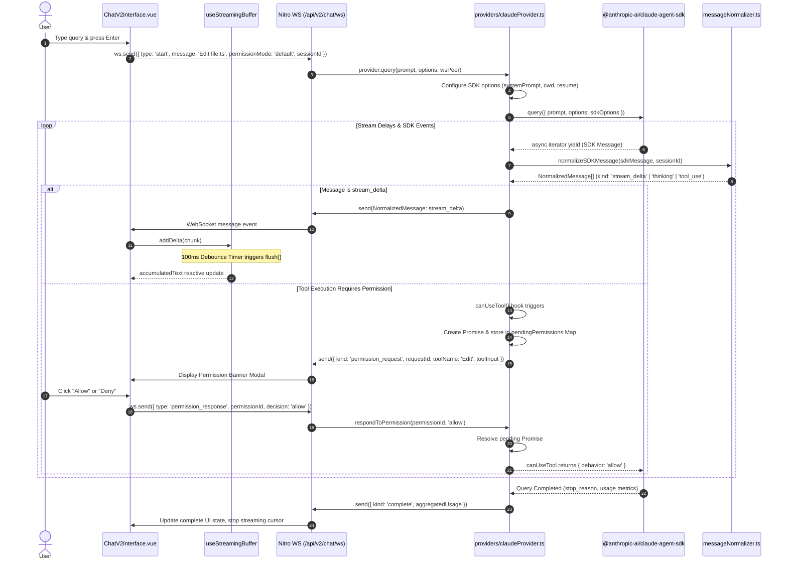

# Architectural Review: claude-code-cli-ui

## Executive Summary

`claude-code-cli-ui` (packaged internally as `agents-ui`) is a fullstack web dashboard, terminal emulator, and visual agent workspace designed to interface with Anthropic's **Claude Code CLI** and the `@anthropic-ai/claude-agent-sdk`. Built with **Nuxt 3**, **Vue 3**, **Nitro**, **Tailwind CSS (@nuxt/ui v3)**, and running on **Node.js / Bun**, it provides two complementary interaction paradigms for agentic software development:

1. **A Full PTY Terminal Emulator (`/cli` Terminal tab)**: Spawns interactive Claude Code CLI processes inside virtual pseudo-terminals via [`node-pty`](file:///c:/Users/W/Documents/GitHub/OpenRemote/ref/claude-code-cli-ui/server/utils/cliSession.ts#L1-L445), rendered in the browser using [`@xterm/xterm`](file:///c:/Users/W/Documents/GitHub/OpenRemote/ref/claude-code-cli-ui/app/composables/useTerminal.ts#L1-L304) over bidirectional WebSockets. This raw terminal interface is paired with a real-time sidecar context monitor that parses token counts, tool execution lifecycles, and watches filesystem mutations via [`chokidar`](file:///c:/Users/W/Documents/GitHub/OpenRemote/ref/claude-code-cli-ui/server/utils/contextMonitor.ts#L1-L317).
2. **A Structured Conversational Web Interface (`/cli` Chat tab / Chat v2)**: Bypasses raw terminal ANSI escape streams in favor of direct programmatic orchestration through `@anthropic-ai/claude-agent-sdk`. It supports streamed token rendering with 100ms debouncing, collapsible thinking blocks, interactive human-in-the-loop tool permission prompts, git status widgets, and visual project/session navigation that reads natively from Claude Code's `~/.claude/projects/` JSONL history.
3. **A Visual Configuration Manager for Agents, Commands, Skills, and Workflows**: Provides visual CRUD management and graph relationship mapping over YAML-frontmatter markdown files residing in `~/.claude/agents/`, `~/.claude/commands/`, and `~/.claude/skills/`.

```
┌────────────────────────────────────────────────────────────────────────────────────────────────┐
│                                       CLAUDE-CODE-CLI-UI                                       │
├───────────────────────────────────┬────────────────────────────────────────────────────────────┤
│ 1. Raw PTY Terminal Emulator      │ Browser xterm.js ──[WS]── Nitro ── node-pty ── Claude CLI  │
│ 2. Structured Chat v2 Web App     │ Vue Chat UI ──[WS]── Nitro Provider ── Claude Agent SDK    │
│ 3. Agent Configuration & Graph    │ Nuxt UI REST API ── File System Parser ── ~/.claude/*      │
└───────────────────────────────────┴────────────────────────────────────────────────────────────┘
```

---

## Architecture & Data Flow

### High-Level System Architecture

The application is structured into four distinct execution layers: Client Browser UI, Nitro Server & WebSocket Gateways, Backend Service & Process Layer, and the underlying OS / Anthropic Claude ecosystem.



---

### Sequence: Terminal PTY Session Lifecycle & Real-Time Context Monitoring



---

### Sequence: Conversational Chat v2 with Streaming & Tool Permission Interception



---

## Core Tech Stack & Dependencies

| Layer / Subsystem | Technology | Version | Purpose in Codebase |
| :--- | :--- | :--- | :--- |
| **Framework** | [Nuxt 3](file:///c:/Users/W/Documents/GitHub/OpenRemote/ref/claude-code-cli-ui/package.json#L30) | `^3.16` | Fullstack SSR/SSG framework, file-based routing, auto-imported composables. |
| **UI Components** | [@nuxt/ui](file:///c:/Users/W/Documents/GitHub/OpenRemote/ref/claude-code-cli-ui/package.json#L19) | `^3` | Design system based on Tailwind CSS, headless UI components, and Lucide icons. |
| **Runtime & Server** | [Nitro (Nuxt Engine)](file:///c:/Users/W/Documents/GitHub/OpenRemote/ref/claude-code-cli-ui/nuxt.config.ts#L17-L21) | Built-in | Fast HTTP + WebSocket server engine powered by `crossws` and `ws`. |
| **Runtime Target** | [Bun / Node.js](file:///c:/Users/W/Documents/GitHub/OpenRemote/ref/claude-code-cli-ui/bin/start.mjs#L1-L24) | `Node >= 18` | Execution environment; CLI launcher in `bin/start.mjs`. |
| **Terminal Emulator** | [@xterm/xterm](file:///c:/Users/W/Documents/GitHub/OpenRemote/ref/claude-code-cli-ui/package.json#L26) | `^6.0.0` | Browser terminal canvas rendering engine with ANSI color palette support. |
| **Terminal Addons** | `@xterm/addon-fit`<br>`@xterm/addon-web-links`<br>`@xterm/addon-search` | `^0.11.0`<br>`^0.12.0`<br>`^0.16.0` | Viewport dynamic fitting, clickable hyperlinks, and text search across the buffer. |
| **PTY Management** | [node-pty](file:///c:/Users/W/Documents/GitHub/OpenRemote/ref/claude-code-cli-ui/package.json#L29) | `^1.1.0` | C++ native POSIX/Win32 pseudo-terminal spawning for Claude CLI. |
| **WebSocket Core** | [ws](file:///c:/Users/W/Documents/GitHub/OpenRemote/ref/claude-code-cli-ui/package.json#L32) / `crossws` | `^8.20.0` | Bidirectional real-time framing for terminal I/O and streaming chat tokens. |
| **Agent SDK** | [@anthropic-ai/claude-agent-sdk](file:///c:/Users/W/Documents/GitHub/OpenRemote/ref/claude-code-cli-ui/package.json#L17) | `^0.2.76` | Direct in-process programmatic invocation of Claude Code subagents. |
| **MCP Support** | [@modelcontextprotocol/sdk](file:///c:/Users/W/Documents/GitHub/OpenRemote/ref/claude-code-cli-ui/package.json#L18) | `^1.29.0` | Model Context Protocol integration for external tool and server discovery. |
| **Filesystem Watcher** | [chokidar](file:///c:/Users/W/Documents/GitHub/OpenRemote/ref/claude-code-cli-ui/package.json#L27) | `^5.0.0` | Real-time monitoring of project working directory for created/modified/deleted files. |
| **Markdown & Syntax** | `marked`, `shiki`, `yaml` | `^17.0.4`, `^4.0.2`, `^2.6` | Frontmatter parsing, AST markdown rendering, and syntax-highlighted code blocks. |
| **Visual Workflow** | `@vue-flow/core` | `^1.41` | Node-based visual graph rendering for agent workflow dependencies. |

---

## Distinctive & Smart Engineering Decisions

### 1. Dual-Paradigm Terminal & Agent Architecture
Rather than forcing all interactions into either a purely text-based chat interface or a dumb terminal iframe, `claude-code-cli-ui` implements a dual-mode system:
- **Raw Terminal Mode**: Preserves full shell interactivity, ncurses TUI compatibility, and raw stdin/stdout piping through `node-pty`.
- **Structured Chat Mode (Chat v2)**: Consumes structured JSON events directly from `@anthropic-ai/claude-agent-sdk`, rendering markdown, code syntax highlighting via Shiki, collapsible thinking blocks, and custom UI components for tool approvals.

### 2. Sidecar Context Monitoring via Real-Time Regex & FS Interception
In raw terminal mode, the server in [`server/api/cli/ws.ts`](file:///c:/Users/W/Documents/GitHub/OpenRemote/ref/claude-code-cli-ui/server/api/cli/ws.ts#L80-L138) inspects the unescaped stdout chunks passing through the PTY pipeline using regex matchers in [`server/utils/contextMonitor.ts`](file:///c:/Users/W/Documents/GitHub/OpenRemote/ref/claude-code-cli-ui/server/utils/contextMonitor.ts#L77-L148):
- Matches token counters (e.g., `Input tokens: (\d+)`) and recalculates estimated session dollar cost using exact model pricing tables.
- Detects tool call invocations (`Tool: (\w+) \((.*?)\)`) and tracks elapsed execution duration.
- Concurrently runs a debounced `chokidar` filesystem watcher on the session's working directory, broadcasting file creations, modifications, and deletions to the UI's context panel.

### 3. High-Performance Debounced Streaming Buffer
To prevent Vue 3 reactivity overhead and DOM layout thrashing during high-speed token generation, [`app/composables/useStreamingBuffer.ts`](file:///c:/Users/W/Documents/GitHub/OpenRemote/ref/claude-code-cli-ui/app/composables/useStreamingBuffer.ts#L9-L175) accumulates incoming `stream_delta`, `thinking`, and `tool_input_delta` events into arrays and flushes them to reactive state on a **100ms debounce interval**. If the incoming queue exceeds `MAX_BUFFER_SIZE = 1000`, an emergency flush is executed immediately.

### 4. Zero-Duplication Storage Interoperability with Native Claude Code
Instead of maintaining a separate SQLite or MongoDB database that quickly falls out of sync with external CLI runs, the backend in [`server/utils/claudeCodeHistory.ts`](file:///c:/Users/W/Documents/GitHub/OpenRemote/ref/claude-code-cli-ui/server/utils/claudeCodeHistory.ts#L1-L870) and [`server/utils/sdkSessionStorage.ts`](file:///c:/Users/W/Documents/GitHub/OpenRemote/ref/claude-code-cli-ui/server/utils/sdkSessionStorage.ts#L1-L165) reads and writes directly to Claude Code's native storage format:
- Projects are indexed from `~/.claude/projects/`.
- Sessions are streamed from individual `~/.claude/projects/{projectName}/*.jsonl` files using Node's `readline` module.
- Any session initiated in the web UI is instantly resumeable via the command-line CLI, and vice versa.

### 5. Asynchronous Human-in-the-Loop Permission Gating
When running in default or restricted permission modes, the backend SDK query registers an asynchronous `canUseTool` hook in [`server/utils/providers/claudeProvider.ts`](file:///c:/Users/W/Documents/GitHub/OpenRemote/ref/claude-code-cli-ui/server/utils/providers/claudeProvider.ts#L199-L250). When Claude attempts to run a bash command or write a file:
1. An asynchronous `Promise` is generated and stored in a memory map `pendingPermissions` indexed by `permissionId`.
2. A `permission_request` WebSocket packet is emitted to the client.
3. The UI presents an interactive approval card ([`ChatV2PermissionBanner.vue`](file:///c:/Users/W/Documents/GitHub/OpenRemote/ref/claude-code-cli-ui/app/components/cli/chatv2/ChatV2PermissionBanner.vue)).
4. When the user approves or rejects, the client sends a `permission_response` frame, resolving the server-side Promise and resuming the SDK agent execution. If unhandled within 5 minutes (`PERMISSION_TIMEOUT_MS`), the request safely times out and denies execution.

---

## Process Lifecycle & Terminal/PTY Management

PTY process management is centralized inside [`server/utils/cliSession.ts`](file:///c:/Users/W/Documents/GitHub/OpenRemote/ref/claude-code-cli-ui/server/utils/cliSession.ts#L1-L445).

```
┌──────────────────────────────────────────────────────────────────────────────────────────────────┐
│                                    PTY SESSION STATE MACHINE                                     │
├───────────────┬──────────────────────────────────────────────────────────────────────────────────┤
│ Spawning      │ ptySpawn(claudePath, args, { name: 'xterm-256color', cols, rows, cwd, env })    │
│ Active Map    │ In-memory Map<string, CliSessionData> storing IPty, Metadata, FSWatchers, Output │
│ Keep-Alive    │ Reset 30-min idleTimer on any stdin/stdout event                                 │
│ Buffer Limit  │ Sliding window capping sessionData.output to last 10,000 chunks                  │
│ SIGWINCH      │ resizeSession(sessionId, cols, rows) -> pty.resize(cols, rows)                   │
│ Termination   │ saveSessionHistory() -> watchers.close() -> pty.kill() -> Map.delete()            │
└───────────────┴──────────────────────────────────────────────────────────────────────────────────┘
```

### 1. CLI Detection and Binary Resolution
Before spawning, [`getClaudePath()`](file:///c:/Users/W/Documents/GitHub/OpenRemote/ref/claude-code-cli-ui/server/utils/cliSession.ts#L337-L395) locates the Claude binary using a prioritized discovery sequence:
1. `runtimeConfig.claudeCliPath` (Nuxt config)
2. `process.env.CLAUDE_CLI_PATH`
3. Known platform locations:
   - `/opt/homebrew/bin/claude` (Apple Silicon macOS)
   - `/usr/local/bin/claude` (Intel macOS / Linux)
   - `/usr/bin/claude` (System bin)
4. Iterative lookup across directories listed in `process.env.PATH`.
5. Validates file existence and POSIX executable permissions (`fs.constants.X_OK`).

### 2. Spawning and Environment Configuration
The session is instantiated via `node-pty.spawn`:
```typescript
pty = ptySpawn(claudePath, args, {
  name: 'xterm-256color',
  cols: options.cols || 80,
  rows: options.rows || 24,
  cwd: workingDir,
  env: {
    ...process.env,
    TERM: 'xterm-256color',
    COLORTERM: 'truecolor',
    HOME: os.homedir(),
    PWD: workingDir,
  },
})
```

### 3. Sizing & SIGWINCH Resizing
- When the xterm container DOM size changes, browser `ResizeObserver` invokes `fitAddon.fit()`.
- The new terminal dimensions are retrieved from `terminal.cols` and `terminal.rows`.
- An asynchronous WebSocket message `{ type: 'resize', sessionId, cols, rows }` is transmitted to the server.
- The server calls `session.pty.resize(cols, rows)`, which triggers a kernel `SIGWINCH` signal on Unix or updates the pseudo-console buffer on Windows, ensuring downstream interactive CLI tools (like curses, fzf, or Claude Code's interactive menus) re-render without clipping.

### 4. Session Lifetime, Idle Timeout & Output Retention
- **In-Memory Session Map**: Active sessions reside in `const sessions = new Map<string, CliSessionData>()`.
- **Idle Timeout**: An inactivity timer (`IDLE_TIMEOUT = 30 * 60 * 1000`, 30 minutes) is reset upon every terminal input or output event. If inactive for 30 minutes, `terminateSession(sessionId)` is automatically invoked.
- **Sliding History Buffer**: `sessionData.output` records raw stream chunks for persistence, capped to the most recent 10,000 entries (`sessionData.output.slice(-10000)`).
- **Graceful Shutdown**: Node process shutdown hook `process.on('beforeExit')` iterates over all active sessions, killing child processes and writing remaining buffers to `~/.claude/cli-history/{sessionId}.json`.

---

## Communication & Protocol

All real-time communications operate over WebSocket connections using JSON framing.

### 1. Terminal WebSocket Protocol (`/api/cli/ws`)

#### Client-to-Server Packets
```typescript
// Start a new CLI PTY session
{ type: 'execute'; agentSlug?: string; workingDir?: string; cols?: number; rows?: number }

// Forward user keystrokes / stdin to the PTY
{ type: 'input'; sessionId: string; data: string }

// Notify terminal dimension change
{ type: 'resize'; sessionId: string; cols: number; rows: number }

// Terminate running session
{ type: 'kill'; sessionId: string }
```

#### Server-to-Client Packets
```typescript
// Confirm session creation
{ type: 'session'; sessionId: string }

// Stream raw stdout/stderr chunks from PTY
{ type: 'output'; data: string }

// Real-time token usage update
{ type: 'token_update'; tokens: { input: number; output: number; cached: number } }

// Full aggregated metrics update
{ type: 'context_update'; metrics: ContextMetrics }

// File change notification
{ type: 'file_change'; change: { path: string; type: 'created'|'modified'|'deleted'; timestamp: string } }

// Tool call invocation/completion
{ type: 'tool_call'; tool: { toolName: string; timestamp: string; elapsed?: number; status: 'running'|'success'|'error' } }

// Process exit
{ type: 'exit'; exitCode: number }

// Error message
{ type: 'error'; error: string }
```

---

### 2. Conversational Agent WebSocket Protocol (`/api/v2/chat/ws`)

#### Client-to-Server Packets
```typescript
// Initiate conversational query
{
  type: 'start';
  message: string;
  sessionId?: string;
  agentSlug?: string;
  workingDir?: string;
  provider?: string;
  permissionMode?: 'default' | 'skip' | 'acceptEdits' | 'plan' | 'bypassPermissions';
  model?: string;
  effort?: 'low' | 'medium' | 'high' | 'max';
  outputStyleId?: string;
  images?: string[];
}

// Abort active LLM query
{ type: 'abort'; sessionId: string }

// Respond to permission prompt
{
  type: 'permission_response';
  permissionId: string;
  decision: 'allow' | 'deny';
  remember?: boolean;
  updatedInput?: any;
}
```

#### Server-to-Client Normalized Message Protocol
All backend events from the Claude Agent SDK are converted via [`messageNormalizer.ts`](file:///c:/Users/W/Documents/GitHub/OpenRemote/ref/claude-code-cli-ui/server/utils/messageNormalizer.ts#L8-L203) into a single unified `NormalizedMessage` interface:

```typescript
export interface NormalizedMessage {
  kind: 'text' | 'tool_use' | 'tool_result' | 'thinking' | 'stream_delta' | 
        'stream_end' | 'complete' | 'error' | 'status' | 'session_created' | 
        'permission_request' | 'permission_cancelled';
  id: string;
  sessionId: string;
  timestamp: string;
  role?: 'user' | 'assistant';
  content?: string;
  toolName?: string;
  toolInput?: any;
  toolResult?: any;
  isError?: boolean;
  metadata?: Record<string, any>;
  provider?: string;
  requestId?: string;
  newSessionId?: string;
}
```

---

## Reliability, Fault Tolerance & Edge Cases

```
┌───────────────────────────────────┬────────────────────────────────────────────────────────────┐
│ Reliability Area                  │ Implementation & Mitigation Strategy                       │
├───────────────────────────────────┼────────────────────────────────────────────────────────────┤
│ WebSocket Disconnection           │ Auto-reconnect timer (3000ms delay) with state reset       │
│ High-Frequency Token Flooding     │ 100ms debouncing buffer + hard 1000-chunk overflow ceiling  │
│ Peer Disconnect During Run        │ cleanupPeer() aborts active SDK queries and rejects locks  │
│ Client Temporary Session ID Sync  │ Optimistic temporary ID seamlessly migrated on server ACK  │
│ Concurrent JSONL Disk Writes      │ readline streamer tolerates malformed/partial JSON lines   │
│ Zombie PTY Process Prevention     │ Inactivity timers (30 min) + process.on('beforeExit') hook │
└───────────────────────────────────┴────────────────────────────────────────────────────────────┘
```

### 1. Reconnection & Resumption
When a WebSocket connection drops, [`useChatV2Handler.ts`](file:///c:/Users/W/Documents/GitHub/OpenRemote/ref/claude-code-cli-ui/app/composables/useChatV2Handler.ts#L83-L90) schedules an automatic reconnection attempt after 3000ms. Because session IDs are passed explicitly in the protocol and Claude Code SDK persists state to disk, resuming an existing session preserves full conversation history.

### 2. Orphaned Query & Permission Cleanup
If a browser tab is closed or the network drops while a tool permission is pending or an LLM stream is running:
- The WebSocket handler's `close(peer)` hook invokes [`cleanupPeer(peer.id)`](file:///c:/Users/W/Documents/GitHub/OpenRemote/ref/claude-code-cli-ui/server/utils/providers/claudeProvider.ts#L75-L99).
- Active queries mapped to that peer ID have their `.interrupt()` method called.
- All pending permission Promise resolvers are rejected with `'IPC connection closed'`, preventing background process hangs.

### 3. Optimistic Session Migration
When starting a chat from a blank screen, the client generates a local temporary ID (`new-session-${Date.now()}`). When the backend SDK registers the real UUID session ID from Claude Code, it emits a `session_created` event. The client's [`useSessionStore`](file:///c:/Users/W/Documents/GitHub/OpenRemote/ref/claude-code-cli-ui/app/composables/useSessionStore.ts) transparently re-keys all optimistic messages to the permanent ID without interrupting user streaming.

---

## Security & Access Control

> [!WARNING]
> `claude-code-cli-ui` is designed strictly as a **local developer utility** and lacks enterprise multi-tenant isolation, user authentication, or strict path sandboxing.

### 1. Network Binding & Exposure
In [`bin/start.mjs`](file:///c:/Users/W/Documents/GitHub/OpenRemote/ref/claude-code-cli-ui/bin/start.mjs#L19), the server sets `process.env.HOST = process.env.HOST || '0.0.0.0'`. Binding to `0.0.0.0` exposes the web UI and WebSocket endpoints to the entire local area network (LAN), allowing any device on the network to access the terminal.

### 2. Unauthenticated WebSocket Gateways
Neither `/api/cli/ws` nor `/api/v2/chat/ws` implements any session token validation, cookie authentication, or CORS/Origin verification. Any web page or script able to connect to `ws://localhost:3030/api/cli/ws` can execute arbitrary shell commands under the host user's privileges.

### 3. Path Traversal Risks
- In [`server/api/files.get.ts`](file:///c:/Users/W/Documents/GitHub/OpenRemote/ref/claude-code-cli-ui/server/api/files.get.ts#L23-L27), absolute file paths are accepted without verifying they reside within project boundaries. An attacker could read arbitrary local files (e.g. `~/.ssh/id_rsa`, `/etc/passwd`).
- In [`server/api/reveal.post.ts`](file:///c:/Users/W/Documents/GitHub/OpenRemote/ref/claude-code-cli-ui/server/api/reveal.post.ts#L22-L35), user-supplied paths are passed directly into child process shell commands (`open "${targetPath}"` / `explorer "${targetPath}"`). While double quotes are used, improper input validation can lead to command injection.
- Conversely, [`server/api/commands/execute.post.ts`](file:///c:/Users/W/Documents/GitHub/OpenRemote/ref/claude-code-cli-ui/server/api/commands/execute.post.ts#L150-L171) contains a strict directory boundary check using `path.relative()`, proving that path containment was enforced on certain endpoints but missed on others.

---

## Flaws, Antipatterns & Gotchas

```
┌───────────────────────────────────┬────────────────────────────────────────────────────────────┐
│ Flaw / Anti-pattern               │ Description & Technical Impact                             │
├───────────────────────────────────┼────────────────────────────────────────────────────────────┤
│ 1. Bun vs node-pty Native ABI     │ Bun's native module loader often fails with node-pty C++    │
│ 2. Regex-Based Context Parsing    │ CLI stdout formatting changes break token/cost calculations│
│ 3. Single-Peer Terminal Binding   │ PTY output is sent to a single WebSocket peer; no pub/sub  │
│ 4. Unbounded Output Buffers       │ 10,000-chunk arrays in memory cause heap inflation over run│
│ 5. Sync Filesystem Calls          │ existsSync in request paths blocks the single-threaded loop │
└───────────────────────────────────┴────────────────────────────────────────────────────────────┘
```

### 1. Bun Native C++ Module Incompatibility with node-pty
While the project advertises Bun support (`bun run dev`), `node-pty` relies on native Node-API / C++ bindings (`node-gyp`). Bun's NAPI implementation has historical incompatibilities with `node-pty` forkpty routines on certain platforms (macOS ARM64 and Windows), requiring users to fall back to `npm run dev` with standard Node.js.

### 2. Fragile Regex-Based Stdout Scraping
Relying on regexes like `/Input tokens?:\s*([\d,]+)/i` in [`contextMonitor.ts`](file:///c:/Users/W/Documents/GitHub/OpenRemote/ref/claude-code-cli-ui/server/utils/contextMonitor.ts#L81) makes the monitoring subsystem brittle. If Anthropic changes the terminal output formatting in a minor update of Claude Code, token parsing, cost estimation, and tool timelines silently cease functioning.

### 3. Lack of Multi-Tab PTY Multiplexing
In [`server/api/cli/ws.ts`](file:///c:/Users/W/Documents/GitHub/OpenRemote/ref/claude-code-cli-ui/server/api/cli/ws.ts#L68-L120), PTY output is bound directly to the specific `peer` that issued the `execute` message. If a user opens the terminal in two browser tabs or refreshes the page, the new WebSocket connection cannot re-attach to the live stdout stream of the existing PTY session.

### 4. Memory Heap Accumulation
`sessionData.output` stores up to 10,000 string slices per session. In high-throughput terminal applications with frequent scrollback output, multiple concurrent active sessions can lead to significant V8 heap usage.

---

## Actionable Lessons & Takeaways for OpenRemote

1. **Adopt xterm.js + FitAddon with ResizeObserver**:
   - The pattern in [`useTerminal.ts`](file:///c:/Users/W/Documents/GitHub/OpenRemote/ref/claude-code-cli-ui/app/composables/useTerminal.ts#L87-L105) of wrapping xterm.js in a Vue 3 composable with automatic `ResizeObserver` dynamic fitting and bidirectional `SIGWINCH` synchronization is optimal for OpenRemote's web console.
2. **Implement Debounced Token Buffering**:
   - High-speed LLM streaming over WebSockets must use a debounced accumulation buffer (such as the 100ms timer in [`useStreamingBuffer.ts`](file:///c:/Users/W/Documents/GitHub/OpenRemote/ref/claude-code-cli-ui/app/composables/useStreamingBuffer.ts#L9-L175)) to avoid severe frontend rendering slowdowns.
3. **Decouple Transports via Provider Adapters**:
   - The provider adapter pattern in [`server/utils/providers/`](file:///c:/Users/W/Documents/GitHub/OpenRemote/ref/claude-code-cli-ui/server/utils/providers/types.ts#L13-L71) enables OpenRemote to support multiple agent backends (Claude, OpenAI, Ollama, custom subagents) through a uniform WebSocket wire protocol.
4. **Enforce Strict Local Host & Path Sandboxing**:
   - OpenRemote must enforce explicit localhost binding (`127.0.0.1`), mandatory authentication tokens on WebSocket endpoints, and rigorous `path.relative()` containment checks on all file-access APIs.
5. **Implement Session Multiplexing & Reattachment**:
   - Instead of binding child process output directly to a single socket connection, implement a pub/sub broadcast bus per session so users can switch tabs, refresh the browser, or access the session from multiple devices seamlessly.

---

## Key Code File Index

| File Path | Component / Layer | Key Functions & Symbols | Description & Reference |
| :--- | :--- | :--- | :--- |
| [`server/utils/cliSession.ts`](file:///c:/Users/W/Documents/GitHub/OpenRemote/ref/claude-code-cli-ui/server/utils/cliSession.ts#L1-L445) | PTY Session Manager | [`createCliSession`](file:///c:/Users/W/Documents/GitHub/OpenRemote/ref/claude-code-cli-ui/server/utils/cliSession.ts#L42), [`getClaudePath`](file:///c:/Users/W/Documents/GitHub/OpenRemote/ref/claude-code-cli-ui/server/utils/cliSession.ts#L337), [`resizeSession`](file:///c:/Users/W/Documents/GitHub/OpenRemote/ref/claude-code-cli-ui/server/utils/cliSession.ts#L210), [`terminateSession`](file:///c:/Users/W/Documents/GitHub/OpenRemote/ref/claude-code-cli-ui/server/utils/cliSession.ts#L232) | Spawns, resizes, monitors, and cleans up `node-pty` instances. |
| [`server/api/cli/ws.ts`](file:///c:/Users/W/Documents/GitHub/OpenRemote/ref/claude-code-cli-ui/server/api/cli/ws.ts#L1-L234) | Terminal WebSocket Gateway | [`defineWebSocketHandler`](file:///c:/Users/W/Documents/GitHub/OpenRemote/ref/claude-code-cli-ui/server/api/cli/ws.ts#L28) | Handles `execute`, `input`, `resize`, `kill` messages for terminal sessions. |
| [`server/utils/contextMonitor.ts`](file:///c:/Users/W/Documents/GitHub/OpenRemote/ref/claude-code-cli-ui/server/utils/contextMonitor.ts#L1-L317) | Sidecar Metric Parser | [`parseTokenUsage`](file:///c:/Users/W/Documents/GitHub/OpenRemote/ref/claude-code-cli-ui/server/utils/contextMonitor.ts#L77), [`parseToolCalls`](file:///c:/Users/W/Documents/GitHub/OpenRemote/ref/claude-code-cli-ui/server/utils/contextMonitor.ts#L108), [`watchDirectory`](file:///c:/Users/W/Documents/GitHub/OpenRemote/ref/claude-code-cli-ui/server/utils/contextMonitor.ts#L153), [`calculateCost`](file:///c:/Users/W/Documents/GitHub/OpenRemote/ref/claude-code-cli-ui/server/utils/contextMonitor.ts#L55) | Regex scraping of token counts, tool events, and Chokidar file watching. |
| [`app/composables/useTerminal.ts`](file:///c:/Users/W/Documents/GitHub/OpenRemote/ref/claude-code-cli-ui/app/composables/useTerminal.ts#L1-L304) | Terminal Composable | [`initTerminal`](file:///c:/Users/W/Documents/GitHub/OpenRemote/ref/claude-code-cli-ui/app/composables/useTerminal.ts#L21), [`connect`](file:///c:/Users/W/Documents/GitHub/OpenRemote/ref/claude-code-cli-ui/app/composables/useTerminal.ts#L112), [`disconnect`](file:///c:/Users/W/Documents/GitHub/OpenRemote/ref/claude-code-cli-ui/app/composables/useTerminal.ts#L203) | xterm.js instance initialization, fit addon wiring, and WebSocket I/O. |
| [`app/components/cli/Terminal.vue`](file:///c:/Users/W/Documents/GitHub/OpenRemote/ref/claude-code-cli-ui/app/components/cli/Terminal.vue#L1-L152) | Terminal UI Component | `<template>`, [`startSession`](file:///c:/Users/W/Documents/GitHub/OpenRemote/ref/claude-code-cli-ui/app/components/cli/Terminal.vue#L27), [`stopSession`](file:///c:/Users/W/Documents/GitHub/OpenRemote/ref/claude-code-cli-ui/app/components/cli/Terminal.vue#L43) | Terminal view with status indicators, play/stop controls, and canvas container. |
| [`server/api/v2/chat/ws.ts`](file:///c:/Users/W/Documents/GitHub/OpenRemote/ref/claude-code-cli-ui/server/api/v2/chat/ws.ts#L1-L175) | Chat v2 WebSocket Gateway | [`defineWebSocketHandler`](file:///c:/Users/W/Documents/GitHub/OpenRemote/ref/claude-code-cli-ui/server/api/v2/chat/ws.ts#L6) | Routes Chat v2 WebSocket actions to registered AI providers. |
| [`server/utils/providers/claudeProvider.ts`](file:///c:/Users/W/Documents/GitHub/OpenRemote/ref/claude-code-cli-ui/server/utils/providers/claudeProvider.ts#L1-L419) | Claude Agent SDK Adapter | [`claudeProvider.query`](file:///c:/Users/W/Documents/GitHub/OpenRemote/ref/claude-code-cli-ui/server/utils/providers/claudeProvider.ts#L131), [`respondToPermission`](file:///c:/Users/W/Documents/GitHub/OpenRemote/ref/claude-code-cli-ui/server/utils/providers/claudeProvider.ts#L334), [`cleanupPeer`](file:///c:/Users/W/Documents/GitHub/OpenRemote/ref/claude-code-cli-ui/server/utils/providers/claudeProvider.ts#L75) | Programmatic orchestration with Claude Agent SDK and permission gating. |
| [`server/utils/messageNormalizer.ts`](file:///c:/Users/W/Documents/GitHub/OpenRemote/ref/claude-code-cli-ui/server/utils/messageNormalizer.ts#L1-L275) | Event Adapter | [`normalizeSDKMessage`](file:///c:/Users/W/Documents/GitHub/OpenRemote/ref/claude-code-cli-ui/server/utils/messageNormalizer.ts#L8), [`attachToolResults`](file:///c:/Users/W/Documents/GitHub/OpenRemote/ref/claude-code-cli-ui/server/utils/messageNormalizer.ts#L239) | Converts SDK stream deltas and tool blocks to `NormalizedMessage` format. |
| [`app/composables/useStreamingBuffer.ts`](file:///c:/Users/W/Documents/GitHub/OpenRemote/ref/claude-code-cli-ui/app/composables/useStreamingBuffer.ts#L1-L314) | Streaming Token Buffer | [`addDelta`](file:///c:/Users/W/Documents/GitHub/OpenRemote/ref/claude-code-cli-ui/app/composables/useStreamingBuffer.ts#L87), [`flush`](file:///c:/Users/W/Documents/GitHub/OpenRemote/ref/claude-code-cli-ui/app/composables/useStreamingBuffer.ts#L161), [`endStreaming`](file:///c:/Users/W/Documents/GitHub/OpenRemote/ref/claude-code-cli-ui/app/composables/useStreamingBuffer.ts#L201) | 100ms debounced buffer preventing UI layout thrashing during token streaming. |
| [`app/composables/useChatV2Handler.ts`](file:///c:/Users/W/Documents/GitHub/OpenRemote/ref/claude-code-cli-ui/app/composables/useChatV2Handler.ts#L1-L560) | Chat v2 Client Handler | [`connect`](file:///c:/Users/W/Documents/GitHub/OpenRemote/ref/claude-code-cli-ui/app/composables/useChatV2Handler.ts#L45), [`handleNormalizedMessage`](file:///c:/Users/W/Documents/GitHub/OpenRemote/ref/claude-code-cli-ui/app/composables/useChatV2Handler.ts#L157), [`sendChat`](file:///c:/Users/W/Documents/GitHub/OpenRemote/ref/claude-code-cli-ui/app/composables/useChatV2Handler.ts#L250) | Coordinates WebSocket communication, streaming buffers, and permissions. |
| [`server/utils/claudeCodeHistory.ts`](file:///c:/Users/W/Documents/GitHub/OpenRemote/ref/claude-code-cli-ui/server/utils/claudeCodeHistory.ts#L1-L870) | Native History Reader | [`getClaudeCodeProjects`](file:///c:/Users/W/Documents/GitHub/OpenRemote/ref/claude-code-cli-ui/server/utils/claudeCodeHistory.ts#L344), [`getClaudeCodeSessions`](file:///c:/Users/W/Documents/GitHub/OpenRemote/ref/claude-code-cli-ui/server/utils/claudeCodeHistory.ts#L520), [`getClaudeCodeSessionMessages`](file:///c:/Users/W/Documents/GitHub/OpenRemote/ref/claude-code-cli-ui/server/utils/claudeCodeHistory.ts#L597) | Direct streaming and parsing of `~/.claude/projects/` JSONL chat history. |
| [`server/utils/claudeDir.ts`](file:///c:/Users/W/Documents/GitHub/OpenRemote/ref/claude-code-cli-ui/server/utils/claudeDir.ts#L1-L25) | Path Configuration | [`getClaudeDir`](file:///c:/Users/W/Documents/GitHub/OpenRemote/ref/claude-code-cli-ui/server/utils/claudeDir.ts#L7), [`resolveClaudePath`](file:///c:/Users/W/Documents/GitHub/OpenRemote/ref/claude-code-cli-ui/server/utils/claudeDir.ts#L22) | Resolves `~/.claude` root directory with `CLAUDE_DIR` environment override. |
| [`app/types/index.ts`](file:///c:/Users/W/Documents/GitHub/OpenRemote/ref/claude-code-cli-ui/app/types/index.ts#L1-L609) | Centralized Type Schema | [`NormalizedMessage`](file:///c:/Users/W/Documents/GitHub/OpenRemote/ref/claude-code-cli-ui/app/types/index.ts#L426), [`CliSession`](file:///c:/Users/W/Documents/GitHub/OpenRemote/ref/claude-code-cli-ui/app/types/index.ts#L322), [`ContextMetrics`](file:///c:/Users/W/Documents/GitHub/OpenRemote/ref/claude-code-cli-ui/app/types/index.ts#L365) | Shared TypeScript interfaces and types across client and server. |
| [`app/utils/models.ts`](file:///c:/Users/W/Documents/GitHub/OpenRemote/ref/claude-code-cli-ui/app/utils/models.ts#L1-L150) | Client Model Registry | `MODEL`, `MODEL_META`, `DEFAULT_MODEL` | Canonical single source of truth for frontend LLM model metadata and styling. |
| [`server/utils/models.ts`](file:///c:/Users/W/Documents/GitHub/OpenRemote/ref/claude-code-cli-ui/server/utils/models.ts#L1-L100) | Server Model Registry | `SERVER_MODEL_META`, `getModelPricing`, `getModelContextWindow` | Server pricing definitions and context window capacities for token cost calculations. |
| [`bin/start.mjs`](file:///c:/Users/W/Documents/GitHub/OpenRemote/ref/claude-code-cli-ui/bin/start.mjs#L1-L24) | CLI Binary Entrypoint | `./bin/start.mjs` | Executable launcher that runs `nuxi build` if needed and boots the Nitro server. |
