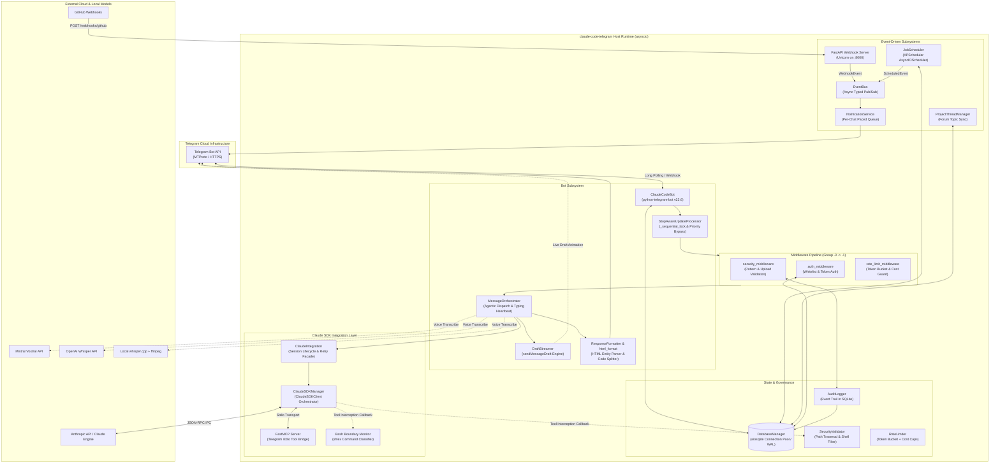
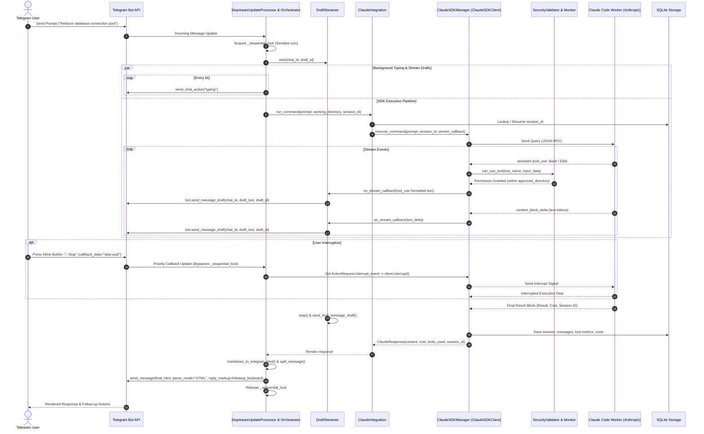
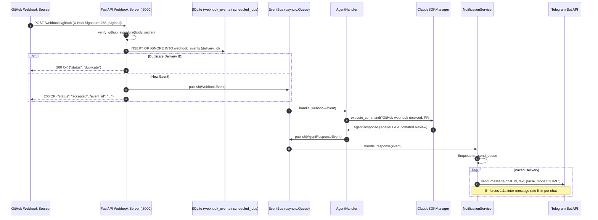

# Architectural Review: claude-code-telegram

> **Target Repository**: `c:\Users\W\Documents\GitHub\OpenRemote\ref\claude-code-telegram`  
> **Review Date**: August 2026  
> **Review Scope**: Full repository codebase audit ([`src/main.py`](file:///c:/Users/W/Documents/GitHub/OpenRemote/ref/claude-code-telegram/src/main.py), [`src/bot/`](file:///c:/Users/W/Documents/GitHub/OpenRemote/ref/claude-code-telegram/src/bot/), [`src/claude/`](file:///c:/Users/W/Documents/GitHub/OpenRemote/ref/claude-code-telegram/src/claude/), [`src/events/`](file:///c:/Users/W/Documents/GitHub/OpenRemote/ref/claude-code-telegram/src/events/), [`src/security/`](file:///c:/Users/W/Documents/GitHub/OpenRemote/ref/claude-code-telegram/src/security/), [`src/storage/`](file:///c:/Users/W/Documents/GitHub/OpenRemote/ref/claude-code-telegram/src/storage/), [`src/api/`](file:///c:/Users/W/Documents/GitHub/OpenRemote/ref/claude-code-telegram/src/api/), [`src/scheduler/`](file:///c:/Users/W/Documents/GitHub/OpenRemote/ref/claude-code-telegram/src/scheduler/), [`src/projects/`](file:///c:/Users/W/Documents/GitHub/OpenRemote/ref/claude-code-telegram/src/projects/), [`src/mcp/`](file:///c:/Users/W/Documents/GitHub/OpenRemote/ref/claude-code-telegram/src/mcp/), deployment scripts, and configuration).

---

## 1. Executive Summary

[`claude-code-telegram`](file:///c:/Users/W/Documents/GitHub/OpenRemote/ref/claude-code-telegram/README.md) is an advanced, production-grade Python asynchronous daemon that bridges **Telegram** (via `python-telegram-bot`) and Anthropic's **Claude Code** agent ecosystem.

### Architectural Evolution & Scope
Unlike basic wrapper scripts that spawn headless CLI subprocesses (`claude -p`) and parse stdout text using regular expressions, `claude-code-telegram` represents a mature, enterprise-grade architecture:
- **SDK-First Agent Engine**: Deeply integrates Anthropic's official `claude-agent-sdk` (`ClaudeSDKClient`), managing a persistent agent runtime over structured JSON-RPC IPC.
- **Preventive Tool-Use Interception**: Injects asynchronous security hooks (`can_use_tool` callbacks) into the SDK to validate bash commands and filesystem path boundaries *before* tools execute.
- **Native Draft Streaming**: Leverages Telegram's `sendMessageDraft` API via `DraftStreamer` for real-time, token-by-token streaming animations without exhausting Telegram's message edit rate limits.
- **Multi-Modal Ingestion**: Handles text, code files, zip archives (with zip-bomb guards), images (screenshots, UI mockups), and voice notes (via Mistral Voxtral, OpenAI Whisper, or local `whisper.cpp` + `ffmpeg`).
- **Co-Hosted Event-Driven Ecosystem**: Shares the `asyncio` event loop across a `python-telegram-bot` client, a `FastAPI` webhook receiver (with GitHub HMAC-SHA256 signature verification and atomic deduplication), an `APScheduler` cron daemon, and an asynchronous `EventBus`.
- **Forum Topic Routing**: Synchronizes Telegram Supergroup and Private Chat forum topics with configured project workspaces (`ProjectThreadManager`), providing topic-isolated multi-project workspaces.

```
+-----------------------------------------------------------------------------------+
|                              Telegram Ecosystem                                   |
|   (Direct Chats, Supergroup Forum Topics, Inline Keyboards, Voice, Files, Photos) |
+-----------------------------------------+-----------------------------------------+
                                          | MTProto / HTTPS Long Polling & Webhooks
                                          v
+-----------------------------------------------------------------------------------+
|                      claude-code-telegram Daemon (Python 3.11+)                   |
|                                                                                   |
|  +-----------------------------------------------------------------------------+  |
|  |                             Bot Infrastructure                              |  |
|  |  * StopAwareUpdateProcessor (Sequential Lock + Bypass for Stop Callbacks)    |  |
|  |  * Middleware Pipeline (Auth -> Rate Limiting -> Security -> Threat Detect) |  |
|  |  * MessageOrchestrator (Multi-Modal Dispatch & Verbose Levels 0, 1, 2)       |  |
|  |  * DraftStreamer (sendMessageDraft Token Animation & State Recovery)        |  |
|  |  * ResponseFormatter (Robust HTML Parser & Balanced <pre><code> Chunking)   |  |
|  +--------------------------------------+--------------------------------------+  |
|                                         |                                         |
|  +-----------------------------------+  |  +-----------------------------------+  |
|  |      Event Bus & Integrations     |  |  |    Security, Storage & State      |  |
|  |  * Async EventBus (Pub/Sub)       |  |  |  * SQLite WAL (aiosqlite Pool)    |  |
|  |  * FastAPI Webhook API (Uvicorn)  |  |  |  * SecurityValidator & AuditLog   |  |
|  |  * APScheduler Cron Engine        |  |  |  * TokenBucket & Cost Tracker     |  |
|  |  * NotificationService (Paced)    |  |  |  * ProjectThreadManager (Topics)  |  |
|  +-----------------------------------+  |  +-----------------------------------+  |
|                                         |                                         |
|  +--------------------------------------+--------------------------------------+  |
|  |                     Claude Engine Integration Layer                         |  |
|  |  * ClaudeSDKManager (ClaudeSDKClient Session Pool & Auto-Resume)             |  |
|  |  * can_use_tool Callback Hook (Path Boundary & Bash Safety Classification)  |  |
|  |  * Custom FastMCP Server (Telegram Stdio Transport Tools)                   |  |
|  |  * Interrupt Watcher (asyncio.Event -> SDK Interrupt)                       |  |
|  +--------------------------------------+--------------------------------------+  |
+-----------------------------------------+-----------------------------------------+
                                          | JSON-RPC IPC / Stdio
                                          v
+-----------------------------------------------------------------------------------+
|                        Claude Code Native Agent Worker                            |
|             (Anthropic Agent CLI / Node.js Process / MCP Subprocesses)            |
+-----------------------------------------------------------------------------------+
```

---

## 2. Architecture & Data Flow

### 2.1 System Component Topology



---

### 2.2 End-to-End Sequence: Agentic Turn with Live Draft Streaming & Interruption



---

### 2.3 Event-Driven Webhook & Cron Pipeline



---

## 3. Core Tech Stack & Dependencies

The complete dependency manifest is defined in [`pyproject.toml`](file:///c:/Users/W/Documents/GitHub/OpenRemote/ref/claude-code-telegram/pyproject.toml):

| Component / Package | Version Spec | Subsystem Role | Technical Rationale & Architectural Significance |
| :--- | :--- | :--- | :--- |
| **`python`** | `^3.11` | Core Runtime | Utilizes modern typing features, `datetime.UTC`, TaskGroups, and high-performance `asyncio` loop improvements. |
| **`python-telegram-bot`** | `^22.6` | Telegram Bot Framework | Enterprise async Telegram client supporting custom `BaseUpdateProcessor`, middleware decorators, rate-limiting handlers, and `sendMessageDraft`. |
| **`claude-agent-sdk`** | `^0.1.39` | Agent Runtime Engine | Anthropic's official SDK replacing fragile CLI stdout parsing with native JSON-RPC IPC, structured message objects, and programmatic `can_use_tool` pre-execution boundary validators. |
| **`pydantic-settings` / `pydantic`** | `^2.1.0` / `^2.1.0` | Configuration & Validation | Strongly typed environment variable parsing with validation, file size converters, and SecretStr redaction. |
| **`fastapi` / `uvicorn`** | `^0.115.0` / `^0.34.0` | Co-Hosted HTTP Server | Embedded ASGI server running within the main asyncio loop for webhooks (GitHub, GitLab, custom alerts). |
| **`aiosqlite`** | `^0.21.0` | Asynchronous SQLite Driver | High-throughput async database interactions utilizing connection pooling, WAL mode, and schema migrations. |
| **`apscheduler`** | `^3.11.0` | Job Scheduling Engine | `AsyncIOScheduler` executing in-memory cron schedules persisted to SQLite. |
| **`structlog`** | `^24.4.0` | Structured JSON Logging | Contextual, key-value structured logging with automated secret scrubbing and contextual tracking. |
| **`mcp`** / **`fastmcp`** | `^1.3.0` | Model Context Protocol | FastMCP stdio server exposing Telegram-native tools (`send_image_to_user`) directly to Claude's tool registry. |
| **`mistralai`** / **`openai`** | Optional `[voice]` | Speech-to-Text Providers | Cloud voice transcription backends (Voxtral and Whisper-1) for incoming voice messages. |
| **`PyYAML`** | `^6.0.2` | Workspace Configuration | Parsing `projects.yaml` definitions for forum topic routing. |

---

## 4. Distinctive & Smart Engineering Decisions

### 4.1 Real-Time Streaming via `sendMessageDraft` Engine
Standard Telegram bots stream responses by repeatedly calling `bot.edit_message_text()`. This introduces significant rate limit pressure (Telegram throttles edits to ~1–3 per second per chat) and causes UI jitter.

`claude-code-telegram` introduces [`DraftStreamer`](file:///c:/Users/W/Documents/GitHub/OpenRemote/ref/claude-code-telegram/src/bot/utils/draft_streamer.py#L28-L149), which leverages Telegram's unreleased `sendMessageDraft` API method:
1. **Dynamic Draft ID Generation**: Generates non-zero 30-bit random integers (`secrets.randbits(30) | 1`) in [`draft_streamer.py:L18-L25`](file:///c:/Users/W/Documents/GitHub/OpenRemote/ref/claude-code-telegram/src/bot/utils/draft_streamer.py#L18-L25) to animate typing bubbles smoothly.
2. **Rate Limit Bypass**: Draft updates do not trigger `edit_message_text` flood penalties.
3. **Tail Truncation**: When streaming text exceeds Telegram's 4096 character threshold, [`DraftStreamer._compose_draft`](file:///c:/Users/W/Documents/GitHub/OpenRemote/ref/claude-code-telegram/src/bot/utils/draft_streamer.py#L92-L113) preserves the prompt header and tail-truncates the stream (`[...]\n\n` + last 3800 chars), ensuring the user always sees the newest tokens.
4. **Self-Disabling Error Recovery**: If `sendMessageDraft` fails (e.g. unsupported client or server rejection), it permanently disables draft streaming for that turn and falls back to standard message delivery without crashing.

```python
# Draft ID Generation in src/bot/utils/draft_streamer.py:L18-L25
def generate_draft_id() -> int:
    """Generate a draft_id suitable for Bot.send_message_draft.
    Must be a non-zero integer that fits within 32-bit signed int.
    """
    draft_id = secrets.randbits(30) | 1
    return draft_id
```

---

### 4.2 Priority-Bypassing `StopAwareUpdateProcessor`
In `python-telegram-bot`, sequential processing prevents concurrent message corruption but stalls button callbacks while a long LLM query runs.

[`StopAwareUpdateProcessor`](file:///c:/Users/W/Documents/GitHub/OpenRemote/ref/claude-code-telegram/src/bot/update_processor.py#L14-L65) solves this:
- Normal updates (messages, commands) acquire `_sequential_lock`, ensuring turn serialization.
- Callback queries with `data.startswith("stop:")` **bypass `_sequential_lock` entirely**, executing concurrently to trigger `active_request.interrupt_event.set()`, instantly halting the running Claude SDK query.

```python
# Priority routing in src/bot/update_processor.py:L33-L64
async def process_update(self, update: Update, coroutine: Coroutine[Any, Any, Any]) -> None:
    if self._is_priority_update(update):
        # Run immediately in a separate background task without acquiring sequential lock
        task = asyncio.create_task(coroutine)
        self._active_tasks.add(task)
        task.add_done_callback(self._active_tasks.discard)
        return

    # Regular update: serialize behind lock
    async with self._sequential_lock:
        await coroutine
```

---

### 4.3 Pre-Execution Tool Interception via `can_use_tool` Hooks
Instead of executing tools freely and attempting to parse outputs retroactively, [`ClaudeSDKManager`](file:///c:/Users/W/Documents/GitHub/OpenRemote/ref/claude-code-telegram/src/claude/sdk_integration.py#L180-L240) injects a `can_use_tool` callback into `ClaudeSDKClientOptions`:
- **Filesystem Tools (`Write`, `Edit`, `MultiEdit`, `Read`)**: Resolves target paths and validates them against `SecurityValidator.validate_path()` to ensure operations stay strictly inside `approved_directory`.
- **Shell Tools (`Bash`)**: Invokes [`check_bash_directory_boundary`](file:///c:/Users/W/Documents/GitHub/OpenRemote/ref/claude-code-telegram/src/claude/monitor.py#L86-L177), tokenizing the shell command via `shlex` and blocking write/delete commands directed outside the workspace while allowing read-only inspection commands (`cat`, `git status`, `ls`).

```python
# Tool callback in src/claude/sdk_integration.py:L180-L240
def _make_can_use_tool_callback(self, working_directory: Path):
    async def can_use_tool(tool_name: str, tool_input: dict[str, Any], context: dict[str, Any]) -> bool:
        if tool_name in ("Write", "Edit", "MultiEdit"):
            file_path = tool_input.get("file_path", "")
            is_valid, _, _ = self.security_validator.validate_path(file_path, current_dir=working_directory)
            return is_valid
        if tool_name == "Bash":
            command = tool_input.get("command", "")
            is_safe, _ = check_bash_directory_boundary(command, working_directory, self.approved_directory)
            return is_safe
        return True
    return can_use_tool
```

---

### 4.4 Multi-Tier Forum Topic Project Routing
For teams and multi-repository setups, [`ProjectThreadManager`](file:///c:/Users/W/Documents/GitHub/OpenRemote/ref/claude-code-telegram/src/projects/thread_manager.py#L38-L432) syncs projects defined in `projects.yaml` with Telegram Forum Topics:
- `/sync_threads` creates, renames, reopens, or archives topics dynamically.
- Paces Telegram Topic API calls using `_sync_api_lock` and configurable rate intervals (`DEFAULT_PROJECT_THREADS_SYNC_ACTION_INTERVAL_SECONDS = 0.5s`).
- Automatically resolves incoming `message_thread_id` to the associated project workspace and switches session context seamlessly.

---

### 4.5 Resilient HTML Chunking & Parser Sanitization
Telegram HTML parsing frequently breaks on unbalanced tags emitted during LLM streaming.
- [`markdown_to_telegram_html`](file:///c:/Users/W/Documents/GitHub/OpenRemote/ref/claude-code-telegram/src/bot/utils/html_format.py#L21-L105) utilizes non-destructive UUID placeholders for code blocks, inline code, and headers, sanitizes HTML entities (`&`, `<`, `>`), and re-injects escaped content.
- [`ResponseFormatter._split_message`](file:///c:/Users/W/Documents/GitHub/OpenRemote/ref/claude-code-telegram/src/bot/utils/formatting.py#L476-L548) tracks open `<pre><code>` tags across chunk boundaries, automatically appending `</code></pre>` to the end of a chunk and reopening `<pre><code>` at the start of the next chunk.

---

## 5. Process Lifecycle & Terminal / Subprocess Management

### 5.1 Subprocess Architecture vs SDK Integration
Prior versions of `claude-code-telegram` relied on headless CLI subprocess execution (`claude -p`). The current architecture has transitioned to the official `claude-agent-sdk`:

```
+-------------------------------------------------------------------------------+
|                           ClaudeSDKManager Architecture                       |
|                                                                               |
|  +-------------------------------------------------------------------------+  |
|  |                            ClaudeSDKClient                              |  |
|  |  * Persistent background Node.js IPC process                            |  |
|  |  * Structured JSON-RPC communication                                    |  |
|  |  * can_use_tool security hooks injected directly into agent loop        |  |
|  |  * Stdio MCP server registration (FastMCP telegram tool server)         |  |
|  +------------------------------------+------------------------------------+  |
|                                       |                                       |
|               +-----------------------+-----------------------+               |
|               |                                               |               |
|               v                                               v               |
|  +--------------------------+                   +--------------------------+  |
|  |     Query Streaming      |                   |    Interrupt Control     |  |
|  |  * async for msg in      |                   |  * ActiveRequest         |  |
|  |    client.query(...)     |                   |  * interrupt_event.wait()|  |
|  |  * SDKMessage objects    |                   |  * client.interrupt()    |  |
|  +--------------------------+                   +--------------------------+  |
+-------------------------------------------------------------------------------+
```

### 5.2 Terminal / Stdio Management
- **Child Process Execution**: The SDK spawns the Claude Code node engine in the background and communicates over standard I/O pipes using JSON-RPC.
- **FastMCP Stdio Transport**: [`src/mcp/telegram_server.py`](file:///c:/Users/W/Documents/GitHub/OpenRemote/ref/claude-code-telegram/src/mcp/telegram_server.py) runs as a standalone FastMCP stdio process registered via `ClaudeSDKClientOptions(mcp_servers={"telegram": {"command": "python", "args": ["-m", "src.mcp.telegram_server"]}})`.
- **Exit Code & Process Cleanliness**: On application shutdown, [`src/main.py`](file:///c:/Users/W/Documents/GitHub/OpenRemote/ref/claude-code-telegram/src/main.py#L207-L368) invokes `ClaudeSDKManager.disconnect()`, which gracefully terminates child IPC sockets and reaps background Node.js processes.

---

## 6. Communication & Protocol Specifications

### 6.1 Database Schema & Entity Relationships

The database architecture is managed via SQLite in WAL mode with connection pooling ([`DatabaseManager`](file:///c:/Users/W/Documents/GitHub/OpenRemote/ref/claude-code-telegram/src/storage/database.py#L137-L368)):

```
                                  +-------------------+
                                  |       users       |
                                  +-------------------+
                                  | user_id (PK)      |
                                  | telegram_username |
                                  | is_allowed        |
                                  | total_cost        |
                                  | session_count     |
                                  +---------+---------+
                                            |
                   +------------------------+------------------------+
                   | 1:N                                             | 1:N
                   v                                                 v
         +-------------------+                             +-------------------+
         |     sessions      |                             |     audit_log     |
         +-------------------+                             +-------------------+
         | session_id (PK)   |                             | id (PK AUTO)      |
         | user_id (FK)      |                             | user_id (FK)      |
         | project_path      |                             | event_type        |
         | total_cost        |                             | event_data (JSON) |
         | total_turns       |                             | success           |
         | is_active         |                             +-------------------+
         +---------+---------+
                   |
         +---------+---------+
         | 1:N               | 1:N
         v                   v
+-------------------+ +-------------------+
|     messages      | |    tool_usage     |
+-------------------+ +-------------------+
| message_id (PK)   | | id (PK AUTO)      |
| session_id (FK)   | | session_id (FK)   |
| user_id (FK)      | | message_id (FK)   |
| prompt / response | | tool_name         |
| cost / duration   | | tool_input (JSON) |
+-------------------+ +-------------------+

+-------------------------------------------------------------------------------+
|                              Independent Tables                               |
|                                                                               |
|  +----------------------+ +----------------------+ +-----------------------+  |
|  |    scheduled_jobs    | |    webhook_events    | |    project_threads    |  |
|  +----------------------+ +----------------------+ +-----------------------+  |
|  | job_id (PK)          | | id (PK AUTO)         | | id (PK AUTO)          |  |
|  | cron_expression      | | delivery_id (UNIQUE) | | project_slug          |  |
|  | prompt / working_dir | | provider / payload   | | chat_id / thread_id   |  |
|  | is_active            | | processed            | | UNIQUE(chat, thread)  |  |
|  +----------------------+ +----------------------+ +-----------------------+  |
+-------------------------------------------------------------------------------+
```

---

### 6.2 Telegram Command Surface

| Command | Arguments | Middleware / Scope | Technical Function |
| :--- | :--- | :--- | :--- |
| `/start` | None | Auth Required | Sends welcome card, system diagnostics, and initial quick-action buttons. |
| `/help` | Optional topic | Public / Auth | Formats interactive help menu with command navigation. |
| `/new` | None | Auth Required | Invalidates active SQLite session ID and starts a fresh Claude context. |
| `/status` | None | Auth Required | Renders current session ID, cost metrics, active working directory, and rate limits. |
| `/repo` | `[slug]` | Auth Required | Lists or switches active repository workspace from `projects.yaml`. |
| `/sync_threads` | None | Admin / Auth | Creates and reconciles Telegram forum topics matching configured project repositories. |
| `/verbose` | `[0\|1\|2]` | Auth Required | Sets stream verbosity: `0` (summary), `1` (tools + text), `2` (raw SDK events). |
| `/cost` | None | Auth Required | Displays daily and all-time token costs tracked in SQLite. |
| `/export` | `[md\|json\|html]`| Auth Required | Exports complete session transcript in requested format as a document attachment. |
| `/schedule` | `<cron> <prompt>` | Auth Required | Registers recurring cron job in `APScheduler` and persists to SQLite. |
| `/jobs` | None | Auth Required | Lists active scheduled jobs with next execution timestamps. |
| `/canceljob` | `<job_id>` | Auth Required | Cancels scheduled cron job and soft-deletes in SQLite. |

---

## 7. Reliability, Fault Tolerance & Edge Cases

| Failure Mode / Edge Case | Engineering Mechanism | Code Reference | Technical Assessment |
| :--- | :--- | :--- | :--- |
| **Telegram Rate Limits (HTTP 429)** | Configures `AIORateLimiter` in PTB Application; `NotificationService` uses `SEND_INTERVAL_SECONDS = 1.1s` per chat; `DraftStreamer` bypasses edit quotas. | [`core.py:L70-75`](file:///c:/Users/W/Documents/GitHub/OpenRemote/ref/claude-code-telegram/src/bot/core.py#L70-L75), [`service.py:L20-22`](file:///c:/Users/W/Documents/GitHub/OpenRemote/ref/claude-code-telegram/src/notifications/service.py#L20-L22) | **Optimal**: Effectively eliminates 429 flood control exceptions during high-frequency token generation. |
| **SDK Stream Transient Errors** | Exponential backoff retry loop (`_is_retryable_error`) catching connection drops, rate limits, and 500 errors up to `max_retries = 3`. | [`sdk_integration.py:L293-356`](file:///c:/Users/W/Documents/GitHub/OpenRemote/ref/claude-code-telegram/src/claude/sdk_integration.py#L293-L356) | **Resilient**: Gracefully recovers from temporary Anthropic API outages without dropping the user's turn. |
| **Stale / Expired Claude Sessions** | If SDK returns an invalid session error, `ClaudeIntegration` clears the dead session ID from SQLite and transparently restarts a new session. | [`facade.py:L62-95`](file:///c:/Users/W/Documents/GitHub/OpenRemote/ref/claude-code-telegram/src/claude/facade.py#L62-L95) | **High Utility**: Users are never stranded by expired or purged upstream session IDs. |
| **Systemd Host Daemon Recovery** | Systemd user service configured with `Restart=always`, `RestartSec=10`, `TimeoutStopSec=30`, and linger enabled (`loginctl enable-linger`). | [`SYSTEMD_SETUP.md:L35-65`](file:///c:/Users/W/Documents/GitHub/OpenRemote/ref/claude-code-telegram/SYSTEMD_SETUP.md#L35-L65) | **Production-Ready**: Automatically restarts after kernel reboots or unhandled crashes. |
| **Webhook Replay Attacks & Duplicates** | Atomic SQLite deduplication (`INSERT OR IGNORE` on `delivery_id`) before publishing events to the `EventBus`. | [`server.py:L93-112`](file:///c:/Users/W/Documents/GitHub/OpenRemote/ref/claude-code-telegram/src/api/server.py#L93-L112) | **Robust**: Prevents duplicate webhook event execution across network re-transmissions. |
| **Zip-Bomb & Malicious Archives** | Checks archive member count and enforces a strict uncompressed size limit (`100 MB`). | [`file_handler.py:L205-233`](file:///c:/Users/W/Documents/GitHub/OpenRemote/ref/claude-code-telegram/src/bot/features/file_handler.py#L205-L233) | **Secure**: Protects host disk storage from decompression exhaustion attacks. |

---

## 8. Security & Access Control

### 8.1 Multi-Tier Authentication Architecture
Authentication is implemented via a modular provider model in [`src/security/auth.py`](file:///c:/Users/W/Documents/GitHub/OpenRemote/ref/claude-code-telegram/src/security/auth.py#L50-L215):
- **`WhitelistAuthProvider`**: Compares `update.effective_user.id` against `settings.allowed_users`.
- **`TokenAuthProvider`**: Supports shared-secret authentication tokens hashed with SHA-256 and salted with `settings.secret_key`.
- **Session Expiration**: In-memory sessions automatically expire after 24 hours of inactivity (`session_timeout = timedelta(hours=24)`).

### 8.2 Path Traversal & Filesystem Sandboxing
[`SecurityValidator`](file:///c:/Users/W/Documents/GitHub/OpenRemote/ref/claude-code-telegram/src/security/validators.py#L21-L217) enforces strict filesystem isolation:
1. **Forbidden Regex Patterns**: Scans input strings for dangerous directory traversal sequences (`..`, `~`, `${...}`, `$(...)`, null bytes `\x00`).
2. **Canonical Resolution**: Resolves paths via `.resolve()` and verifies that `resolved_path` is a child of `approved_directory` using `path.relative_to(approved_directory)`.
3. **Blacklisted Filenames**: Blocks access to sensitive configuration files (`.env`, `.ssh`, `id_rsa`, `shadow`, `passwd`, `.bash_history`).

### 8.3 Rate Limiting & Cost Governance
[`RateLimiter`](file:///c:/Users/W/Documents/GitHub/OpenRemote/ref/claude-code-telegram/src/security/rate_limiter.py#L67-L295) implements a dual-constraint governor:
- **Token Bucket Algorithm**: Tracks per-user request burst capacity (`rate_limit_burst = 5`) and steady-state refill rates (`refill_rate = requests / window`).
- **Cost Budget Cap**: Tracks accumulated USD expenses per user (`cost_tracker`), blocking execution when exceeding `claude_max_cost_per_user` (default: $10.00/day).

---

## 9. Flaws, Antipatterns & Gotchas

Despite its architectural maturity, several subtle bugs, antipatterns, and design limitations exist in the codebase:

### 9.1 Hardcoded Unix Temp Paths on Windows (`/tmp/claude_bot_files`)
- In [`src/bot/features/file_handler.py:L53`](file:///c:/Users/W/Documents/GitHub/OpenRemote/ref/claude-code-telegram/src/bot/features/file_handler.py#L53):
  ```python
  self.temp_dir = Path("/tmp/claude_bot_files")
  ```
- **Impact**: On Windows systems, `Path("/tmp/claude_bot_files")` resolves to `C:\tmp\claude_bot_files`. If the root drive lacks write permissions or directory creation fails, file uploads crash with `PermissionError` or `FileNotFoundError`.
- **Correction**: Must use standard Python `tempfile.gettempdir()`:
  ```python
  self.temp_dir = Path(tempfile.gettempdir()) / "claude_bot_files"
  ```

### 9.2 Custom FastMCP Stdio Server Path Coupling
- In [`src/mcp/telegram_server.py:L15-L48`](file:///c:/Users/W/Documents/GitHub/OpenRemote/ref/claude-code-telegram/src/mcp/telegram_server.py#L15-L48), the MCP server is launched as a stdio subprocess.
- **Fragility**: `send_image_to_user` tool returns a confirmation string to Claude, but actual message delivery relies on the orchestrator's stream callback intercepting tool names in `_make_stream_callback`. If Claude modifies the tool name or runs in raw SDK mode without the callback wrapper, the image is never sent to Telegram.

### 9.3 In-Memory Session Storage Concurrency Lock Leak
- In [`src/claude/session.py:L113`](file:///c:/Users/W/Documents/GitHub/OpenRemote/ref/claude-code-telegram/src/claude/session.py#L113), `SessionManager` utilizes an `asyncio.Lock()`. However, `_sessions` dictionary pruning in `_enforce_session_cap()` removes sessions from memory without verifying if an active query is currently referencing the pruned session object.

### 9.4 Lack of True PTY Terminal Interactive Mode
- While the Anthropic SDK (`claude-agent-sdk`) provides superior programmatic control over raw subprocess pipes, it operates in structured request-response turns.
- **Limitation**: If a user runs an interactive terminal utility (e.g. `npm init`, `htop`, or commands requesting interactive `[y/N]` stdin input not supported by Claude Code's tools), the SDK cannot emulate raw pseudo-terminal (PTY) keystroke passthrough.

---

## 10. Actionable Lessons & Takeaways for OpenRemote

Comparing `claude-code-telegram` with `TeleClaude` offers critical engineering insights for the development of OpenRemote:

```
+--------------------------+-----------------------------+-------------------------------+
| Architectural Dimension  | TeleClaude                  | claude-code-telegram          |
+--------------------------+-----------------------------+-------------------------------+
| Codebase Complexity      | 1,626 LOC (7 files)         | ~12,000 LOC (modular pkg)     |
| Integration Model        | CLI subprocess (claude -p)  | claude-agent-sdk (JSON-RPC)   |
| Streaming Engine         | edit_message_text debounce  | sendMessageDraft animation    |
| Tool Security Hook       | None (Post-run regex check) | can_use_tool SDK callbacks    |
| Webhook / Event Bus      | None                        | FastAPI + in-memory EventBus  |
| Workspace Management     | Single directory path       | Forum Topic Sync & Registry   |
| Voice Transcription      | Groq Whisper API (httpx)    | Mistral / OpenAI / whisper.cpp|
+--------------------------+-----------------------------+-------------------------------+
```

### Key Architectural Patterns for OpenRemote to Adopt:

1. **Adopt `sendMessageDraft` for Zero-Lag Streaming**:
   - Replace message editing loops with Telegram's draft streaming API (`bot.send_message_draft`). This eliminates `HTTP 429 RetryAfter` flood errors, drastically reduces network traffic, and provides instantaneous token animation.
2. **Implement SDK `can_use_tool` Pre-Execution Interception**:
   - OpenRemote should enforce workspace path boundaries and command safety at the SDK callback layer *before* tools execute, rather than relying on reactive stdout parsing.
3. **Telegram Forum Topic Project Multi-Tenancy**:
   - Adopt the `ProjectThreadManager` pattern of mapping workspace repositories to Telegram Forum Topics (`message_thread_id`), allowing developers to manage multiple active repositories from a single Telegram supergroup.
4. **State-Aware HTML Tag Chunking**:
   - Adopt `ResponseFormatter._split_message` logic that dynamically tracks and rebalances `<pre><code>` blocks across 4000-character chunk boundaries, preventing Telegram HTML parsing errors.
5. **Priority-Bypassing Update Dispatcher**:
   - Adopt `StopAwareUpdateProcessor`'s pattern of maintaining a sequential lock for standard turns while allowing cancellation callbacks (`stop:*`) to bypass the lock and trigger immediate query interruption.

---

## 11. Key Code File Index

The following table indexes the primary architectural components of `claude-code-telegram`:

| Module / File Path | Key Classes & Functions | Line Range | Architectural Purpose & Description |
| :--- | :--- | :--- | :--- |
| [`src/main.py`](file:///c:/Users/W/Documents/GitHub/OpenRemote/ref/claude-code-telegram/src/main.py) | `create_application()`, `run_application()`, graceful shutdown sequence | [L95-368](file:///c:/Users/W/Documents/GitHub/OpenRemote/ref/claude-code-telegram/src/main.py#L95-L368) | Application entrypoint, dependency injection container, signal handling, and subsystem teardown. |
| [`src/bot/core.py`](file:///c:/Users/W/Documents/GitHub/OpenRemote/ref/claude-code-telegram/src/bot/core.py) | `ClaudeCodeBot`, `_build_application()`, `_add_middleware()` | [L45-235](file:///c:/Users/W/Documents/GitHub/OpenRemote/ref/claude-code-telegram/src/bot/core.py#L45-L235) | Telegram bot wrapper, PTB application builder, proxy setup, and middleware pipeline registration. |
| [`src/bot/update_processor.py`](file:///c:/Users/W/Documents/GitHub/OpenRemote/ref/claude-code-telegram/src/bot/update_processor.py) | `StopAwareUpdateProcessor`, `process_update()`, `_is_priority_update()` | [L14-65](file:///c:/Users/W/Documents/GitHub/OpenRemote/ref/claude-code-telegram/src/bot/update_processor.py#L14-L65) | Custom update processor serializing regular updates while allowing priority `stop:` queries to bypass locks. |
| [`src/bot/orchestrator.py`](file:///c:/Users/W/Documents/GitHub/OpenRemote/ref/claude-code-telegram/src/bot/orchestrator.py) | `MessageOrchestrator`, `agentic_text()`, `_make_stream_callback()` | [L52-1160](file:///c:/Users/W/Documents/GitHub/OpenRemote/ref/claude-code-telegram/src/bot/orchestrator.py#L52-L1160) | Central dispatch orchestrator handling multi-modal inputs, stream callbacks, typing heartbeats, and draft updates. |
| [`src/bot/utils/draft_streamer.py`](file:///c:/Users/W/Documents/GitHub/OpenRemote/ref/claude-code-telegram/src/bot/utils/draft_streamer.py) | `DraftStreamer`, `generate_draft_id()`, `update()`, `_compose_draft()` | [L18-149](file:///c:/Users/W/Documents/GitHub/OpenRemote/ref/claude-code-telegram/src/bot/utils/draft_streamer.py#L18-L149) | Real-time token streaming via `sendMessageDraft` with animated draft IDs and 4096-char tail truncation. |
| [`src/bot/utils/html_format.py`](file:///c:/Users/W/Documents/GitHub/OpenRemote/ref/claude-code-telegram/src/bot/utils/html_format.py) | `markdown_to_telegram_html()`, `escape_html()` | [L21-105](file:///c:/Users/W/Documents/GitHub/OpenRemote/ref/claude-code-telegram/src/bot/utils/html_format.py#L21-L105) | Markdown to Telegram HTML converter utilizing UUID placeholders to preserve code blocks and special entities. |
| [`src/bot/utils/formatting.py`](file:///c:/Users/W/Documents/GitHub/OpenRemote/ref/claude-code-telegram/src/bot/utils/formatting.py) | `ResponseFormatter`, `FormattedMessage`, `_split_message()` | [L476-548](file:///c:/Users/W/Documents/GitHub/OpenRemote/ref/claude-code-telegram/src/bot/utils/formatting.py#L476-L548) | Stateful message chunking engine preserving open `<pre><code>` tags across split Telegram message boundaries. |
| [`src/claude/sdk_integration.py`](file:///c:/Users/W/Documents/GitHub/OpenRemote/ref/claude-code-telegram/src/claude/sdk_integration.py) | `ClaudeSDKManager`, `execute_command()`, `_make_can_use_tool_callback()` | [L180-513](file:///c:/Users/W/Documents/GitHub/OpenRemote/ref/claude-code-telegram/src/claude/sdk_integration.py#L180-L513) | `claude-agent-sdk` client lifecycle manager, query stream consumer, tool hook injector, and retry logic. |
| [`src/claude/facade.py`](file:///c:/Users/W/Documents/GitHub/OpenRemote/ref/claude-code-telegram/src/claude/facade.py) | `ClaudeIntegration`, `run_command()`, `continue_session()` | [L33-154](file:///c:/Users/W/Documents/GitHub/OpenRemote/ref/claude-code-telegram/src/claude/facade.py#L33-L154) | Integration facade managing auto-resumption and stale session error recovery. |
| [`src/claude/session.py`](file:///c:/Users/W/Documents/GitHub/OpenRemote/ref/claude-code-telegram/src/claude/session.py) | `SessionManager`, `ClaudeSession`, `get_or_create_session()` | [L45-215](file:///c:/Users/W/Documents/GitHub/OpenRemote/ref/claude-code-telegram/src/claude/session.py#L45-L215) | In-memory and SQLite session tracking with per-user session limits. |
| [`src/claude/monitor.py`](file:///c:/Users/W/Documents/GitHub/OpenRemote/ref/claude-code-telegram/src/claude/monitor.py) | `check_bash_directory_boundary()`, `_FS_MODIFYING_COMMANDS` | [L28-177](file:///c:/Users/W/Documents/GitHub/OpenRemote/ref/claude-code-telegram/src/claude/monitor.py#L28-L177) | Static analysis monitor inspecting bash tool commands for workspace boundary escapes. |
| [`src/security/validators.py`](file:///c:/Users/W/Documents/GitHub/OpenRemote/ref/claude-code-telegram/src/security/validators.py) | `SecurityValidator`, `validate_path()`, `validate_filename()` | [L21-390](file:///c:/Users/W/Documents/GitHub/OpenRemote/ref/claude-code-telegram/src/security/validators.py#L21-L390) | Path traversal validation, filename sanitization, and dangerous pattern filters. |
| [`src/security/rate_limiter.py`](file:///c:/Users/W/Documents/GitHub/OpenRemote/ref/claude-code-telegram/src/security/rate_limiter.py) | `RateLimiter`, `RateLimitBucket`, `check_rate_limit()` | [L23-295](file:///c:/Users/W/Documents/GitHub/OpenRemote/ref/claude-code-telegram/src/security/rate_limiter.py#L23-L295) | Token-bucket rate limiter and per-user daily cost budget enforcement. |
| [`src/security/auth.py`](file:///c:/Users/W/Documents/GitHub/OpenRemote/ref/claude-code-telegram/src/security/auth.py) | `AuthenticationManager`, `WhitelistAuthProvider`, `TokenAuthProvider` | [L50-336](file:///c:/Users/W/Documents/GitHub/OpenRemote/ref/claude-code-telegram/src/security/auth.py#L50-L336) | Multi-provider authentication manager with user ID whitelist and salted token verification. |
| [`src/storage/database.py`](file:///c:/Users/W/Documents/GitHub/OpenRemote/ref/claude-code-telegram/src/storage/database.py) | `DatabaseManager`, `_run_migrations()`, `get_connection()` | [L137-368](file:///c:/Users/W/Documents/GitHub/OpenRemote/ref/claude-code-telegram/src/storage/database.py#L137-L368) | Async SQLite connection pool manager, schema migrations (v1-v4), and health checks. |
| [`src/projects/thread_manager.py`](file:///c:/Users/W/Documents/GitHub/OpenRemote/ref/claude-code-telegram/src/projects/thread_manager.py) | `ProjectThreadManager`, `sync_topics()`, `resolve_project()` | [L38-432](file:///c:/Users/W/Documents/GitHub/OpenRemote/ref/claude-code-telegram/src/projects/thread_manager.py#L38-L432) | Telegram forum topic synchronization with rate-paced topic creation and project routing. |
| [`src/api/server.py`](file:///c:/Users/W/Documents/GitHub/OpenRemote/ref/claude-code-telegram/src/api/server.py) | `create_api_app()`, `receive_webhook()`, `_try_record_webhook()` | [L22-193](file:///c:/Users/W/Documents/GitHub/OpenRemote/ref/claude-code-telegram/src/api/server.py#L22-L193) | Co-hosted FastAPI webhook server with GitHub signature verification and deduplication. |
| [`src/scheduler/scheduler.py`](file:///c:/Users/W/Documents/GitHub/OpenRemote/ref/claude-code-telegram/src/scheduler/scheduler.py) | `JobScheduler`, `add_job()`, `_fire_event()` | [L23-247](file:///c:/Users/W/Documents/GitHub/OpenRemote/ref/claude-code-telegram/src/scheduler/scheduler.py#L23-L247) | APScheduler wrapper persisting scheduled jobs to SQLite and publishing `ScheduledEvent`. |
| [`src/notifications/service.py`](file:///c:/Users/W/Documents/GitHub/OpenRemote/ref/claude-code-telegram/src/notifications/service.py) | `NotificationService`, `_process_send_queue()`, `_rate_limited_send()` | [L24-161](file:///c:/Users/W/Documents/GitHub/OpenRemote/ref/claude-code-telegram/src/notifications/service.py#L24-L161) | Rate-limited notification delivery service consuming `AgentResponseEvent` with per-chat pacing. |
| [`src/events/bus.py`](file:///c:/Users/W/Documents/GitHub/OpenRemote/ref/claude-code-telegram/src/events/bus.py) | `EventBus`, `publish()`, `subscribe()` | [L12-98](file:///c:/Users/W/Documents/GitHub/OpenRemote/ref/claude-code-telegram/src/events/bus.py#L12-L98) | Asynchronous typed in-memory pub/sub event bus bridging webhooks, cron jobs, and notifications. |
| [`src/mcp/telegram_server.py`](file:///c:/Users/W/Documents/GitHub/OpenRemote/ref/claude-code-telegram/src/mcp/telegram_server.py) | `FastMCP("telegram")`, `send_image_to_user()` | [L15-48](file:///c:/Users/W/Documents/GitHub/OpenRemote/ref/claude-code-telegram/src/mcp/telegram_server.py#L15-L48) | FastMCP stdio server exposing Telegram-specific tools directly to Claude. |
| [`src/bot/features/voice_handler.py`](file:///c:/Users/W/Documents/GitHub/OpenRemote/ref/claude-code-telegram/src/bot/features/voice_handler.py) | `VoiceHandler`, `process_voice_message()`, `_transcribe_local()` | [L28-350](file:///c:/Users/W/Documents/GitHub/OpenRemote/ref/claude-code-telegram/src/bot/features/voice_handler.py#L28-L350) | Voice message handler supporting Mistral Voxtral, OpenAI Whisper, and local `whisper.cpp` + `ffmpeg`. |
| [`src/bot/features/file_handler.py`](file:///c:/Users/W/Documents/GitHub/OpenRemote/ref/claude-code-telegram/src/bot/features/file_handler.py) | `FileHandler`, `handle_document_upload()`, `_process_archive()` | [L47-522](file:///c:/Users/W/Documents/GitHub/OpenRemote/ref/claude-code-telegram/src/bot/features/file_handler.py#L47-L522) | Multi-format file processor with zip extraction (100MB guard), code analysis, and visual tree generator. |
| [`src/bot/features/git_integration.py`](file:///c:/Users/W/Documents/GitHub/OpenRemote/ref/claude-code-telegram/src/bot/features/git_integration.py) | `GitIntegration`, `get_status()`, `get_diff()`, `get_file_history()` | [L52-420](file:///c:/Users/W/Documents/GitHub/OpenRemote/ref/claude-code-telegram/src/bot/features/git_integration.py#L52-L420) | Safe Git operation runner restricted to whitelisted read commands and formatted diff outputs. |
| [`src/bot/features/session_export.py`](file:///c:/Users/W/Documents/GitHub/OpenRemote/ref/claude-code-telegram/src/bot/features/session_export.py) | `SessionExporter`, `export_session()`, `_export_html()` | [L32-302](file:///c:/Users/W/Documents/GitHub/OpenRemote/ref/claude-code-telegram/src/bot/features/session_export.py#L32-L302) | Session exporter converting SQLite chat histories into formatted Markdown, JSON, and standalone HTML files. |
| [`SYSTEMD_SETUP.md`](file:///c:/Users/W/Documents/GitHub/OpenRemote/ref/claude-code-telegram/SYSTEMD_SETUP.md) | Systemd user unit definition and deployment commands | [L1-118](file:///c:/Users/W/Documents/GitHub/OpenRemote/ref/claude-code-telegram/SYSTEMD_SETUP.md#L1-L118) | Linux systemd service configuration (`Restart=always`, linger setup, journalctl monitoring). |
