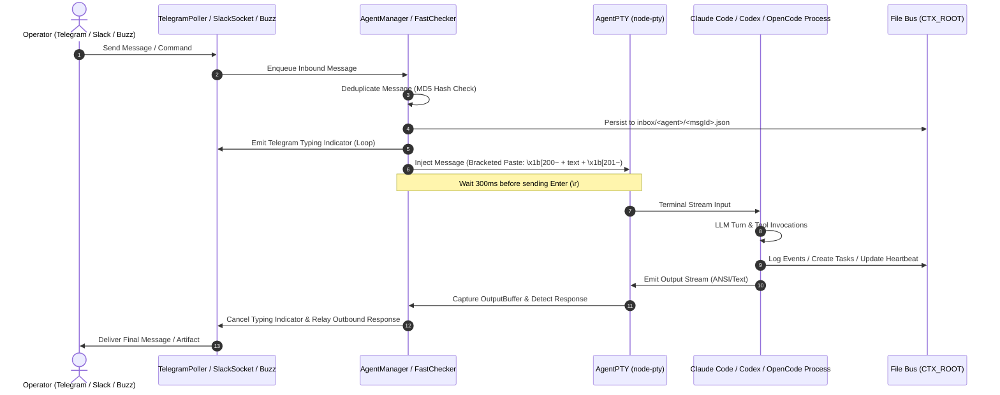
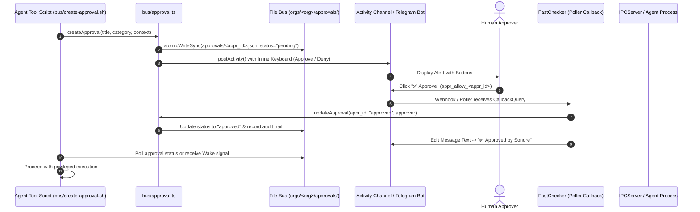
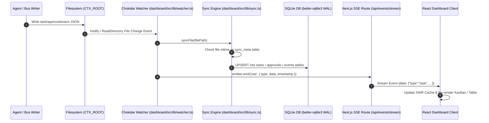

# Architectural Review: cortextos

## Executive Summary

**cortextOS** is an autonomous, persistent 24/7 AI agent orchestration system designed to wrap modern interactive terminal agent runtimes—including **Claude Code** (`@anthropic-ai/claude-code`), **OpenAI Codex App Server** (`codex-app-server`), **OpenCode** (TUI), and **Hermes**—into resilient, supervised background processes. It bridges these interactive agent sessions with operator control interfaces across **Telegram**, **Slack**, a distributed **Nostr/NIP-29 (Buzz)** relay, and a full-featured **Next.js web dashboard**.

```
+---------------------------------------------------------------------------------------------------+
|                                      OPERATOR INTERFACES                                         |
|   +-----------------------+   +-------------------+   +--------------------+   +--------------+   |
|   |  Telegram Bot Poller  |   | Slack Socket Mode |   | Buzz Relay (Nostr) |   |  Next.js UI  |   |
|   +-----------+-----------+   +---------+---------+   +---------+----------+   +-------+------+   |
+---------------|-------------------------|-----------------------|----------------------|----------+
                |                         |                       |                      |
                v                         v                       v                      v
+---------------------------------------------------------------------------------------------------+
|                                     cortextOS DAEMON SUPERVISOR                                   |
|   +-------------------------------------------------------------------------------------------+   |
|   | AgentManager: Lifecycle Coordination, Registry State, Process Tree, CrashLoopPauser       |   |
|   +-------------------------------------------------------------------------------------------+   |
|   | FastChecker (Per-Agent): Polling Loop, Inbound Queue, Typing Simulator, Context Monitor   |   |
|   +-------------------------------------------------------------------------------------------+   |
|   | IPCServer: Unix Domain Socket / Named Pipe (Daemon Control & Worker Coordination)        |   |
|   +-------------------------------------------------------------------------------------------+   |
|   | CronScheduler: High-Precision Scheduled Prompts & Workflow Triggers                       |   |
+---------------------------------------------------------------------------------------------------+
        |                                       |                                    |
        v                                       v                                    v
+-----------------------+           +-----------------------+            +-----------------------+
|  ClaudePTY (node-pty) |           |  CodexAppServerPTY    |            |   OpencodePTY (node)  |
|  - Bracketed Paste    |           |  - WS-over-Unix-Sock  |            |   - XDG State Isol.   |
|  - TUI Auto-Accept    |           |  - JSON-RPC Protocol  |            |   - Context Reporting |
+-----------------------+           +-----------------------+            +-----------------------+
        \                                       |                                    /
         ---------------------------------------+------------------------------------
                                                |
                                                v
+---------------------------------------------------------------------------------------------------+
|                                 SHARED FILESYSTEM BUS (CTX_ROOT)                                  |
|  tasks/ (*.json)  |  approvals/ (*.json)  |  inbox/ (*.json)  |  analytics/events/ (*.jsonl)      |
|  state/crons.json |  state/heartbeat.json |  memory/handoffs/ |  knowledge-base/                  |
+---------------------------------------------------------------------------------------------------+
                                                |
                                                v
+---------------------------------------------------------------------------------------------------+
|                                    DASHBOARD SYNC & STREAMING                                     |
|   +--------------------------+   +---------------------------+   +----------------------------+   |
|   | Chokidar FS Watcher      |-->| SQLite Cache (WAL Mode)   |-->| Server-Sent Events (SSE)   |   |
|   +--------------------------+   +---------------------------+   +----------------------------+   |
+---------------------------------------------------------------------------------------------------+
```

### Core Value Proposition & System Capabilities
1. **Headless Terminal Automation & Multi-Runtime Abstraction**: Wraps interactive TUI agents into headless pseudo-terminals (`node-pty`) with automated prompt handling (bypassing folder trust and permissions dialogues), bracketed paste injection, and JSON-RPC WebSocket bridges.
2. **Context-Handoff Lifecycle Management**: Proactively tracks token consumption and triggers a cooperative three-tier context rotation (Warning -> Handoff Document Generation -> Hard Restart into clean session) before context exhaustion causes silent degradation.
3. **Decoupled File Bus Architecture**: Coordinates tasks, human-in-the-loop approvals, theta-wave autoresearch experiments, scheduled crons, and telemetry via an atomic JSON/JSONL filesystem bus, eliminating hard coupling to external database servers.
4. **Normative Schema Contracts & Privacy Redaction**: Formal JSON Schemas validate lifecycle state snapshots (`cortext.status/v1`), with strict data-driven redaction policies that sanitize private paths, credentials, and raw counts into coarse buckets for safe export.

---

## Architecture & Data Flow

cortextOS operates as a unified daemon supervising multiple child PTY instances, background workers, and communication pollers.

### Inbound Message & PTY Injection Flow
When an operator sends a message via Telegram, Slack, or Buzz, the message traverses the poller, is deduplicated, written to the agent's inbox, and injected via bracketed paste into the active PTY session.



### Human-in-the-Loop Approval & Escalation Flow
Sensitive agent operations (deployments, emails, database mutations) require human approval. Agents generate approval records on the bus, triggering notifications with interactive inline keyboards.



### Dashboard Synchronization & Streaming Pipeline
The Next.js dashboard uses a local SQLite read replica updated via filesystem events, streaming updates to clients over Server-Sent Events.



---

## Core Tech Stack & Dependencies

```
+----------------------------------------------------------------------------------------------------+
|                                    CORTEXTOS TECHNOLOGY STACK                                      |
+----------------------------------------------------------------------------------------------------+
| CORE RUNTIME      | Node.js 20+ (ESM + CommonJS Dual Architecture via tsup)                        |
| LANGUAGE          | TypeScript 5.x with strict typechecking, NodeNext module resolution            |
| PROCESS ENGINE    | node-pty (Native C++ PTY addon for Linux, macOS, and Windows ConPTY)           |
| PROCESS MANAGER   | PM2 (Production Process Supervision, Max Restarts, Cluster/Fork mode)           |
| NETWORKING / IPC  | Node net (Unix Domain Sockets & Windows Named Pipes), ws (WebSocket Client)   |
| BOT CHANNELS      | Telegram Bot API (Custom Poller), Slack Socket Mode (@slack/socket-mode)       |
| DISTRIBUTED BUS   | Nostr NIP-29 (Secp256k1, Schnorr signatures via @noble/curves)                 |
| DASHBOARD UI      | Next.js 15 (App Router), React 19, Tailwind CSS, Lucide Icons                  |
| DASHBOARD STORAGE | SQLite via better-sqlite3 (WAL Mode, In-Memory Transactions, Mtime Caching)    |
| SCHEMA VALIDATION | AJV (JSON Schema Draft-07 / 2020-12 validator for lifecycle contracts)         |
| TEST SUITE        | Vitest 3.x (Unit & Integration Tests), Playwright (End-to-End Browser Tests)   |
+----------------------------------------------------------------------------------------------------+
```

### Dependency Audit
| Package | Version | Layer | Usage Rationale |
|---|---|---|---|
| [`node-pty`](https://github.com/microsoft/node-pty) | `^1.1.0` | Daemon / PTY | Spawns pseudo-terminals for Claude Code and OpenCode without external terminal multiplexers (tmux/screen). |
| [`commander`](https://github.com/tj/commander.js) | `^12.0.0` | CLI / Bus | Parses CLI commands and bus subcommands across daemon and shell environments. |
| [`better-sqlite3`](https://github.com/WiseLibs/better-sqlite3) | `^11.0.0` | Dashboard | Ultra-fast synchronous SQLite driver used as a read cache in the Next.js dashboard. |
| [`chokidar`](https://github.com/paulmillr/chokidar) | `^4.0.0` | Dashboard | Cross-platform filesystem watcher monitoring `CTX_ROOT` for atomic JSON mutations. |
| [`@slack/socket-mode`](https://github.com/slackapi/node-slack-sdk) | `^2.0.0` | Integrations | Connects to Slack without requiring inbound public webhook URLs. |
| [`ws`](https://github.com/websockets/ws) | `^8.18.0` | PTY / Buzz | Communicates over WebSocket-framed Unix sockets for Codex App Server and Nostr relays. |
| [`@noble/curves`](https://github.com/paulmillr/noble-curves) | `^1.4.0` | Buzz Relay | Cryptographic Schnorr event signing for Nostr / NIP-29 decentralized communication. |
| [`next`](https://nextjs.org/) | `^15.0.0` | Dashboard | Server-rendered React framework for fleet telemetry, kanban tasks, and approvals. |
| [`ajv`](https://ajv.js.org/) | `^8.17.0` | Lifecycle | Strict JSON Schema validation for `cortext.status/v1` normative contracts. |

---

## Distinctive & Smart Engineering Decisions

### 1. Dual-Path Headless Auto-Accept for Interactive AI CLIs
CLI tools such as Claude Code 2.1.x display interactive modal prompts upon initialization:
- **Screen 1**: Folder trust prompt (`"trust this folder?"` -> Default: Yes, confirm with `\r`).
- **Screen 2**: Permissions bypass prompt (`"Bypass Permissions mode"` -> Default: `1. No, exit`, Choice 2: `2. Yes, I accept`).

A naive automated runner pressing `Enter` selects option 1 ("No, exit"), immediately terminating the process (Exit Code 1). [`AgentPTY`](file:///c:/Users/W/Documents/GitHub/OpenRemote/ref/cortextos/src/pty/agent-pty.ts#L191-L248) solves this with a multi-phase polling state machine:
```typescript
// Detect bypass prompt and move DOWN before confirming
if (showingBypass && !bypassHandled) {
  bypassHandled = true;
  this.pty.write('\x1b[B'); // Arrow down to "2. Yes, I accept"
  setTimeout(() => {
    if (this.pty && !this.outputBuffer.isBootstrapped()) {
      this.pty.write('\r'); // Submit acceptance
    }
    clearInterval(promptPoll);
  }, 350);
}
```
If the agent fails to bootstrap within a 45-second backstop, `_awaitingInteractiveConfirmation` is flagged to inform the dashboard instead of reporting a false-positive healthy state.

### 2. Context-Handoff Lifecycle with Cooperative Lease Locking
Long-running AI agents eventually fill their context windows, leading to hallucination or sudden crash. cortextOS implements a proactive three-tier context lifecycle in [`FastChecker`](file:///c:/Users/W/Documents/GitHub/OpenRemote/ref/cortextos/src/daemon/fast-checker.ts#L85-L108):
- **Tier 1 (Warning at 30% context)**: Injects an advisory prompt warning the agent of token consumption.
- **Tier 2 (Handoff at 60% context)**: 
  1. Verifies work-fill margin (+10% token growth above baseline) to avoid futile handoffs on cold boot.
  2. Acquires a cooperative handoff lease via [`requestContextHandoffLease`](file:///c:/Users/W/Documents/GitHub/OpenRemote/ref/cortextos/src/daemon/context-handoff-lease.ts).
  3. Prompts the agent to write structured state to `memory/handoffs/<timestamp>.md`.
  4. Sets a deadline timer (`ctxHandoffDeadlineAt`).
- **Tier 3 (Enforced Hard Restart)**: If the agent fails to self-restart within the grace window, the supervisor forcefully terminates the process and spawns a fresh session configured to resume from the handoff document.

### 3. Unix Socket Path Length Compensation for Codex App Server
On POSIX systems, `sockaddr_un.sun_path` is constrained to 108 bytes (104 on macOS). Nested agent directory paths such as `/root/.cortextos/default/state/orchestrator-worker-01/codex.sock` frequently breach this kernel limit.
[`CodexAppServerPTY`](file:///c:/Users/W/Documents/GitHub/OpenRemote/ref/cortextos/src/pty/codex-app-server-pty.ts#L80-L96) proactively calculates the byte length. If it exceeds 100 bytes, it switches to `/tmp/cas-<short-uuid>.sock` and writes a reference pointer file into the agent state directory.

### 4. Lifecycle Generation Counters Preventing Exit Handler Races
When restarting an agent, graceful shutdown can race against a new process spawn. A late exit callback from the old process could trigger spurious crash recovery on the newly spawned process.
[`AgentProcess`](file:///c:/Users/W/Documents/GitHub/OpenRemote/ref/cortextos/src/daemon/agent-process.ts#L65-L76) mitigates this via monotonic `lifecycleGeneration` counters captured at spawn time:
```typescript
const spawnGeneration = ++this.lifecycleGeneration;
this.pty.onExit((code, signal) => {
  if (this.lifecycleGeneration !== spawnGeneration) {
    this.log('Old PTY exit received after new generation started; ignoring.');
    return;
  }
  this.handleExit(code, signal);
});
```

### 5. Deterministic Redaction Engine for Public Status Telemetry
Status reporting can leak sensitive paths, user identities, or prompt secrets. [`redactLifecycleStatus`](file:///c:/Users/W/Documents/GitHub/OpenRemote/ref/cortextos/src/lifecycle/redact-status.ts#L86-L100) transforms local snapshots into privacy-safe formats:
- Maps continuous integers (e.g. task counts) into discrete buckets: `'0'`, `'1'`, `'2-5'`, `'6-20'`, `'21-100'`, `'>100'`.
- Strips filesystem paths and converts host metadata to canonical observation codes (`LEGACY_STATUS_OBSERVATIONS`).

---

## Process Lifecycle & Terminal/PTY Management

### PTY Spawning & Terminal Abstraction
The system provides a unified terminal interface across four distinct runtime adapters:

```
                  +--------------------------------+
                  |         AgentProcess           |
                  +---------------+----------------+
                                  |
         +------------------------+------------------------+
         |                        |                        |
         v                        v                        v
+------------------+    +--------------------+    +------------------+
|    AgentPTY      |    | CodexAppServerPTY  |    |   OpencodePTY    |
| (Claude Code CLI)|    | (OpenAI Codex App) |    |  (OpenCode TUI)  |
+------------------+    +--------------------+    +------------------+
| - node-pty spawn |    | - Persistent Daemon|    | - node-pty spawn |
| - xterm-256color |    | - WS / Unix Socket |    | - Isolated XDG   |
| - ANSI Stripping |    | - JSON-RPC Engine  |    | - TUI Chat Detect|
+------------------+    +--------------------+    +------------------+
```

1. **[`AgentPTY`](file:///c:/Users/W/Documents/GitHub/OpenRemote/ref/cortextos/src/pty/agent-pty.ts)**:
   - Spawns Claude Code CLI (`claude` or `claude.exe` under Windows ConPTY) with dimensions `200x50` and `TERM=xterm-256color`.
   - Injects arguments: `--continue` (if session exists), `--dangerously-skip-permissions`, `--model <name>`, `--append-system-prompt <local/*.md>`.
   - Captures output in a circular [`OutputBuffer`](file:///c:/Users/W/Documents/GitHub/OpenRemote/ref/cortextos/src/pty/output-buffer.ts) (1,000 lines) with ANSI stripping.
2. **[`CodexAppServerPTY`](file:///c:/Users/W/Documents/GitHub/OpenRemote/ref/cortextos/src/pty/codex-app-server-pty.ts)**:
   - Manages a persistent `codex app-server` background process.
   - Speaks JSON-RPC over WebSocket Unix sockets, managing threads (`thread/start`, `thread/resume`) and turns (`turn/start`, `turn/interrupt`).
   - Implements sandbox overrides (`approvalPolicy: 'never'`, `sandbox: 'danger-full-access'`).
3. **[`OpencodePTY`](file:///c:/Users/W/Documents/GitHub/OpenRemote/ref/cortextos/src/pty/opencode-pty.ts)**:
   - Spawns OpenCode terminal UI with isolated XDG directories (`OPENCODE_CONFIG_DIR`, `OPENCODE_DATA_DIR`).
   - Detects whether the terminal is in Chat mode (`"Ask anything"`) or Shell execution mode before injecting text.
4. **[`HermesPTY`](file:///c:/Users/W/Documents/GitHub/OpenRemote/ref/cortextos/src/pty/hermes-pty.ts)**:
   - Adapter for the experimental Hermes agent runtime.

### Input Injection Engine
Injecting commands into a running terminal requires care to prevent control characters from executing prematurely. [`src/pty/inject.ts`](file:///c:/Users/W/Documents/GitHub/OpenRemote/ref/cortextos/src/pty/inject.ts) provides safe terminal primitives:

```typescript
// Bracketed Paste Mode prevents shell evaluation of inline newlines/special characters
const PASTE_START = '\x1b[200~';
const PASTE_END = '\x1b[201~';

export function injectMessage(write: (data: string) => void, content: string, enterDelay = 300): void {
  const MAX_CHUNK = 4096;
  if (content.length <= MAX_CHUNK) {
    write(PASTE_START + content + PASTE_END);
  } else {
    write(PASTE_START);
    for (let i = 0; i < content.length; i += MAX_CHUNK) {
      write(content.slice(i, i + MAX_CHUNK));
    }
    write(PASTE_END);
  }
  // Bounded delay before submitting to allow terminal paste buffers to settle
  setTimeout(() => {
    try { write('\r'); } catch (e) { /* pty torn down */ }
  }, enterDelay);
}
```

### Worker Process Lifecycle
For short-lived sub-tasks, [`AgentManager.spawnWorker`](file:///c:/Users/W/Documents/GitHub/OpenRemote/ref/cortextos/src/daemon/agent-manager.ts#L1758) spawns isolated [`WorkerProcess`](file:///c:/Users/W/Documents/GitHub/OpenRemote/ref/cortextos/src/daemon/worker-process.ts) instances. Workers execute non-interactively (`claude -p "<prompt>"`), log output to `logs/<worker>.log`, and clean up resources on completion.

---

## Communication & Protocol

### 1. Filesystem Bus Format & Contracts
The filesystem bus under `CTX_ROOT` serves as the primary coordination plane:

| Path Pattern | Format | Access Mode | Description |
|---|---|---|---|
| `orgs/<org>/tasks/<taskId>.json` | JSON | Read/Write (Atomic) | Task record containing dependencies, status, assignee, and deliverables. |
| `orgs/<org>/tasks/task.audit.jsonl` | JSONL | Append-Only | Audit log tracking every task state transition. |
| `orgs/<org>/approvals/<apprId>.json` | JSON | Read/Write (Atomic) | Human-in-the-loop approval request with category and context. |
| `orgs/<org>/analytics/events/<agent>/<YYYY-MM-DD>.jsonl` | JSONL | Append-Only | Daily structured event stream. |
| `inbox/<agent>/<msgId>.json` | JSON | Atomic Write / Unlink | Inter-agent messaging inbox. |
| `state/agents/<agent>/crons.json` | JSON | Read/Write | Persistent scheduled cron definitions. |
| `state/agents/<agent>/cron-execution.log` | JSONL | Append-Only | Execution history with output status and durations. |
| `state/<agent>/heartbeat.json` | JSON | Read/Write (Atomic) | Liveness heartbeat, current task, and mode indicators. |

#### Directed Acyclic Graph (DAG) Task Dependency Validation
Tasks support complex execution graphs via `blocked_by` and `blocks` arrays. [`createTask`](file:///c:/Users/W/Documents/GitHub/OpenRemote/ref/cortextos/src/bus/task.ts#L12) performs cycle detection prior to disk writes:

```typescript
// Cycle check traverses the dependency graph using depth-first search
function detectCycleOrThrow(paths: BusPaths, targetId: string, directDeps: string[], virtualTask?: Partial<Task>): void {
  const visited = new Set<string>();
  function walk(currentId: string, path: string[]): void {
    if (path.includes(currentId)) {
      throw new Error(`Cycle detected: ${path.join(' -> ')} -> ${currentId}`);
    }
    visited.add(currentId);
    const deps = getTaskBlockers(paths, currentId, virtualTask);
    for (const dep of deps) {
      walk(dep, [...path, currentId]);
    }
  }
  for (const dep of directDeps) {
    walk(dep, [targetId]);
  }
}
```

### 2. Daemon IPC Protocol
The daemon exposes an IPC endpoint over a local Unix domain socket (or Windows Named Pipe) located via [`getIpcPath`](file:///c:/Users/W/Documents/GitHub/OpenRemote/ref/cortextos/src/utils/paths.ts).

```typescript
// Request Format
export interface IPCRequest {
  type: 'status' | 'start-agent' | 'stop-agent' | 'restart-agent' | 'wake'
      | 'inject-agent' | 'spawn-worker' | 'terminate-worker' | 'fire-cron'
      | 'reload-crons' | 'fleet-health' | 'list-cron-executions';
  agent?: string;
  data?: Record<string, unknown>;
}

// Response Format
export interface IPCResponse {
  success: boolean;
  data?: unknown;
  error?: string;
}
```

### 3. Distributed Messaging via Buzz (Nostr NIP-29)
For cross-host agent coordination, cortextOS implements Nostr/NIP-29 relay communication in [`src/buzz/`](file:///c:/Users/W/Documents/GitHub/OpenRemote/ref/cortextos/src/buzz/index.ts).
- Uses secp256k1 keypairs per agent (`identity.json`).
- Messages are wrapped in canonical Nostr Kind 9 (Group Chat) or Kind 13 (Direct Message) events, signed via Schnorr signatures.
- [`BuzzRelayClient`](file:///c:/Users/W/Documents/GitHub/OpenRemote/ref/cortextos/src/buzz/relay-client.ts) maintains a persistent WebSocket connection per org, dispatching events to agents via [`BuzzDispatcher`](file:///c:/Users/W/Documents/GitHub/OpenRemote/ref/cortextos/src/buzz/dispatcher.ts).

---

## Reliability, Fault Tolerance & Edge Cases

### 1. CrashLoopPauser & Circuit Breaker
Unsupervised AI agents can enter rapid crash loops (e.g. invalid configuration, broken tools). cortextOS implements a multi-layered circuit breaker in [`src/daemon/index.ts`](file:///c:/Users/W/Documents/GitHub/OpenRemote/ref/cortextos/src/daemon/index.ts#L30-L89):
- **Crash Window Tracking**: Records crashes in `state/.daemon-crash-history.json` (sliding window: 3 crashes in 15 minutes).
- **Operator Emergency Notification**: Upon tripping the threshold, sends a single synchronous `curl` notification to the operator's Telegram chat.
- **Backoff & Suppression**: Agent restarts are paused for 30 minutes, preventing resource exhaustion and API credit depletion.

### 2. Telegram Poller Conflict Resolution (HTTP 409)
When the daemon restarts abruptly, the previous HTTP connection to Telegram's `getUpdates` endpoint may remain active on Telegram's edge servers for up to 30 seconds. A naive reconnect triggers an HTTP 409 Conflict loop.
[`TelegramPoller`](file:///c:/Users/W/Documents/GitHub/OpenRemote/ref/cortextos/src/telegram/poller.ts#L67-L75) detects 409 errors, logs `'conflict-self-die'`, and yields execution to the supervisor to wait out the connection timeout before retrying.

### 3. Quota Watchdog & Autonomous Throttling
[`bin/quota-watchdog.sh`](file:///c:/Users/W/Documents/GitHub/OpenRemote/ref/cortextos/bin/quota-watchdog.sh) runs via system cron every 5 minutes:
- Scrapes the 5-hour rolling Claude API token window using `ccusage`.
- When remaining quota drops below `10%` (`QUOTA_THRESHOLD_PCT`), executes `cortextos stop --all` and writes `paused.json`.
- When quota recovers past `50%` (`QUOTA_RESUME_PCT`), automatically issues `cortextos start --all` and notifies the operator.

---

## Security & Access Control

```
+----------------------------------------------------------------------------------------------------+
|                                    SECURITY BOUNDARY LAYERS                                        |
+----------------------------------------------------------------------------------------------------+
| INBOUND TELEGRAM / SLACK  | Whitelisted Numeric User IDs (ALLOWED_USER), Bot Token Validation      |
| OPERATOR APPROVAL GATE    | Explicit Human Signature required for Email, Deploy, Delete, Exec      |
| FILE SYSTEM PERMISSIONS   | Restrictive umask (0077 / 0700 dirs, 0600 files), PID file protection  |
| INPUT SANITIZATION        | Path Traversal Rejection (/^[a-z0-9_-]+$/), ANSI & Control Char Filter |
| CREDENTIAL ISOLATION      | Org-level secrets.env separated from per-agent .env files              |
| TELEMETRY REDACTION       | Path stripping, identity obscuration, discrete integer bucketizing     |
+----------------------------------------------------------------------------------------------------+
```

### 1. Inbound Identity Whitelisting
Telegram and Slack controllers reject unauthorized interactions before passing input to agent runtimes:
- Telegram verifies incoming `message.from.id` against a comma-separated list of authorized integer IDs (`ALLOWED_USER`).
- Unauthorized requests are logged as security events on the bus, and rejected without executing agent turns.

### 2. Path Traversal & Injection Sanitization
All file-bus commands, task identifiers, and agent names are validated against strict alphanumeric regexes before constructing filesystem paths:
```typescript
export function validateAgentName(name: string): void {
  if (!name || !/^[a-z0-9_-]+$/.test(name)) {
    throw new Error(`Invalid agent name: "${name}". Allowed: [a-z0-9_-]`);
  }
}
```

### 3. Prompt Fence Sanitization
When external text (Telegram messages, Slack chats, Nostr events) is injected into prompts, [`wrapFenceSafe`](file:///c:/Users/W/Documents/GitHub/OpenRemote/ref/cortextos/src/utils/validate.ts) sanitizes markdown code fences to prevent prompt injection breakouts:
```typescript
export function wrapFenceSafe(text: string, fence = '```'): string {
  // If the payload contains the closing fence, escape or increase backtick count
  if (text.includes(fence)) {
    return text.replace(/```/g, '` ` `');
  }
  return text;
}
```

---

## Flaws, Antipatterns & Gotchas

### 1. Synchronous File I/O in Daemon Polling Loops
- **Anti-pattern**: [`FastChecker`](file:///c:/Users/W/Documents/GitHub/OpenRemote/ref/cortextos/src/daemon/fast-checker.ts) and [`AgentManager`](file:///c:/Users/W/Documents/GitHub/OpenRemote/ref/cortextos/src/daemon/agent-manager.ts) heavily utilize synchronous filesystem APIs (`readFileSync`, `writeFileSync`, `readdirSync`, `statSync`) on 1-second polling intervals.
- **Impact**: Under large fleets (>15 agents) or high task churn, the Node.js event loop experiences latency spikes, delaying message ingestion and IPC responses.

### 2. Dual Source-of-Truth Sync Race in Dashboard
- **Anti-pattern**: The Next.js dashboard uses SQLite as a read cache updated via Chokidar file watcher events.
- **Impact**: If an agent writes a task file and immediately queries the dashboard API via HTTP, a race condition occurs where the SQLite database has not yet processed the inotify event, returning stale data.

### 3. Fragility of Terminal ANSI Scraping
- **Anti-pattern**: Identifying interactive CLI states (e.g. folder trust, AskUserQuestion menus) relies on pattern-matching against raw ANSI output strings (`"trust this folder"`, `"Ask anything"`).
- **Impact**: Upstream UI changes in `@anthropic-ai/claude-code` or `opencode` releases can silently break regex matching, causing agents to hang in un-bootstrapped states.

### 4. Memory Growth in Persistent Dedup Stores
- **Anti-pattern**: Inbound message deduplication hashes are persisted to `.message-dedup-hashes` with basic rotation.
- **Impact**: Without aggressive TTL pruning, long-running agent deployments accumulating hundreds of daily messages experience linear disk and memory growth.

---

## Actionable Lessons & Takeaways for OpenRemote

### 1. Adopt Schema-First Protocol Contracts for Agent Operations
OpenRemote can replace ad-hoc JSON payloads with formal JSON Schema contracts for agent state, telemetry, and capabilities (mirroring [`cortext.status.v1.schema.json`](file:///c:/Users/W/Documents/GitHub/OpenRemote/ref/cortextos/schemas/cortext.status.v1.schema.json)). This ensures backward-compatible RPC schemas and enables deterministic redaction for remote telemetry.

### 2. Implement a Structured Context-Handoff Lifecycle
To operate persistent 24/7 agents without context exhaustion:
- Monitor token consumption after every agent turn.
- At 60% context utilization, acquire a handoff lock, instruct the agent to write a structured handoff document summarizing active work and open tasks, and gracefully reboot into a clean context window resuming from that summary.

### 3. Robust PTY Wrapping & Bracketed Paste Injection
When integrating interactive CLI agents:
- Use native pseudo-terminals (`node-pty`) rather than detached pipes to retain interactive features.
- Always inject inbound messages wrapped in bracketed paste mode (`\x1b[200~` ... `\x1b[201~`) with a deferred submission delay (300ms) to ensure terminal buffers do not interpret inline newlines as premature execution commands.
- Use monotonic generation counters on PTY exit handlers to prevent teardown race conditions.

### 4. Decoupled Hybrid Bus with Local Atomic Persistence
- Use an atomic filesystem bus (`atomicWriteSync` via temporary file renaming) for zero-dependency local operation.
- Layer an inotify/Chokidar event bridge to sync file state into an indexed SQLite/Postgres database for rapid query processing in the UI.

---

## Key Code File Index

| Category | File Path | Key Symbols / Exports | Purpose & Architecture Role |
|---|---|---|---|
| **Daemon** | [`src/daemon/index.ts`](file:///c:/Users/W/Documents/GitHub/OpenRemote/ref/cortextos/src/daemon/index.ts#L1-L362) | `Daemon`, `handleFatal`, `recordCrash` | Daemon bootstrap, fatal error handling, PM2 respawn logic, and crash markers. |
| **Daemon** | [`src/daemon/agent-manager.ts`](file:///c:/Users/W/Documents/GitHub/OpenRemote/ref/cortextos/src/daemon/agent-manager.ts#L72-L600) | `AgentManager`, `startAgent`, `stopAgent` | Core supervisor managing agent lifecycles, deduplication, and cron registries. |
| **Daemon** | [`src/daemon/agent-process.ts`](file:///c:/Users/W/Documents/GitHub/OpenRemote/ref/cortextos/src/daemon/agent-process.ts#L32-L160) | `AgentProcess`, `start`, `handleExit` | Agent process wrapper, startup prompt generation, and generation counter guards. |
| **Daemon** | [`src/daemon/fast-checker.ts`](file:///c:/Users/W/Documents/GitHub/OpenRemote/ref/cortextos/src/daemon/fast-checker.ts#L42-L140) | `FastChecker`, `start`, `checkContext` | Polling engine, PTY injector, Telegram typing simulator, and 3-tier context monitor. |
| **Daemon** | [`src/daemon/ipc-server.ts`](file:///c:/Users/W/Documents/GitHub/OpenRemote/ref/cortextos/src/daemon/ipc-server.ts#L1-L140) | `IPCServer`, `handleFireCron`, `computeNextFire` | Unix domain socket / named pipe server handling CLI and dashboard requests. |
| **Daemon** | [`src/daemon/cron-scheduler.ts`](file:///c:/Users/W/Documents/GitHub/OpenRemote/ref/cortextos/src/daemon/cron-scheduler.ts) | `CronScheduler`, `nextFireFromCron` | Cron engine evaluating 5-field cron syntax and interval schedules. |
| **PTY** | [`src/pty/agent-pty.ts`](file:///c:/Users/W/Documents/GitHub/OpenRemote/ref/cortextos/src/pty/agent-pty.ts#L32-L250) | `AgentPTY`, `spawn`, `detectFirstRunPrompt` | Base Claude Code PTY adapter with ConPTY support and first-run auto-accept logic. |
| **PTY** | [`src/pty/codex-app-server-pty.ts`](file:///c:/Users/W/Documents/GitHub/OpenRemote/ref/cortextos/src/pty/codex-app-server-pty.ts#L88-L200) | `CodexAppServerPTY`, `spawn`, `startTurn` | OpenAI Codex App Server JSON-RPC WebSocket client over Unix socket. |
| **PTY** | [`src/pty/opencode-pty.ts`](file:///c:/Users/W/Documents/GitHub/OpenRemote/ref/cortextos/src/pty/opencode-pty.ts#L59-L150) | `OpencodePTY`, `spawn`, `injectMessage` | OpenCode TUI adapter with XDG directory isolation and context monitoring. |
| **PTY** | [`src/pty/inject.ts`](file:///c:/Users/W/Documents/GitHub/OpenRemote/ref/cortextos/src/pty/inject.ts#L1-L182) | `injectMessage`, `selectOption`, `KEYS` | Terminal input primitives using bracketed paste mode and TUI arrow navigation. |
| **Bus** | [`src/bus/task.ts`](file:///c:/Users/W/Documents/GitHub/OpenRemote/ref/cortextos/src/bus/task.ts#L12-L120) | `createTask`, `updateTask`, `detectCycleOrThrow` | Task lifecycle engine with DAG cycle detection and symmetric edge updates. |
| **Bus** | [`src/bus/approval.ts`](file:///c:/Users/W/Documents/GitHub/OpenRemote/ref/cortextos/src/bus/approval.ts#L12-L120) | `createApproval`, `updateApproval` | Human-in-the-loop approval gates and inline Telegram keyboard dispatch. |
| **Bus** | [`src/bus/experiment.ts`](file:///c:/Users/W/Documents/GitHub/OpenRemote/ref/cortextos/src/bus/experiment.ts#L1-L100) | `createExperiment`, `evaluateExperiment` | Autoresearch (Theta Wave) hypothesis tracking, metrics, and TSV evaluation. |
| **Bus** | [`src/bus/event.ts`](file:///c:/Users/W/Documents/GitHub/OpenRemote/ref/cortextos/src/bus/event.ts#L8-L97) | `logEvent`, `refreshHeartbeatTimestamp` | Daily structured JSONL telemetry logger and heartbeat synchronization. |
| **Lifecycle** | [`src/lifecycle/status-contract.ts`](file:///c:/Users/W/Documents/GitHub/OpenRemote/ref/cortextos/src/lifecycle/status-contract.ts) | `STATUS_CHECK_POLICIES`, `LEGACY_STATUS_OBSERVATIONS` | Normative lifecycle contracts, observation definitions, and capability flags. |
| **Lifecycle** | [`src/lifecycle/check-status.ts`](file:///c:/Users/W/Documents/GitHub/OpenRemote/ref/cortextos/src/lifecycle/check-status.ts#L1-L100) | `evaluateStatusCheck`, `evaluateHealthy` | Policy evaluator enforcing system usability and isolation guarantees. |
| **Lifecycle** | [`src/lifecycle/redact-status.ts`](file:///c:/Users/W/Documents/GitHub/OpenRemote/ref/cortextos/src/lifecycle/redact-status.ts#L1-L100) | `redactLifecycleStatus`, `countBucket` | Privacy engine sanitizing filesystem paths and bucketizing counts for public export. |
| **Buzz** | [`src/buzz/relay-client.ts`](file:///c:/Users/W/Documents/GitHub/OpenRemote/ref/cortextos/src/buzz/relay-client.ts) | `BuzzRelayClient`, `publish`, `subscribe` | Nostr/NIP-29 WebSocket client for cross-host agent mesh communication. |
| **Telegram** | [`src/telegram/poller.ts`](file:///c:/Users/W/Documents/GitHub/OpenRemote/ref/cortextos/src/telegram/poller.ts#L1-L100) | `TelegramPoller`, `computePollBackoffMs` | Long-polling Telegram controller with exponential backoff and 429/409 handling. |
| **Dashboard** | [`dashboard/src/lib/watcher.ts`](file:///c:/Users/W/Documents/GitHub/OpenRemote/ref/cortextos/dashboard/src/lib/watcher.ts#L1-L100) | `initWatcher`, `onSSEEvent`, `handleFileChange` | Chokidar file bus watcher triggering SQLite sync and SSE browser events. |
| **Dashboard** | [`dashboard/src/lib/sync.ts`](file:///c:/Users/W/Documents/GitHub/OpenRemote/ref/cortextos/dashboard/src/lib/sync.ts#L1-L100) | `syncTasks`, `syncApprovals`, `syncFile` | Incremental mtime-based file-to-SQLite synchronization transaction engine. |
| **Watchdog** | [`bin/quota-watchdog.sh`](file:///c:/Users/W/Documents/GitHub/OpenRemote/ref/cortextos/bin/quota-watchdog.sh#L1-L60) | Shell Script | Standalone cron utility for LLM token quota monitoring, pause, and auto-resume. |
