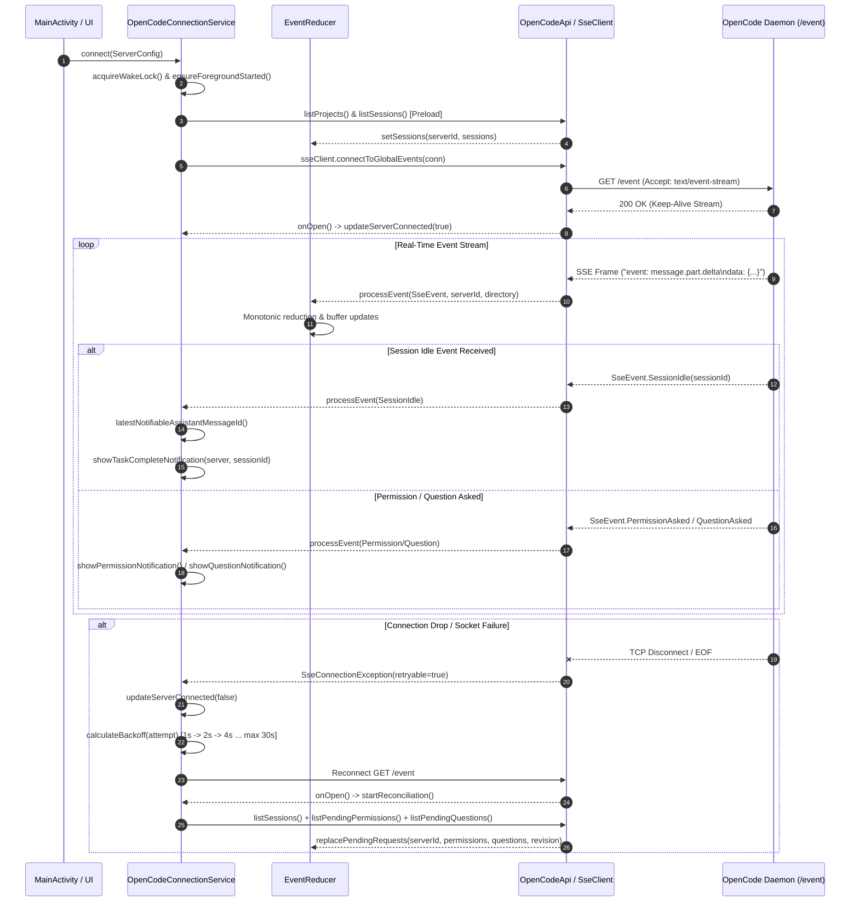
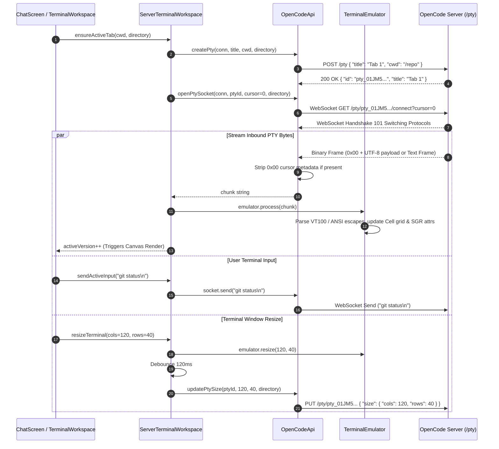

# Architectural Review: oc-remote

## Executive Summary

[`oc-remote`](file:///c:/Users/W/Documents/GitHub/OpenRemote/ref/oc-remote) (package name `dev.minios.ocremote`, display name **OC Remote**) is a native Android client written in modern Kotlin and Jetpack Compose (Kotlin 1.9.24, Android SDK 35, Jetpack Compose 2024.12.01, Ktor 2.3.11, Dagger Hilt 2.51, Coroutines 1.8.1). It functions as a mobile control plane, chat interface, and pseudo-terminal (PTY) client for autonomous [`OpenCode`](file:///c:/Users/W/Documents/GitHub/OpenRemote/ref/oc-remote/README.md) development servers.

Unlike lightweight webview wrappers or simple chat apps, `oc-remote` is a full-fledged client-side operating environment. It features a persistent Android Foreground Service that maintains multiple simultaneous Server-Sent Events (SSE) connections across distinct OpenCode instances, a streaming JSON memory-protection sanitizer that strips multi-megabyte diff payloads to prevent Android Dalvik/ART Heap `OutOfMemoryError` crashes, a custom VT100/ANSI terminal emulator with alternate-screen buffer and line-drawing support, an end-to-end encrypted distributed sync engine (supporting GitHub Gists, WebDAV, and Android Storage Access Framework), an on-device local Termux launcher with proxy integration, and a self-validating in-app APK update subsystem.

```
+-----------------------------------------------------------------------------------------------------------------------+
|                                                   OC Remote (Android)                                                 |
|                                                                                                                       |
|  +-------------------------------------+  +------------------------------------+  +--------------------------------+  |
|  |     MainActivity (Compose UI)       |  |   OpenCodeConnectionService (FG)   |  |     LocalServerManager (CLI)   |  |
|  | - HomeScreen / Server Management    |  | - Multi-server Concurrent SSE Hub  |  | - Termux RunCommand IPC        |  |
|  | - ChatScreen / Interactive Turns    |  | - EventReducer StateFlow Pipeline  |  | - Local OpenCode Server Daemon |  |
|  | - ServerTerminalWorkspace (VT100)   |  | - SessionNotificationCoordinator   |  | - Local Loopback Proxy Bridge  |  |
|  | - WorkspaceFiles & Diff Viewer      |  | - Exponential Backoff & WakeLocks  |  +--------------------------------+  |
|  +-------------------------------------+  +------------------------------------+                                      |
|                      |                                       |                                                        |
|                      v                                       v                                                        |
|  +-----------------------------------------------------------------------------------------------------------------+  |
|  |                                            Data & Resiliency Engine                                             |  |
|  |  - OversizedMessageSanitizer (Streaming JsonReader Pruning)  - MessageImageCache (SHA-256 Disk Offloading)      |  |
|  |  - SyncRepository (Gist / WebDAV / SAF / AES-256-GCM)        - DiagnosticLogRepository (SQLite Ring Buffer)     |  |
|  |  - UpdateRepository (APK Hash & Signature Cert Verification) - PendingPromptRepository / DraftRepository        |  |
|  +-----------------------------------------------------------------------------------------------------------------+  |
+-----------------------------------------------------------------------------------------------------------------------+
                                        |                                        |
                          HTTP REST / WebSocket (PTY)                     SSE Stream (/event)
                                        |                                        |
                                        v                                        v
+-----------------------------------------------------------------------------------------------------------------------+
|                                            OpenCode Server (Remote Daemon)                                            |
|                                                                                                                       |
|  +---------------------------+  +---------------------------+  +-------------------------+  +----------------------+  |
|  |      /session REST        |  |       /pty & WS PTY       |  |       /project REST     |  |     /event (SSE)     |  |
|  | - CRUD, Fork, Compact     |  | - Spawn PTY (POST /pty)   |  | - Multi-directory Tree  |  | - Session lifecycle |  |
|  | - prompt_async            |  | - PTY WebSocket Bridge    |  | - Worktrees & Metadata  |  | - Tool invocations   |  |
|  | - Permissions & Questions |  | - Dynamic Window Resizing |  +-------------------------+  | - Delta streams      |  |
|  +---------------------------+  +---------------------------+                               +----------------------+  |
|                                               |                                                                       |
|                                               v                                                                       |
|  +-----------------------------------------------------------------------------------------------------------------+  |
|  |                                           OpenCode Execution Engine                                             |  |
|  |  - Autonomous Tool Runner (Bash, Edit, Read)  - Model Context Engine  - Multi-agent Subsession Orchestration    |  |
|  +-----------------------------------------------------------------------------------------------------------------+  |
+-----------------------------------------------------------------------------------------------------------------------+
```

### Core Design Philosophy & Capabilities
1. **Uninterrupted Background Operations**: Autonomous agent executions can run for tens of minutes. `oc-remote` guarantees connection survivability through an active Android Foreground Service with configurable partial wake-locks, `NetworkCallback` network-switch recovery, and Doze-mode re-synchronization.
2. **Deterministic Monotonic State Reduction**: SSE deltas, tool status mutations, permission requests, and session metadata flow into a single unified `EventReducer` that guarantees monotonic tool progressions and buffers out-of-order part deltas up to 64KB per key.
3. **Hardened Memory Management**: Mobile ART heaps are limited (often 256MB–512MB). Massive repository snapshots or diffs generated by LLMs are intercepted by a streaming Gson sanitizer (`OversizedMessageSanitizer`) that drops bloated payload keys on-the-fly and writes base64 image data URLs directly to disk cache.
4. **Rich PTY Terminal with Tabbed Multi-Tenancy**: A custom ANSI/VT100 emulator supports 256-color and 24-bit true-color palettes, cursor key modes (DECCKM), alternate screen buffers (DEC mode 1049), and line-drawing graphics across multiple backgrounded tabs.
5. **Decoupled Zero-Knowledge Synchronization**: Multi-device settings and server directories sync across GitHub Gists, WebDAV servers, or local SAF files encrypted with AES-256-GCM via PBKDF2-derived keys, ensuring sensitive daemon tokens are never leaked to external cloud storage.

---

## Architecture & Data Flow

### 1. High-Level Architecture Topology

The codebase adheres to Clean Architecture and Modern Android Architecture (MVI/MVVM with unidirectional data flow), split into `data`, `domain`, `service`, `logging`, and `ui` packages.

```mermaid
graph TD
    subgraph UI_Layer ["UI Layer (Jetpack Compose)"]
        NavGraph["NavGraph.kt"]
        HomeScreen["HomeScreen.kt"]
        ChatScreen["ChatScreen.kt"]
        ServerTerminal["ServerTerminalWorkspace.kt"]
        ServerSettings["ServerSettingsScreen.kt"]
        FilesScreen["WorkspaceFilesScreen.kt"]
        Diagnostics["DiagnosticsScreen.kt"]
    end

    subgraph Service_Layer ["Service & Lifecycle Management"]
        Service["OpenCodeConnectionService.kt"]
        NotifCoord["SessionNotificationCoordinator.kt"]
        LocalServer["LocalServerManager.kt"]
    end

    subgraph Data_Repository_Layer ["Data & Repository Layer"]
        EventReducer["EventReducer.kt (StateFlow Hub)"]
        ServerRepo["ServerRepository.kt"]
        SettingsRepo["SettingsRepository.kt"]
        DraftRepo["DraftRepository.kt"]
        PendingPromptRepo["PendingPromptRepository.kt"]
        SyncRepo["SyncRepository.kt"]
        UpdateRepo["UpdateRepository.kt"]
        DiagRepo["DiagnosticLogRepository.kt"]
    end

    subgraph Networking_Layer ["Networking & API Layer"]
        OpenCodeApi["OpenCodeApi.kt (Ktor REST / WS Engine)"]
        SseClient["SseClient.kt (Ktor SSE Stream)"]
        SseFrameDecoder["SseFrameDecoder.kt (Character Budgeting)"]
        Sanitizer["OversizedMessageSanitizer.kt (Gson Stream Filter)"]
        ImageCache["MessageImageCache.kt (Disk Storage)"]
    end

    subgraph Remote_Server ["Remote OpenCode Server"]
        RestEndpoints["REST Endpoints (/session, /project, /pty)"]
        SseEndpoint["SSE Endpoint (/event)"]
        PtyWebSocket["WebSocket Endpoint (/pty/{id}/connect)"]
    end

    UI_Layer --> Data_Repository_Layer
    UI_Layer --> Service_Layer
    Service_Layer --> Networking_Layer
    Service_Layer --> Data_Repository_Layer
    Data_Repository_Layer --> Networking_Layer
    Networking_Layer --> Remote_Server
```



---

### 2. Multi-Server Foreground Connection Lifecycle

`OpenCodeConnectionService` maintains persistent connections to multiple servers concurrently. Each server connection runs an independent coroutine job inside `serviceScope`.



---

### 3. PTY Terminal WebSocket Architecture & Flow

Terminal emulation is decoupled into the network bridge (`OpenCodeApi` / `PtySocket`), runtime management (`ServerTerminalWorkspace`), and display rendering (`TerminalEmulator`).



---

## Core Tech Stack & Dependencies

| Category | Component / Library | Version | Technical Rationale & Role |
| :--- | :--- | :--- | :--- |
| **Language & Platform** | Kotlin | `1.9.24` | Android Native codebase with Kotlin Coroutines and Flows. |
| **UI Framework** | Jetpack Compose (BOM) | `2024.12.01` | Pure declarative UI with Material3, dynamic color, custom layouts. |
| **Networking & HTTP** | Ktor Client Core / OkHttp | `2.3.11` | Custom streaming HTTP client, WebSockets, ContentNegotiation, Auth. |
| **Serialization** | `kotlinx.serialization` + `Gson` | `1.6.3` / `2.10.1` | Kotlinx for domain models; Gson for low-level tokenized streaming sanitization. |
| **Dependency Injection**| Dagger Hilt | `2.51` | Singleton scopes for API, Repositories, Reducers; Hilt ViewModels. |
| **Local Storage** | AndroidX DataStore + SQLite | Preferences `1.1.1` | DataStore for settings; custom SQLite database for circular diagnostic ring logging. |
| **Terminal / ANSI** | Custom VT100 Engine | In-house | Cell grid parser, DECSTBM margins, SGR 256/TrueColor, DECCKM cursor mode. |
| **Cryptography** | `javax.crypto` + `AndroidKeyStore` | JCE / Keystore | AES-256-GCM, PBKDF2-HMAC-SHA256, SecureRandom salt/IV generation. |
| **CLI / Local Engine** | Termux Intent Protocol | `com.termux` | Background process invocation via `RUN_COMMAND` intent broadcast. |

---

## Distinctive & Smart Engineering Decisions

### 1. Streaming JSON Memory Sanitization (`OversizedMessageSanitizer`)
In autonomous agent workflows, tools like `git diff`, `ripgrep`, or code snapshotters produce massive JSON payloads (tens of megabytes). When deserialized naively into Kotlin data classes on Android, Dalvik/ART runs out of contiguous heap space, crashing the application with `OutOfMemoryError`.

To eliminate this, `oc-remote` implements [`OversizedMessageSanitizer.kt`](file:///c:/Users/W/Documents/GitHub/OpenRemote/ref/oc-remote/app/src/main/kotlin/dev/minios/ocremote/data/api/OversizedMessageSanitizer.kt#L23-L200). It operates as a streaming pipeline using low-level Gson `JsonReader` and `JsonWriter`:
- **Streaming Pruning**: Intercepts JSON keys named `data`, `diff`, `output`, `patch`, `snapshot`, and `reasoningEncryptedContent` when their payload size exceeds configured thresholds (`maxStringPropertyChars = 131,072`), replacing them with truncated string summaries (`[Pruned oversized diff: 4,521,000 characters]`).
- **Base64 Image Disk Extraction**: When detecting data URLs (`data:image/png;base64,...`) inside string tokens, it bypasses the in-memory JSON string allocation entirely, stream-decodes the base64 chunks directly to a SHA-256 named file on disk via [`MessageImageCache.kt`](file:///c:/Users/W/Documents/GitHub/OpenRemote/ref/oc-remote/app/src/main/kotlin/dev/minios/ocremote/data/api/MessageImageCache.kt#L23-L90), and rewrites the JSON token to a local `file:///` URI.

```kotlin
// OversizedMessageSanitizer.kt
if (key in PRUNED_PROPERTIES && value.length > maxStringPropertyChars) {
    writer.value("[Pruned oversized content: ${value.length} characters]")
} else if (value.startsWith("data:image/") && value.contains(";base64,")) {
    val cachedFileUri = imageCache.saveBase64DataUrl(value)
    writer.value(cachedFileUri ?: value.take(maxStringPropertyChars))
}
```

---

### 2. Monotonic Tool State Progression & Out-of-Order Delta Buffering
In real-time SSE streams, network packet re-ordering can cause a late `session.next.tool.called` event to arrive *after* a `session.next.tool.completed` or `session.next.tool.error` event. Naive assignment reverts the tool to `Pending`, corrupting UI state.

[`EventReducer.kt`](file:///c:/Users/W/Documents/GitHub/OpenRemote/ref/oc-remote/app/src/main/kotlin/dev/minios/ocremote/data/repository/EventReducer.kt#L380-L505) enforces monotonic tool state progression:
1. `ToolState.Pending` $\rightarrow$ `ToolState.Running` $\rightarrow$ `ToolState.Completed` / `ToolState.Error`.
2. Once a tool transitions to `Completed` or `Error`, backwards transitions are ignored.
3. For streaming text deltas (`MessagePartDelta`), if delta packets arrive before the parent part metadata has been emitted, the deltas are buffered in a bounded FIFO queue (`pendingDeltas`, maximum 128 keys, 64KB per key) and merged atomically when the parent part arrives.

```kotlin
// EventReducer.kt
private fun shouldIgnoreToolUpdate(current: ToolState?, incoming: ToolState): Boolean {
    if (current is ToolState.Completed && incoming is ToolState.Running) return true
    if (current is ToolState.Error && incoming is ToolState.Running) return true
    if (current is ToolState.Completed && incoming is ToolState.Pending) return true
    return false
}
```

---

### 3. Multi-Session, Multi-Directory Background Service Architecture
OpenCode servers organize work into directories and project worktrees. `OpenCodeConnectionService` attaches `x-opencode-directory` headers across requests and maintains persistent connections to multiple different servers simultaneously:
- **Persistent Notification Aggregation**: Displays an Android `NotificationCompat.InboxStyle` notification summarising the connection status across all configured remote instances.
- **Session Notification Suppression**: Uses [`SessionNotificationCoordinator.kt`](file:///c:/Users/W/Documents/GitHub/OpenRemote/ref/oc-remote/app/src/main/kotlin/dev/minios/ocremote/service/SessionNotificationCoordinator.kt#L28-L60) to suppress notification sounds/vibrations if the user currently has the corresponding chat session open and active in the foreground.
- **Sub-Agent Filter**: Sub-agent and child sessions (`parentId != null`) are tracked in memory to resolve interactions but are automatically suppressed from triggering user-facing notifications.

---

### 4. Custom Hardware-Accelerated VT100 Terminal Engine
Rather than embedding a bloated WebView or heavy third-party terminal library, `oc-remote` features an in-tree terminal emulator in [`TerminalEmulator.kt`](file:///c:/Users/W/Documents/GitHub/OpenRemote/ref/oc-remote/app/src/main/kotlin/dev/minios/ocremote/ui/screens/chat/TerminalEmulator.kt#L27-L1269):
- **Fixed Cell Grid & SGR Parser**: Maintains screen arrays (`mainScreen` and `altScreen`) of styled `Cell` structures with foreground/background colors, bold, reverse, underline, and italic attributes.
- **DEC Special Graphics Translation**: Translates VT100 line-drawing characters (such as box-drawing borders `┌─┬─┐`, tees, and crossing lines) into Unicode block elements.
- **Precise Canvas Run Rendering**: Exposes `renderRuns()`, grouping contiguous characters with identical styles into `TerminalRun` records positioned at exact column multiples (`col * charWidth`), avoiding horizontal drift and glyph jitter.
- **DEC Modes**: Implements DEC Private Mode 1049 (switch to alternate screen buffer, clear screen, save/restore cursor) used by `htop`, `vim`, and `nano`.

---

### 5. Two-Tier Zero-Knowledge Cryptographic Sync Protocol
`oc-remote` syncs configurations across devices using GitHub Gists, WebDAV, or Android Document Storage (`content://` URIs). To prevent master passwords and API keys from leaking to cloud storage, it implements a dual-tier cryptographic architecture:
- **Local Secret Store** ([`LocalSyncSecretStore.kt`](file:///c:/Users/W/Documents/GitHub/OpenRemote/ref/oc-remote/app/src/main/kotlin/dev/minios/ocremote/data/sync/LocalSyncSecretStore.kt#L16-L71)): Stores local transport tokens in `SharedPreferences` encrypted with an AES-256-GCM hardware key generated in the `AndroidKeyStore`.
- **Portable Payload Encryption** ([`PasswordCrypto.kt`](file:///c:/Users/W/Documents/GitHub/OpenRemote/ref/oc-remote/app/src/main/kotlin/dev/minios/ocremote/data/sync/PasswordCrypto.kt#L13-L58)): Encrypts outgoing sync payloads with AES-256-GCM using keys derived from a user passphrase via PBKDF2-HMAC-SHA256 (310,000 iterations, 16-byte random salt, 12-byte IV). Android Keystore is deliberately excluded from payload derivation to ensure cross-device portability.
- **Revision Preflight (CAS)**: GitHub Gists do not support HTTP `If-Match` headers. [`GistSyncTransport.kt`](file:///c:/Users/W/Documents/GitHub/OpenRemote/ref/oc-remote/app/src/main/kotlin/dev/minios/ocremote/data/sync/GistSyncTransport.kt#L50-L71) executes an atomic revision preflight comparison (`requireExpectedGistRevision`) before patching to prevent lost updates in concurrent environments.

---

### 6. Local Server Manager via Termux IPC
`oc-remote` allows running OpenCode directly on the Android device via Termux integration in [`LocalServerManager.kt`](file:///c:/Users/W/Documents/GitHub/OpenRemote/ref/oc-remote/app/src/main/kotlin/dev/minios/ocremote/data/repository/LocalServerManager.kt#L18-L150):
- Dispatches `com.termux.RUN_COMMAND` intent broadcasts with `com.termux.permission.RUN_COMMAND` permission.
- Starts `opencode serve --port <port>` in the background, sets execution arguments, verifies health on `http://127.0.0.1:<port>/global/health`, and manages process termination without root requirements.

---

### 7. Self-Validating In-App Update Engine
[`UpdateRepository.kt`](file:///c:/Users/W/Documents/GitHub/OpenRemote/ref/oc-remote/app/src/main/kotlin/dev/minios/ocremote/data/update/UpdateRepository.kt#L53-L275) implements a secure APK self-updater:
- Downloads APK artifacts in streaming chunks while updating UI progress.
- Computes the SHA-256 checksum during streaming.
- Inspects the downloaded APK package archive via `PackageManager.getPackageArchiveInfo()`.
- Validates that the archive package name matches `dev.minios.ocremote`, the `versionCode` is strictly greater than the installed version, and the APK signing certificate SHA-256 fingerprint matches the running application's signature history before prompting installation.

---

## Process Lifecycle & Terminal/PTY Management

### 1. Pseudo-Terminal Lifecycle

```
       [ Client UI ]
             |
     (1) POST /pty {"title": "Tab 1", "cwd": "/path"}
             v
       [ OpenCode Server ] ---> Spawns PTY Process (pty_01J...)
             |
     (2) 200 OK {"id": "pty_01J..."}
             v
     (3) WebSocket GET /pty/{id}/connect?cursor=0
             |
     +-------+-------+
     | Bidirectional |
     | WebSocket PTY |
     +-------+-------+
     | Inbound: Binary/Text PTY UTF-8 Stream (0x00 cursor prefix)
     | Outbound: Raw Keystrokes & Control Chars (\x03, \x1b, etc.)
     | Control: PUT /pty/{id} {"size": {"cols": C, "rows": R}}
     v
[ Terminal Process Exit / EOF ] ---> State: Exited / Disconnected
     |
(4) Recovery:
     - If PTY exists -> Reconnect Loop (backoff: 1s, 2s, 5s, 10s, 30s)
     - If 404 Not Found -> Mark Exited -> User triggers Restart -> POST /pty
```

### 2. Terminal Emulation Protocol Implementation
[`TerminalEmulator.kt`](file:///c:/Users/W/Documents/GitHub/OpenRemote/ref/oc-remote/app/src/main/kotlin/dev/minios/ocremote/ui/screens/chat/TerminalEmulator.kt) implements the following state transitions:

1. **State Machine (`EscState`)**:
   - `NORMAL`: Processes printable characters and standard control codes (`\r`, `\n`, `\t`, `\b`, `\u000E` SO, `\u000F` SI).
   - `ESC`: Intercepts two-byte escape sequences (`ESC 7` save cursor, `ESC 8` restore cursor, `ESC M` reverse index, `ESC c` full reset, `ESC (` G0 charset, `ESC )` G1 charset).
   - `CSI` (`ESC [`): Parameter accumulator for cursor positioning, erasing, line insertions, and SGR styles.
   - `OSC` (`ESC ]`): Accumulator terminated by `BEL` (`\u0007`) or `ST` (`ESC \`).

2. **VT100 Graphics & Charset Mapping**:
   When G0 or G1 is configured for DEC line drawing (`useLineDrawingG0 = true` via `ESC ( 0`), character codes `0x6A` to `0x7E` are mapped to box-drawing characters:
   ```kotlin
   'j' -> '┘' (0x2518)  'k' -> '┐' (0x2510)  'l' -> '┌' (0x250C)
   'm' -> '└' (0x2514)  'n' -> '┼' (0x253C)  'q' -> '─' (0x2500)
   't' -> '├' (0x251C)  'u' -> '┤' (0x2524)  'v' -> '┴' (0x2534)
   'w' -> '┬' (0x252C)  'x' -> '│' (0x2502)  'a' -> '▒' (0x2592)
   ```

3. **DEC Private Modes Handled**:
   - `?25`: Cursor visibility (`DECTCEM`).
   - `?1`: Cursor Keys Application Mode (`DECCKM` — switches arrow keys between `ESC [ A` and `ESC O A`).
   - `?1049` / `?47` / `?1047`: Alternate Screen Buffer switching.
   - `?12`: Cursor blink enable/disable.

4. **Dynamic Resizing with Debounce**:
   [`ServerTerminalWorkspace.kt`](file:///c:/Users/W/Documents/GitHub/OpenRemote/ref/oc-remote/app/src/main/kotlin/dev/minios/ocremote/ui/screens/chat/ServerTerminalWorkspace.kt#L309-L336) throttles PTY resize requests using a 120ms debounce loop. When the Android Compose layout changes (e.g. keyboard open/close or orientation change), the local emulator resizes instantly, and the server-side resize (`PUT /pty/{id}`) is coalesced to minimize PTY signal churn.

---

## Communication & Protocol

### 1. HTTP REST Endpoints

All requests include `Authorization: Basic <base64>` (or Bearer) and optional `x-opencode-directory: <path>`.

```
GET    /global/health                -> Check server connectivity & version
GET    /project                      -> List available projects and worktrees
GET    /session                      -> List sessions (optional ?directory=...)
POST   /session                      -> Create a new session
GET    /session/{id}                 -> Get session details & revert state
DELETE /session/{id}                 -> Delete session
POST   /session/{id}/fork            -> Fork session at current state
POST   /session/{id}/summarize       -> Compact/summarize session history
POST   /session/{id}/revert          -> Undo/revert session to specific messageId
POST   /session/{id}/unrevert        -> Redo reverted messages
POST   /session/{id}/prompt_async    -> Submit prompt parts asynchronously
POST   /session/{id}/abort           -> Cancel ongoing LLM reasoning/tools
POST   /session/{id}/command         -> Execute custom server slash command
POST   /session/{id}/shell           -> Execute shell command inside session
GET    /session/{id}/message         -> Paginated message history (?limit=&before=)
GET    /session/status               -> Map of active session statuses (busy/idle)
GET    /permission                   -> List pending permission requests
POST   /permission/{id}/reply        -> Reply to permission (once | always | reject)
GET    /question                     -> List pending question requests
POST   /question/{id}/reply          -> Submit answers to multi-choice question
POST   /question/{id}/reject         -> Reject pending question
POST   /pty                          -> Spawn pseudo-terminal process
PUT    /pty/{id}                     -> Resize terminal ({ size: { cols, rows } })
DELETE /pty/{id}                     -> Terminate PTY process
GET    /provider                     -> Catalog of LLM providers & default models
GET    /agent                        -> List of active AI agent definitions
GET    /find/file                    -> Workspace file mention search (?query=&dirs=)
```

---

### 2. Server-Sent Events (SSE) Protocol

- **Endpoint**: `GET /event`
- **Framing**: `SseFrameDecoder` parses incoming raw UTF-8 lines (`event: ...`, `data: ...`), enforces a 1MB character budget per frame to guard against infinite buffers, and checks for 90-second heartbeat timeouts.
- **Event Envelope Schema**:
  ```json
  {
    "type": "message.part.delta",
    "directory": "/home/user/workspace",
    "workspaceId": "ws_default",
    "properties": {
      "sessionID": "ses_01JM5...",
      "messageID": "msg_01JM5...",
      "partID": "prt_01JM5...",
      "delta": "const app = express();"
    }
  }
  ```

#### Polymorphic Event Mapping in `SseClient.kt`:
```kotlin
when (type) {
    "server.connected"       -> SseEvent.ServerConnected
    "server.heartbeat"       -> SseEvent.Heartbeat
    "session.created"        -> SseEvent.SessionCreated(session)
    "session.updated"        -> SseEvent.SessionUpdated(session)
    "session.deleted"        -> SseEvent.SessionDeleted(sessionId)
    "session.idle"           -> SseEvent.SessionIdle(sessionId)
    "session.error"          -> SseEvent.SessionError(sessionId, error)
    "message.created"        -> SseEvent.MessageCreated(message)
    "message.part.created"   -> SseEvent.MessagePartCreated(part)
    "message.part.delta"     -> SseEvent.MessagePartDelta(sessionId, messageId, partId, delta)
    "message.part.updated"   -> SseEvent.MessagePartUpdated(part)
    "permission.asked"       -> SseEvent.PermissionAsked(id, sessionId, permission, patterns, always, metadata, tool)
    "permission.replied"     -> SseEvent.PermissionReplied(id, sessionId)
    "question.asked"         -> SseEvent.QuestionAsked(id, sessionId, questions, tool)
    "question.replied"       -> SseEvent.QuestionReplied(id, sessionId)
    "question.rejected"      -> SseEvent.QuestionRejected(id, sessionId)
}
```

---

### 3. Pseudo-Terminal (PTY) WebSocket Protocol

- **Endpoint**: `GET /pty/{id}/connect?cursor=-1`
- **Protocol Rules**:
  - **Inbound Binary Frame**: When a binary WebSocket frame is received, if the first byte is `0x00`, the leading bytes represent cursor index metadata; the remaining bytes represent raw UTF-8 terminal output.
  - **Inbound Text Frame**: Treated directly as raw ANSI/VT100 escape chunks.
  - **Outbound Text Frame**: Raw user keystrokes, escape codes, or paste blocks sent directly into the remote stdin.

---

## Reliability, Fault Tolerance & Edge Cases

### 1. Memory Pressure Safeguards
- **Chunked Pagination Recovery**: If an `OutOfMemoryError` occurs during message loading, `ChatViewModel` catches it, halves `currentMessageLimit` (coerced to at least 10), and transparently retries fetching.
- **Disk-Streamed Export**: [`OpenCodeApi.exportSessionToStream()`](file:///c:/Users/W/Documents/GitHub/OpenRemote/ref/oc-remote/app/src/main/kotlin/dev/minios/ocremote/data/api/OpenCodeApi.kt#L623-L669) pipes multi-megabyte session export data directly from Ktor's `ByteReadChannel` to an Android `FileOutputStream` in 8KB chunks, throttling UI notifications to 2 updates/sec without loading the payload into memory.

### 2. Reconnection Strategy & Backoff
- **Adaptive Backoff Modes**: Configurable via settings:
  - *Aggressive*: Base delay 1s, backoff factor 2.0, max delay 5s.
  - *Normal*: Base delay 1s, backoff factor 2.0, max delay 30s.
  - *Conservative*: Base delay 1s, backoff factor 2.0, max delay 60s.
- **15-Minute Timeout Cleanup**: If a server cannot be reached for 15 consecutive minutes (`FAILED_CONNECTION_TIMEOUT_MS`), reconnect attempts stop, and transient connection states are cleaned up.
- **Doze / Wakeup Re-synchronization**: When Android exits Doze mode (`ACTION_DEVICE_IDLE_MODE_CHANGED`) or network switches (`NetworkCallback.onAvailable`), `OpenCodeConnectionService` replaces stale SSE jobs to force clean TCP handshakes and initiates state reconciliation.

### 3. SQLite Crash Ring Buffer with Auto-Recovery
[`DiagnosticLogDatabase.kt`](file:///c:/Users/W/Documents/GitHub/OpenRemote/ref/oc-remote/app/src/main/kotlin/dev/minios/ocremote/data/repository/DiagnosticLogDatabase.kt#L45-L160) implements an on-disk circular diagnostic buffer capped at 2,000 entries. If SQLite database corruption occurs:
- The error is caught in `openOrCreateDatabase()`.
- The corrupted `.db` file is deleted and re-initialized automatically.
- Writes are buffered through a non-blocking Kotlin `Channel` (`BufferOverflow.DROP_OLDEST`) and flushed in 50-entry batches every 150ms to prevent disk I/O bottlenecks.

---

## Security & Access Control

```
+-----------------------------------------------------------------------------------------------------------------------+
|                                                    Security Layers                                                    |
|                                                                                                                       |
|  +-----------------------------------------------------------------------------------------------------------------+  |
|  | 1. On-Device Keystore Storage (LocalSyncSecretStore)                                                            |  |
|  | - Master Passwords & GitHub Tokens encrypted via AES-256-GCM hardware key in AndroidKeyStore                       |  |
|  | - Encrypted blobs stored in private SharedPreferences (sync_secrets.xml)                                       |  |
|  +-----------------------------------------------------------------------------------------------------------------+  |
|                                                          |                                                            |
|  +-----------------------------------------------------------------------------------------------------------------+  |
|  | 2. Cloud-Agnostic Zero-Knowledge Sync Encryption (PasswordCrypto)                                               |  |
|  | - 310,000-iteration PBKDF2-HMAC-SHA256 Key Derivation from User Passphrase                                       |  |
|  | - AES-256-GCM payload encryption with 16-byte random salt and 12-byte IV                                       |  |
|  | - Transports (GitHub Gist, WebDAV, SAF) store only encrypted ciphertext                                         |  |
|  +-----------------------------------------------------------------------------------------------------------------+  |
|                                                          |                                                            |
|  +-----------------------------------------------------------------------------------------------------------------+  |
|  | 3. Diagnostics & PII Sanitization (DiagnosticLogRepository)                                                     |  |
|  | - Bearer tokens: Bearer [REDACTED]                                                                              |  |
|  | - Basic Auth: Basic [REDACTED]                                                                                  |  |
|  | - Password JSON fields: "password": "[REDACTED]"                                                                |  |
|  | - GitHub PATs: ghp_[REDACTED] / github_pat_[REDACTED]                                                           |  |
|  | - IPv4 / Local IP addresses: [IP_REDACTED]                                                                      |  |
|  +-----------------------------------------------------------------------------------------------------------------+  |
|                                                          |                                                            |
|  +-----------------------------------------------------------------------------------------------------------------+  |
|  | 4. Self-Update Integrity Verification (UpdateRepository)                                                        |  |
|  | - Downloaded APK SHA-256 Checksum Validation                                                                    |  |
|  | - Package name match check (`dev.minios.ocremote`)                                                              |  |
|  | - Monotonic `versionCode` increase check                                                                        |  |
|  | - `signingCertificateHistory` fingerprint matching with installed app certs                                     |  |
|  +-----------------------------------------------------------------------------------------------------------------+  |
+-----------------------------------------------------------------------------------------------------------------------+
```

---

## Flaws, Antipatterns & Gotchas

### 1. Unsynchronized Reconciliation Race Condition
In [`OpenCodeConnectionService.reconcileServerState()`](file:///c:/Users/W/Documents/GitHub/OpenRemote/ref/oc-remote/app/src/main/kotlin/dev/minios/ocremote/service/OpenCodeConnectionService.kt#L639-L720), the service fetches projects, sessions, statuses, permissions, and questions in sequence across multiple HTTP requests. If the user performs an action (such as answering a question or sending a prompt) while reconciliation is in flight, `replacePendingRequests()` can overwrite the freshly submitted user state with stale snapshot data.
- *Mitigation in code*: Uses `revision = eventReducer.pendingSnapshotRevision()` to reject outdated snapshots, but a fine-grained per-session mutex would provide stronger consistency.

### 2. HTTP Redirect Body Stripping Risk
In [`NetworkModule.kt`](file:///c:/Users/W/Documents/GitHub/OpenRemote/ref/oc-remote/app/src/main/kotlin/dev/minios/ocremote/di/NetworkModule.kt#L59-L63), `HttpRedirect` is installed with `checkHttpMethod = false` to support reverse proxies. However, standard HTTP 301/302 redirects will mutate `POST /session/{id}/prompt_async` to `GET`, dropping the prompt body. Proxies must strictly issue `307 Temporary Redirect` or `308 Permanent Redirect` to preserve HTTP POST semantics.

### 3. PTY Process Orphan Risk on Remote Restart
If the remote OpenCode daemon restarts, existing PTY IDs become invalid. When the client attempts to reconnect (`GET /pty/{id}/connect`), the server returns `404 Not Found`.
- *Handling*: [`ServerTerminalWorkspace.kt`](file:///c:/Users/W/Documents/GitHub/OpenRemote/ref/oc-remote/app/src/main/kotlin/dev/minios/ocremote/ui/screens/chat/ServerTerminalWorkspace.kt#L493-L505) catches `isMissingPtyFailure()`, sets the tab state to `TerminalTabState.Exited`, and prompts the user to Restart rather than endlessly looping.

---

## Actionable Lessons & Takeaways for OpenRemote

1. **Adopt Streaming JSON Sanitization Early**:
   Large LLM outputs containing multi-file diffs and base64 tool screenshots will quickly overwhelm mobile memory budgets. Implementing a low-level streaming filter that offloads base64 images to disk cache during deserialization is critical for mobile stability.
2. **Implement Monotonic Tool State Reducers**:
   Never assume real-time SSE events will arrive in strict linear sequence. State machines for tool calls must treat state transitions as monotonic DAGs and reject regressions.
3. **Use Two-Tier Cryptography for Sync**:
   Keep hardware Keystore bindings local to the device, while deriving cloud-sync encryption keys independently via PBKDF2/Argon2. This enables cross-platform zero-knowledge sync across mobile, desktop, and web clients.
4. **Decouple PTY Emulation from UI Rendering**:
   Maintain terminal grid buffers and SGR state in an independent engine. Calculate contiguous style runs to render on a high-performance Canvas rather than composing thousands of individual text elements.
5. **Implement Session Notification Suppression**:
   Track the active visible session on the client and immediately suppress notifications for events matching that session ID, preventing redundant alert chime loops while the user is actively chatting.

---

## Key Code File Index

| File / Component | Primary Responsibility | Key Functions / Classes | Clickable Reference |
| :--- | :--- | :--- | :--- |
| `OpenCodeApi.kt` | Low-level Ktor HTTP, SSE, WebSocket PTY network client | `promptAsync`, `listMessagesPage`, `openPtySocket`, `exportSessionToStream` | [`OpenCodeApi.kt`](file:///c:/Users/W/Documents/GitHub/OpenRemote/ref/oc-remote/app/src/main/kotlin/dev/minios/ocremote/data/api/OpenCodeApi.kt#L49-L607) |
| `SseClient.kt` | SSE stream receiver and polymorphic event dispatcher | `connectToGlobalEvents`, `parseEventByType` | [`SseClient.kt`](file:///c:/Users/W/Documents/GitHub/OpenRemote/ref/oc-remote/app/src/main/kotlin/dev/minios/ocremote/data/api/SseClient.kt#L66-L535) |
| `SseFrameDecoder.kt` | Line-by-line SSE framer with character budgeting | `decodeLine`, `maxLineLength` | [`SseFrameDecoder.kt`](file:///c:/Users/W/Documents/GitHub/OpenRemote/ref/oc-remote/app/src/main/kotlin/dev/minios/ocremote/data/api/SseFrameDecoder.kt#L1-L60) |
| `OversizedMessageSanitizer.kt`| Streaming Gson filter to prune massive JSON diffs | `sanitizeMessagesResponse`, `sanitizeJsonObject` | [`OversizedMessageSanitizer.kt`](file:///c:/Users/W/Documents/GitHub/OpenRemote/ref/oc-remote/app/src/main/kotlin/dev/minios/ocremote/data/api/OversizedMessageSanitizer.kt#L23-L200) |
| `MessageImageCache.kt` | Base64 image extractor and SHA-256 disk cache | `saveBase64DataUrl`, `trimCache` | [`MessageImageCache.kt`](file:///c:/Users/W/Documents/GitHub/OpenRemote/ref/oc-remote/app/src/main/kotlin/dev/minios/ocremote/data/api/MessageImageCache.kt#L23-L90) |
| `EventReducer.kt` | Central reactive StateFlow hub for all domain models | `processEvent`, `replacePendingRequests`, `mergeMessages` | [`EventReducer.kt`](file:///c:/Users/W/Documents/GitHub/OpenRemote/ref/oc-remote/app/src/main/kotlin/dev/minios/ocremote/data/repository/EventReducer.kt#L112-L685) |
| `OpenCodeConnectionService.kt`| Android Foreground Service for multi-server SSE | `startSseConnection`, `reconcileServerState`, `calculateBackoff` | [`OpenCodeConnectionService.kt`](file:///c:/Users/W/Documents/GitHub/OpenRemote/ref/oc-remote/app/src/main/kotlin/dev/minios/ocremote/service/OpenCodeConnectionService.kt#L108-L720) |
| `SessionNotificationCoordinator.kt`| Notification manager suppressing active session alerts | `activate`, `deactivate`, `postUnlessActive` | [`SessionNotificationCoordinator.kt`](file:///c:/Users/W/Documents/GitHub/OpenRemote/ref/oc-remote/app/src/main/kotlin/dev/minios/ocremote/service/SessionNotificationCoordinator.kt#L28-L60) |
| `TerminalEmulator.kt` | In-tree VT100 / ANSI terminal state machine | `processChar`, `applySgr`, `mapLineDrawing`, `renderRuns` | [`TerminalEmulator.kt`](file:///c:/Users/W/Documents/GitHub/OpenRemote/ref/oc-remote/app/src/main/kotlin/dev/minios/ocremote/ui/screens/chat/TerminalEmulator.kt#L27-L1269) |
| `ServerTerminalWorkspace.kt` | Multi-tab PTY manager with debounced resizing | `ensureActiveTab`, `resizeLoop`, `reconnectLoop` | [`ServerTerminalWorkspace.kt`](file:///c:/Users/W/Documents/GitHub/OpenRemote/ref/oc-remote/app/src/main/kotlin/dev/minios/ocremote/ui/screens/chat/ServerTerminalWorkspace.kt#L56-L558) |
| `ChatViewModel.kt` | Chat turn organizer, draft manager, command runner | `sendMessage`, `revertMessage`, `undoMessage`, `compactSession` | [`ChatViewModel.kt`](file:///c:/Users/W/Documents/GitHub/OpenRemote/ref/oc-remote/app/src/main/kotlin/dev/minios/ocremote/ui/screens/chat/ChatViewModel.kt#L227-L1765) |
| `PasswordCrypto.kt` | PBKDF2-HMAC-SHA256 & AES-256-GCM payload encryption | `encrypt`, `decrypt`, `deriveKey` | [`PasswordCrypto.kt`](file:///c:/Users/W/Documents/GitHub/OpenRemote/ref/oc-remote/app/src/main/kotlin/dev/minios/ocremote/data/sync/PasswordCrypto.kt#L13-L58) |
| `LocalSyncSecretStore.kt` | Android Keystore secret manager | `get`, `put`, `encrypt`, `decrypt` | [`LocalSyncSecretStore.kt`](file:///c:/Users/W/Documents/GitHub/OpenRemote/ref/oc-remote/app/src/main/kotlin/dev/minios/ocremote/data/sync/LocalSyncSecretStore.kt#L16-L71) |
| `GistSyncTransport.kt` | GitHub Gist sync transport with revision preflight | `read`, `write`, `requireExpectedGistRevision` | [`GistSyncTransport.kt`](file:///c:/Users/W/Documents/GitHub/OpenRemote/ref/oc-remote/app/src/main/kotlin/dev/minios/ocremote/data/sync/GistSyncTransport.kt#L20-L87) |
| `LocalServerManager.kt` | Termux command execution manager | `startLocalServer`, `stopLocalServer`, `isLocalServerHealthy` | [`LocalServerManager.kt`](file:///c:/Users/W/Documents/GitHub/OpenRemote/ref/oc-remote/app/src/main/kotlin/dev/minios/ocremote/data/repository/LocalServerManager.kt#L18-L150) |
| `DiagnosticLogDatabase.kt` | Circular SQLite logging database | `recordBatch`, `readRecent`, `pruneOldEntries` | [`DiagnosticLogDatabase.kt`](file:///c:/Users/W/Documents/GitHub/OpenRemote/ref/oc-remote/app/src/main/kotlin/dev/minios/ocremote/data/repository/DiagnosticLogDatabase.kt#L45-L160) |
| `UpdateRepository.kt` | APK self-update & signature validator | `check`, `downloadAndValidateApk`, `validateApk` | [`UpdateRepository.kt`](file:///c:/Users/W/Documents/GitHub/OpenRemote/ref/oc-remote/app/src/main/kotlin/dev/minios/ocremote/data/update/UpdateRepository.kt#L53-L275) |
| `MainActivity.kt` | Android Entry Point, intent dispatcher, theme controller | `handleSessionIntent`, `handleShareIntent`, `dispatchKeyEvent` | [`MainActivity.kt`](file:///c:/Users/W/Documents/GitHub/OpenRemote/ref/oc-remote/app/src/main/kotlin/dev/minios/ocremote/MainActivity.kt#L74-L348) |
