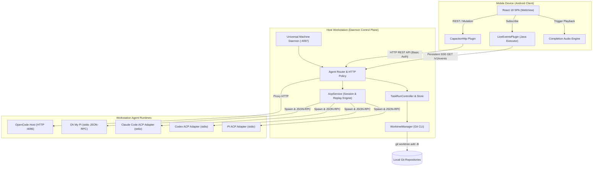
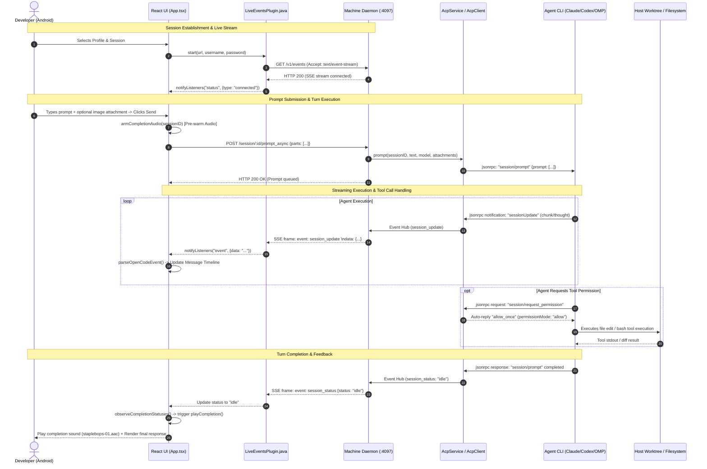
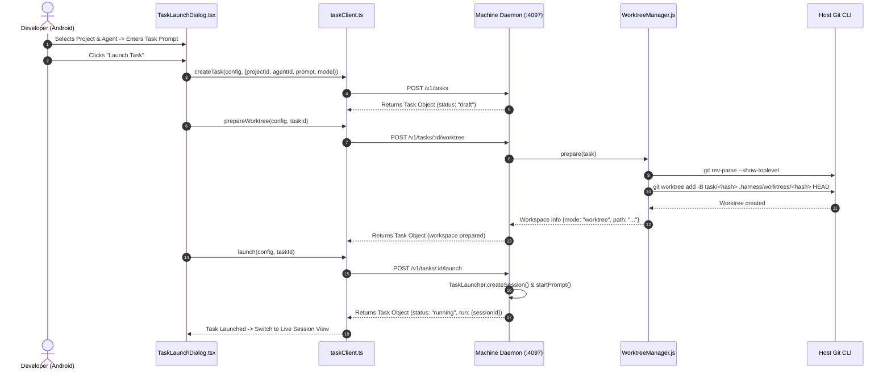

# Architectural Review: opencode-remote-android

## Executive Summary

[`opencode-remote-android`](file:///c:/Users/W/Documents/GitHub/OpenRemote/ref/opencode-remote-android/README.md) (commercially branded and evolved into **Harness Remote** / **TaskDesk v3**) is a local-first, multi-backend remote control plane and native mobile companion application designed to supervise, orchestrate, and interact with autonomous AI coding agents directly on developer workstations from smartphones, tablets, and desktop environments.

Unlike conventional cloud-tethered developer tools that mirror code to third-party hosted servers, Harness Remote operates on a strict **zero-cloud execution philosophy**: all source repositories, model API credentials, language server indexers, agent command-line interfaces (CLIs), and shell execution environments remain exclusively on the host workstation. The Android application functions as an ultra-responsive, secure remote supervision terminal that communicates with the host workstation via a unified daemon over authenticated HTTP and Server-Sent Events (SSE).

Originally conceived as a dedicated mobile client for [OpenCode](https://github.com/sst/opencode), the project has evolved into a comprehensive, multi-agent control plane supporting:
1. **OpenCode** (Direct native HTTP server integration on port 4096)
2. **Oh My Pi (OMP)** (First-party Agent Client Protocol [ACP] over stdio)
3. **Claude Code** (Official `@agentclientprotocol/claude-agent-acp` adapter)
4. **Codex CLI** (Official `@agentclientprotocol/codex-acp` adapter with rollout JSONL history parsing)
5. **PI** (Automata Labs `@automatalabs/pi-acp` adapter)

The architecture is built as a hybrid system comprising a **Capacitor-based Android native wrapper** with a custom Java native plugin for resilient SSE stream processing ([`LiveEventsPlugin.java`](file:///c:/Users/W/Documents/GitHub/OpenRemote/ref/opencode-remote-android/web/native-android/LiveEventsPlugin.java)), a responsive **React 18 / TypeScript frontend renderer** ([`App.tsx`](file:///c:/Users/W/Documents/GitHub/OpenRemote/ref/opencode-remote-android/web/src/App.tsx)), and a **Node.js Universal Machine Daemon** ([`machine-daemon.js`](file:///c:/Users/W/Documents/GitHub/OpenRemote/ref/opencode-remote-android/bridge/src/machine-daemon.js)) that manages agent host lifecycles, Git worktree isolation, and JSON-RPC process communication.

```
┌─────────────────────────────────────────────────────────────────────────────┐
│                             Android Mobile Device                           │
│  ┌───────────────────────────────────────────────────────────────────────┐  │
│  │                    Capacitor Native Android Container                 │  │
│  │  ┌───────────────────────────┐     ┌───────────────────────────────┐  │  │
│  │  │   LiveEventsPlugin.java   │     │         CapacitorHttp         │  │  │
│  │  │  (HttpURLConnection SSE)  │     │   (Native OkHttp / Network)   │  │  │
│  │  └─────────────┬─────────────┘     └───────────────┬───────────────┘  │  │
│  │                │ Events                            │ REST API         │  │
│  │  ┌─────────────▼───────────────────────────────────▼───────────────┐  │  │
│  │  │        React 18 / TypeScript Single-Page Application (SPA)      │  │  │
│  │  │  • Session Timeline Renderer    • Interactive Question / Card   │  │  │
│  │  │  • Diff Patch Inspector         • Adaptive Soft-Keyboard Bar    │  │  │
│  │  └─────────────────────────────────────────────────────────────────┘  │  │
│  └───────────────────────────────────┬───────────────────────────────────┘  │
└──────────────────────────────────────┼──────────────────────────────────────┘
                                       │ Authenticated HTTP / SSE (Port 4097)
                                       │ WireGuard / Tailscale / LAN
┌──────────────────────────────────────▼──────────────────────────────────────┐
│                            Remote Host Machine                              │
│  ┌───────────────────────────────────────────────────────────────────────┐  │
│  │               Harness Remote Universal Daemon (Port 4097)             │  │
│  │  ┌────────────────────────┐  ┌──────────────────┐  ┌───────────────┐  │  │
│  │  │      Agent Router      │  │  WorktreeManager │  │ TaskRunStore  │  │  │
│  │  │    (Port Multiplex)    │  │  (Git Isolation) │  │ (Persistence) │  │  │
│  │  └───────────┬────────────┘  └──────────────────┘  └───────────────┘  │  │
│  └──────────────┼────────────────────────────────────────────────────────┘  │
│                 │ Process Spawning / stdio JSON-RPC / Loopback HTTP         │
│  ┌──────────────┼──────────────┬──────────────┬──────────────┬───────────┐  │
│  │              │              │              │              │           │  │
│  ▼              ▼              ▼              ▼              ▼           ▼  │
│ ┌────────────┐ ┌────────────┐ ┌────────────┐ ┌────────────┐ ┌─────────┐ ┌───┴──────────┐
│ │  OpenCode  │ │   Oh My Pi │ │Claude Code │ │ Codex CLI  │ │ PI ACP  │ │ Git Worktrees │
│ │ (HTTP 4096)│ │  (omp acp) │ │ (Agent ACP)│ │ (Codex ACP)│ │ (pi-acp)│ │ (Isolated)   │
│ └────────────┘ └────────────┘ └────────────┘ └────────────┘ └─────────┘ └───────────────┘
└─────────────────────────────────────────────────────────────────────────────┘
```

---

## Architecture & Data Flow

### 1. System Topology & Process Boundaries

The system distributes responsibilities across four distinct layers:
1. **Native Android Runtime**: Handles background execution, device wake locks, native TCP connection lifecycles, and low-level byte streaming through [`LiveEventsPlugin.java`](file:///c:/Users/W/Documents/GitHub/OpenRemote/ref/opencode-remote-android/web/native-android/LiveEventsPlugin.java).
2. **Web / UI View Layer**: An optimized, mobile-first React application communicating across the Capacitor JavaScript Bridge. It compiles message streams into structured, human-readable execution steps, collapsible reasoning blocks, and unified diff viewers.
3. **Machine Daemon & Agent Router**: A Node.js daemon ([`machine-daemon.js`](file:///c:/Users/W/Documents/GitHub/OpenRemote/ref/opencode-remote-android/bridge/src/machine-daemon.js) / [`agent-router.js`](file:///c:/Users/W/Documents/GitHub/OpenRemote/ref/opencode-remote-android/bridge/src/agent-router.js)) that exposes a single public endpoint (default: `4097`). It acts as a reverse proxy, translating frontend REST/SSE requests into agent-specific protocols.
4. **Agent Host Runtimes**: Background processes managed by the daemon:
   - Loopback HTTP sub-processes (OpenCode on port 4096).
   - Persistent child processes communicating via stdio JSON-RPC using the Agent Client Protocol (ACP v1).



---

### 2. End-to-End Session & Turn Execution Sequence

The following sequence details how a prompt is dispatched from the Android device, executed within an ACP-isolated process on the host workstation, streamed back in real-time, and completed with audio and haptic feedback:



---

### 3. TaskDesk Worktree Isolation Sequence

Harness Remote v3 introduces **TaskDesk**, where tasks run inside isolated Git worktrees rather than dirtying the user's primary working tree:



---

## Core Tech Stack & Dependencies

The repository leverages a multi-target build strategy, allowing a unified codebase to power an Android APK, an Electron desktop application, and a responsive web application.

```
┌───────────────────────────────────────────────────────────────────────────────────┐
│                               Target Deployments                                  │
├─────────────────────────┬─────────────────────────┬───────────────────────────────┤
│    Android Native APK   │   Electron Desktop App  │     Web App / Hosted PWA      │
│  (Capacitor 8 Container)│  (Windows, macOS, Linux)│     (Vite + Static Server)    │
└────────────┬────────────┴────────────┬────────────┴───────────────┬───────────────┘
             │                         │                            │
┌────────────▼─────────────────────────▼────────────────────────────▼───────────────┐
│                    Shared UI Presentation Layer (React 18 / TS)                   │
│  • React 18.3.1 (Memoized Virtual DOM)   • Remark-GFM 4.0 (Markdown Table/Direct) │
│  • Custom SVG Iconography System         • i18n Translation Engine (4 Locales)    │
└──────────────────────────────────────┬────────────────────────────────────────────┘
                                       │
┌──────────────────────────────────────▼────────────────────────────────────────────┐
│                    Platform-Specific Transport Abstraction                       │
├─────────────────────────┬─────────────────────────┬───────────────────────────────┤
│    Android Transport    │    Desktop Transport    │        Web Transport          │
│ • LiveEventsPlugin.java │ • Electron IPC Contract │ • Fetch ReadableStream        │
│ • CapacitorHttp Native  │ • Node net/http client  │ • Standard EventSource API    │
└─────────────────────────┴─────────────────────────┴───────────────────────────────┘
```

### Dependency Analysis Matrix

| Component Layer | Technology / Library | Version | Purpose in Codebase |
|---|---|---|---|
| **Android Runtime** | `@capacitor/core` & `@capacitor/android` | `^8.3.4` | Native WebView runtime, Android activity lifecycle, bridge bindings |
| **Android Native Plugin** | `LiveEventsPlugin.java` | Custom (Java 17) | Background `HttpURLConnection` SSE client bypassing WebView stream limits |
| **Android App Lifecycle** | `@capacitor/app` | `^8.1.1` | Native back-button handling, app pause/resume state retention |
| **UI Framework** | `react` & `react-dom` | `18.3.1` | Component-based stateful renderer for session views, modals, and composer |
| **Markdown Processing** | `react-markdown` & `remark-gfm` | `^10.1.0` / `^4.0.1` | Renders agent output, syntax-highlighted code blocks, tables, and task lists |
| **Build & Bundler** | `vite` | `^8.0.14` | Hot Module Reloading (HMR), production minification, asset pipeline |
| **Desktop Shell** | `electron` & `electron-builder` | `^43.3.0` / `^26.15.3` | Cross-platform desktop packaging with native OS menus and file dialogs |
| **Backend Daemon** | Node.js Built-in Modules | `>=20.0.0` | `node:http`, `node:child_process`, `node:crypto`, `node:fs/promises` |
| **Agent Protocols** | `@agentclientprotocol/*` | Pinned (0.63/1.1) | Official ACP adapters for Claude Code (`0.63.0`) and Codex CLI (`1.1.14`) |
| **External Agent Adapter** | `@automatalabs/pi-acp` | Pinned (`0.2.5`) | Third-party stdio adapter bridging PI coding agent to ACP v1 |
| **Host Extension** | `@baylarsadigov/omp-undo-redo` | Dynamic (>=1.1.0) | Discovered host plugin providing workspace Undo/Redo for Oh My Pi |

### Native Android vs. Hybrid Capacitor Trade-off Analysis

The project intentionally adopted a **Capacitor Hybrid Architecture** instead of a pure native Android stack (Kotlin + Jetpack Compose + OkHttp). The architectural rationale and trade-offs are evaluated below:

```
┌─────────────────────────────────────────────────────────────────────────────┐
│                 Architectural Trade-Off: Hybrid vs Pure Native              │
├──────────────────────────────────────┬──────────────────────────────────────┤
│  Capacitor Hybrid (Current Approach) │ Pure Native Android (Kotlin/Compose) │
├──────────────────────────────────────┼──────────────────────────────────────┤
│ ✅ 95% code sharing between Android, │ ❌ Triplicated codebase (Android,    │
│    Desktop (Electron), and Web/PWA.  │    Desktop, Web written separately). │
│ ✅ Rapid iteration on Markdown/Diff  │ ❌ Slower development cycle for      │
│    rendering and CSS themes.         │    complex rich-text formatting.     │
│ ⚠️ WebView memory footprint on large │ ✅ Zero-overhead native memory model │
│    transcripts (500+ message nodes). │    with Jetpack LazyColumn recycling.│
│ ⚠️ Soft keyboard layout adjustment   │ ✅ First-class `WindowInsets` and    │
│    requires CSS `env(safe-area-...)`.│    IME animation support in Compose. │
│ ✅ Solved WebView SSE stream leaks   │ ✅ Direct OkHttp connection pool with│
│    via custom Java LiveEventsPlugin. │    native multiplexing & TLS pinning.│
└──────────────────────────────────────┴──────────────────────────────────────┘
```

---

## Distinctive & Smart Engineering Decisions

### 1. Dual-Mode Responsive Architecture with Pixel-Exact JS/CSS Synchronization

Rather than maintaining separate mobile and desktop codebases or relying on jarring breakpoint switches, Harness Remote implements a **single build, two-layout design**.
- **The 781px Threshold**: Defined identically in CSS (`@media (max-width: 780px)`) and TypeScript (`DESKTOP_MIN_WIDTH = 781` in [`App.tsx:L85-87`](file:///c:/Users/W/Documents/GitHub/OpenRemote/ref/opencode-remote-android/web/src/App.tsx#L85-L87)).
- **Seamless Adaptation**: On screens `< 781px`, the UI presents a native mobile experience with bottom navigation tabs, full-screen message views, and slide-over dialogs. Above `781px`, it automatically expands into a two-pane desktop workspace with a resizable sidebar (`220px–960px`), context inspector, and modal overlays.
- **Persistent Geometry**: Sidebar and inspector widths are stored in `localStorage` under versioned keys (`SIDEBAR_WIDTH_STORAGE_KEY = "opencode.remote.desktopSidebarWidth.v4"` in [`App.tsx:L76`](file:///c:/Users/W/Documents/GitHub/OpenRemote/ref/opencode-remote-android/web/src/App.tsx#L76)) and clamped on window resizing using `maxSidebarWidth()`.

```typescript
// App.tsx: lines 104-124
function clamp(value: number, min: number, max: number): number {
  return Math.min(max, Math.max(min, value))
}

function maxPanelWidth(max: number, min: number, otherPanel: number): number {
  return Math.max(min, Math.min(max, window.innerWidth - MAIN_WIDTH_MIN - otherPanel))
}

function maxSidebarWidth(otherPanel = 0): number {
  return maxPanelWidth(SIDEBAR_WIDTH_MAX, SIDEBAR_WIDTH_MIN, otherPanel)
}
```

---

### 2. Touch-Primary vs. Fine-Pointer Keyboard Inversion

Mobile soft keyboards lack dedicated `Shift` and `Control` modifier keys. A desktop convention of `Enter = Send` and `Shift+Enter = Newline` causes accidental message submissions when typing on mobile.

Harness Remote solves this by dynamically detecting pointer coarse traits ([`App.tsx:L135-138`](file:///c:/Users/W/Documents/GitHub/OpenRemote/ref/opencode-remote-android/web/src/App.tsx#L135-L138)):
- **Desktop / Fine Pointer**: `Enter` submits prompt; `Shift+Enter` inserts newline.
- **Mobile / Coarse Pointer (`SOFT_KEYBOARD_DEVICE`)**: `Enter` inserts newline; `Ctrl+Enter` / `Cmd+Enter` or tapping the dedicated send button submits.
- **Soft Keyboard IME Optimization**: Sets `enterKeyHint={softKeyboard ? "enter" : "send"}` and enables `autoCapitalize="sentences"` / `autoCorrect="on"` in [`SessionComposer.tsx:L58-69`](file:///c:/Users/W/Documents/GitHub/OpenRemote/ref/opencode-remote-android/web/src/components/session-composer.tsx#L58-L69).

---

### 3. Native Android SSE Engine (`LiveEventsPlugin.java`)

Android WebViews frequently suffer from background stream suspension, TCP socket truncation, and aggressive buffer delays when consuming Server-Sent Events via standard `fetch()` `ReadableStream` or `EventSource`.

To achieve bulletproof live event streaming, the team wrote a dedicated native Capacitor plugin in Java ([`LiveEventsPlugin.java`](file:///c:/Users/W/Documents/GitHub/OpenRemote/ref/opencode-remote-android/web/native-android/LiveEventsPlugin.java)):
- **Direct Java Networking**: Utilizes `HttpURLConnection` running on a dedicated background `ExecutorService` (`Executors.newSingleThreadExecutor()`).
- **Zero Read Timeout**: Explicitly calls `connection.setReadTimeout(0)` to keep long-lived streams open indefinitely without triggering OS socket read timeouts.
- **Native Frame Parsing**: Streams incoming bytes via `BufferedReader`, detecting double newline boundaries (`\n\n`), extracting `data:` lines, and dispatching structured JSON payloads across the native bridge using `notifyListeners("event", payload)`.
- **Automatic Exponential Reconnection**: Reconnects automatically on network dropped sockets (1s up to 30s exponential backoff clamp) in [`LiveEventsPlugin.java:L98-107`](file:///c:/Users/W/Documents/GitHub/OpenRemote/ref/opencode-remote-android/web/native-android/LiveEventsPlugin.java#L98-L107).

```java
// LiveEventsPlugin.java: lines 71-89
HttpURLConnection current = (HttpURLConnection) new URL(endpoint).openConnection();
connection = current;
current.setRequestMethod("GET");
current.setRequestProperty("Accept", "text/event-stream");
if (!username.isEmpty() || !password.isEmpty()) {
    String credentials = username + ":" + password;
    String encoded = Base64.encodeToString(credentials.getBytes(StandardCharsets.UTF_8), Base64.NO_WRAP);
    current.setRequestProperty("Authorization", "Basic " + encoded);
}
current.setConnectTimeout(10000);
current.setReadTimeout(0);
int status = current.getResponseCode();
String contentType = current.getContentType();
if (status != HttpURLConnection.HTTP_OK || contentType == null || !contentType.toLowerCase().contains("text/event-stream")) {
    throw new IllegalStateException("HTTP " + status + "; expected text/event-stream");
}
delayMs = 1000;
publishStatus("connected", null, null);
readFrames(current.getInputStream());
```

---

### 4. Zero-Audio-Latency Mobile Audio Priming

Mobile browsers and WebViews enforce strict autoplay restrictions: media cannot play unless initiated directly by a user gesture. However, agent turns complete asynchronously minutes after the user taps "Send".

Harness Remote overcomes this limitation in [`completion-audio.ts`](file:///c:/Users/W/Documents/GitHub/OpenRemote/ref/opencode-remote-android/web/src/completion-audio.ts#L44-L85):
- When the user taps Send, [`armCompletionAudio(sessionID)`](file:///c:/Users/W/Documents/GitHub/OpenRemote/ref/opencode-remote-android/web/src/completion-audio.ts#L74-L85) executes synchronously within the touch gesture callstack.
- It calls [`primePlayback()`](file:///c:/Users/W/Documents/GitHub/OpenRemote/ref/opencode-remote-android/web/src/completion-audio.ts#L44-L60), which sets `audio.muted = true`, starts playback (`nativePlay.call(audio)`), and immediately pauses and resets `audio.currentTime = 0`.
- This unlocks the HTML5 Audio pipeline on Android/iOS WebViews. When the background SSE stream later delivers `session_status: "idle"`, the completion sound ([`staplebops-01.aac`](file:///c:/Users/W/Documents/GitHub/OpenRemote/ref/opencode-remote-android/web/public/audio/staplebops-01.aac)) plays immediately without permission errors.

---

### 5. Multi-Writer Lock Bypass via Codex Rollout Parsing

Codex CLI acquires an exclusive thread writer lock (`~/.codex/thread-writer-locks/<sessionId>.lock`) whenever an active CLI session is running on the workstation. Standard ACP `session/load` requests fail with lock conflicts.

The bridge implements [`createCodexHistoryLoader`](file:///c:/Users/W/Documents/GitHub/OpenRemote/ref/opencode-remote-android/bridge/src/codex-session-history.js):
- Bypasses the active lock by directly locating and reading the append-only rollout log on disk: `~/.codex/sessions/<yyyy>/<mm>/<dd>/rollout-<timestamp>-<sessionId>.jsonl`.
- Parses JSONL `event_msg` records (`user_message.message`, `agent_message.message`, `agent_reasoning.text`), deduplicates intermediate streaming states, and reconstructs the full session transcript even while the host CLI holds an active write lock.

---

### 6. Longest Common Subsequence (LCS) Replay Merging

When switching sessions or recovering from a network drop, reloading a transcript from the server could overwrite optimistic local user messages or cause jarring UI flickering.

[`acp-service.js:L115-168`](file:///c:/Users/W/Documents/GitHub/OpenRemote/ref/opencode-remote-android/bridge/src/acp-service.js#L115-L168) implements a formal Longest Common Subsequence diffing algorithm ([`mergeReplay`](file:///c:/Users/W/Documents/GitHub/OpenRemote/ref/opencode-remote-android/bridge/src/acp-service.js#L115-L168)) to merge cached client messages with replayed server history:
- Identifies common prefixes and suffixes.
- Constructs an LCS matrix on message signatures (`role + content`).
- Merges divergent branches smoothly without dropping unconfirmed turns or duplicating responses.

---

## Process & Terminal Rendering on Android

Rather than running a heavy, unreadable ANSI terminal emulator (such as xterm.js) on a vertical 6-inch phone screen, Harness Remote decomposes terminal interactions and agent execution into a **Structured Message & Action Timeline**.

```
┌─────────────────────────────────────────────────────────────────────────────┐
│                           Mobile Timeline Rendering                         │
├─────────────────────────────────────────────────────────────────────────────┤
│  👤 User Message: "Refactor auth middleware and add test cases"             │
├─────────────────────────────────────────────────────────────────────────────┤
│  ⚡ Action Group Pill: "Thought for 12s, read 3 files, ran 2 commands"      │
│     [ Tap to expand full reasoning & tool execution modal ]                  │
├─────────────────────────────────────────────────────────────────────────────┤
│  📝 Interactive Tool Card: `git status` -> Exit code 0                     │
├─────────────────────────────────────────────────────────────────────────────┤
│  📊 Unified Diff Card: `src/auth.ts` (+24 / -8)                             │
│     [ Tap to open full-screen diff modal with syntax highlighting ]          │
├─────────────────────────────────────────────────────────────────────────────┤
│  ❓ Question Prompt: "Which hashing algorithm should be used?"              │
│     ( ) Argon2id (Recommended)   ( ) Scrypt   ( ) Custom text input...      │
│     [ Send Answer ]                                                         │
├─────────────────────────────────────────────────────────────────────────────┤
│  🤖 Assistant Response: Markdown explanation and summary of changes         │
└─────────────────────────────────────────────────────────────────────────────┘
```

### 1. Action Grouping & Duration Formatting

Consecutive agent operations (thinking, reading files, executing bash commands, applying diffs) are aggregated into compact summary pills to keep the mobile chat clean:
- **Timeline Construction**: [`buildMessageTimeline()`](file:///c:/Users/W/Documents/GitHub/OpenRemote/ref/opencode-remote-android/web/src/App.tsx#L1216-L1236) walks message parts in order, grouping contiguous `reasoning`, `tool`, and `patch` items into an `action-group`.
- **Tool Counting**: [`summarizeToolCounts()`](file:///c:/Users/W/Documents/GitHub/OpenRemote/ref/opencode-remote-android/web/src/App.tsx#L1247-L1307) tallies operations into human-readable phrases (e.g., `"read 4 files, searched 2 times, ran 1 command"`).
- **Reasoning Durations**: [`formatActionDuration()`](file:///c:/Users/W/Documents/GitHub/OpenRemote/ref/opencode-remote-android/web/src/App.tsx#L1238-L1243) calculates elapsed thought duration (`"Thought for 14s"` or `"Thought for 2m"`).

---

### 2. Interactive Decision Cards

When an agent pauses to ask questions or request shell permissions, the UI renders interactive native cards instead of expecting raw stdin text:
- **`QuestionCard`** ([`App.tsx:L871-1001`](file:///c:/Users/W/Documents/GitHub/OpenRemote/ref/opencode-remote-android/web/src/App.tsx#L871-L1001)): Displays single/multi-choice options with descriptions and a custom text input field. Answers are submitted via `api.replyQuestion()` or dismissed via `api.rejectQuestion()`.
- **`PermissionCard`** ([`App.tsx:L1003-1055`](file:///c:/Users/W/Documents/GitHub/OpenRemote/ref/opencode-remote-android/web/src/App.tsx#L1003-L1055)): Surfaces permission requests (e.g., filesystem read/write, bash execution) with pattern badges and three explicit actions: `Deny`, `Allow Once`, and `Allow Always`.

---

### 3. Syntax-Colored Diff & Patch Modal

File modifications generated by tools or patch events are rendered with dedicated diff viewers:
- **Diff Stat Calculation**: [`diffLineStats(oldStr, newStr)`](file:///c:/Users/W/Documents/GitHub/OpenRemote/ref/opencode-remote-android/web/src/App.tsx#L380-L410) computes line additions and deletions.
- **Diff Lines View**: [`DiffLines`](file:///c:/Users/W/Documents/GitHub/OpenRemote/ref/opencode-remote-android/web/src/App.tsx#L567-L585) parses unified patches into syntax-highlighted classes: `.diff-line-meta` (headers), `.diff-line-add` (green additions), `.diff-line-del` (red deletions), and `.diff-line-hunk` (blue line coordinate ranges).

---

### 4. Dynamic Scroll Travel Affordances

Navigating large conversation transcripts on mobile is facilitated by dynamic floating jump controls ([`App.tsx:L656-780`](file:///c:/Users/W/Documents/GitHub/OpenRemote/ref/opencode-remote-android/web/src/App.tsx#L656-L780)):
- **Scaled Thresholds**: Rather than using a static scroll offset, [`jumpAffordancesFor()`](file:///c:/Users/W/Documents/GitHub/OpenRemote/ref/opencode-remote-android/web/src/App.tsx#L674-L679) computes thresholds dynamically based on total scroll range (`Math.min(320, range * 0.25)`).
- **Auto-Follow Disengage**: Jumping to the top automatically unhooks the conversation auto-follow tracker, allowing the user to read earlier messages without incoming SSE chunks violently snapping the view back to the bottom.

---

## Communication & Mobile Networking

The networking architecture handles the harsh realities of mobile connectivity: radio sleep states, network switching (Wi-Fi to LTE/5G), NAT timeouts, and captive portals.

```
┌─────────────────────────────────────────────────────────────────────────────┐
│                          Mobile Networking Pipeline                         │
├──────────────────────────────────────┬──────────────────────────────────────┤
│        Control Channel (REST)        │         Event Stream (SSE)           │
├──────────────────────────────────────┼──────────────────────────────────────┤
│ • Transport: CapacitorHttp (Android) │ • Transport: LiveEventsPlugin (Java) │
│ • Timeout: 12s connect / 30s read    │ • Timeout: Infinite read, 10s ping   │
│ • Headers: Basic Auth + Agent Route  │ • Parser: Native BufferedReader      │
│ • Preflight: No CORS on Native App   │ • Watchdog: 30s client stall timer   │
└──────────────────────────────────────┴──────────────────────────────────────┘
```

### 1. Dual-Channel Networking Pipeline

1. **Transactional HTTP Channel (`CapacitorHttp`)**:
   - Handles profile verification, session creation, prompt dispatch, model catalogs, and question replies.
   - Handled natively by Android's `HttpURLConnection` via Capacitor, completely bypassing WebView CORS security restrictions and preflight `OPTIONS` overhead.
2. **Streaming Event Channel (`LiveEventsPlugin` / `createNativeOpenCodeEventSubscription`)**:
   - Connects to `/v1/events` or `/global/event` using `Accept: text/event-stream`.
   - Native Java background thread receives raw chunks and dispatches parsed JSON events to React state hooks.

---

### 2. Network Transitions & Dead-Socket Watchdog

Mobile devices frequently disconnect TCP sockets silently when roaming or sleeping without sending `FIN` or `RST` packets:
- **Server Heartbeat**: The daemon emits an SSE comment ping every 10 seconds (`: ping\n\n` in [`bridge/src/server.js:L174`](file:///c:/Users/W/Documents/GitHub/OpenRemote/ref/opencode-remote-android/bridge/src/server.js#L174)).
- **Client Stall Watchdog**: [`createFetchOpenCodeEventSubscription`](file:///c:/Users/W/Documents/GitHub/OpenRemote/ref/opencode-remote-android/web/src/opencode-events.ts#L73-L193) arms a 30-second watchdog timer on every received chunk (`armStall()`). If no bytes arrive for 30 seconds, the client explicitly aborts the hung socket, destroys the reader, and schedules an exponential reconnect (`1s -> 2s -> 4s -> ... -> 30s max`).

```typescript
// opencode-events.ts: lines 135-150
let stallTimer: TimerID | undefined
const disarmStall = () => {
  if (stallTimer !== undefined) clearTimeout(stallTimer)
  stallTimer = undefined
}
const armStall = () => {
  disarmStall()
  stallTimer = setTimeout(() => {
    stallTimer = undefined
    logger(`OpenCode SSE stalled for ${stallTimeoutMs}ms, reconnecting`)
    currentController.abort()
    reader.cancel().catch(() => undefined)
  }, stallTimeoutMs)
}
```

---

## Reliability, Fault Tolerance & Edge Cases

| Failure Scenario | Threat / Risk | Mitigating Architecture in Harness Remote |
|---|---|---|
| **Android OS Process Eviction** | System kills background WebView when RAM is constrained during agent work. | State is persisted in `localStorage`. Background daemon continues running work; upon app relaunch, `LiveEventsPlugin` reconnects, calls `session/load`, and reconstructs conversation via LCS replay. |
| **Silent TCP Socket Loss** | Wi-Fi dropped; socket stays in `ESTABLISHED` without delivering data. | Dual heartbeat/watchdog system (10s server ping, 30s client stall timer) forces socket teardown and exponential reconnection. |
| **Accidental Multi-Turn Input** | User types follow-up prompt while agent is already busy executing. | Prompts are queued gracefully on the server (`prompt_async`). Stop button transforms into an active abort trigger (`POST /session/:id/abort`). |
| **Orphaned Git Branches / Dirt** | Agent crashes mid-task, leaving uncommitted work or dirty worktrees. | [`WorktreeManager.js`](file:///c:/Users/W/Documents/GitHub/OpenRemote/ref/opencode-remote-android/bridge/src/worktree-manager.js#L64-L98) inspects status via `git status --porcelain=v1`. Prevents deletion of dirty worktrees; rollback forces clean removal with branch reconciliation. |
| **ACP Child Adapter Crash** | Agent process crashes or fails during startup handshake. | [`AcpClient.js`](file:///c:/Users/W/Documents/GitHub/OpenRemote/ref/opencode-remote-android/bridge/src/acp-client.js#L88-L113) captures the last 600 characters of `stderr` (`#stderrSummary()`), rejecting pending RPC promises with exact compiler/runtime error strings. |

---

## Security & Access Control

### 1. Filesystem Boundary Enforcement (`--root`)
The daemon restricts all session creations and file browsing operations within explicitly configured root boundaries.
- [`allowedDirectory()`](file:///c:/Users/W/Documents/GitHub/OpenRemote/ref/opencode-remote-android/bridge/src/server.js#L60-L67) resolves the candidate path and all configured roots using `fs.promises.realpath`.
- Validates that the relative path does not begin with `..` or escape the approved root jail.

```javascript
// bridge/src/server.js: lines 60-67
async function allowedDirectory(candidate, config) {
  const resolved = await realpath(candidate)
  const roots = await Promise.all((config.roots.length ? config.roots : [process.cwd()]).map((root) => realpath(root)))
  if (!roots.some((root) => resolved === root || !path.relative(root, resolved).startsWith(`..${path.sep}`) && path.relative(root, resolved) !== "..")) {
    throw new Error("Directory is outside the configured --root boundary")
  }
  return resolved
}
```

### 2. Authentication & Credential Hygiene
- **HTTP Basic Authentication**: All endpoints require `Authorization: Basic <base64>` header verification against configured daemon credentials.
- **In-Memory Ephemeral Launch Tokens**: Internal credentials used to communicate with managed child hosts (e.g. OpenCode on port 4096) are held exclusively in memory during session creation and are **never persisted to disk** inside `task.run` records.

### 3. Cleartext Traffic & VPN Model
- Android configuration ([`capacitor.config.ts`](file:///c:/Users/W/Documents/GitHub/OpenRemote/ref/opencode-remote-android/web/capacitor.config.ts#L9)) enables `cleartext: true` to support plain HTTP connections across trusted private mesh networks (Tailscale, WireGuard, LAN).
- Production deployments over public networks are instructed to terminate TLS using Nginx, Caddy, or Cloudflare Tunnel.

---

## Flaws, Antipatterns & Gotchas

### 1. Lack of Virtualized List Rendering in Large Transcripts
- **Flaw**: [`App.tsx`](file:///c:/Users/W/Documents/GitHub/OpenRemote/ref/opencode-remote-android/web/src/App.tsx) renders all message envelopes and diff blocks directly into the DOM without list virtualization (`react-window` or `react-virtualized`).
- **Impact**: In coding sessions exceeding 300+ turns with extensive bash output, the DOM node count exceeds 15,000 elements, leading to noticeable scroll jank and high RAM usage inside Android's WebView.

### 2. Auto-Granting Tool Permissions in Unattended Mode
- **Flaw**: In [`AcpClient.js:L232-245`](file:///c:/Users/W/Documents/GitHub/OpenRemote/ref/opencode-remote-android/bridge/src/acp-client.js#L232-L245), when `permissionMode === "allow"`, all incoming ACP permission requests are automatically answered with `allow_once`.
- **Impact**: While necessary for frictionless mobile operation where the user cannot approve every individual `cat` or `grep` invocation, an agent running prompt injection or destructive shell commands (`rm -rf`) executes with full user workstation permissions.

### 3. Third-Party ACP Adapter Dependency Risks
- **Flaw**: PI and Claude Code integrations rely on third-party npm adapters (`@automatalabs/pi-acp` and `@agentclientprotocol/*`) that bundle specific versions of underlying agent engines.
- **Impact**: If an adapter lags upstream agent releases or breaks its stdio serialization format, the bridge fails without recourse until the adapter package is updated and republished.

---

## Actionable Lessons & Takeaways for OpenRemote

The architectural evolution of `opencode-remote-android` provides invaluable reference patterns and design guidelines for building the next-generation OpenRemote mobile client:

```
┌─────────────────────────────────────────────────────────────────────────────┐
│                    Key Takeaways for OpenRemote Mobile                      │
├─────────────────────────────────────────────────────────────────────────────┤
│ 1. Mobile Terminal UX: Render structured step cards instead of raw xterm.js │
│ 2. Keyboard Accessory Bar: Provide Esc, Tab, Ctrl+C, Ctrl+D, and /commands   │
│ 3. Connection Watchdog: Enforce a 30s stall timer over SSE / WebSocket      │
│ 4. Git Worktree Isolation: Execute remote agent runs in dedicated branches  │
│ 5. Native Push Notifications: Dispatch FCM/APNs triggers on human attention │
└─────────────────────────────────────────────────────────────────────────────┘
```

1. **Structured Step Rendering Over Raw PTY Terminals**:
   - Rendering raw terminal emulators on mobile screens creates severe UX friction (tiny fonts, horizontal scrolling, difficult text selection).
   - *OpenRemote Takeaway*: Deconstruct remote agent output into structured timeline cards (Thinking, Tool Execution, Diffs, Questions) while keeping an optional "Raw Terminal / Logs" drawer for deep inspection.

2. **Mobile Keyboard Accessory Bar**:
   - Soft keyboards lack essential terminal keys (`Escape`, `Tab`, `Ctrl+C`, `Ctrl+D`, `Up/Down` history).
   - *OpenRemote Takeaway*: Implement a persistent accessory bar above the mobile soft keyboard providing instant access to common developer keys, slash commands (`/help`, `/reset`), and quick-action interrupts.

3. **Persistent Native Connection Watchdogs**:
   - Standard browser WebSockets and EventSources fail silently when mobile devices enter low-power sleep or switch from Wi-Fi to cellular.
   - *OpenRemote Takeaway*: Follow the `LiveEventsPlugin.java` pattern: manage connections in native code (OkHttp / Java / Kotlin) with client-side heartbeats and stall detection rather than relying on WebView stream longevity.

4. **Task-Scoped Git Worktree Isolation**:
   - Modifying a developer's main working tree remotely risks file conflicts and broken local builds.
   - *OpenRemote Takeaway*: Adopt the `WorktreeManager` pattern to automatically spawn tasks in isolated `task/<id>` Git worktrees, allowing multiple agents to work concurrently without colliding with the developer's desktop workspace.

5. **Universal Attention & Push Notification Hub**:
   - Mobile users do not watch the screen continuously while agents run multi-minute tasks.
   - *OpenRemote Takeaway*: Integrate push notifications (via Firebase Cloud Messaging / APNs) that alert the developer specifically when an agent completes a task, hits an error, or requires human attention (e.g. asking a question or requesting permission).

---

## Key Code File Index

| File Path | Core Subsystem | Key Classes, Functions & Responsibilities | Clickable Link |
|---|---|---|---|
| `web/native-android/LiveEventsPlugin.java` | Native Android Networking | `LiveEventsPlugin`, `runStream()`, `readFrames()`, `publishEvent()` - Background native SSE client using `HttpURLConnection`. | [`LiveEventsPlugin.java`](file:///c:/Users/W/Documents/GitHub/OpenRemote/ref/opencode-remote-android/web/native-android/LiveEventsPlugin.java) |
| `web/native-android/MainActivity.java` | Android Application Entry | `MainActivity`, `registerPlugin(LiveEventsPlugin.class)` - Capacitor bridge activity initialization. | [`MainActivity.java`](file:///c:/Users/W/Documents/GitHub/OpenRemote/ref/opencode-remote-android/web/native-android/MainActivity.java) |
| `web/src/App.tsx` | Mobile & Desktop UI Engine | `App`, `buildMessageTimeline()`, `describeToolAction()`, `QuestionCard()`, `PermissionCard()`, `useJumpAffordances()` - Core UI state & timeline renderer. | [`App.tsx`](file:///c:/Users/W/Documents/GitHub/OpenRemote/ref/opencode-remote-android/web/src/App.tsx) |
| `web/src/opencode-events.ts` | Event Stream Client | `createNativeOpenCodeEventSubscription()`, `createFetchOpenCodeEventSubscription()`, `streamURL()` - Event stream lifecycle & stall watchdog. | [`opencode-events.ts`](file:///c:/Users/W/Documents/GitHub/OpenRemote/ref/opencode-remote-android/web/src/opencode-events.ts) |
| `web/src/sse-parser.ts` | SSE Wire Parser | `parseSSEFrame()`, `parseOpenCodeEvent()` - Low-level SSE wire frame and JSON payload parser. | [`sse-parser.ts`](file:///c:/Users/W/Documents/GitHub/OpenRemote/ref/opencode-remote-android/web/src/sse-parser.ts) |
| `web/src/api.ts` | HTTP Client Abstraction | `api`, `requestWithHeaders()`, `replyQuestion()`, `replyPermission()` - Native `CapacitorHttp` and desktop REST client. | [`api.ts`](file:///c:/Users/W/Documents/GitHub/OpenRemote/ref/opencode-remote-android/web/src/api.ts) |
| `web/src/components/session-composer.tsx` | Composer Input Bar | `SessionComposer` - Adaptive input textarea with soft-keyboard enter inversion and attachment picker. | [`session-composer.tsx`](file:///c:/Users/W/Documents/GitHub/OpenRemote/ref/opencode-remote-android/web/src/components/session-composer.tsx) |
| `web/src/components/panels.tsx` | UI Dialogs & Wizards | `ConnectServerWizard`, `NewSessionDialog`, `SettingsPanel` - Server discovery and connection wizard. | [`panels.tsx`](file:///c:/Users/W/Documents/GitHub/OpenRemote/ref/opencode-remote-android/web/src/components/panels.tsx) |
| `web/src/completion-audio.ts` | Mobile Audio & Feedback | `armCompletionAudio()`, `primePlayback()`, `playCompletion()` - Gesture-primed zero-latency completion audio. | [`completion-audio.ts`](file:///c:/Users/W/Documents/GitHub/OpenRemote/ref/opencode-remote-android/web/src/completion-audio.ts) |
| `web/src/taskClient.ts` | TaskDesk Client API | `taskClient`, `listProjects()`, `listTasks()`, `createTask()`, `prepareWorktree()` - TaskDesk v3 REST API bindings. | [`taskClient.ts`](file:///c:/Users/W/Documents/GitHub/OpenRemote/ref/opencode-remote-android/web/src/taskClient.ts) |
| `bridge/src/server.js` | Bridge HTTP Server | `createBridgeServer()`, `allowedDirectory()`, `providersResponse()` - Standalone bridge server and request router. | [`server.js`](file:///c:/Users/W/Documents/GitHub/OpenRemote/ref/opencode-remote-android/bridge/src/server.js) |
| `bridge/src/machine-daemon.js` | Universal Machine Daemon | `MachineDaemon`, `createMachineDaemonServer()`, `registerAcpHost()` - Central multi-agent daemon controller. | [`machine-daemon.js`](file:///c:/Users/W/Documents/GitHub/OpenRemote/ref/opencode-remote-android/bridge/src/machine-daemon.js) |
| `bridge/src/agent-router.js` | Agent Reverse Proxy | `createAgentRoutingServer()`, `proxyManagedHttpRequest()` - Port 4097 HTTP/SSE multiplexing proxy. | [`agent-router.js`](file:///c:/Users/W/Documents/GitHub/OpenRemote/ref/opencode-remote-android/bridge/src/agent-router.js) |
| `bridge/src/acp-client.js` | Agent Client Protocol (ACP) | `AcpClient`, `#start()`, `request()`, `#respondPermission()` - stdio JSON-RPC client managing agent child processes. | [`acp-client.js`](file:///c:/Users/W/Documents/GitHub/OpenRemote/ref/opencode-remote-android/bridge/src/acp-client.js) |
| `bridge/src/acp-service.js` | Session & History Engine | `AcpService`, `mergeReplay()`, `messages()`, `prompt()` - ACP session lifecycle, turns, and LCS history deduplication. | [`acp-service.js`](file:///c:/Users/W/Documents/GitHub/OpenRemote/ref/opencode-remote-android/bridge/src/acp-service.js) |
| `bridge/src/task-launcher.js` | Task Run Dispatcher | `TaskLauncher`, `createSession()`, `startPrompt()` - Launches tasks into ACP or loopback HTTP agent sessions. | [`task-launcher.js`](file:///c:/Users/W/Documents/GitHub/OpenRemote/ref/opencode-remote-android/bridge/src/task-launcher.js) |
| `bridge/src/worktree-manager.js` | Git Worktree Isolation | `WorktreeManager`, `prepare()`, `inspect()`, `cleanup()`, `rollback()` - Safe Git worktree branch management. | [`worktree-manager.js`](file:///c:/Users/W/Documents/GitHub/OpenRemote/ref/opencode-remote-android/bridge/src/worktree-manager.js) |
| `bridge/src/harness-profiles.js` | Agent Profile Registry | `harnessProfile()`, `HARNESS_PROFILES` - Pinned ACP adapter versions, launch commands, and capabilities. | [`harness-profiles.js`](file:///c:/Users/W/Documents/GitHub/OpenRemote/ref/opencode-remote-android/bridge/src/harness-profiles.js) |
| `bridge/src/codex-session-history.js` | Codex JSONL Parser | `createCodexHistoryLoader()` - Lock-free parser for `~/.codex/sessions/**/*.jsonl` rollout files. | [`codex-session-history.js`](file:///c:/Users/W/Documents/GitHub/OpenRemote/ref/opencode-remote-android/bridge/src/codex-session-history.js) |
| `bridge/src/extension-actions.js` | Host Extension Loader | `listExtensionActions()`, `resolveExtensionAction()` - Host plugin discovery (e.g. OMP Undo/Redo sidecar). | [`extension-actions.js`](file:///c:/Users/W/Documents/GitHub/OpenRemote/ref/opencode-remote-android/bridge/src/extension-actions.js) |
