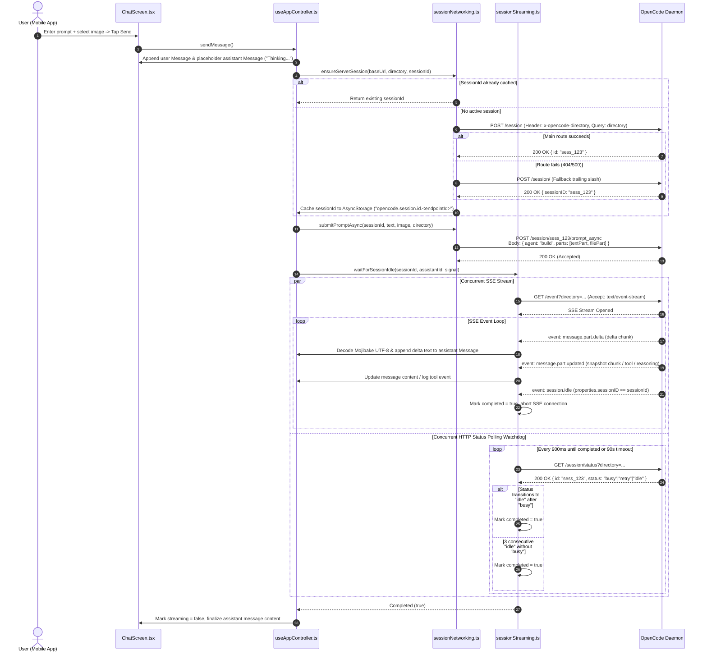
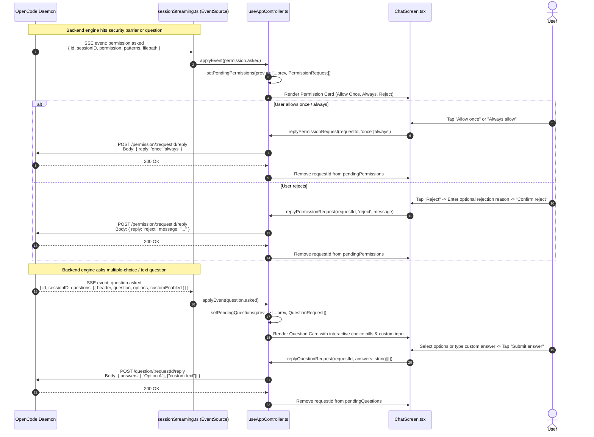

# Architectural Review: opencode-remote

## Executive Summary

[`opencode-remote`](file:///c:/Users/W/Documents/GitHub/OpenRemote/ref/opencode-remote) (packaged internally as `opencode-mobile-chat`, with user-facing bundle name `OPcode`) is a mobile chat client written in React Native and Expo (React 19, React Native 0.81.5, Expo SDK 54). It is engineered as a remote graphical frontend connecting to an [`opencode serve`](file:///c:/Users/W/Documents/GitHub/OpenRemote/ref/opencode-remote/README.md#L32-L36) daemon running on a developer's workstation or remote server.

```
+------------------------------------------------------------------------------------------------+
|                                    opencode-remote Client                                      |
|                                                                                                |
|   +----------------------------------------------------------------------------------------+   |
|   |                                  useAppController                                      |   |
|   |  - Centralized State Machine     - Endpoint & Session Switcher                         |   |
|   |  - Traced HTTP Fetch Engine      - Dual-Channel SSE / Polling Stream Coordinator       |   |
|   |  - Permission & Question Barrier - Mojibake UTF-8 Recovery                             |   |
|   +----------------------------------------------------------------------------------------+   |
|         |                                    |                                    |            |
|         v                                    v                                    v            |
|   [ HomeScreen ]                     [ ProjectsScreen ]                    [ ChatScreen ]      |
|   - Endpoint Manager                 - Project / Worktree                  - Markdown Parser   |
|   - Health Verifier                    Pagination & Selector               - Interactive Cards |
|                                                                            - Image Uploader    |
+------------------------------------------------------------------------------------------------+
                                               |
                          HTTP REST + SSE (x-opencode-directory)
                                               |
                                               v
+------------------------------------------------------------------------------------------------+
|                                 OpenCode Server (Remote Daemon)                                |
|                                                                                                |
|   +------------------+     +--------------------+     +------------------+     +-----------+   |
|   | /session (REST)  |     | /event (SSE Stream)|     | /project (REST)  |     | /global   |   |
|   | - Session Create |     | - deltas           |     | - Worktrees      |     |  /health  |   |
|   | - Prompt Async   |     | - snapshots        |     | - Pagination     |     +-----------+   |
|   | - Abort / Status |     | - tool events      |     +------------------+                     |
|   +------------------+     | - permissions      |                                              |
|                            | - questions        |                                              |
|                            +--------------------+                                              |
|                                      |                                                         |
|                                      v                                                         |
|   +----------------------------------------------------------------------------------------+   |
|   |                          OpenCode Core Execution Engine                                |   |
|   |  - LLM Reasoning Loop            - Tool Execution (Read, Exec, Edit)                  |   |
|   |  - Workspace Security Sandbox    - Terminal Process Lifecycle                          |   |
|   +----------------------------------------------------------------------------------------+   |
+------------------------------------------------------------------------------------------------+
```

### Purpose & Design Goals
1. **Mobile-First Control Plane**: Provide software engineers with a portable interface to direct, monitor, and interact with autonomous OpenCode AI coding agents operating on remote desktop/server environments.
2. **Interactive Human-in-the-Loop Barrier**: Enable immediate real-time review and resolution of sandbox permission requests (e.g., file system modifications outside the project tree) and multi-choice agent questions from mobile devices.
3. **Workspace-Aware Multi-Tenancy**: Allow a single remote OpenCode server instance to host and switch across multiple project directories and worktrees without daemon restarts.
4. **Hybrid Stream Resilience**: Bridge unstable mobile network environments (cellular handoffs, background socket freezes) using Server-Sent Events (SSE) combined with continuous HTTP status polling.

---

## Architecture & Data Flow

### 1. System Component Architecture

The application is structured around a centralized controller pattern implemented via the custom React hook [`useAppController`](file:///c:/Users/W/Documents/GitHub/OpenRemote/ref/opencode-remote/src/hooks/useAppController.ts#L36-L478). State, persistence, and network operations are decoupled into focused domain modules under [`src/hooks/appController/`](file:///c:/Users/W/Documents/GitHub/OpenRemote/ref/opencode-remote/src/hooks/appController/).

```mermaid
graph TD
    subgraph UI_Layer ["UI & Navigation Layer"]
        App["App.tsx"] --> Nav["AppNavigator.tsx"]
        App --> Modal["EndpointModal.tsx"]
        Nav --> ScreenHome["HomeScreen.tsx"]
        Nav --> ScreenProj["ProjectsScreen.tsx"]
        Nav --> ScreenChat["ChatScreen.tsx"]
        Nav --> ScreenSet["SettingsScreen.tsx"]
    end

    subgraph State_Controller ["Central Controller State (useAppController)"]
        HookCtrl["useAppController.ts"]
        Bootstrap["useAppControllerBootstrap.ts"]
        NetReq["requestHandlers.ts"]
        NetSess["sessionNetworking.ts"]
        NetStream["sessionStreaming.ts"]
        Helpers["useAppController.helpers.ts"]
    end

    subgraph Utilities_Config ["Utilities & Storage"]
        ChatApi["chatApi.ts"]
        Storage["storage.ts"]
        Types["types/chat.ts"]
        I18n["i18n.ts"]
    end

    subgraph External_Daemon ["OpenCode Server Daemon (Remote HTTP/SSE)"]
        HealthAPI["GET /global/health"]
        ProjAPI["GET /project"]
        SessAPI["POST /session & /session/:id/prompt_async"]
        EventAPI["GET /event (SSE Stream)"]
        StatusAPI["GET /session/status"]
        PermAPI["POST /permission/:id/reply"]
        QuestAPI["POST /question/:id/reply & reject"]
        AbortAPI["POST /session/:id/abort"]
    end

    UI_Layer --> HookCtrl
    HookCtrl --> Bootstrap
    HookCtrl --> NetReq
    HookCtrl --> NetSess
    HookCtrl --> NetStream
    HookCtrl --> Helpers
    HookCtrl --> Storage
    HookCtrl --> ChatApi
    HookCtrl --> I18n

    Bootstrap --> Storage
    Bootstrap --> ChatApi
    NetSess --> SessAPI
    NetStream --> EventAPI
    NetStream --> StatusAPI
    NetReq --> PermAPI
    NetReq --> QuestAPI
    HookCtrl --> AbortAPI
    Modal --> HealthAPI
    ScreenProj --> ProjAPI
```



---

### 2. Session Initialization & Prompt Lifecycle Sequence

The following sequence diagram illustrates the lifecycle of creating a session, dispatching a prompt with optional image attachment, streaming deltas via SSE while polling `/session/status`, and handling completion.



---

### 3. Interactive Permission & Question Delegation Flow

When OpenCode's internal agents encounter an action requiring elevated permissions (e.g. modifying an external directory) or ambiguity (asking the user for clarification), it emits asynchronous server events that `opencode-remote` intercepts and renders into interactive UI elements.



---

## Core Tech Stack & Dependencies

| Layer / Subsystem | Package / Technology | Version | Architectural Role & Selection Rationale |
| :--- | :--- | :--- | :--- |
| **Core Framework** | `react`, `react-native` | `19.1.0`, `0.81.5` | Cross-platform mobile foundation executing on the modern React 19 architecture and Hermes JavaScript engine. |
| **Tooling & Platform** | `expo` | `^54.0.0` | Managed build, asset pipeline, and deployment toolchain with support for iOS, Android, and Web targets. |
| **Navigation** | `@react-navigation/stack`, `@react-navigation/native` | `^7.7.2`, `^7.1.28` | Pure JavaScript Stack Navigator providing predictable view transitions across Home, Projects, Chat, and Settings. |
| **Screen Management** | `react-native-screens`, `react-native-safe-area-context` | `~4.16.0`, `~5.6.0` | Native view hierarchy optimization (rendering off-screen views with native containers) and device notch/inset handling. |
| **Networking: SSE** | `react-native-sse` | `^1.2.1` | Native Server-Sent Events client supporting persistent HTTP streaming (`Accept: text/event-stream`) on iOS and Android. |
| **Rendering: Markdown** | `react-native-markdown-display` | `^7.0.2` | Renders LLM output containing code fences, inline code, headings, blockquotes, and lists into native React Native Text components. |
| **Media Attachments** | `expo-image-picker` | `^17.0.10` | Media library picker configured with `base64: true` and `quality: 0.9` to produce inline Data URLs for multimodal prompts. |
| **Local Persistence** | `@react-native-async-storage/async-storage` | `2.2.0` | Asynchronous key-value storage for endpoint configurations, active session IDs, and user language preferences. |
| **Internationalization** | Built-in custom TypeScript dictionary (`i18n.ts`) | N/A | Zero-dependency, type-safe English (`en`) and Simplified Chinese (`zh`) dictionary with automatic locale resolution via `Intl.DateTimeFormat`. |

---

## Distinctive & Smart Engineering Decisions

### 1. Dual-Channel Stream Synchronization (SSE + Polling Hybrid)
Mobile operating systems aggressively throttle or terminate persistent TCP connections when applications transition to background or during network interface switches.
- In [`sessionStreaming.ts:L60-L172`](file:///c:/Users/W/Documents/GitHub/OpenRemote/ref/opencode-remote/src/hooks/appController/sessionStreaming.ts#L60-L172), `watchSessionStatusEvents` connects to `/event` via SSE for sub-millisecond delta streaming.
- Concurrently in [`sessionStreaming.ts:L541-L555`](file:///c:/Users/W/Documents/GitHub/OpenRemote/ref/opencode-remote/src/hooks/appController/sessionStreaming.ts#L541-L555), `waitForSessionIdle` executes an active polling loop against `GET /session/status` every 900ms.
- **Safety Tripper**: If the SSE connection freezes or drops silently, the polling loop detects when the session transitions to `idle` (or sees 3 consecutive `idle` checks without seeing `busy`) and cleanly releases the UI lock.

### 2. Heuristic Delta and Snapshot Deduplication
OpenCode servers can deliver output using both delta tokens (`message.part.delta`) and full snapshot replacements (`message.part.updated`).
- In [`sessionStreaming.ts:L439-L449`](file:///c:/Users/W/Documents/GitHub/OpenRemote/ref/opencode-remote/src/hooks/appController/sessionStreaming.ts#L439-L449), the streaming listener inspects incoming snapshot updates against accumulated text:
  ```typescript
  if (!streamedAssistantText) {
    appendAssistantChunk(nextText);
  } else if (nextText === streamedAssistantText) {
    // Duplicate snapshot received - ignore
  } else if (nextText.startsWith(streamedAssistantText)) {
    // Incremental extension - slice only the newly appended portion
    appendAssistantChunk(nextText.slice(streamedAssistantText.length));
  } else {
    // Discontinuous output - append with markdown divider
    appendAssistantChunk(`\n\n---\n${nextText}`);
  }
  ```

### 3. Mojibake UTF-8 Recovery Subsystem
HTTP gateways or reverse proxies misconfigured with ISO-8859-1 or Latin-1 default headers often double-encode multibyte UTF-8 characters (especially CJK text and code symbols).
- In [`useAppController.helpers.ts:L50-L65`](file:///c:/Users/W/Documents/GitHub/OpenRemote/ref/opencode-remote/src/hooks/useAppController.helpers.ts#L50-L65), `decodePossiblyMojibakeText` detects corrupted UTF-8 sequences using regex pattern `/[ÃÂåæçéèêëìíîïðñòóôõöøùúûüýþÿ]/`.
- It reconstructs the raw byte stream into a `Uint8Array` by masking characters with `& 0xff`, then re-decodes the bytes using `new TextDecoder('utf-8', { fatal: false })`. If the re-decoded string does not contain replacement characters (`\uFFFD`), it returns the cleanly repaired string.

### 4. Worktree Multi-Tenancy via Request-Level Context
Rather than binding an endpoint URL to a single fixed repository path, `opencode-remote` passes the targeted workspace directory dynamically on every HTTP request:
- HTTP Header: `x-opencode-directory: <path>` (e.g. in [`sessionNetworking.ts:L37`](file:///c:/Users/W/Documents/GitHub/OpenRemote/ref/opencode-remote/src/hooks/appController/sessionNetworking.ts#L37)).
- URL Query Parameter: `?directory=<path>` (e.g. in [`chatApi.ts:L23-L35`](file:///c:/Users/W/Documents/GitHub/OpenRemote/ref/opencode-remote/src/utils/chatApi.ts#L23-L35)).
- This enables dynamic switching between repositories discovered via the `/project` API on [`ProjectsScreen.tsx`](file:///c:/Users/W/Documents/GitHub/OpenRemote/ref/opencode-remote/src/screens/ProjectsScreen.tsx#L129-L167).

### 5. Defensive Schema Tolerant Extraction
API payloads from OpenCode can vary across server versions (e.g. `sessionID` vs `sessionId` vs `id`; nested inside `data`, `session`, or `result`).
- Functions like [`pickSessionIdFromResponse`](file:///c:/Users/W/Documents/GitHub/OpenRemote/ref/opencode-remote/src/utils/chatApi.ts#L70-L86), [`pickSessionStateForId`](file:///c:/Users/W/Documents/GitHub/OpenRemote/ref/opencode-remote/src/hooks/useAppController.helpers.ts#L173-L208), and [`parseProjectPage`](file:///c:/Users/W/Documents/GitHub/OpenRemote/ref/opencode-remote/src/screens/ProjectsScreen.tsx#L44-L84) implement breadth-first object traversal and defensive array unwrapping to guarantee client stability against backend API contract drift.

---

## Process Lifecycle & Terminal/PTY Management

### 1. Architectural Positioning: Client-Side Process Model
`opencode-remote` is strictly an API-driven frontend client. It does not spawn local operating system processes, pseudo-terminals (PTY), or manage ConPTY / POSIX subprocesses locally on the mobile device.

All process lifecycles and tool executions take place on the remote host managed by `opencode serve`. The client interacts with the remote process lifecycle through structured SSE event streams and HTTP abort signals:

```
[ Mobile Client: opencode-remote ]
        |
        | 1. POST /session/:id/prompt_async
        | 2. GET /event (SSE Stream)
        v
[ Remote Host: opencode serve Daemon ]
        |
        |-- Spawns / Manages Worker Agents
        |-- Executes Tools (child_process / PTY / Shell)
        |-- Monitors exit codes, stdout, stderr
        |-- Emits SSE Event stream (tool, message.part.delta, session.idle)
        v
[ Mobile Client: sessionStreaming.ts ]
        |-- Captures 'tool' part events
        |-- Truncates stdout/stderr snippets to max 1200 chars / 24 lines
        |-- Dispatches POST /session/:id/abort if user taps Stop
```

### 2. Tool Execution Tracing & ANSI/Text Formatting
When the remote agent runs terminal commands or file readers, events of type `message.part.updated` with `part.type === 'tool'` are emitted by the server.
- In [`sessionStreaming.ts:L384-L412`](file:///c:/Users/W/Documents/GitHub/OpenRemote/ref/opencode-remote/src/hooks/appController/sessionStreaming.ts#L384-L412), the client parses tool events:
  - Specialized handler for `tool === 'read'`: Formats a clean progress banner displaying `toolReadRunning` and `toolReadPathLabel: <filePath>`.
  - Generic tool logger: Passes input and output payloads to [`toToolEventSnippet`](file:///c:/Users/W/Documents/GitHub/OpenRemote/ref/opencode-remote/src/hooks/useAppController.helpers.ts#L88-L104), which restricts output to 1200 characters and 24 lines, appending `(truncated)` if output overflows.
- Terminal ANSI escape sequences are not interpreted via a full terminal emulator like `xterm.js`; instead, text is rendered through Markdown code blocks or logged into the internal event history buffer ([`EVENT_LOG_LIMIT = 200`](file:///c:/Users/W/Documents/GitHub/OpenRemote/ref/opencode-remote/src/hooks/useAppController.helpers.ts#L40)).

### 3. Remote Session Cancellation / Abort Flow
When the user cancels an ongoing generation via the `Stop` button:
1. In [`useAppController.ts:L173-L198`](file:///c:/Users/W/Documents/GitHub/OpenRemote/ref/opencode-remote/src/hooks/useAppController.ts#L173-L198), `stopStreaming` immediately aborts the active client-side `AbortController` (cancelling pending fetch and SSE listeners).
2. It sends an asynchronous cancellation command to the server:
   ```typescript
   await fetchWithTrace(
     'session-abort',
     buildApiUrl(gatewayBaseUrl, `/session/${sessionId}/abort`, { directory: activeDirectory }),
     { method: 'POST' }
   );
   ```
3. The UI state is updated immediately to display `t('requestCancelled')` without waiting for server roundtrips.

---

## Communication & Protocol

### 1. Network Protocol Matrix

| Endpoint Route | Method | Transport / Format | Headers / Query Params | Purpose |
| :--- | :--- | :--- | :--- | :--- |
| `/global/health` | `GET` | HTTP / JSON | Query: `directory` | Validates server reachability before saving gateway endpoint. |
| `/project` | `GET` | HTTP / JSON | Query: `directory`, `page`, `pageSize`, `limit`, `cursor` | Discovers Git repositories/worktrees with cursor pagination. |
| `/session` | `POST` | HTTP / JSON | Header: `x-opencode-directory`<br/>Query: `directory`<br/>Body: `{}` | Initializes a new execution session on the server. |
| `/session/` | `POST` | HTTP / JSON | Same as `/session` | Fallback route for servers requiring trailing slash. |
| `/session/:id/prompt_async` | `POST` | HTTP / JSON | Query: `directory`<br/>Body: `PromptPayload` | Asynchronously dispatches a user prompt to the agent. |
| `/session/status` | `GET` | HTTP / JSON | Query: `directory` | Retrieves current session state (`busy`, `retry`, `idle`). |
| `/session/:id/abort` | `POST` | HTTP / JSON | Query: `directory` | Aborts ongoing session execution and child tool runs. |
| `/event` | `GET` | HTTP SSE (`text/event-stream`) | Header: `Accept: text/event-stream`<br/>Query: `directory` | Real-time event stream for message deltas, tools, permissions. |
| `/permission/:id/reply` | `POST` | HTTP / JSON | Query: `directory`<br/>Body: `{ reply, message? }` | Submits authorization reply (`once`, `always`, `reject`). |
| `/question/:id/reply` | `POST` | HTTP / JSON | Query: `directory`<br/>Body: `{ answers: string[][] }` | Submits answers to agent clarification questions. |
| `/question/:id/reject` | `POST` | HTTP / JSON | Query: `directory` | Rejects an agent question prompt. |

---

### 2. Message Payload Schemas

#### A. Prompt Submission Payload (`POST /session/:id/prompt_async`)
```json
{
  "agent": "build",
  "parts": [
    {
      "type": "text",
      "text": "Refactor the database connection pool in src/db.ts"
    },
    {
      "type": "file",
      "mime": "image/jpeg",
      "filename": "screenshot_1724321000.jpg",
      "url": "data:image/jpeg;base64,/9j/4AAQSkZJRgABAQAAAQABAAD..."
    }
  ]
}
```

#### B. Server-Sent Event (SSE) Payloads (`GET /event`)
- **Delta Stream (`message.part.delta`)**:
  ```json
  {
    "type": "message.part.delta",
    "properties": {
      "sessionID": "sess_01HXYZ",
      "messageID": "msg_01HABC",
      "field": "text",
      "delta": "const pool = createPool();"
    }
  }
  ```
- **Permission Request (`permission.asked`)**:
  ```json
  {
    "type": "permission.asked",
    "properties": {
      "id": "perm_req_991",
      "sessionID": "sess_01HXYZ",
      "permission": "filesystem.write",
      "patterns": ["/etc/hosts", "../outside-project/*"],
      "always": ["/etc/*"],
      "metadata": {
        "filepath": "/etc/hosts",
        "parentDir": "/etc"
      },
      "tool": {
        "messageID": "msg_01HABC",
        "callID": "call_tool_01"
      }
    }
  }
  ```
- **Question Prompt (`question.asked`)**:
  ```json
  {
    "type": "question.asked",
    "properties": {
      "id": "q_req_501",
      "sessionID": "sess_01HXYZ",
      "questions": [
        {
          "header": "Database Migration Strategy",
          "question": "Which migration tool should be used?",
          "multiple": false,
          "custom": true,
          "options": [
            { "label": "Prisma", "description": "Type-safe ORM & migrations" },
            { "label": "Drizzle", "description": "Lightweight SQL schema migrations" }
          ]
        }
      ]
    }
  }
  ```

---

### 3. Request Tracing & Timeout Budgeting

All HTTP interactions pass through [`fetchWithTrace`](file:///c:/Users/W/Documents/GitHub/OpenRemote/ref/opencode-remote/src/hooks/useAppController.helpers.ts#L226-L284), which implements strict timeout budgets and diagnostic telemetry:

```typescript
const API_TIMEOUT_MS: Record<ApiTraceTag, number> = {
  'create-session': 15000,
  'create-session-fallback': 15000,
  'prompt-async': 15000,
  'session-status': 8000,
  'event-stream': 12000,
  'permission-reply': 12000,
  'question-reply': 12000,
  'question-reject': 12000,
  'session-message': 12000,
  'session-abort': 8000,
  'gateway-health': 8000,
};
```
- Each request initializes an internal `AbortController` linked to a `setTimeout(timeoutMs)` timer.
- If a parent `signal` is supplied, parent abort events trigger the internal controller.
- Execution latencies are recorded with `[api][start]`, `[api][ok]`, `[api][timeout]`, and `[api][fail]` log lines.

---

## Reliability, Fault Tolerance & Edge Cases

```
+--------------------------------------------------------------------------------------------------+
|                                Reliability & Fault Tolerance Matrix                              |
+------------------------------------+-------------------------------------------------------------+
| Threat / Edge Case                 | Mitigation Mechanism in opencode-remote                     |
+------------------------------------+-------------------------------------------------------------+
| Silent SSE Connection Drop         | 900ms Polling Loop against /session/status acting as        |
| (Mobile background / carrier NAT)  | concurrent watchdog with 90s global timeout ceiling.       |
+------------------------------------+-------------------------------------------------------------+
| App Termination / Cold Restart     | Per-endpoint session IDs persisted to AsyncStorage under    |
|                                    | 'opencode.session.id.<endpointId>'.                         |
+------------------------------------+-------------------------------------------------------------+
| Server Route Incompatibility       | Automatic fallback from POST /session to POST /session/     |
| (Trailing slash redirects / 404)   | with header and query preservation.                         |
+------------------------------------+-------------------------------------------------------------+
| Malformed Multibyte Characters     | Mojibake regex detection + Uint8Array byte recovery         |
| (Double UTF-8 / Latin-1 encoding)  | using fatal:false TextDecoder.                              |
+------------------------------------+-------------------------------------------------------------+
| Rapid Successive Streaming Events  | Atomic setState functional updates + 200-item circular      |
| (Memory pressure / UI stutter)     | event log buffer cap (truncateLogs).                        |
+------------------------------------+-------------------------------------------------------------+
| Zombie Network Requests            | Cascading AbortController signals on unmount, endpoint      |
| (User navigates away during fetch) | switch, or stop action.                                     |
+------------------------------------+-------------------------------------------------------------+
```

### Edge Case Details:
1. **Endpoint Switching State Invalidation**: In [`useAppController.ts:L142-L156`](file:///c:/Users/W/Documents/GitHub/OpenRemote/ref/opencode-remote/src/hooks/useAppController.ts#L142-L156), entering a new endpoint immediately aborts any in-flight fetch/stream controllers, clears conversation messages, resets permission/question queues, and reloads the cached session ID mapped specifically to that endpoint.
2. **Legacy Config Migration**: In [`useAppControllerBootstrap.ts:L37-L50`](file:///c:/Users/W/Documents/GitHub/OpenRemote/ref/opencode-remote/src/hooks/appController/useAppControllerBootstrap.ts#L37-L50), if the new multi-endpoint key `opencode.gateway.endpoints` is empty, it checks for `opencode.gateway.base.url` (legacy single-endpoint key), wraps it in a default endpoint structure, and persists it.

---

## Security & Access Control

### 1. Transport Security & Cleartext Traffic
- In [`app.json:L18-L24`](file:///c:/Users/W/Documents/GitHub/OpenRemote/ref/opencode-remote/app.json#L18-L24), the application explicitly enables cleartext HTTP traffic:
  - iOS: `NSAppTransportSecurity -> NSAllowsArbitraryLoads = true`
  - Android: `usesCleartextTraffic = true`
- **Context**: This configuration permits direct LAN connections (e.g. `http://192.168.1.50:4096` or `http://localhost:4096`) during local network development.
- **Remote Access Mandate**: The documentation explicitly mandates that external remote access must be routed through HTTPS (e.g. Cloudflare Tunnels, Tailscale Funnel, or reverse proxies with TLS termination) to prevent unencrypted prompt/code transit over public cellular networks.

### 2. Authorization & Token Verification (Current State)
- The current implementation does **not** include an HTTP Authorization header mechanism (e.g. `Authorization: Bearer <token>` or API key query parameters).
- Requests rely on network-level perimeter security (VPN, private LAN, or password-protected reverse proxy tunnels).

### 3. Agent Sandbox Permission Delegation
- Rather than bypassing agent permissions or blindly auto-approving shell commands, `opencode-remote` acts as the cryptographic human authorization gate:
  - `permission.asked` events provide the exact permission scope, file paths, and pattern matchers.
  - The user can grant one-time execution (`once`), persist the rule for the session (`always`), or reject with feedback (`reject`).

---

## Flaws, Antipatterns & Gotchas

### 1. Architectural Flaws & Bottlenecks

```
[CRITICAL] Inline Base64 Data URL Image Uploads
Location: sessionNetworking.ts:L98 & ChatScreen.tsx:L310
Detail: Images are encoded as base64 Data URLs inside JSON bodies. This inflates 
payload size by ~33%, blocks the JavaScript thread during encoding of large images, 
and risks triggering HTTP 413 (Payload Too Large) on reverse proxies.
Fix: Use multipart/form-data upload endpoints or presigned blob storage.
```

```
[HIGH] Global Unfiltered SSE Event Stream Consumption
Location: sessionStreaming.ts:L71
Detail: The client opens GET /event on the server root. If the OpenCode daemon is 
serving multiple concurrent sessions or projects, events for all sessions arrive on 
the same stream. While the client filters by sessionID locally, high traffic creates 
unnecessary JSON parsing overhead and battery drain on mobile devices.
Fix: Scope SSE connections to session endpoints, e.g. GET /session/:id/event.
```

```
[MEDIUM] Missing Authentication Header Support
Location: chatApi.ts & useAppController.helpers.ts:L261
Detail: No provision for passing 'Authorization: Bearer <token>' or custom headers. 
This prevents deployment behind authenticated API gateways or multi-user enterprise servers.
Fix: Add an optional authToken property to Endpoint model and attach to headers.
```

```
[MEDIUM] Non-Virtualized Markdown Rendering Performance
Location: ChatScreen.tsx:L361
Detail: Markdown components are rendered inside a standard ScrollView. For long chats 
or massive code generation blocks (thousands of lines), React Native must layout and 
retain the entire node tree, causing frame drops and potential out-of-memory crashes.
Fix: Implement windowed rendering or virtualized message list (FlashList / FlatList).
```

### 2. Unhandled Error Paths & Gotchas
1. **Fixed 900ms Polling Loop**: The polling loop in `waitForSessionIdle` runs continuously at 900ms intervals regardless of network status or battery level. On weak cellular networks, this can exhaust the socket pool.
2. **Silent Tool Output Clipping**: `toToolEventSnippet` clips output silently at 1200 characters without providing a "View Full Output" expansion capability in the mobile UI.
3. **Session ID Disconnect on Base URL Modification**: In `useAppController.ts:L396`, modifying an endpoint's base URL immediately purges the stored session ID from AsyncStorage, even if the URL change was simply switching between HTTP and HTTPS on the same host.

---

## Actionable Lessons & Takeaways for OpenRemote

The `opencode-remote` repository offers battle-tested design patterns and architectural lessons that directly inform the design of OpenRemote's core engine:

```
+----------------------------------------------------------------------------------------------------+
|                             Strategic Blueprint for OpenRemote Engine                              |
+----------------------------------------------------------------------------------------------------+
|  1. ADOPT HYBRID DUAL-CHANNEL SYNCHRONIZATION                                                      |
|     - Never rely solely on WebSockets or SSE in mobile/remote clients.                             |
|     - Always pair long-lived push streams with an idempotent state-polling watchdog.               |
|                                                                                                    |
|  2. IMPLEMENT FIRST-CLASS HUMAN-IN-THE-LOOP (HITL) PROTOCOLS                                       |
|     - Lift tool permissions (permission.asked) and disambiguation questions (question.asked)        |
|       into structured, first-class RPC messages rather than plain terminal text prompts.           |
|                                                                                                    |
|  3. SEPARATE WORKSPACE DIRECTORY CONTEXT FROM DAEMON LIFECYCLE                                     |
|     - Support header/query-level workspace targeting (x-openremote-directory) to allow a single    |
|       persistent daemon to service multiple projects simultaneously.                               |
|                                                                                                    |
|  4. IMPLEMENT ROBUST MULTI-BYTE STREAM DECODING                                                    |
|     - Incorporate defensive UTF-8 byte stream repair to withstand proxy encoding anomalies.        |
|                                                                                                    |
|  5. UPGRADE TO CHUNKED STREAMING & VIRTUALIZED UI                                                  |
|     - Use binary/multipart uploads for image attachments instead of base64 JSON payload embedding. |
|     - Virtualize terminal and markdown message history using FlashList / xterm headless buffers.   |
+----------------------------------------------------------------------------------------------------+
```

---

## Key Code File Index

The following table indexes all core files, primary symbols, and line ranges across the `opencode-remote` codebase.

| File Path | Primary Export / Symbol | Line Range | Architectural Purpose |
| :--- | :--- | :--- | :--- |
| [`App.tsx`](file:///c:/Users/W/Documents/GitHub/OpenRemote/ref/opencode-remote/App.tsx) | [`App`](file:///c:/Users/W/Documents/GitHub/OpenRemote/ref/opencode-remote/App.tsx#L9-L20) | [L1-L21](file:///c:/Users/W/Documents/GitHub/OpenRemote/ref/opencode-remote/App.tsx#L1-L21) | Root component mounting `SafeAreaProvider`, `NavigationContainer`, and `EndpointModal`. |
| [`i18n.ts`](file:///c:/Users/W/Documents/GitHub/OpenRemote/ref/opencode-remote/i18n.ts) | [`translations`](file:///c:/Users/W/Documents/GitHub/OpenRemote/ref/opencode-remote/i18n.ts#L98-L289), [`detectLocale`](file:///c:/Users/W/Documents/GitHub/OpenRemote/ref/opencode-remote/i18n.ts#L291-L294) | [L1-L295](file:///c:/Users/W/Documents/GitHub/OpenRemote/ref/opencode-remote/i18n.ts#L1-L295) | Type-safe translation dictionaries (`en`, `zh`) and system locale auto-detection. |
| [`src/types/chat.ts`](file:///c:/Users/W/Documents/GitHub/OpenRemote/ref/opencode-remote/src/types/chat.ts) | [`Message`](file:///c:/Users/W/Documents/GitHub/OpenRemote/ref/opencode-remote/src/types/chat.ts#L5-L11), [`PermissionRequest`](file:///c:/Users/W/Documents/GitHub/OpenRemote/ref/opencode-remote/src/types/chat.ts#L25-L38), [`QuestionRequest`](file:///c:/Users/W/Documents/GitHub/OpenRemote/ref/opencode-remote/src/types/chat.ts#L55-L62), [`Endpoint`](file:///c:/Users/W/Documents/GitHub/OpenRemote/ref/opencode-remote/src/types/chat.ts#L64-L68) | [L1-L69](file:///c:/Users/W/Documents/GitHub/OpenRemote/ref/opencode-remote/src/types/chat.ts#L1-L69) | Core TypeScript domain model definitions for the chat engine and protocol. |
| [`src/config/storage.ts`](file:///c:/Users/W/Documents/GitHub/OpenRemote/ref/opencode-remote/src/config/storage.ts) | [`sessionStorageKey`](file:///c:/Users/W/Documents/GitHub/OpenRemote/ref/opencode-remote/src/config/storage.ts#L7-L9), Storage Key Constants | [L1-L10](file:///c:/Users/W/Documents/GitHub/OpenRemote/ref/opencode-remote/src/config/storage.ts#L1-L10) | AsyncStorage key identifiers and per-endpoint session key generation helper. |
| [`src/utils/chatApi.ts`](file:///c:/Users/W/Documents/GitHub/OpenRemote/ref/opencode-remote/src/utils/chatApi.ts) | [`normalizeGatewayBaseUrl`](file:///c:/Users/W/Documents/GitHub/OpenRemote/ref/opencode-remote/src/utils/chatApi.ts#L11-L21), [`buildApiUrl`](file:///c:/Users/W/Documents/GitHub/OpenRemote/ref/opencode-remote/src/utils/chatApi.ts#L23-L35), [`pickSessionIdFromResponse`](file:///c:/Users/W/Documents/GitHub/OpenRemote/ref/opencode-remote/src/utils/chatApi.ts#L70-L86) | [L1-L149](file:///c:/Users/W/Documents/GitHub/OpenRemote/ref/opencode-remote/src/utils/chatApi.ts#L1-L149) | URL sanitation, query parameter serializing, and defensive API response extraction. |
| [`src/hooks/useAppController.ts`](file:///c:/Users/W/Documents/GitHub/OpenRemote/ref/opencode-remote/src/hooks/useAppController.ts) | [`useAppController`](file:///c:/Users/W/Documents/GitHub/OpenRemote/ref/opencode-remote/src/hooks/useAppController.ts#L36-L478) | [L1-L481](file:///c:/Users/W/Documents/GitHub/OpenRemote/ref/opencode-remote/src/hooks/useAppController.ts#L1-L481) | Centralized state machine and coordinator for networking, streaming, and UI handlers. |
| [`src/hooks/useAppController.helpers.ts`](file:///c:/Users/W/Documents/GitHub/OpenRemote/ref/opencode-remote/src/hooks/useAppController.helpers.ts) | [`decodePossiblyMojibakeText`](file:///c:/Users/W/Documents/GitHub/OpenRemote/ref/opencode-remote/src/hooks/useAppController.helpers.ts#L50-L65), [`fetchWithTrace`](file:///c:/Users/W/Documents/GitHub/OpenRemote/ref/opencode-remote/src/hooks/useAppController.helpers.ts#L226-L284), [`toToolEventSnippet`](file:///c:/Users/W/Documents/GitHub/OpenRemote/ref/opencode-remote/src/hooks/useAppController.helpers.ts#L88-L104) | [L1-L285](file:///c:/Users/W/Documents/GitHub/OpenRemote/ref/opencode-remote/src/hooks/useAppController.helpers.ts#L1-L285) | Diagnostic HTTP fetch wrapper, Mojibake decoder, and tool output truncator. |
| [`src/hooks/appController/useAppControllerBootstrap.ts`](file:///c:/Users/W/Documents/GitHub/OpenRemote/ref/opencode-remote/src/hooks/appController/useAppControllerBootstrap.ts) | [`useAppControllerBootstrap`](file:///c:/Users/W/Documents/GitHub/OpenRemote/ref/opencode-remote/src/hooks/appController/useAppControllerBootstrap.ts#L16-L68) | [L1-L69](file:///c:/Users/W/Documents/GitHub/OpenRemote/ref/opencode-remote/src/hooks/appController/useAppControllerBootstrap.ts#L1-L69) | Startup lifecycle hook loading cached endpoints, active sessions, and legacy storage keys. |
| [`src/hooks/appController/sessionNetworking.ts`](file:///c:/Users/W/Documents/GitHub/OpenRemote/ref/opencode-remote/src/hooks/appController/sessionNetworking.ts) | [`ensureServerSession`](file:///c:/Users/W/Documents/GitHub/OpenRemote/ref/opencode-remote/src/hooks/appController/sessionNetworking.ts#L17-L78), [`submitPromptAsync`](file:///c:/Users/W/Documents/GitHub/OpenRemote/ref/opencode-remote/src/hooks/appController/sessionNetworking.ts#L117-L141) | [L1-L142](file:///c:/Users/W/Documents/GitHub/OpenRemote/ref/opencode-remote/src/hooks/appController/sessionNetworking.ts#L1-L142) | Session creation with trailing slash fallback and asynchronous prompt dispatch. |
| [`src/hooks/appController/sessionStreaming.ts`](file:///c:/Users/W/Documents/GitHub/OpenRemote/ref/opencode-remote/src/hooks/appController/sessionStreaming.ts) | [`watchSessionStatusEvents`](file:///c:/Users/W/Documents/GitHub/OpenRemote/ref/opencode-remote/src/hooks/appController/sessionStreaming.ts#L60-L172), [`waitForSessionIdle`](file:///c:/Users/W/Documents/GitHub/OpenRemote/ref/opencode-remote/src/hooks/appController/sessionStreaming.ts#L187-L562) | [L1-L563](file:///c:/Users/W/Documents/GitHub/OpenRemote/ref/opencode-remote/src/hooks/appController/sessionStreaming.ts#L1-L563) | SSE stream listener (`react-native-sse`) and concurrent 900ms HTTP status polling watchdog. |
| [`src/hooks/appController/requestHandlers.ts`](file:///c:/Users/W/Documents/GitHub/OpenRemote/ref/opencode-remote/src/hooks/appController/requestHandlers.ts) | [`replyPermissionRequest`](file:///c:/Users/W/Documents/GitHub/OpenRemote/ref/opencode-remote/src/hooks/appController/requestHandlers.ts#L20-L84), [`replyQuestionRequest`](file:///c:/Users/W/Documents/GitHub/OpenRemote/ref/opencode-remote/src/hooks/appController/requestHandlers.ts#L95-L150), [`rejectQuestionRequest`](file:///c:/Users/W/Documents/GitHub/OpenRemote/ref/opencode-remote/src/hooks/appController/requestHandlers.ts#L160-L210) | [L1-L211](file:///c:/Users/W/Documents/GitHub/OpenRemote/ref/opencode-remote/src/hooks/appController/requestHandlers.ts#L1-L211) | Network dispatch handlers for submitting permission authorizations and question answers. |
| [`src/components/EndpointModal.tsx`](file:///c:/Users/W/Documents/GitHub/OpenRemote/ref/opencode-remote/src/components/EndpointModal.tsx) | [`EndpointModal`](file:///c:/Users/W/Documents/GitHub/OpenRemote/ref/opencode-remote/src/components/EndpointModal.tsx#L9-L68) | [L1-L142](file:///c:/Users/W/Documents/GitHub/OpenRemote/ref/opencode-remote/src/components/EndpointModal.tsx#L1-L142) | Modal dialog for creating, configuring, verifying (`/global/health`), and editing endpoints. |
| [`src/screens/HomeScreen.tsx`](file:///c:/Users/W/Documents/GitHub/OpenRemote/ref/opencode-remote/src/screens/HomeScreen.tsx) | [`HomeScreen`](file:///c:/Users/W/Documents/GitHub/OpenRemote/ref/opencode-remote/src/screens/HomeScreen.tsx#L13-L70) | [L1-L187](file:///c:/Users/W/Documents/GitHub/OpenRemote/ref/opencode-remote/src/screens/HomeScreen.tsx#L1-L187) | Endpoint selection dashboard with navigation to Projects and Settings. |
| [`src/screens/ProjectsScreen.tsx`](file:///c:/Users/W/Documents/GitHub/OpenRemote/ref/opencode-remote/src/screens/ProjectsScreen.tsx) | [`ProjectsScreen`](file:///c:/Users/W/Documents/GitHub/OpenRemote/ref/opencode-remote/src/screens/ProjectsScreen.tsx#L99-L319) | [L1-L507](file:///c:/Users/W/Documents/GitHub/OpenRemote/ref/opencode-remote/src/screens/ProjectsScreen.tsx#L1-L507) | Worktree / repository browser with cursor pagination against `/project` API. |
| [`src/screens/ChatScreen.tsx`](file:///c:/Users/W/Documents/GitHub/OpenRemote/ref/opencode-remote/src/screens/ChatScreen.tsx) | [`ChatScreen`](file:///c:/Users/W/Documents/GitHub/OpenRemote/ref/opencode-remote/src/screens/ChatScreen.tsx#L118-L585) | [L1-L958](file:///c:/Users/W/Documents/GitHub/OpenRemote/ref/opencode-remote/src/screens/ChatScreen.tsx#L1-L958) | Primary chat interface with Markdown display, image picker, and interactive cards for permissions & questions. |
| [`src/screens/SettingsScreen.tsx`](file:///c:/Users/W/Documents/GitHub/OpenRemote/ref/opencode-remote/src/screens/SettingsScreen.tsx) | [`SettingsScreen`](file:///c:/Users/W/Documents/GitHub/OpenRemote/ref/opencode-remote/src/screens/SettingsScreen.tsx#L13-L47) | [L1-L126](file:///c:/Users/W/Documents/GitHub/OpenRemote/ref/opencode-remote/src/screens/SettingsScreen.tsx#L1-L126) | App configuration screen providing language switching (`EN` / `ZH`). |
