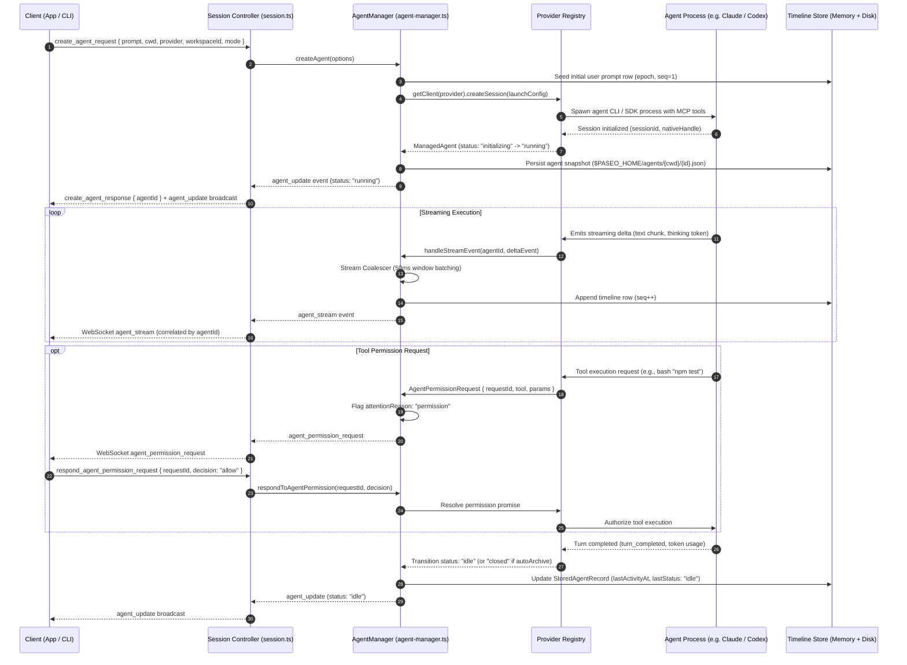
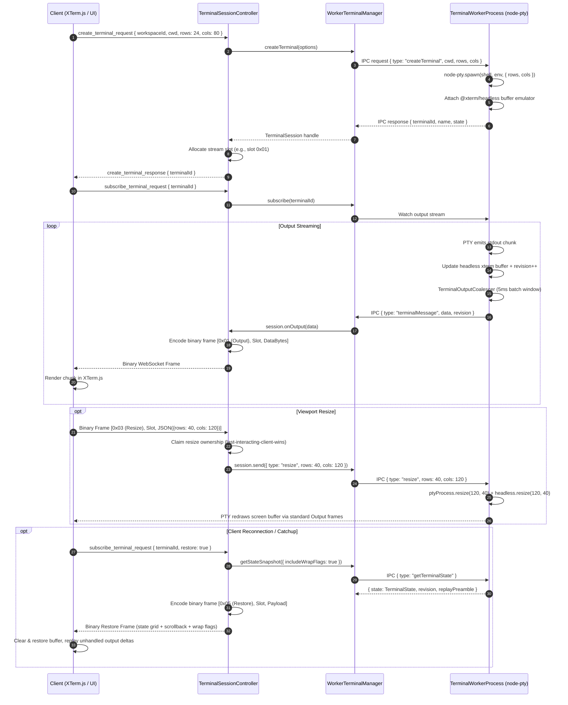
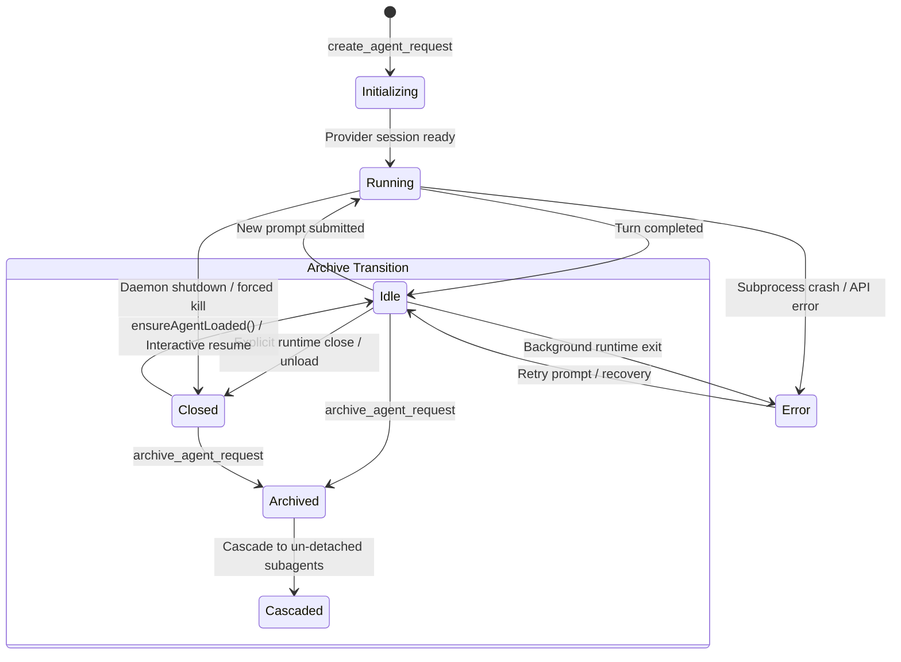

# Architectural Review: paseo

> **Target Repository**: `c:\Users\W\Documents\GitHub\OpenRemote\ref\paseo`  
> **Review Date**: August 2026  
> **Review Scope**: Complete monorepo codebase audit across the backend daemon ([`packages/server`](file:///c:/Users/W/Documents/GitHub/OpenRemote/ref/paseo/packages/server)), cross-platform frontend ([`packages/app`](file:///c:/Users/W/Documents/GitHub/OpenRemote/ref/paseo/packages/app)), wire protocol schemas ([`packages/protocol`](file:///c:/Users/W/Documents/GitHub/OpenRemote/ref/paseo/packages/protocol)), TypeScript client SDK ([`packages/client`](file:///c:/Users/W/Documents/GitHub/OpenRemote/ref/paseo/packages/client)), CLI ([`packages/cli`](file:///c:/Users/W/Documents/GitHub/OpenRemote/ref/paseo/packages/cli)), Electron desktop app ([`packages/desktop`](file:///c:/Users/W/Documents/GitHub/OpenRemote/ref/paseo/packages/desktop)), E2EE relay layer ([`packages/relay`](file:///c:/Users/W/Documents/GitHub/OpenRemote/ref/paseo/packages/relay)), Docker infrastructure ([`docker/`](file:///c:/Users/W/Documents/GitHub/OpenRemote/ref/paseo/docker)), and architectural documentation ([`docs/`](file:///c:/Users/W/Documents/GitHub/OpenRemote/ref/paseo/docs)).

---

## 1. Executive Summary

[Paseo](file:///c:/Users/W/Documents/GitHub/OpenRemote/ref/paseo/README.md) is a self-hosted, local-first platform for orchestrating, monitoring, and interacting with AI coding agents across multiple heterogeneous providers. Designed to bridge local development workstations with remote and mobile interfaces, Paseo provides a centralized daemon and unified UI that lets developers run multiple coding agents in parallel on their own hardware while monitoring and controlling them from desktop, web, iOS, Android, or terminal environments.

```
┌──────────────────────────────────────────────────────────────────────────────────┐
│                                 PASEO CLIENTS                                    │
│   ┌──────────────────┐  ┌──────────────────┐  ┌──────────────────────────────┐   │
│   │   Mobile App     │  │   Desktop App    │  │       Web Browser UI         │   │
│   │ (React Native)   │  │   (Electron)     │  │ (Bundled in Daemon / Docker) │   │
│   └────────┬─────────┘  └────────┬─────────┘  └──────────────┬───────────────┘   │
│            │                     │                           │                   │
│            │  Encrypted Relay    │   Local IPC / Direct WS   │   Direct WS / TLS │
│            │  (Curve25519)       │   (127.0.0.1:6767)        │   (0.0.0.0:6767)  │
│            └──────────────┬──────┴───────────────────────────┘                   │
└───────────────────────────┼──────────────────────────────────────────────────────┘
                            │ WebSocket Protocol (JSON RPC + Binary PTY Frames)
┌───────────────────────────▼──────────────────────────────────────────────────────┐
│                               PASEO DAEMON                                       │
│   ┌──────────────────────────────────────────────────────────────────────────┐   │
│   │ WebSocket Server & Session Controller (session.ts, websocket-server.ts)  │   │
│   └──────────────────────┬───────────────────────────┬───────────────────────┘   │
│                          │                           │                           │
│   ┌──────────────────────▼───────┐    ┌──────────────▼───────────────────────┐   │
│   │ Agent Manager                │    │ Terminal Manager & Worker Subprocess │   │
│   │ (Lifecycle, Streaming, MCP)  │    │ (node-pty, @xterm/headless buffer)   │   │
│   └──────────────┬───────────────┘    └──────────────┬───────────────────────┘   │
│                  │                                   │                           │
│   ┌──────────────▼───────────────┐    ┌──────────────▼───────────────────────┐   │
│   │ Git Worktree & Workspace Svc │    │ File Observer & Service Proxy Engine │   │
│   │ (Branch isolation & setup)   │    │ (Port mapping, health monitoring)    │   │
│   └──────────────────────────────┘    └──────────────────────────────────────┘   │
└───────────────────────────┬──────────────────────────────────────────────────────┘
                            │
┌───────────────────────────▼──────────────────────────────────────────────────────┐
│                       LOCAL AGENT EXECUTION BACKENDS                             │
│  ┌──────────────┐  ┌──────────────┐  ┌──────────────┐  ┌──────────────────────┐  │
│  │ Claude Code  │  │ OpenAI Codex │  │ GitHub Copilot│  │ OpenCode / Pi / ACP   │  │
│  │ (Anthropic)  │  │ (AppServer)  │  │ (ACP Agent)  │  │ (Local CLI / stdio)  │  │
│  └──────────────┘  └──────────────┘  └──────────────┘  └──────────────────────┘  │
└──────────────────────────────────────────────────────────────────────────────────┘
```

### Core Value Propositions
1. **Heterogeneous Multi-Agent Control Plane**: Standardizes prompt submission, turn lifecycles, structured reasoning output, tool-call approvals, and timeline persistence across diverse agent architectures including Anthropic Claude Code (SDK/CLI), OpenAI Codex (`codex-app-server`), GitHub Copilot (ACP), OpenCode, Pi, and generic ACP (Cursor, Kimi, Kiro, Trae) agents.
2. **Worktree-Isolated Multi-Session Concurrency**: Spawns multiple parallel agents in isolated Git worktrees (`$PASEO_HOME/worktrees/`), dynamically allocating isolated port ranges, executing workspace bootstrap lifecycle scripts, and auto-naming Git branches from prompt intent.
3. **Decoupled Session & Workspace Identity**: Separates opaque workspace identifiers (`wks_<hex>`) from filesystem working directories (`cwd`), allowing multiple isolated sessions to operate on identical checkouts without cross-contaminating cache layers, file-explorer states, or comment drafts.
4. **Crash-Resilient PTY Architecture**: Offloads all `node-pty` terminal instances into an isolated worker child process (`terminal-worker-process.ts`), preventing native ConPTY and Darwin `spawn-helper` segmentation faults from terminating the primary daemon.
5. **Zero-Knowledge Remote Access**: Employs an optional end-to-end encrypted relay mechanism utilizing Curve25519 ECDH key exchange and XSalsa20-Poly1305 authenticated symmetric encryption (`packages/relay`), avoiding mandatory firewall punching or port forwarding.

---

## 2. Architecture & Data Flow

Paseo is structured as an npm workspace monorepo comprising 7 primary functional packages and support layers:

```
paseo/
├── packages/
│   ├── server/       # Core daemon: WebSocket RPC, AgentManager, PTY worker, Git services
│   ├── app/          # Cross-platform client UI (Expo for iOS/Android, Web, Desktop UI)
│   ├── protocol/     # Canonical wire schemas, binary codecs, TypeScript types (Zod)
│   ├── client/       # Low-level daemon WebSocket transport & high-level PaseoClient SDK
│   ├── cli/          # Docker-style CLI commands (paseo run, ls, attach, daemon start)
│   ├── desktop/      # Electron desktop shell, login shell environment, IPC bridges
│   ├── relay/        # E2EE client/daemon channels, NaCl box cryptography, WebSocket relay
│   ├── highlight/    # Shiki-based syntax highlighting engine
│   └── plugin/       # Native plugin runtime interfaces and RPC bindings
├── docker/           # Multi-stage production container images and Compose configs
└── docs/             # Authoritative technical specifications and architectural contracts
```

### 2.1 Component Interaction Architecture

```mermaid
flowchart TB
    subgraph Client_Surfaces ["Client Surfaces"]
        EXPO["Expo App\n(iOS / Android / Web)"]
        ELECTRON["Desktop Wrapper\n(Electron BrowserWindow)"]
        CLI["Paseo CLI\n(Commander.js)"]
        SDK["TypeScript SDK\n(@getpaseo/client)"]
    end

    subgraph Transport_Layer ["Transport & Cryptography"]
        DIRECT_WS["Direct WebSocket\n(ws://127.0.0.1:6767/ws)"]
        RELAY_E2EE["Encrypted Relay Bridge\n(Curve25519 + XSalsa20-Poly1305)"]
    end

    subgraph Daemon_Core ["Paseo Daemon (@getpaseo/server)"]
        WS_SERVER["WebSocket Server\n(websocket-server.ts)"]
        SESSION_CTRL["Session Controller\n(session.ts)"]
        DIR_SYNC["Directory Sync Service\n(directory-sync/)"]
        
        subgraph Agent_Subsystem ["Agent Subsystem"]
            AGENT_MGR["Agent Manager\n(agent-manager.ts)"]
            AGENT_STOR[("Agent Storage\n$PASEO_HOME/agents/")]
            PROV_REG["Provider Registry\n(provider-registry.ts)"]
            STREAM_COAL["Stream Coalescer\n(agent-stream-coalescer.ts)"]
            MCP_CATALOG["Paseo Tool Catalog & MCP\n(agent/tools/, mcp-server.ts)"]
        end

        subgraph Terminal_Subsystem ["Terminal Subsystem"]
            TERM_SESS_CTRL["Terminal Session Controller\n(terminal-session-controller.ts)"]
            WORKER_MGR["Worker Terminal Manager\n(worker-terminal-manager.ts)"]
        end

        subgraph Workspace_Subsystem ["Workspace & Git Subsystem"]
            WS_REG[("Workspace Registry\nworkspaces.json")]
            WS_GIT_SVC["Workspace Git Service\n(workspace-git-service.ts)"]
            WORKTREE_SVC["Paseo Worktree Service\n(paseo-worktree-service.ts)"]
            SRV_PROXY["Service Proxy & Port Registry\n(service-proxy.ts)"]
        end
    end

    subgraph Isolated_Processes ["Isolated Subprocesses"]
        PTY_WORKER["Terminal Worker Process\n(node-pty + @xterm/headless)"]
        AGENT_PROCS["Agent Runtimes\n(Claude SDK, Codex AppServer, ACP)"]
    end

    EXPO --> DIRECT_WS & RELAY_E2EE
    ELECTRON --> DIRECT_WS
    CLI --> DIRECT_WS
    SDK --> DIRECT_WS & RELAY_E2EE

    DIRECT_WS --> WS_SERVER
    RELAY_E2EE --> WS_SERVER

    WS_SERVER --> SESSION_CTRL
    SESSION_CTRL --> AGENT_MGR
    SESSION_CTRL --> TERM_SESS_CTRL
    SESSION_CTRL --> WS_GIT_SVC
    SESSION_CTRL --> DIR_SYNC

    AGENT_MGR --> PROV_REG
    AGENT_MGR --> AGENT_STOR
    AGENT_MGR --> STREAM_COAL
    AGENT_MGR --> MCP_CATALOG
    PROV_REG --> AGENT_PROCS

    TERM_SESS_CTRL --> WORKER_MGR
    WORKER_MGR -->|Node IPC (Advanced Serialization)| PTY_WORKER

    WS_GIT_SVC --> WORKTREE_SVC
    WORKTREE_SVC --> WS_REG
    WORKTREE_SVC --> SRV_PROXY
```

---

### 2.2 End-to-End Sequence: Agent Creation, Execution, Tool Approval & Timeline Streaming



---

### 2.3 End-to-End Sequence: Terminal PTY Multiplexing, Binary Streaming & Snapshot Reflow



---

## 3. Core Tech Stack & Dependencies

Paseo leverages a modular Node.js and TypeScript technology stack engineered for low latency, native system execution, and strict cross-platform compatibility:

### 3.1 Stack Breakdown

| Layer | Technology | Version / Choice | Rationale & Architectural Purpose |
| :--- | :--- | :--- | :--- |
| **Runtime & Language** | **Node.js & TypeScript** | Node `v22+` / TS `5.7+` | Native support for `--experimental-strip-types`, high-throughput async I/O, strict typechecking across packages. |
| **Backend Daemon** | **Express & `ws`** | Express `4.21`, `ws` `8.18` | Lightweight HTTP routing for static web assets, `/api/health`, and high-performance WebSocket server handling multiplexed JSON and binary streams. |
| **Terminal & PTY** | **`node-pty` & `@xterm/headless`** | `node-pty` `1.2.0-beta.15`, `@xterm/headless` `5.5.0` | Native pseudoterminal allocation (ConPTY on Windows, POSIX `openpty`/`forkpty` on macOS/Linux) with server-side virtual terminal buffer emulation. |
| **Frontend Framework** | **React Native & Expo** | Expo `52.0`, React Native `0.76` (Fabric) | Single codebase targeting iOS, Android, Web (HTML5/Canvas), and Desktop (Electron). File-based navigation via `expo-router`. |
| **Desktop Wrapper** | **Electron** | Electron `33.2` | Multi-window desktop shell with native menu bar, dock integrations, and isolated guest `<webview>` instances for browser automation. |
| **Relay & Crypto** | **TweetNaCl / libsodium** | `tweetnacl` `1.0.3` | Pure JavaScript implementation of Salsa20-Poly1305 and Curve25519 ECDH key derivation for zero-knowledge E2EE relay tunnels. |
| **Wire Validation** | **Zod** | Zod `3.24` | Strict bidirectional runtime schema parsing, eliminating untyped wire payloads without runtime transformers. |
| **State Management** | **TanStack Query & Zustand** | TanStack React Query `5.62` | Partitioned caching: TanStack Query for directory-backed Git/PR queries; custom stores for workspace-owned draft/attachment state. |
| **Logging & Metrics** | **Pino** | Pino `9.6` | Ultra-low overhead JSON structured logger with rotating file appenders (`$PASEO_HOME/daemon.log`). |
| **Agent Protocols** | **Anthropic SDK & MCP SDK** | `@anthropic-ai/sdk`, `@modelcontextprotocol/sdk` | Direct native integration with Claude Code task protocols and standardized Model Context Protocol tool catalogs. |

---

## 4. Distinctive & Smart Engineering Decisions

### 4.1 Opaque Workspace Identity vs Filesystem Path Coupling
A major architectural flaw in many multi-agent tools is assuming a 1:1 mapping between a working directory (`cwd`) and a project session. Paseo deliberately decouples them:
- **`workspaceId`** is an opaque hex/UUID string (e.g., `wks_8a92f03b21c4`).
- **`cwd`** represents the exact filesystem execution path.
- **`worktreeRoot`** stores the backing Git checkout directory.

This allows multiple independent workspaces to operate on the same physical checkout without leaking UI state, expanding directory trees, or colliding review comments.

### 4.2 Right-Sidebar Cache Partitioning (Directory-Backed vs Workspace-Owned)
Paseo enforces strict partition boundaries for frontend state in [`packages/app/src/git/query-keys.ts`](file:///c:/Users/W/Documents/GitHub/OpenRemote/ref/paseo/packages/app/src/git/query-keys.ts) and [`packages/app/src/review/store.ts`](file:///c:/Users/W/Documents/GitHub/OpenRemote/ref/paseo/packages/app/src/review/store.ts):
- **Directory-Backed State** (shared across same-`cwd` workspaces): Git status, uncommitted diffs, GitHub PR tracking, and file preview caches are keyed exclusively by `(serverId, cwd)`. If two windows view the same directory, their Git diffs remain synchronized.
- **Workspace-Owned State** (isolated per workspace): Review draft comments, diff display mode overrides, composer file attachments, and file-tree expansion states are keyed strictly by `workspaceId`. Changing a file draft in Workspace A never pollutes Workspace B on the same repository folder.

### 4.3 Subagents Track vs Tab Decoupling
Managing hierarchical swarms of subagents creates severe UX friction when closing a tab deletes or orphans background tasks. In [`packages/server/src/server/agent/agent-manager.ts`](file:///c:/Users/W/Documents/GitHub/OpenRemote/ref/paseo/packages/server/src/server/agent/agent-manager.ts) and [`docs/agent-lifecycle.md`](file:///c:/Users/W/Documents/GitHub/OpenRemote/ref/paseo/docs/agent-lifecycle.md):
- **Root Agents**: Closing a root agent tab triggers an explicit archive gesture (with safety confirmation if currently running).
- **Subagents**: Closing a subagent tab is **layout-only**. The subagent remains active in memory, running in its parent's floating **Subagents Track** pill.
- **Cascade Archive**: When a parent orchestrator is archived, all non-detached subagents are recursively cascade-archived. However, if a subagent is currently open in an active tab on another client or belongs to another workspace, it is automatically **detached** into an independent root agent instead of being destroyed.



### 4.4 Journaled 2-Phase Transaction Boundary for Workspace Labels
Rather than introducing heavy SQL databases, Paseo persists data in human-readable JSON. To prevent corruption during compound mutations (e.g., renaming a label across the shared catalog and 50 workspace definitions), [`packages/server/src/server/workspace-labels/`](file:///c:/Users/W/Documents/GitHub/OpenRemote/ref/paseo/packages/server/src/server/workspace-labels) implements a journaled two-phase commit:
1. Writes before/after state snapshots to `$PASEO_HOME/projects/workspace-labels.transaction.json`.
2. Atomically writes the updated `workspace-labels.json` and `workspaces.json` files via temp-file replacement (`writeJsonFileAtomic`).
3. Updates the transaction status to `committed` before removing the journal file.
4. If the daemon crashes midway, bootstrap recovery inspects the journal and rolls back uncommitted writes before serving any WebSocket traffic.

---

## 5. Process Lifecycle & Terminal/PTY Management

### 5.1 Terminal Worker Subprocess Isolation
Terminal PTY management is notoriously crash-prone due to platform-native C++ bindings (`node-pty`), Windows ConPTY worker thread failures, and unhandled signals. Paseo isolates the entire PTY lifecycle:

```
┌────────────────────────────────────────────────────────────┐
│                    PASEO DAEMON PROCESS                    │
│  ┌──────────────────────────────────────────────────────┐  │
│  │ WorkerTerminalManager (worker-terminal-manager.ts)   │  │
│  └──────────────────────────┬───────────────────────────┘  │
└─────────────────────────────┼──────────────────────────────┘
                              │ Node IPC (Advanced Serialization)
                              │ Fork: terminal-worker-process.ts
┌─────────────────────────────▼──────────────────────────────┐
│                  TERMINAL WORKER SUBPROCESS                │
│  ┌──────────────────────────────────────────────────────┐  │
│  │ Uncaught Exception Guard (Process-level safety)      │  │
│  │ ConPTY Async Failure Trap & In-Flight Error Routing  │  │
│  └──────────────────────────┬───────────────────────────┘  │
│                             │                              │
│       ┌─────────────────────┴─────────────────────┐        │
│       │                                           │        │
│  ┌────▼─────────────────┐                   ┌─────▼─────┐  │
│  │ node-pty Spawn Engine│                   │ @xterm/   │  │
│  │ (win32 / darwin /    │                   │ headless  │  │
│  │  posix execve)       │                   │ Buffer    │  │
│  └────┬─────────────────┘                   └─────┬─────┘  │
│       │                                           │        │
│       │ Raw PTY Stream                            │ State  │
│       └─────────────────────┬─────────────────────┘ Snapshot
│                             ▼                              │
│             TerminalOutputCoalescer (5ms Window)           │
│                             │                              │
└─────────────────────────────┼──────────────────────────────┘
                              │ Batched IPC Messages
                              ▼
```

1. **Dedicated Worker Architecture**: [`createWorkerTerminalManager()`](file:///c:/Users/W/Documents/GitHub/OpenRemote/ref/paseo/packages/server/src/terminal/worker-terminal-manager.ts#L150) uses Node `child_process.fork()` to run [`terminal-worker-process.ts`](file:///c:/Users/W/Documents/GitHub/OpenRemote/ref/paseo/packages/server/src/terminal/terminal-worker-process.ts) with advanced serialization.
2. **ConPTY Uncaught Exception Trapping**: On Windows, `node-pty` spawns ConPTY on a secondary worker thread. If the spawn target is invalid, it throws an asynchronous uncatchable exception. In [`terminal-worker-process.ts:L34-L37`](file:///c:/Users/W/Documents/GitHub/OpenRemote/ref/paseo/packages/server/src/terminal/terminal-worker-process.ts#L34-L37), `process.on("uncaughtException")` intercepts the error, attributes it to the specific in-flight creation request via `inFlightTerminalCreateRequest`, rejects that creation promise, and preserves all running terminal sessions.
3. **Darwin Prebuild Executable Bit Enforcement**: In [`terminal.ts:L199-L233`](file:///c:/Users/W/Documents/GitHub/OpenRemote/ref/paseo/packages/server/src/terminal/terminal.ts#L199-L233), `ensureNodePtySpawnHelperExecutableForCurrentPlatform` dynamically locates `node-pty/build/Release/spawn-helper` and verifies execute permissions (`0o111`), patching permissions on macOS before spawn attempts.

### 5.2 Terminal Output Coalescing & Memory Backpressure
High-throughput CLI output (e.g., `find /` or running heavy test suites) can easily saturate the Node event loop and WebSocket buffers.
- **Output Coalescing**: [`TerminalOutputCoalescer`](file:///c:/Users/W/Documents/GitHub/OpenRemote/ref/paseo/packages/server/src/terminal/terminal-output-coalescer.ts) buffers raw PTY chunks into ~5ms timer windows, combining UTF-8 byte payloads and stamping the batch with the highest revision index before IPC dispatch.
- **Dual Backpressure Watermarks**:
  - **Soft Limit (4 MiB)**: When a client socket's `bufferedAmount` exceeds 4 MiB, the server throttles live delta frames and switches to snapshot catch-up mode (`resolveRestoreAfterOutputOverflow`).
  - **Hard Limit (8 MiB)**: Defined in [`websocket/physical-socket.ts:L105`](file:///c:/Users/W/Documents/GitHub/OpenRemote/ref/paseo/packages/server/src/server/websocket/physical-socket.ts#L105) (`MAX_PHYSICAL_SOCKET_BUFFERED_BYTES = 8 * 1024 * 1024`). If a delinquent socket hits 8 MiB of pending outbound buffer, the server terminates that physical socket without affecting other clients connected to the same session.

### 5.3 Git Worktree Provisioning & Lifecycle Scripts
When an agent is configured with `isolation: "worktree"`, Paseo executes an automated provisioning workflow in [`packages/server/src/server/paseo-worktree-service.ts`](file:///c:/Users/W/Documents/GitHub/OpenRemote/ref/paseo/packages/server/src/server/paseo-worktree-service.ts) and [`packages/server/src/server/worktree-bootstrap.ts`](file:///c:/Users/W/Documents/GitHub/OpenRemote/ref/paseo/packages/server/src/server/worktree-bootstrap.ts):
1. **Branch Planning**: Generates a slugified branch name (e.g., `feature/auth-provider`) or allocates a temporary placeholder.
2. **Worktree Creation**: Executes `git worktree add <path> -b <branch>` under high priority queueing (`runWithGitCommandPriority("high")`).
3. **Paseo Config Seeding**: Copies `.paseo/` settings and workspace configs from the parent checkout.
4. **Port Allocation**: [`allocateWorkspaceServicePort()`](file:///c:/Users/W/Documents/GitHub/OpenRemote/ref/paseo/packages/server/src/server/workspace-service-port-allocator.ts#L20) reserves dedicated TCP ports for workspace service scripts (e.g., dev servers on 3001, 3002).
5. **Setup Execution**: Runs bootstrap lifecycle commands defined in `paseo.json` (e.g., `npm install`), truncating stdout/stderr with middle-truncation accumulators to prevent memory bloating.
6. **Prompt-Driven Branch Auto-Naming**: If an initial prompt was provided, [`attemptFirstAgentBranchAutoName`](file:///c:/Users/W/Documents/GitHub/OpenRemote/ref/paseo/packages/server/src/server/paseo-worktree-service.ts#L153) calls lightweight LLM structured generation to convert user intent into a semantic Git branch name and renames the branch before the first commit.

---

## 6. Communication & Protocol

### 6.1 Multiplexed WebSocket Protocol & Binary Framing
Paseo runs all client-daemon communication across a single WebSocket connection that mixes JSON-RPC envelopes with custom binary frame multiplexing:

```
Top-Level WebSocket Wire Payloads
├── JSON Text Envelopes
│   ├── { type: "hello", clientId, clientType, capabilities }
│   ├── { type: "ping" } / { type: "pong" }  (10s Application Lease)
│   ├── { type: "recording_state", ... }
│   └── { type: "session", payload: SessionInboundMessage | SessionOutboundMessage }
│
└── Binary Frames (Header: [1-byte Opcode, 1-byte Slot ID] + Variable Payload)
    ├── Opcode 0x01 (Output): Raw PTY terminal output bytes
    ├── Opcode 0x02 (Input): Raw client keyboard/stdin bytes
    ├── Opcode 0x03 (Resize): JSON payload { rows: number, cols: number }
    ├── Opcode 0x04 (Snapshot): JSON payload { state: TerminalState, revision }
    ├── Opcode 0x05 (Restore): Compressed buffer state + wrap reflow metadata
    └── File Transfers: FileBegin (0x10), FileChunk (0x11, 256 KiB chunks), FileEnd (0x12)
```

In [`packages/protocol/src/binary-frames/terminal.ts`](file:///c:/Users/W/Documents/GitHub/OpenRemote/ref/paseo/packages/protocol/src/binary-frames/terminal.ts), binary terminal frames avoid JSON stringification and Base64 serialization overhead, achieving sub-millisecond terminal input/output latency.

### 6.2 Dotted RPC Namespacing & Version Drift Contract
Paseo enforces a strict RPC design contract detailed in [`docs/protocol-compatibility.md`](file:///c:/Users/W/Documents/GitHub/OpenRemote/ref/paseo/docs/protocol-compatibility.md) and [`docs/rpc-namespacing.md`](file:///c:/Users/W/Documents/GitHub/OpenRemote/ref/paseo/docs/rpc-namespacing.md):
- **RPC Naming**: All new endpoints use dotted namespaces with explicit direction suffixes: `domain.provider.operation.request` paired with `domain.provider.operation.response` (e.g., `checkout.forge.set_auto_merge.request`).
- **Wire Compatibility**: Schemas in `packages/protocol/src/messages.ts` are strictly append-only. New fields must be optional; fields are never deleted or narrowed. Wire schemas omit Zod transformers (`.transform()`, `.preprocess()`) so schemas remain pure serializers.
- **Capability Gating**: Client capabilities advertised in `hello` are retained in `Session.supports(CLIENT_CAPS.xyz)`. New protocol features are gated on capability flags rather than try-catch fallbacks.

---

## 7. Reliability, Fault Tolerance & Edge Cases

### 7.1 Concurrency Throttling & Git Token Bucket
Simultaneous agent invocations and file watcher triggers can easily spawn dozens of Git processes, causing CPU spikes and repository lock contentions. In [`packages/server/src/utils/run-git-command.ts`](file:///c:/Users/W/Documents/GitHub/OpenRemote/ref/paseo/packages/server/src/utils/run-git-command.ts):
- **Rate Limit**: Default 64 processes/second start-rate limit (token bucket burst allowance).
- **Concurrency Limit**: Default 8 maximum concurrent active Git subprocesses (`PASEO_GIT_MAX_PROCESS_CONCURRENCY`).
- **Priority Queues**: User-facing interactive operations (diffs, worktree creation) use `"high"` priority; background watcher refreshes and health checks use `"background"`.

### 7.2 Provider Session Resurrection & Replay Memory Safety
When resuming long-lived agents:
- **Residency Cleanup**: Unused agents transition to `closed` in memory (releasing provider processes) while preserving JSON records on disk. Calling `ensureAgentLoaded()` re-instantiates the runtime using the persisted `PersistenceHandle`.
- **Token Count Calculation**: In Claude SDK transcripts, intermediate turn token counts represent cached prefix sizes. Paseo avoids multiplying turn counts by taking the final assistant message context size rather than naively summing turn usage.
- **Replay Depth Pruning**: When replaying Claude subagent transcripts, Paseo filters out grandchild tasks (`spawnDepth >= 2`) that belong to nested subagent trees, preventing phantom "running forever" rows.

### 7.3 Worktree Creation Rollback Guarantee
If any stage of worktree initialization fails (e.g., branch collision, failed directory copy, script error), [`rollbackCreatedPaseoWorktree()`](file:///c:/Users/W/Documents/GitHub/OpenRemote/ref/paseo/packages/server/src/utils/worktree.js) guarantees complete atomic cleanup:
1. Kills any spawned bootstrap terminal processes.
2. Removes the allocated service port reservations.
3. Invokes `git worktree remove --force <path>`.
4. Deletes the backing Git branch if it was newly created.
5. Emits structured error diagnostics back to the requesting client.

---

## 8. Security & Sandboxing

### 8.1 Zero-Knowledge End-to-End Encrypted Relay
For remote connectivity across firewalls, Paseo provides a zero-knowledge relay transport ([`packages/relay`](file:///c:/Users/W/Documents/GitHub/OpenRemote/ref/paseo/packages/relay)):
- **Key Exchange**: During initial setup, the daemon generates a Curve25519 keypair (`$PASEO_HOME/daemon-keypair.json`, permissions `0600`). Pairing via QR code transmits the daemon's public key out-of-band to the client.
- **Encryption**: Client and daemon derive a shared secret using ECDH and encrypt all WebSocket messages with XSalsa20-Poly1305 authenticated encryption (NaCl `crypto_box`).
- **Zero Knowledge**: The relay server (e.g. `getpaseo/paseo-relay`) only inspects routing connection IDs; all payload data, terminal bytes, source code, and auth tokens remain fully opaque ciphertext.

```
┌─────────────┐       Plaintext        ┌──────────────────┐
│ Expo Mobile │ <====================> │ EncryptedChannel │
└─────────────┘                        └────────┬─────────┘
                                                │
                                                │ NaCl Box Ciphertext
                                                ▼
                                       ┌──────────────────┐
                                       │   Paseo Relay    │ (Zero-Knowledge Router)
                                       └────────┬─────────┘
                                                │
                                                │ NaCl Box Ciphertext
                                                ▼
┌─────────────┐       Plaintext        ┌──────────────────┐
│ Local Daemon│ <====================> │ EncryptedChannel │
└─────────────┘                        └──────────────────┘
```

### 8.2 Host Header Validation & DNS Rebinding Protection
In [`packages/server/src/server/hostnames.ts`](file:///c:/Users/W/Documents/GitHub/OpenRemote/ref/paseo/packages/server/src/server/hostnames.ts), incoming HTTP and WebSocket requests are strictly validated against `isHostnameAllowed()`:
- Allowed targets default to loopback addresses (`127.0.0.1`, `::1`, `localhost`).
- Rejects unauthorized DNS names with HTTP 403, preventing browser-based DNS rebinding attacks from executing local terminal commands.
- Custom deployments configure allowed host patterns via `PASEO_HOSTNAMES` or `config.json`.

### 8.3 Filesystem Boundary Enforcement
To protect the host workstation:
- **Path Traversal Guards**: Functions in [`packages/server/src/server/path-utils.ts`](file:///c:/Users/W/Documents/GitHub/OpenRemote/ref/paseo/packages/server/src/server/path-utils.ts) (`assertAbsolutePath`, `isSameOrDescendantPath`) ensure file operations, explorer listings, and file edits cannot escape the selected workspace root or project boundary.
- **Atomic File Writing**: [`writeJsonFileAtomic`](file:///c:/Users/W/Documents/GitHub/OpenRemote/ref/paseo/packages/server/src/server/atomic-file.ts) writes data to a `.tmp` sibling file before executing an atomic OS rename, avoiding partial reads and corrupted states.

### 8.4 Docker Isolation & Privilege Dropping
The production Docker environment ([`docker/base/Dockerfile`](file:///c:/Users/W/Documents/GitHub/OpenRemote/ref/paseo/docker/base/Dockerfile)):
- Builds `@getpaseo/server` and `@getpaseo/cli` into source tarballs via multi-stage packaging.
- Spawns via `tini` as init PID 1.
- Drops privileges from root to the non-root `paseo` user (`uid:gid 1000:1000`) via `gosu` in the entrypoint script.
- Restricts container access to mounted `/home/paseo` and `/workspace` volumes.

---

## 9. Flaws, Antipatterns & Gotchas

Despite its sophisticated architecture, a deep audit of the codebase reveals several technical tradeoffs, edge cases, and antipatterns:

### 9.1 The Monolithic Session Controller Antipattern
[`packages/server/src/server/session.ts`](file:///c:/Users/W/Documents/GitHub/OpenRemote/ref/paseo/packages/server/src/server/session.ts) spans **7,525 lines of code** in a single file. It acts as a massive god-object responsible for:
- WebSocket connection state
- Voice STT/TTS coordination
- Git mutation and checkout observers
- File system searches and suggestions
- Agent lifecycle and timeline projection
- Schedule execution and push notifications

*Impact*: High cognitive overhead, tight coupling between session management and domain services, and heightened regression risk during refactors.

### 9.2 File-Based JSON Storage Scaling Bottlenecks
Paseo deliberately avoids an embedded SQL engine (like SQLite) in favor of individual JSON files under `$PASEO_HOME/agents/{cwd}/{agentId}.json`.
- **Scaling Limit**: As the number of historic agent runs reaches hundreds or thousands, listing, searching, and filtering operations require traversing directories and reading hundreds of individual JSON files from disk (`AgentStorage.load()`).
- **Locking Overhead**: Atomic rename operations across hundreds of concurrent agent turns create significant filesystem I/O thrashing on Windows and network-mounted storage.

### 9.3 Unconstrained In-Memory Timeline Growth
In [`packages/server/src/server/agent/agent-timeline-store.ts`](file:///c:/Users/W/Documents/GitHub/OpenRemote/ref/paseo/packages/server/src/server/agent/agent-timeline-store.ts), active agent timelines are buffered in-memory (`InMemoryAgentTimelineStore`).
- **Memory Pressure**: Heavy coding sessions producing tens of thousands of lines of build output, tool diffs, and reasoning tokens accumulate directly in the Node.js V8 heap.
- **Mitigation**: While client-facing fetch endpoints are paginated (`limitAgentTimelineItemContent`), the daemon process retains full row objects in memory until the agent runtime is explicitly closed.

### 9.4 Subagent Fleet Sprawl Under Long-Lived Orchestrators
When an orchestrator agent spawns numerous subagents via MCP tools over days of continuous operation, subagent records accumulate indefinitely in memory and in the UI subagent track. While Paseo provides an **Archive Finished** action, provider-native subagents lack individual lifecycle control handles and must be manually purged.

---

## 10. Actionable Lessons & Takeaways for OpenRemote

Paseo offers critical architectural patterns and practical blueprints for designing **OpenRemote**:

### 1. Adopt Opaque Session IDs Keyed Separately from Filesystem CWD
*Pattern*: Never use repository path strings as primary keys for remote sessions or UI state.  
*Implementation*: Key all runtime state, comment drafts, and file explorer buffers by an opaque UUID (`sessionId`/`workspaceId`), using `cwd` strictly for process execution. This unlocks running multiple concurrent agent sessions on the same repository without UI crosstalk.

### 2. Fork PTY Processes into Dedicated Worker Subprocesses
*Pattern*: Native terminal bindings (`node-pty`) are prone to unhandled thread crashes and ConPTY aborts.  
*Implementation*: Do not run `node-pty` inside the primary API/WebSocket server process. Follow Paseo's `WorkerTerminalManager` pattern: fork a dedicated worker with Node IPC, trap `uncaughtException` to catch asynchronous ConPTY spawn failures, and throttle output via a 5ms coalescing window.

### 3. Multiplex Binary Terminal Frames Over WebSockets
*Pattern*: Base64-encoding high-speed terminal output within JSON-RPC envelopes wastes CPU and increases bandwidth by 33%.  
*Implementation*: Adopt Paseo's binary frame header layout: `[1-byte Opcode, 1-byte Slot ID, ...Payload]`. Handle terminal I/O, viewport resizes, and binary file chunks over raw ArrayBuffers while reserving JSON for control messages.

### 4. Implement Prompt-Driven Git Worktree Isolation
*Pattern*: Running autonomous agents directly in the user's primary checkout causes race conditions with active editor buffers and uncommitted files.  
*Implementation*: Automatically provision ephemeral Git worktrees for parallel agent runs. Integrate lightweight LLM structured output to auto-name feature branches from prompt intent and execute teardown/merge workflows automatically on completion.

### 5. Enforce Two-Tier Cache Scoping (Directory-Backed vs Session-Owned)
*Pattern*: Avoid cache divergence when multiple UI windows or clients observe the same workspace.  
*Implementation*: Partition the client cache: git diffs and status queries share a `(serverId, cwd)` cache key, whereas editor selections, attachments, and draft messages are strictly scoped to `(serverId, sessionId)`.

---

## 11. Key Code File Index

The following table indexes the critical architectural files in Paseo with exact functions, line ranges, and direct clickable links:

| Component | File Path | Lines | Key Symbols & Responsibilities |
| :--- | :--- | :---: | :--- |
| **Daemon Bootstrap** | [`packages/server/src/server/bootstrap.ts`](file:///c:/Users/W/Documents/GitHub/OpenRemote/ref/paseo/packages/server/src/server/bootstrap.ts) | 1,842 | `bootstrap()`, HTTP/WS server initialization, relay setup, storage mounting. |
| **WebSocket Engine** | [`packages/server/src/server/websocket-server.ts`](file:///c:/Users/W/Documents/GitHub/OpenRemote/ref/paseo/packages/server/src/server/websocket-server.ts) | 2,964 | `WebSocketServer`, connection authentication, binary routing, socket capacity guards. |
| **Session Controller** | [`packages/server/src/server/session.ts`](file:///c:/Users/W/Documents/GitHub/OpenRemote/ref/paseo/packages/server/src/server/session.ts) | 7,525 | `Session`, RPC request routing, voice integration, file search, lifecycle dispatch. |
| **Agent Manager** | [`packages/server/src/server/agent/agent-manager.ts`](file:///c:/Users/W/Documents/GitHub/OpenRemote/ref/paseo/packages/server/src/server/agent/agent-manager.ts) | 4,916 | `AgentManager`, `ManagedAgent`, state transitions, turn timeouts, timeline pagination. |
| **Agent Storage** | [`packages/server/src/server/agent/agent-storage.ts`](file:///c:/Users/W/Documents/GitHub/OpenRemote/ref/paseo/packages/server/src/server/agent/agent-storage.ts) | 442 | `AgentStorage`, atomic JSON persistence at `$PASEO_HOME/agents/{cwd}/{id}.json`. |
| **Stream Coalescer** | [`packages/server/src/server/agent/agent-stream-coalescer.ts`](file:///c:/Users/W/Documents/GitHub/OpenRemote/ref/paseo/packages/server/src/server/agent/agent-stream-coalescer.ts) | 215 | `AgentStreamCoalescer`, 50ms batching window for LLM streaming tokens. |
| **Claude Provider** | [`packages/server/src/server/agent/providers/claude/agent.ts`](file:///c:/Users/W/Documents/GitHub/OpenRemote/ref/paseo/packages/server/src/server/agent/providers/claude/agent.ts) | 5,420 | `ClaudeAgentClient`, Anthropic SDK bridge, task protocol parsing, subagent hooks. |
| **Codex Provider** | [`packages/server/src/server/agent/providers/codex-app-server-agent.ts`](file:///c:/Users/W/Documents/GitHub/OpenRemote/ref/paseo/packages/server/src/server/agent/providers/codex-app-server-agent.ts) | 6,105 | `CodexAppServerAgent`, JSONL RPC stdio driver for `codex-app-server`. |
| **OpenCode Provider**| [`packages/server/src/server/agent/providers/opencode-agent.ts`](file:///c:/Users/W/Documents/GitHub/OpenRemote/ref/paseo/packages/server/src/server/agent/providers/opencode-agent.ts) | 4,680 | `OpenCodeAgent`, HTTP REST and WebSocket/SSE client for OpenCode daemon. |
| **ACP Generic Adapter**| [`packages/server/src/server/agent/providers/acp-agent.ts`](file:///c:/Users/W/Documents/GitHub/OpenRemote/ref/paseo/packages/server/src/server/agent/providers/acp-agent.ts) | 3,340 | `AcpAgentClient`, Agent Client Protocol adapter for Cursor, Kimi, Kiro, Trae. |
| **Terminal Worker Mgr**| [`packages/server/src/terminal/worker-terminal-manager.ts`](file:///c:/Users/W/Documents/GitHub/OpenRemote/ref/paseo/packages/server/src/terminal/worker-terminal-manager.ts) | 864 | `createWorkerTerminalManager`, child process forking, IPC request/response router. |
| **Terminal Subprocess**| [`packages/server/src/terminal/terminal-worker-process.ts`](file:///c:/Users/W/Documents/GitHub/OpenRemote/ref/paseo/packages/server/src/terminal/terminal-worker-process.ts) | 351 | Worker entrypoint, `node-pty` spawn, ConPTY uncaught exception isolation. |
| **Terminal Controller**| [`packages/server/src/terminal/terminal-session-controller.ts`](file:///c:/Users/W/Documents/GitHub/OpenRemote/ref/paseo/packages/server/src/terminal/terminal-session-controller.ts) | 1,096 | `TerminalSessionController`, binary frame encoding, resize ownership, backpressure. |
| **Terminal Binary Codec**| [`packages/protocol/src/binary-frames/terminal.ts`](file:///c:/Users/W/Documents/GitHub/OpenRemote/ref/paseo/packages/protocol/src/binary-frames/terminal.ts) | 133 | `encodeTerminalStreamFrame`, `decodeTerminalStreamFrame`, opcode definitions. |
| **Worktree Service** | [`packages/server/src/server/paseo-worktree-service.ts`](file:///c:/Users/W/Documents/GitHub/OpenRemote/ref/paseo/packages/server/src/server/paseo-worktree-service.ts) | 278 | `createPaseoWorktree`, branch planning, config seeding, prompt-driven auto-naming. |
| **Worktree Bootstrap** | [`packages/server/src/server/worktree-bootstrap.ts`](file:///c:/Users/W/Documents/GitHub/OpenRemote/ref/paseo/packages/server/src/server/worktree-bootstrap.ts) | 1,058 | `spawnWorkspaceScript`, lifecycle command execution, middle-truncation accumulators. |
| **Git Command Engine** | [`packages/server/src/utils/run-git-command.ts`](file:///c:/Users/W/Documents/GitHub/OpenRemote/ref/paseo/packages/server/src/utils/run-git-command.ts) | 530 | `runGitCommand`, token-bucket rate limiter, concurrency throttling, priority queues. |
| **E2EE Encrypted Ch** | [`packages/relay/src/encrypted-channel.ts`](file:///c:/Users/W/Documents/GitHub/OpenRemote/ref/paseo/packages/relay/src/encrypted-channel.ts) | 586 | `EncryptedChannel`, Curve25519 key exchange, XSalsa20-Poly1305 NaCl box cipher. |
| **Daemon Client SDK** | [`packages/client/src/daemon-client.ts`](file:///c:/Users/W/Documents/GitHub/OpenRemote/ref/paseo/packages/client/src/daemon-client.ts) | 5,120 | `DaemonClient`, WebSocket transport driver, RPC request correlation, auto-reconnect. |
| **Desktop Main Shell** | [`packages/desktop/src/main.ts`](file:///c:/Users/W/Documents/GitHub/OpenRemote/ref/paseo/packages/desktop/src/main.ts) | 1,025 | Electron `main.ts`, multi-window manager, daemon supervisor, sandboxed webview bridge. |
| **Docker Base Build** | [`docker/base/Dockerfile`](file:///c:/Users/W/Documents/GitHub/OpenRemote/ref/paseo/docker/base/Dockerfile) | 106 | Multi-stage Node 22 build, `tini` init, `gosu` non-root privilege dropping. |
