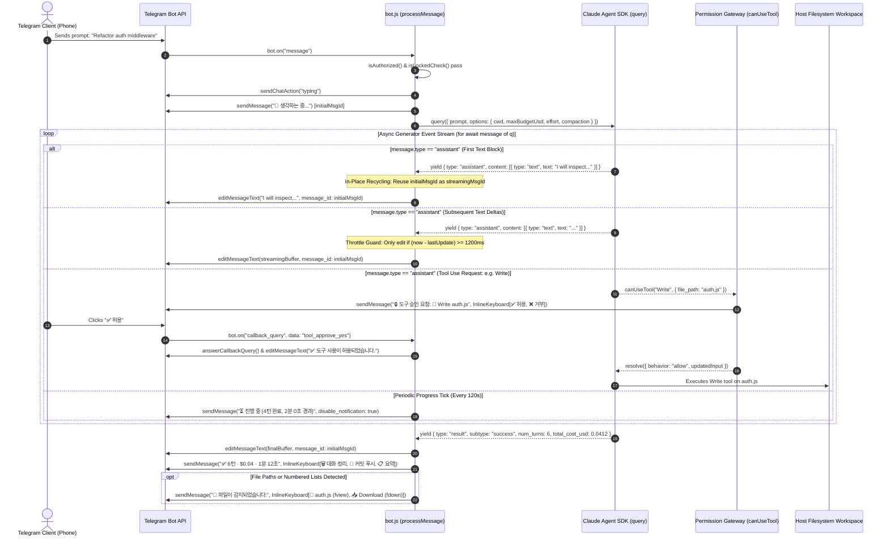
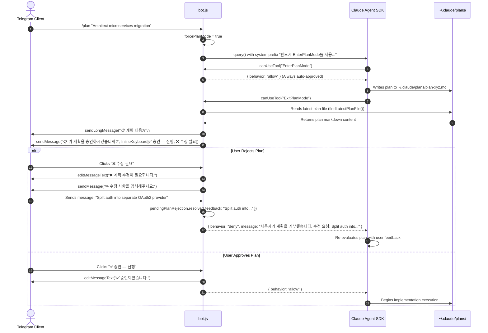
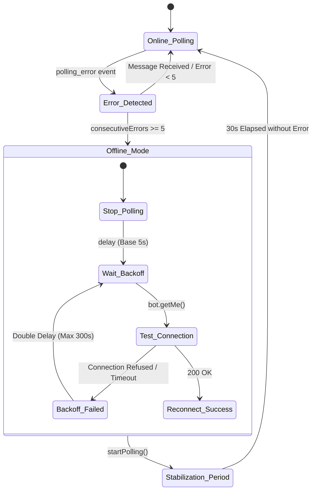

# Architectural Review: remote-cli

> **Target Repository**: `c:\Users\W\Documents\GitHub\OpenRemote\ref\remote-cli`  
> **Review Date**: August 2026  
> **Codebase Size**: 7,688 LOC across 14 source files (JavaScript, C#, Batch, Markdown)  
> **Review Scope**: Complete codebase audit ([`bot.js`](file:///c:/Users/W/Documents/GitHub/OpenRemote/ref/remote-cli/bot.js), [`commands.js`](file:///c:/Users/W/Documents/GitHub/OpenRemote/ref/remote-cli/commands.js), [`config.js`](file:///c:/Users/W/Documents/GitHub/OpenRemote/ref/remote-cli/config.js), [`utils.js`](file:///c:/Users/W/Documents/GitHub/OpenRemote/ref/remote-cli/utils.js), [`i18n.js`](file:///c:/Users/W/Documents/GitHub/OpenRemote/ref/remote-cli/i18n.js), [`launcher.cs`](file:///c:/Users/W/Documents/GitHub/OpenRemote/ref/remote-cli/launcher.cs), [`restart-control.js`](file:///c:/Users/W/Documents/GitHub/OpenRemote/ref/remote-cli/restart-control.js), [`mail-trigger.js`](file:///c:/Users/W/Documents/GitHub/OpenRemote/ref/remote-cli/mail-trigger.js), [`mailer.js`](file:///c:/Users/W/Documents/GitHub/OpenRemote/ref/remote-cli/mailer.js), [`law-launcher.cs`](file:///c:/Users/W/Documents/GitHub/OpenRemote/ref/remote-cli/law-launcher.cs), [`law-bot/law-bot.js`](file:///c:/Users/W/Documents/GitHub/OpenRemote/ref/remote-cli/law-bot/law-bot.js), [`law-bot/law-session.js`](file:///c:/Users/W/Documents/GitHub/OpenRemote/ref/remote-cli/law-bot/law-session.js), [`law-bot/law-tools.js`](file:///c:/Users/W/Documents/GitHub/OpenRemote/ref/remote-cli/law-bot/law-tools.js), [`package.json`](file:///c:/Users/W/Documents/GitHub/OpenRemote/ref/remote-cli/package.json)).

---

## 1. Executive Summary

### 1.1 Purpose and Core Mission
[`remote-cli`](file:///c:/Users/W/Documents/GitHub/OpenRemote/ref/remote-cli/README.md) (package name: `claude-telegram-remote`) is a full-featured, persistent remote control bridge that links mobile/desktop Telegram clients directly to Anthropic's **Claude Code CLI** engine on a host workstation. 

Unlike Anthropic's official browser-based *Claude Code Remote Control* feature (introduced Feb 2026)—which requires an existing interactive terminal session to remain open on the host machine—`remote-cli` is architected as an **always-on, headless background daemon**. It provides autonomous session initialization, real-time response streaming, structured tool-permission firewalls, interactive plan-mode reviews, live cloud-tunneled web/GUI previews, voice transcription, and multi-channel out-of-band recovery mechanisms.

```
+-------------------+       Telegram MTProto / HTTPS        +-------------------------+
|  Telegram Client  | <===================================> |   Telegram Bot API      |
| (iOS/Android/Web) |                                       +------------+------------+
+-------------------+                                                    | Long Polling
                                                                         v
+-------------------------------------------------------------------------------------+
| Host Workstation (Windows Daemon)                                                   |
|                                                                                     |
|  +-------------------------------------------------------------------------------+  |
|  | C# Tray Launcher Watchdog (launcher.exe / launcher.cs)                        |  |
|  | - Single-instance Mutex    - Auto-start Registry    - Self-recompiling Hotload|  |
|  | - Watchdog Supervision     - Exit-code dispatch     - PowerSuspend Detection  |  |
|  +---------------------------------------+---------------------------------------+  |
|                                          | Spawns & Supervises                      |
|                                          v                                          |
|  +-------------------------------------------------------------------------------+  |
|  | Node.js Bridge Daemon (bot.js / commands.js)                                  |  |
|  | - Telegram Event Handlers  - Throttled In-Place Stream - 2-Step PIN Lock      |  |
|  | - Tool Permission Firewall - Telegram-to-SDK Bridge   - Path Traversal Guard  |  |
|  | - Telegraph Long Spillover - Natural Lang Directory    - Dead-Man's Switch     |  |
|  +-------------------+-----------------------------------+-----------------------+  |
|                      |                                   |                          |
|         Async Query  | Generator            HTTP Tunnel  | Express Static           |
|                      v                                   v                          |
|  +---------------------------------------+   +-----------------------------------+  |
|  | @anthropic-ai/claude-agent-sdk        |   | Cloudflared Quick Tunnel          |  |
|  | - Native Agent Tool Execution         |   | - HTML Live Preview (Port 18923)  |  |
|  | - Context Compaction & Budget Guards  |   | - Web Restart Portal (Port 18925) |  |
|  | - Subprocess Tool Handlers (Bash/Edit)|   +-----------------------------------+  |
|  +---------------------------------------+                                          |
+-------------------------------------------------------------------------------------+
```

### 1.2 Architectural Paradigm: SDK-Native Bridge vs. PTY Multiplexing
A defining engineering choice in `remote-cli` is its architectural paradigm: **Native Agent SDK IPC Streaming** rather than **Virtual Pseudo-Terminal (PTY) Multiplexing**.

| Architectural Dimension | PTY Multiplexing Bridge (e.g. ConPTY / node-pty) | `remote-cli` SDK-Native Bridge |
|---|---|---|
| **Underlying Mechanism** | Allocates Windows ConPTY / Linux master-slave PTY pair, pipes raw byte stream. | Imports `@anthropic-ai/claude-agent-sdk`, consumes structured async generator events. |
| **Output Representation** | Raw VT100 / ANSI escape sequences, screen redraws, cursor jumps. | Structured semantic event stream (`text`, `tool_use`, `result`, `system`). |
| **Terminal Desynchronization** | High risk: dropped packets or window resizes corrupt line-wrap and alternate buffer. | Zero risk: no VT escape sequence parsing needed; discrete message updates. |
| **Tool Permission Control** | Fragile: requires scraping stdout for regex prompts (`[y/N]`) and injecting STDIN. | Robust: direct `canUseTool` interception hook receiving tool name, parameters, and abort signal. |
| **Interactive UX on Mobile** | Emulated terminal keyboard or raw string injection. | Native Telegram Inline Keyboards, buttons, file download actions, and voice memos. |

---

## 2. Architecture & Data Flow

The project is structured into three primary operational tiers:
1. **Supervisor Tier**: The C# Windows Forms Launcher ([`launcher.cs`](file:///c:/Users/W/Documents/GitHub/OpenRemote/ref/remote-cli/launcher.cs)), maintaining single-instance mutexes, registry boot persistence, and watchdog loop restarts.
2. **Daemon & Ingestion Tier**: The Node.js core engine ([`bot.js`](file:///c:/Users/W/Documents/GitHub/OpenRemote/ref/remote-cli/bot.js) & [`commands.js`](file:///c:/Users/W/Documents/GitHub/OpenRemote/ref/remote-cli/commands.js)), implementing the Telegram bot polling loop, command dispatcher, permission gateway, and throttled streaming buffers.
3. **Execution & Cloud Tier**: The `@anthropic-ai/claude-agent-sdk` integration running agentic loops, paired with `cloudflared` tunnels for live HTML preview and out-of-band administrative webhooks.

### 2.1 System Component Architecture

```mermaid
flowchart TB
    subgraph Telegram_Cloud ["Telegram Cloud Infrastructure"]
        TG_API["Telegram Bot API\n(Long Polling / Webhook)"]
        TG_CLIENT["Mobile / Desktop Telegram Client"]
        TG_CLIENT <--> TG_API
    end

    subgraph Host_Machine ["Windows Host Workstation"]
        subgraph Supervisor_Tier ["Tier 1: C# Watchdog & Supervisor (launcher.cs)"]
            MUTEX["Single-Instance Mutex\n(ClaudeTelegramBot_SingleInstance)"]
            TRAY["System Tray Icon & Context Menu"]
            WATCHDOG["Watchdog Supervision Loop\n(Timer 2000ms: ExitCode 82/83)"]
            REBUILD["Self-Recompilation Engine\n(csc.exe -> _rebuild.bat)"]
            REGISTRY["Auto-Start Registry Handler\n(HKCU/Software/Microsoft/Windows/CurrentVersion/Run)"]
            POWER["PowerMode / Session Monitor\n(SystemEvents Pause/Resume)"]
        end

        subgraph Daemon_Tier ["Tier 2: Node.js Core Bridge Daemon (bot.js)"]
            LOCK["PID Lockfile Guard\n(bot.lock)"]
            STATE[("State Store\nbot-state.json")]
            AUTH_GW{"Authorization\n& PIN Guard"}
            CMD_ROUTER["Command Router\n(commands.js)"]
            PERM_GW{"Tool Permission\nGateway (canUseTool)"}
            STREAM_BUF["Throttled Stream Buffer\n(1200ms Debouncer)"]
            PREVIEW_ENG["Preview & GUI Engine\n(Smart Script / Screenshot)"]
            HEALTH["Dead-Man's Switch\n(Healthcheck Ping Loop)"]
            CRON["Node-Cron Scheduler\n(20 Task Capacity)"]
        end

        subgraph Execution_Tier ["Tier 3: Claude Code Agent Engine"]
            SDK["@anthropic-ai/claude-agent-sdk\n(query() Async Generator)"]
            PROJ_SESS[("~/.claude/projects/\nSession JSONL Store")]
            PLAN_STORE[("~/.claude/plans/\nPlan Markdown Store")]
            FS_TARGET["Host Filesystem / Target Workspace"]
        end

        subgraph Out_Of_Band ["Tier 4: Auxiliary & Recovery Services"]
            EXPRESS_PREVIEW["Express Static Server\n(Port 18923)"]
            CF_PREVIEW["Cloudflared Quick Tunnel\n(HTML Live Preview)"]
            EXPRESS_RESTART["Express Webhook/Restart\n(Port 18925)"]
            CF_RESTART["Cloudflared Secret Restart Tunnel"]
            IMAP_TRIGGER["IMAPflow Mail Monitor\n(Port 993 Gmail Listener)"]
            SMTP_MAILER["Nodemailer Alert Dispatcher\n(Port 465 SMTP)"]
        end
    end

    subgraph External_APIs ["External Cloud Services"]
        HEALTHCHECKS["Healthchecks.io\n(Dead-Man's Switch Alert)"]
        OPENAI_WHISPER["OpenAI Whisper API\n(Audio Transcription)"]
        TELEGRAPH["Telegraph API\n(Instant View Long-Spillover)"]
    end

    %% Wiring
    TG_API <-->|Polling Updates| Daemon_Tier
    WATCHDOG -->|Spawns & Monitors| Daemon_Tier
    AUTH_GW -->|Valid User & PIN OK| CMD_ROUTER
    CMD_ROUTER -->|Execute Prompt| SDK
    SDK -->|Tool Call Event| PERM_GW
    PERM_GW <-->|Inline Keyboard Approval| TG_API
    SDK -->|Text Deltas| STREAM_BUF
    STREAM_BUF -->|editMessageText| TG_API
    STREAM_BUF -.->|Long Text Spillover| TELEGRAPH
    Daemon_Tier <--> STATE
    SDK <--> PROJ_SESS
    SDK <--> PLAN_STORE
    SDK <--> FS_TARGET
    PREVIEW_ENG <--> EXPRESS_PREVIEW
    EXPRESS_PREVIEW <--> CF_PREVIEW
    CF_PREVIEW --> TG_API
    HEALTH -->|GET Ping / Fail| HEALTHCHECKS
    Daemon_Tier -->|Transcribe Voice| OPENAI_WHISPER
    IMAP_TRIGGER -->|Receive Remote Trigger| WATCHDOG
    EXPRESS_RESTART <--> CF_RESTART
    EXPRESS_RESTART -->|Restart Hook| WATCHDOG
    Daemon_Tier -->|Crash / Down Alert| SMTP_MAILER
```



---

### 2.2 End-to-End Sequence: Prompt Processing & In-Place Streaming

The diagram below illustrates the complete lifecycle of a user prompt, detailing the **initial message recycling pattern**, **throttled streaming deltas**, **interactive tool approval**, and **completion statistics dispatch**.



---

### 2.3 Interactive Plan Mode & Rejection Flow

When Plan Mode is invoked via `/plan` or an autonomous agent decision, `remote-cli` intercepts `EnterPlanMode` and `ExitPlanMode` tool calls, reads the newly generated markdown plan file from disk, and provides a structured feedback loop.



---

## 3. Core Tech Stack & Dependencies

```
+-----------------------------------------------------------------------------------------------+
| Runtime Environments                                                                          |
|   ├── Node.js Engine: v20.x / v22.x (x64)                                                     |
|   └── .NET Framework: v4.0.30319 / C# 5.0 (WinForms Native Subsystem)                         |
+-----------------------------------------------------------------------------------------------+
| Production NPM Dependencies                                                                   |
|   ├── @anthropic-ai/claude-agent-sdk (^0.2.92)  ──> Agentic IPC stream, tool hooks, compaction|
|   ├── node-telegram-bot-api         (^0.66.0)   ──> MTProto long polling, inline UI, files    |
|   ├── cloudflared                   (^0.7.1)    ──> Embedded Cloudflare Quick Tunnel binary   |
|   ├── express                       (^4.21.2)   ──> Static preview server & Webhook gateway   |
|   ├── openai                        (^4.104.0)  ──> Whisper audio transcription client        |
|   ├── node-cron                     (^4.2.1)    ──> In-memory cron task orchestration         |
|   ├── imapflow                      (^1.4.7)    ──> TLS IMAP client for email dead-man triggers|
|   ├── nodemailer                    (^9.0.3)    ──> SMTP alert dispatcher                     |
|   └── dotenv                        (^16.4.7)   ──> Environment variable parsing              |
+-----------------------------------------------------------------------------------------------+
| Build & Distribution Tooling                                                                  |
|   ├── @yao-pkg/pkg                  (^6.14.0)   ──> Standalone Node binary bundler            |
|   └── Microsoft csc.exe             (v4.0)      ──> Windows native C# compiler                |
+-----------------------------------------------------------------------------------------------+
```

### 3.1 Dependency Breakdown & System Role

1. **[`@anthropic-ai/claude-agent-sdk`](file:///c:/Users/W/Documents/GitHub/OpenRemote/ref/remote-cli/package.json#L18)** (`v0.2.92`):  
   Provides high-level programmatic invocation of the Claude Code core engine. It manages headless subprocess spawning, context compaction (`CONFIG.COMPACTION_THRESHOLD = 100000`), budget ceiling enforcement (`maxBudgetUsd`), reasoning effort adjustments (`effort: "low" | "medium" | "high" | "max"`), and granular tool interception callbacks (`canUseTool`).
2. **[`node-telegram-bot-api`](file:///c:/Users/W/Documents/GitHub/OpenRemote/ref/remote-cli/package.json#L24)** (`v0.66.0`):  
   Handles Telegram Bot API communications over HTTPS long-polling. Manages command handlers (`bot.onText`), inline button callbacks (`bot.on("callback_query")`), file uploads/downloads (`bot.getFile`, `downloadTelegramFile`), and chat action indicators.
3. **[`cloudflared`](file:///c:/Users/W/Documents/GitHub/OpenRemote/ref/remote-cli/package.json#L19)** (`v0.7.1`):  
   Automates downloading and running the Cloudflare Tunnel daemon (`cloudflared.exe`). Generates ephemeral, secure, public HTTPS URLs (`https://*.trycloudflare.com`) without opening host router firewall ports or requiring fixed DNS records.
4. **[`express`](file:///c:/Users/W/Documents/GitHub/OpenRemote/ref/remote-cli/package.json#L21)** (`v4.21.2`):  
   Serves two local endpoints:
   - Port 18923: Serves working directory static assets for HTML live preview.
   - Port 18924 / 18925: Ingests automated external webhook triggers and emergency web-based restart tokens.
5. **[`openai`](file:///c:/Users/W/Documents/GitHub/OpenRemote/ref/remote-cli/package.json#L26)** (`v4.104.0`):  
   Powers voice-to-text functionality. When Telegram sends an `.ogg` Opus audio message, the bot pipes it to OpenAI's `whisper-1` model, converting speech into a text prompt.
6. **[`imapflow`](file:///c:/Users/W/Documents/GitHub/OpenRemote/ref/remote-cli/package.json#L22)** (`v1.4.7`) & **[`nodemailer`](file:///c:/Users/W/Documents/GitHub/OpenRemote/ref/remote-cli/package.json#L25)** (`v9.0.3`):  
   Forms the out-of-band email control plane. `imapflow` checks IMAP Gmail inboxes for recovery commands (`MAINBOT RESTART`), while `nodemailer` sends alerts when service degradation is detected.

---

## 4. Distinctive & Smart Engineering Decisions

### 4.1 "In-Place Message Recycling" UI Pattern
In chat-based remote terminals, sending repeated messages for status updates creates notification spam and clutters the conversation. Conversely, deleting and re-sending messages creates visual flickering.

`remote-cli` solves this with an **in-place message recycling lifecycle** ([`bot.js:L785-L958`](file:///c:/Users/W/Documents/GitHub/OpenRemote/ref/remote-cli/bot.js#L785-L958)):
1. **Immediate Feedback**: The moment a user sends a prompt, the bot immediately dispatches `🤔 생각하는 중...` and records `initialMsgId`.
2. **First Chunk Transformation**: When the SDK emits the first text block, the bot transforms `initialMsgId` into the active streaming output container via `editMessageText`, eliminating the initial message.
3. **Throttled Streaming**: Subsequent text deltas are appended to `streamingBuffer` and flushed to `editMessageText` only when `(Date.now() - lastStreamUpdate) >= CONFIG.STREAMING_THROTTLE` (1200ms).
4. **Tool Transition**: If a tool starts executing, the text is frozen, and the same message ID is updated to display tool progress (e.g., `📖 Read auth.js`), unless `currentVerbosity === 2` (detailed mode), which creates structured audit logs.

### 4.2 64-Byte Telegram `callback_data` Bypass via In-Memory ID Map
The Telegram Bot API strictly limits inline button `callback_data` payloads to **64 bytes**. Absolute file paths on Windows (e.g., `C:\Users\Administrator\Documents\Projects\OpenRemote\server\auth\middleware.js`) routinely exceed this limit.

`remote-cli` implements a bidirectionally mapped ID registry ([`utils.js:L117-L129`](file:///c:/Users/W/Documents/GitHub/OpenRemote/ref/remote-cli/utils.js#L117-L129)):
```javascript
const pathIdMap = new Map();
let pathIdCounter = 0;

function registerPath(filePath) {
  const id = String(++pathIdCounter);
  pathIdMap.set(id, filePath);
  return id;
}

function lookupPath(id) {
  return pathIdMap.get(id) || null;
}
```
Button callback payloads are compacted to `fview_12`, `fdown_12`, or `del_yes_12` (less than 12 bytes), completely preventing Telegram 64-byte payload rejection errors.

### 4.3 Multi-Tier Dead-Man's Switch & Out-of-Band Recovery Mesh
Workstations running background automation bots frequently experience sleep-state suspension, Wi-Fi reconnection latency, or hung polling sockets. `remote-cli` implements a **4-tier recovery mesh**:

```
+----------------------------------------------------------------------------------------+
| Level 1: In-Process Healthcheck Loop (Dead-Man's Switch)                               |
|   - Sends periodic HTTP GET ping to Healthchecks.io every 60s                          |
|   - Actively tests socket health via bot.getMe() with 10s timeout                       |
|   - Consecutive failures >= 2 -> Actively stops & restarts polling loop                |
+----------------------------------------------------------------------------------------+
| Level 2: C# Watchdog Supervisor (launcher.cs)                                          |
|   - Monitors child Node.js PID every 2000ms                                            |
|   - Handles exit code 82 (user requested restart) -> Clean restart                     |
|   - Handles exit code 83 (uncaughtException crash) -> Damped auto-restart (max 5/2min)|
|   - Handles exit code 1 (mutex/lock collision) -> Halts without cascading spam         |
+----------------------------------------------------------------------------------------+
| Level 3: Out-of-Band Cloudflared Web Restart Portal (restart-control.js)               |
|   - Exposes high-entropy token URL via ephemeral Cloudflare tunnel:                     |
|     https://random-subdomain.trycloudflare.com/restart/main/<token>                    |
|   - Clicking the URL triggers process.exit(82), forcing the C# supervisor to restart   |
+----------------------------------------------------------------------------------------+
| Level 4: IMAPflow Mail-Trigger Watcher (mail-trigger.js)                               |
|   - Polls IMAP Gmail inbox every 120s over secure TLS (Port 993)                       |
|   - Authenticates sender against RESTART_EMAIL_FROM whitelist                          |
|   - Detects subject "MAINBOT RESTART" -> Triggers process.exit(82)                     |
+----------------------------------------------------------------------------------------+
```

### 4.4 Smart GUI vs. Console Detection with Win32 Screenshot Capture
When a user requests execution of a script or binary via `/preview run.py` or `/preview app.exe`, the bot cannot predict whether the target is a console script or a GUI application (e.g. Tkinter, PyQt, WinForms).

`remote-cli` implements a **3-second dynamic probe** ([`bot.js:L1152-L1178`](file:///c:/Users/W/Documents/GitHub/OpenRemote/ref/remote-cli/bot.js#L1152-L1178)):
1. Spawns the child process via `child_process.exec`.
2. Sets a 3000ms detection timer (`CONFIG.SCRIPT_GUI_DETECT_MS`).
3. If the process exits within 3 seconds, it is classified as a **CLI utility**, and stdout/stderr are returned as a monospace codeblock.
4. If the process is still running after 3 seconds, it is classified as a **GUI window**:
   - Executes an embedded PowerShell script invoking Win32 `SetForegroundWindow` and `ShowWindow(SW_RESTORE)` to bring the window to the front.
   - Captures the primary screen using .NET `System.Drawing.Graphics.CopyFromScreen`.
   - Sends the screenshot to Telegram accompanied by an inline `🛑 Kill Process` button tracking `previewChildPid`.

```
[Target Script Executed]
          │
          ├── Exits in < 3000ms ──> [CLI Mode] ──> Capture stdout/stderr ──> Send Codeblock
          │
          └── Alive at 3000ms   ──> [GUI Mode] ──> Win32 SetForegroundWindow
                                                   │
                                                   └── Take Screenshot ──> Send Photo + "Kill PID" Button
```

### 4.5 Natural Language Directory Resolution
The `/setdir` handler integrates a fuzzy matching heuristic tuned for Korean and English developer workstations ([`utils.js:L189-L316`](file:///c:/Users/W/Documents/GitHub/OpenRemote/ref/remote-cli/utils.js#L189-L316)):
- Filters 35+ Korean postfixes and verbal stopwords (`"에"`, `"에서"`, `"으로"`, `"폴더"`, `"프로젝트"`, `"이동해줘"`).
- Normalizes system folders across OneDrive paths (e.g. `C:\Users\W\OneDrive\바탕 화면` vs `C:\Users\W\Desktop`).
- Computes Levenshtein edit distances against filesystem entries, matching inputs like `"오픈리모트 폴더로 가자"` to `C:\Users\W\Documents\GitHub\OpenRemote`.

### 4.6 Zero-Cold-Start Warm Session Pooling & Spare Pipeline
In the companion legal engine ([`law-bot/law-session.js`](file:///c:/Users/W/Documents/GitHub/OpenRemote/ref/remote-cli/law-bot/law-session.js)), cold-starting the Claude Code subprocess incurs a ~10-second initialization penalty. `remote-cli` eliminates this via an **asynchronous iterator streaming queue**:
- `makeInputQueue()` implements an async iterator `{ next(), push(msg), end() }`.
- The SDK query is initialized with `prompt: input.iterable`, keeping the underlying Node.js worker and model context warm in the background.
- A pre-warmed **"spare" session** is continuously prepared. When a user sends their first message, the spare session is instantly claimed, and a new background spare is created asynchronously.

---

## 5. Process Lifecycle & Terminal/PTY Management

### 5.1 Why Headless SDK IPC Was Chosen Over PTY Allocation
When building remote CLI interfaces, engineers frequently default to allocating a virtual pseudo-terminal (such as `node-pty` using Windows ConPTY or Linux `/dev/pts`). While essential for arbitrary interactive TUI programs (e.g., `vim`, `htop`, `nano`), PTY allocation introduces severe architectural overhead when interacting with AI coding agents:

```
[Conventional PTY Approach]
Host Terminal <== ConPTY ==> VT100 Escape Sequences ==> Terminal Emulator (xterm.js) ==> Canvas/DOM

[remote-cli SDK IPC Approach]
Claude Agent Core <== Async Generator IPC ==> Structured Semantic Events ==> Native Telegram Widgets
```

By leveraging `@anthropic-ai/claude-agent-sdk`, `remote-cli` bypasses the entire class of PTY-related complexities:
- **No VT100 / ANSI Escape Code Stripping**: Output arrives as pristine markdown text rather than fragmented byte streams with cursor positioning escapes (`\x1b[2J`, `\x1b[H`).
- **No Terminal Window Dimensions / SIGWINCH Propagation**: Because output is structured text and interactive buttons rather than fixed-width terminal grids, there is no risk of line-wrapping artifacts or split Unicode characters when viewing on mobile screens.
- **No Raw Mode Stdin Multiplexing**: Tool permissions and options are answered via discrete API callbacks (`canUseTool`) rather than injecting raw ASCII bytes (`y\n`) into a shared stdin pipe.

### 5.2 Subprocess Sanitation & `CLAUDECODE` Unlinking
When Node.js spawns a Claude Code subprocess from within an existing Claude or developer environment, child processes inherit environment variables. Claude Code checks `process.env.CLAUDECODE` to prevent infinite nested sessions.

[`bot.js:L2`](file:///c:/Users/W/Documents/GitHub/OpenRemote/ref/remote-cli/bot.js#L2) explicitly neutralizes this restriction:
```javascript
require("dotenv").config();
delete process.env.CLAUDECODE; // Prevents SDK nested session detection error
```

### 5.3 AbortController Cancellation Lifecycle
When a user executes `/cancel` ([`bot.js:L1683-L1698`](file:///c:/Users/W/Documents/GitHub/OpenRemote/ref/remote-cli/bot.js#L1683-L1698)), cancellation is propagated through standard web `AbortController` primitives:
1. `currentAbortController.abort()` triggers the SDK query abort signal.
2. The active tool approval Promise listener (`signal.addEventListener("abort", onAbort)`) immediately rejects with `"취소됨"`.
3. The underlying agent loop cleanly halts tool subprocesses without leaving orphaned worker threads.

### 5.4 Windows Process Management & Exit Code Semantics
The Node.js daemon and C# supervisor communicate state transitions using strict **Exit Code Semantics**:

| Exit Code | Semantic Meaning | Supervisor Action ([`launcher.cs:L320-L364`](file:///c:/Users/W/Documents/GitHub/OpenRemote/ref/remote-cli/launcher.cs#L320-L364)) |
|---|---|---|
| **`0`** | Clean voluntary shutdown (`SIGINT`, `SIGTERM`, `/quit`). | Launcher terminates cleanly, removes tray icon, exits. |
| **`1`** | Fatal error / Lock collision / 409 Polling Conflict. | Launcher halts restarts to prevent infinite loops and Telegram rate limits. |
| **`2`** | Configuration missing (Token not set in `.env`). | Launcher opens the interactive `.env` configuration GUI dialog. |
| **`82`** | Normal restart requested (via `/restart`, Webhook, or IMAP). | Launcher kills stale PIDs, re-reads `.env`, and restarts `node bot.js`. |
| **`83`** | Unexpected crash (`uncaughtException`). | Launcher increments crash counter; auto-restarts up to 5 times per 120s before pausing. |

---

## 6. Communication & Protocol

### 6.1 Framing & Streaming Protocol Comparison

```
+-----------------------------------------------------------------------------------------------+
| Ingestion Protocol: Telegram Bot API MTProto                                                  |
|   - Transport: HTTPS Long Polling (getUpdates) / JSON payloads                                |
|   - Update Rate: Unbounded ingestion, 30 msgs/sec global outbound limit                       |
+-----------------------------------------------------------------------------------------------+
| Internal Bridge Protocol: Node.js Async Generator IPC                                         |
|   - Transport: Node.js V8 object passing / microtask queue                                    |
|   - Event Types: { type: "assistant"|"tool_use"|"result"|"system" }                          |
+-----------------------------------------------------------------------------------------------+
| Outbound Delivery Protocol: Chunked Telegram REST Dispatches                                  |
|   - Message Throttling: 1200ms streaming debounce (CONFIG.STREAMING_THROTTLE)                  |
|   - Size Boundary: 4096 bytes per Telegram message chunk                                      |
|   - Fallback Threshold: > 8192 bytes -> Offloaded to Telegraph Instant View API               |
+-----------------------------------------------------------------------------------------------+
```

### 6.2 Chunking and Telegraph Spillover Management
Telegram enforces a rigid **4,096-character limit** per message (`MAX_MSG_LENGTH`). `remote-cli` implements a multi-tiered delivery pipeline ([`bot.js:L320-L373`](file:///c:/Users/W/Documents/GitHub/OpenRemote/ref/remote-cli/bot.js#L320-L373)):

1. **Markdown Table Codeblock Wrapping**: Markdown tables (`|---|`) are converted to monospace code blocks (` ``` `) via `convertMarkdownTables()` to prevent visual corruption on mobile clients.
2. **Short Text Delivery** ($\le 4096$ chars): Dispatched in a single `safeSend` call with `parse_mode: "Markdown"`.
3. **Telegraph Instant View Offloading** ($> 8192$ chars): If the text is massive, `createTelegraphPage()` posts the formatted AST nodes to `https://api.telegra.ph/createPage`, returning a clean Instant View link (`📄 응답이 길어서 Telegraph 페이지로 생성했습니다: https://telegra.ph/...`).
4. **Line-Aware Chunk Splitting** (Fallback between 4096 and 8192 chars): Splits text across newline boundaries (`\n`), prefixing headers with chunk indices (`[1/3]`, `[2/3]`, `[3/3]`).

---

## 7. Reliability, Fault Tolerance & Edge Cases

### 7.1 Polling Network Jitter & Exponential Backoff Reconnect
Network drops and VPN state changes often destabilize Telegram long-polling sockets. `remote-cli` includes a resilience engine ([`bot.js:L2573-L2640`](file:///c:/Users/W/Documents/GitHub/OpenRemote/ref/remote-cli/bot.js#L2573-L2640)):
- Consecutive errors are counted (`consecutivePollingErrors`).
- Upon reaching `OFFLINE_THRESHOLD = 5`, the bot halts polling, flags `isOffline = true`, and initiates `scheduleReconnect(delay)` with exponential backoff:
  $$\text{delay}_{\text{next}} = \min(\text{delay} \times 2, 300000\text{ ms})$$
- When `bot.getMe()` verifies that connectivity is restored, polling resumes, and a **30-second stabilization guard** (`STABILIZE_PERIOD = 30000`) prevents false-positive flapping.



### 7.2 Power Management & Suspend Awareness
When a Windows laptop enters sleep mode, background ping timers stop, which would cause external monitoring services (e.g. Healthchecks.io) to send false downtime alerts.

[`launcher.cs:L369-L374`](file:///c:/Users/W/Documents/GitHub/OpenRemote/ref/remote-cli/launcher.cs#L369-L374) intercepts Windows power broadcasts:
```csharp
SystemEvents.PowerModeChanged += (s, e) => {
    if (e.Mode == PowerModes.Suspend) PauseHealthcheck();
};
SystemEvents.SessionEnding += (s, e) => PauseHealthcheck();
```
`PauseHealthcheck()` invokes the Healthchecks.io API to pause monitoring during sleep and resumes monitoring on wake.

### 7.3 State Persistence & Session Teleportation
`remote-cli` maintains continuous state persistence across process restarts:
- **State File (`bot-state.json`)**: Persists current `workingDir`, `lang`, `pinHash`, `isLocked`, `budget`, `effort`, `verbosity`, `webhookToken`, and scheduled `cronJobs`.
- **Session Teleportation (`/teleport`)**: Extracts `sessionId` and current `workingDir`, automatically copying `claude --resume <sessionId>` to the host Windows clipboard, allowing instant handoff from mobile back to the physical desk terminal.

---

## 8. Security & Access Control

```
+-----------------------------------------------------------------------------------------------+
| Authentication Layer                                                                          |
|   ├── Telegram User ID Whitelisting (AUTHORIZED_USER_ID / AUTHORIZED_MAP)                     |
|   └── 2-Step Ephemeral PIN Lock (/lock & /unlock with SHA-256 validation)                     |
+-----------------------------------------------------------------------------------------------+
| Filesystem & Execution Security                                                               |
|   ├── Path Traversal Firewall (isInsideWorkingDir case-insensitive prefix checks)             |
|   └── Interactive Tool Approval Gate (Safe Mode vs. Allow All Mode)                           |
+-----------------------------------------------------------------------------------------------+
| Out-of-Band Channel Security                                                                  |
|   ├── Webhook Endpoints: 128-bit Cryptographic Hex Token Bearer Authentication                |
|   ├── Web Restart Links: Ephemeral High-Entropy Tunnel Subdomains + URL Token Matching        |
|   └── IMAP Trigger: Sender Whitelisting + Strict Subject Matching                             |
+-----------------------------------------------------------------------------------------------+
```

### 8.1 2-Step PIN Lock & Message Destruction
To protect against unauthorized physical access to an unlocked phone:
- Running `/lock` prompts the user for a 4+ character PIN.
- The bot **immediately deletes the user's PIN message** from Telegram (`bot.deleteMessage`) to prevent shoulder-surfing or chat history leakage.
- The PIN is hashed using `crypto.createHash("sha256")` and stored in `bot-state.json`. All incoming commands (except `/unlock`) are rejected until unlocked.

### 8.2 Path Traversal Sanitization
To prevent malicious prompts or traversal payloads from modifying critical system files:
[`utils.js:L102-L109`](file:///c:/Users/W/Documents/GitHub/OpenRemote/ref/remote-cli/utils.js#L102-L109) checks all file targets before reading, deleting, or previewing:
```javascript
function isInsideWorkingDir(filePath, baseDir) {
  const resolved = path.resolve(filePath);
  const base = path.resolve(baseDir);
  if (process.platform === "win32") {
    return resolved.toLowerCase().startsWith(base.toLowerCase());
  }
  return resolved.startsWith(base);
}
```

---

## 9. Flaws, Antipatterns & Gotchas

### 9.1 Volatile In-Memory Callback ID Map
- **Antipattern**: `pathIdMap` in [`utils.js`](file:///c:/Users/W/Documents/GitHub/OpenRemote/ref/remote-cli/utils.js#L117) uses an in-memory `Map` with an incrementing integer counter.
- **Gotcha**: If the bot process restarts, `pathIdMap` is wiped. Any previously sent inline keyboard buttons (`fview_1`, `fdown_2`, `del_yes_3`) in older Telegram chat bubbles will fail with `"File not found"`.
- **Fix**: Persist path IDs into `bot-state.json` or use deterministic truncated SHA-256 hashes of the relative path.

### 9.2 Global Single-Processing Mutex without Queue Prioritization
- **Antipattern**: Global boolean `isProcessing` blocks all incoming messages into a single FIFO `messageQueue`.
- **Gotcha**: If a long-running prompt is executing and the user sends `/cancel` or `/status`, the commands can be delayed or blocked if not matched early in the event pipeline. While `/cancel` has a dedicated handler, other status commands get queued behind long tasks.
- **Fix**: Implement an out-of-band priority queue separating control commands from agent prompts.

### 9.3 Ephemeral Tunnel Subdomain Shifts
- **Antipattern**: `cloudflared.quick()` generates a new random subdomain (`*.trycloudflare.com`) on every restart.
- **Gotcha**: Bookmarked preview links and web restart URLs become invalid upon bot restart.
- **Mitigation in Code**: The bot attempts to mitigate this by broadcasting the new URL to `AUTHORIZED_USER_ID` upon startup.

### 9.4 Monolithic Global Variables in `bot.js`
- **Antipattern**: `bot.js` maintains 20+ top-level mutable `let` variables (`sessionId`, `workingDir`, `isProcessing`, `skipPermissions`, `pendingSdkAsk`, etc.).
- **Gotcha**: Increases the risk of state desynchronization during asynchronous error recovery or concurrent callback execution.
- **Fix**: Encapsulate state into an explicit `SessionContext` state-machine class.

---

## 10. Actionable Lessons & Takeaways for OpenRemote

1. **Adopt Headless Agent SDK IPC Over PTY Scraping Where Possible**  
   For coding agent workflows, structured SDK async generators provide superior reliability compared to virtual terminal scraping. They deliver clean markdown streams, native tool approval hooks, and eliminate ANSI escape sequence parsing bugs.
2. **Implement In-Place UI Recycling for Streaming Updates**  
   Pre-allocate an initial placeholder message (`"Thinking..."`) and edit it in-place for output streaming. Debounce updates to **1000–1500ms** to stay comfortably within chat platform rate limits while maintaining responsive visual feedback.
3. **Pre-Warm Worker Sessions to Eliminate Cold Start**  
   Adopt the `makeInputQueue()` async iterator pattern from [`law-bot/law-session.js`](file:///c:/Users/W/Documents/GitHub/OpenRemote/ref/remote-cli/law-bot/law-session.js#L10) to maintain warm agent worker pools, cutting initial prompt response latency from ~10s to sub-second speeds.
4. **Build a Multi-Tier Recovery & Dead-Man's Watchdog Mesh**  
   Combine OS supervisor processes, external heartbeat pings (Healthchecks.io), power suspend awareness, and out-of-band HTTP/IMAP triggers to ensure the remote host remains controllable even during socket hangs or network disruptions.
5. **Mitigate Mobile Rendering Limitations Proactively**  
   Transform markdown tables to monospace code blocks and implement automatic plain-text fallbacks when markup parsing fails (`can't parse entities`).
6. **Abstract Callback Data to Avoid Payload Limits**  
   Map large paths and object identifiers to short tokens to ensure compatibility with client payload constraints (e.g. Telegram's 64-byte limit).

---

## 11. Key Code File Index

| File Path | Primary Component / Functions | Lines | Architectural Significance |
|---|---|---|---|
| [`bot.js`](file:///c:/Users/W/Documents/GitHub/OpenRemote/ref/remote-cli/bot.js) | `runClaude()`, `processMessage()`, `handleToolPermission()` | [L715–L988](file:///c:/Users/W/Documents/GitHub/OpenRemote/ref/remote-cli/bot.js#L715-L988) | Core bridge engine, SDK async generator loop, tool permission gateway, in-place streaming. |
| [`bot.js`](file:///c:/Users/W/Documents/GitHub/OpenRemote/ref/remote-cli/bot.js) | `startTunnel()`, `runScriptSmart()`, `detectFileCategory()` | [L1040–L1178](file:///c:/Users/W/Documents/GitHub/OpenRemote/ref/remote-cli/bot.js#L1040-L1178) | Cloudflare tunnel manager, static preview server, GUI/CLI script runner and screenshot engine. |
| [`bot.js`](file:///c:/Users/W/Documents/GitHub/OpenRemote/ref/remote-cli/bot.js) | `scheduleReconnect()`, `startHealthcheck()` | [L2618–L2709](file:///c:/Users/W/Documents/GitHub/OpenRemote/ref/remote-cli/bot.js#L2618-L2709) | Exponential backoff reconnect logic, dead-man's switch ping dispatcher, active socket health checks. |
| [`commands.js`](file:///c:/Users/W/Documents/GitHub/OpenRemote/ref/remote-cli/commands.js) | `registerCommands()`, `buildTree()`, `startWebhookServer()` | [L17–L394](file:///c:/Users/W/Documents/GitHub/OpenRemote/ref/remote-cli/commands.js#L17-L394) | Command handlers: `/tree`, `/delete`, `/copy`, `/revert`, `/search`, `/grep`, `/schedule`, `/webhook`. |
| [`config.js`](file:///c:/Users/W/Documents/GitHub/OpenRemote/ref/remote-cli/config.js) | `module.exports` | [L1–L53](file:///c:/Users/W/Documents/GitHub/OpenRemote/ref/remote-cli/config.js#L1-L53) | Centralized timing thresholds, size limits, port assignments, and default budget parameters. |
| [`utils.js`](file:///c:/Users/W/Documents/GitHub/OpenRemote/ref/remote-cli/utils.js) | `convertMarkdownTables()`, `createTelegraphPage()` | [L9–L99](file:///c:/Users/W/Documents/GitHub/OpenRemote/ref/remote-cli/utils.js#L9-L99) | Markdown formatting utilities, table-to-codeblock converter, Telegraph API spillover integration. |
| [`utils.js`](file:///c:/Users/W/Documents/GitHub/OpenRemote/ref/remote-cli/utils.js) | `isInsideWorkingDir()`, `registerPath()`, `resolveDirectory()` | [L102–L330](file:///c:/Users/W/Documents/GitHub/OpenRemote/ref/remote-cli/utils.js#L102-L330) | Path traversal protection, callback_data ID map, fuzzy Levenshtein directory resolver. |
| [`i18n.js`](file:///c:/Users/W/Documents/GitHub/OpenRemote/ref/remote-cli/i18n.js) | `STRINGS`, `createT()` | [L4–L592](file:///c:/Users/W/Documents/GitHub/OpenRemote/ref/remote-cli/i18n.js#L4-L592) | Bilingual (Korean/English) localization tables and template string interpolator. |
| [`launcher.cs`](file:///c:/Users/W/Documents/GitHub/OpenRemote/ref/remote-cli/launcher.cs) | `TrayLauncher.Main()`, `RestartBot()`, `RebuildAndRestart()` | [L246–L376](file:///c:/Users/W/Documents/GitHub/OpenRemote/ref/remote-cli/launcher.cs#L246-L376) | C# supervisor entry point, single-instance mutex, process watchdog, self-recompilation handler. |
| [`launcher.cs`](file:///c:/Users/W/Documents/GitHub/OpenRemote/ref/remote-cli/launcher.cs) | `ShowEnvSetupDialog()`, `ShowGuide()`, `PauseHealthcheck()` | [L871–L1340](file:///c:/Users/W/Documents/GitHub/OpenRemote/ref/remote-cli/launcher.cs#L871-L1340) | WinForms configuration dialog, user guide tabs, and Windows power suspend listeners. |
| [`restart-control.js`](file:///c:/Users/W/Documents/GitHub/OpenRemote/ref/remote-cli/restart-control.js) | `startWebRestart()` | [L17–L70](file:///c:/Users/W/Documents/GitHub/OpenRemote/ref/remote-cli/restart-control.js#L17-L70) | Out-of-band Cloudflare tunneled web portal for remote bot restarts via token authentication. |
| [`mail-trigger.js`](file:///c:/Users/W/Documents/GitHub/OpenRemote/ref/remote-cli/mail-trigger.js) | `startMailTrigger()`, `poll()` | [L10–L87](file:///c:/Users/W/Documents/GitHub/OpenRemote/ref/remote-cli/mail-trigger.js#L10-L87) | IMAPflow mail monitoring daemon for receiving email restart commands. |
| [`mailer.js`](file:///c:/Users/W/Documents/GitHub/OpenRemote/ref/remote-cli/mailer.js) | `createMailer()`, `sendAlert()` | [L5–L30](file:///c:/Users/W/Documents/GitHub/OpenRemote/ref/remote-cli/mailer.js#L5-L30) | Nodemailer SMTP alert dispatcher for downtime notifications. |
| [`law-session.js`](file:///c:/Users/W/Documents/GitHub/OpenRemote/ref/remote-cli/law-bot/law-session.js) | `makeInputQueue()`, `createSessionManager()` | [L10–L100](file:///c:/Users/W/Documents/GitHub/OpenRemote/ref/remote-cli/law-bot/law-session.js#L10-L100) | Warm session pooling and pre-warmed spare pipelines eliminating CLI cold start latency. |
