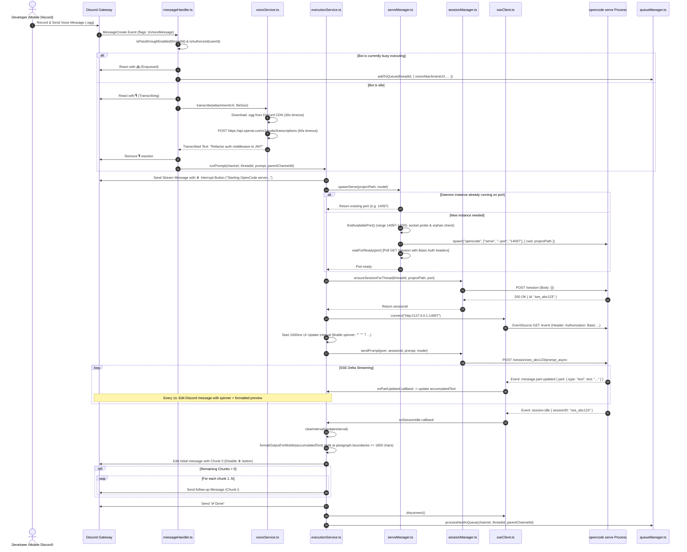
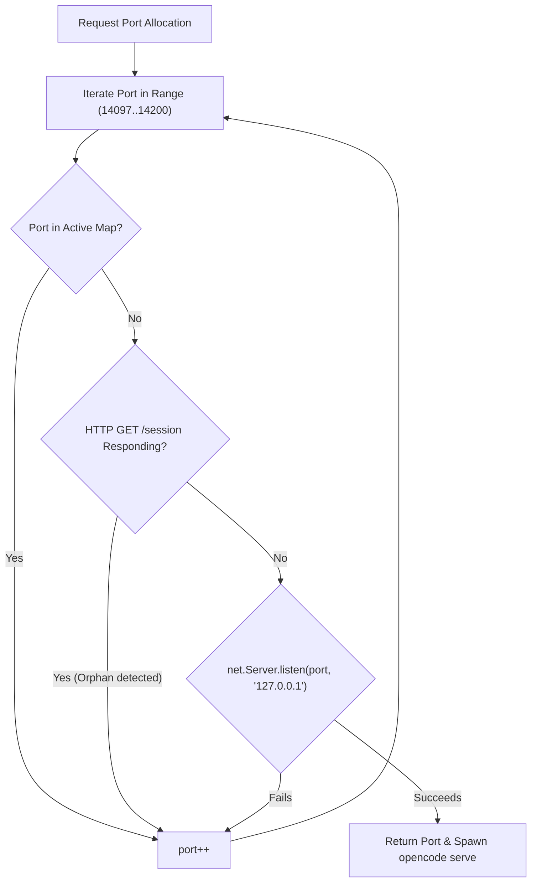

# Architectural Review: remote-opencode

## Executive Summary

[`remote-opencode`](file:///c:/Users/W/Documents/GitHub/OpenRemote/ref/remote-opencode) is an open-source, production-grade Discord bot bridge written in TypeScript for Node.js (v22+) that enables bidirectional remote control over local [OpenCode CLI](https://github.com/sst/opencode) instances. The system allows developers to direct, monitor, and interact with autonomous AI coding agents from any device running Discord—including mobile phones, tablets, or remote laptops—without exposing their local workstation's filesystem or terminals to the public internet via open ingress ports.

```
+---------------------------------------------------------------------------------------------------+
|                                      remote-opencode Bridge                                       |
|                                                                                                   |
|   +-------------------------------------------------------------------------------------------+   |
|   |                                     Discord Bot Gateway                                   |   |
|   |  - Slash Commands (/opencode, /work, /code, /diff, /session, /queue, /model, /allow)      |   |
|   |  - Passthrough Message Handler (Auto-threading & conversational context preservation)     |   |
|   |  - Speech-To-Text Pipeline (Discord Voice Message .ogg -> Whisper API -> Text Prompt)     |   |
|   |  - Role & Snowflake Allowlist Access Control (0o600 file security)                        |   |
|   +-------------------------------------------------------------------------------------------+   |
|         |                                    |                                    |               |
|         v                                    v                                    v               |
|   [ Queue Manager ]                  [ Worktree Manager ]               [ Session Manager ]       |
|   - Per-thread FIFO Queue            - Git Worktree Isolation           - Persistent Thread Map   |
|   - Concurrency Lock (isBusy)        - Auto-branch generation           - REST & SSE Multiplexing |
|   - Pause/Resume & Failover          - PR Creation Automation           - Upstream HTTP Auth Fwd  |
|   +-------------------------------------------------------------------------------------------+   |
|                                                |                                                  |
|                        Loopback HTTP REST + Server-Sent Events (SSE)                              |
|                                                |                                                  |
|                                                v                                                  |
|   +-------------------------------------------------------------------------------------------+   |
|   |                                   Serve Process Manager                                   |   |
|   |  - Process Pool: opencode serve --port <port> (14097 - 14200)                             |   |
|   |  - Platform-Aware Executable Resolution (Windows .cmd/.exe vs POSIX)                      |   |
|   |  - Dynamic Port Allocation, Socket Probing & Orphan Server Detection                      |   |
|   |  - Stdout/Stderr Ring Buffers & Process Lifecycle Supervision                             |   |
|   +-------------------------------------------------------------------------------------------+   |
+---------------------------------------------------------------------------------------------------+
                                                 |
                                                 v
+---------------------------------------------------------------------------------------------------+
|                                 Local Workspace / Git Repository                                  |
|  - Main Project Root (Channel Bound)                                                              |
|  - Isolated Worktree Trees (./worktrees/<branch-name>)                                             |
+---------------------------------------------------------------------------------------------------+
```

### Purpose & Design Goals
1. **Mobile-First Remote Control Plane**: Enable developers to assign coding tasks, inspect streaming agent thought processes, and trigger git actions from mobile Discord clients while on the move.
2. **Headless OpenCode Daemon Orchestration**: Manage multi-tenant `opencode serve` child processes dynamically across multiple repositories without requiring pre-configured server infrastructure.
3. **Conversational Ergonomics via Passthrough & STT**: Eliminate rigid command-line syntax using thread-scoped `/code` passthrough messaging and asynchronous voice message transcription (Whisper-1).
4. **Isolated Worktree Multitasking**: Prevent dirty workspace collisions by spawning dedicated `git worktree` sandboxes for concurrent tasks and automated pull request generation.
5. **Secure Outbound-Only Transport**: Utilize Discord's WebSocket Gateway for communication, eliminating the need for dynamic DNS, port forwarding, or public reverse proxies.

---

## Architecture & Data Flow

### 1. System Component Architecture

The codebase adheres to a modular layered architecture separating Discord interaction handling, service orchestration, local process management, and JSON-based disk persistence.

```mermaid
graph TD
    subgraph Discord_Gateway ["Discord Gateway & Client Layer"]
        Bot["bot.ts (Client Initialization)"]
        IntHandler["interactionHandler.ts"]
        MsgHandler["messageHandler.ts"]
        BtnHandler["buttonHandler.ts"]
    end

    subgraph Command_Suite ["Command & Dispatch Subsystem"]
        CmdIndex["commands/index.ts"]
        CmdOpencode["commands/opencode.ts"]
        CmdWork["commands/work.ts"]
        CmdCode["commands/code.ts"]
        CmdSession["commands/session.ts"]
        CmdQueue["commands/queue.ts"]
        CmdModel["commands/model.ts"]
        CmdDiff["commands/diff.ts"]
        CmdVoice["commands/voice.ts"]
        CmdAllow["commands/allow.ts"]
    end

    subgraph Service_Orchestration ["Service & Orchestration Layer"]
        ExecService["executionService.ts"]
        QueueMgr["queueManager.ts"]
        SessMgr["sessionManager.ts"]
        ServeMgr["serveManager.ts"]
        WorktreeMgr["worktreeManager.ts"]
        VoiceService["voiceService.ts"]
        ServerAuth["serverAuth.ts"]
        ProxySupport["proxySupport.ts"]
    end

    subgraph Persistence_Layer ["Configuration & State Persistence"]
        CfgStore["configStore.ts (~/.remote-opencode/config.json)"]
        DataStore["dataStore.ts (~/.remote-opencode/data.json)"]
    end

    subgraph Daemon_Core ["OpenCode Daemon Process (Loopback)"]
        OpenCodeDaemon["opencode serve --port <port>"]
        RestAPI["REST API (/session, /prompt_async, /abort)"]
        SSEStream["SSE Stream (/event)"]
    end

    Bot --> IntHandler
    Bot --> MsgHandler
    Bot --> ProxySupport
    IntHandler --> CmdIndex
    IntHandler --> BtnHandler
    MsgHandler --> VoiceService
    MsgHandler --> QueueMgr
    MsgHandler --> ExecService
    BtnHandler --> SessMgr
    BtnHandler --> WorktreeMgr

    CmdIndex --> CmdOpencode
    CmdIndex --> CmdWork
    CmdIndex --> CmdCode
    CmdIndex --> CmdSession
    CmdIndex --> CmdQueue
    CmdIndex --> CmdModel
    CmdIndex --> CmdDiff
    CmdIndex --> CmdVoice
    CmdIndex --> CmdAllow

    CmdOpencode --> ExecService
    CmdWork --> WorktreeMgr
    ExecService --> ServeMgr
    ExecService --> SessMgr
    ExecService --> WorktreeMgr
    ExecService --> QueueMgr

    ServeMgr --> ServerAuth
    SessMgr --> ServerAuth
    ServeMgr --> OpenCodeDaemon
    SessMgr --> RestAPI
    ExecService --> SSEStream

    IntHandler --> CfgStore
    MsgHandler --> CfgStore
    CmdIndex --> DataStore
    ExecService --> DataStore
    ServeMgr --> CfgStore
    SessMgr --> DataStore
```



---

### 2. End-to-End Execution Sequence

The sequence below depicts the complete lifecycle of a user dispatching a voice message prompt inside a Discord thread with passthrough mode enabled, including Whisper STT transcription, server spawning, SSE delta streaming, braille spinner animation, chunk splitting, and queue drainage.



---

## Core Tech Stack & Dependencies

| Layer / Dependency | Upstream Package / Technology | Version / Requirement | Architectural Role & Implementation Details |
| :--- | :--- | :--- | :--- |
| **Runtime Engine** | [Node.js](https://nodejs.org/) | `>=22.0.0` | Required for native Web standard APIs: global `fetch`, `FormData`, `Blob`, `AbortSignal.timeout()`, and ES Module execution. |
| **Language** | [TypeScript](https://www.typescriptlang.org/) | `^5.9.3` | Strict static typing compiled via `tsc` to ECMAScript Modules (`dist/`). |
| **Discord Framework** | [`discord.js`](https://discord.js.org/) | `^14.25.1` | Manages Discord Gateway WebSocket connection, Gateway Intents (`Guilds`, `GuildMessages`, `MessageContent`), Slash Command interaction routing, and thread management. |
| **SSE Streaming** | [`eventsource`](https://github.com/EventSource/eventsource) | `^4.1.0` | Implements W3C EventSource over loopback HTTP. Configured with a custom `fetch` wrapper to inject HTTP Basic Authentication headers into SSE handshakes. |
| **CLI Framework** | [`commander`](https://github.com/tj/commander.js) | `^13.1.0` | CLI parser driving subcommands: `start`, `setup`, `deploy`, `undeploy`, `config`, `allow`, and `voice`. |
| **Interactive Terminal UI**| [`@clack/prompts`](https://github.com/natemoo-re/clack) | `^0.9.1` | Delivers an interactive 7-step onboarding wizard for token entry, intent validation, and automated browser launching. |
| **HTTP Proxy Engine** | [`undici`](https://undici.nodejs.org/) | `^6.23.0` | Injects application-wide proxy agents (`EnvHttpProxyAgent`) via `setGlobalDispatcher` while enforcing loopback bypass (`localhost`, `127.0.0.1`, `::1`). |
| **Terminal Coloring** | [`picocolors`](https://github.com/alexeyraspopov/picocolors)| `^1.1.1` | Ultra-lightweight zero-dependency terminal formatter for CLI status logs. |
| **Browser Automation** | [`open`](https://github.com/sindresorhus/open) | `^10.1.0` | Spawns default system browser for Discord OAuth authorization and Developer Portal navigation during setup. |
| **Update Manager** | [`update-notifier`](https://github.com/yeoman/update-notifier) | `^7.3.1` | Background check notifying users of newer npm releases. |
| **PTY / Subprocess** | [`node-pty`](https://github.com/microsoft/node-pty) / `child_process` | `^1.1.0` (in manifest) | Included in `package.json` manifest; runtime execution leverages Node's native `child_process.spawn` and `execFile` targeting `opencode serve` daemons. |

---

## Distinctive & Smart Engineering Decisions

### 1. Dual-Mode Discord UX: Slash Commands vs. Transparent Thread Passthrough
Traditional chat bots force users to prefix every single message with verbose slash commands (e.g. `/opencode prompt: fix bug`). `remote-opencode` implements two ergonomic modes:
* **Explicit Mode**: Users run [`/opencode prompt:<text>`](file:///c:/Users/W/Documents/GitHub/OpenRemote/ref/remote-opencode/src/commands/opencode.ts#L22-L80), which automatically converts the prompt title into a dedicated Discord thread via [`getOrCreateThread()`](file:///c:/Users/W/Documents/GitHub/OpenRemote/ref/remote-opencode/src/utils/threadHelper.ts#L4-L31).
* **Passthrough Mode**: Once inside a thread, users run [`/code`](file:///c:/Users/W/Documents/GitHub/OpenRemote/ref/remote-opencode/src/commands/code.ts#L10-L61) (or enable [`/autocode`](file:///c:/Users/W/Documents/GitHub/OpenRemote/ref/remote-opencode/src/commands/autocode.ts#L18-L54) per project). From then on, standard plain text messages and voice recordings sent directly in the thread are intercepted by [`handleMessageCreate()`](file:///c:/Users/W/Documents/GitHub/OpenRemote/ref/remote-opencode/src/handlers/messageHandler.ts#L28-L96) and piped straight to the OpenCode engine without slash commands.

### 2. Asynchronous Speech-to-Text (STT) Voice Processing Pipeline
Mobile developers frequently find typing complex code instructions tedious on software keyboards. `remote-opencode` incorporates first-class Discord Voice Message ingestion:
* **Bitmask Identification**: Detects native voice messages using Discord's `MessageFlags.IsVoiceMessage` (flag bit `8192`) combined with empty text content.
* **Deferred Transcribing**: If the agent is currently busy, audio metadata (`voiceAttachmentUrl`, `voiceAttachmentSize`) is enqueued immediately with an `📥` reaction without making Whisper API calls. The 30s CDN download and 60s Whisper transcription only fire when the task reaches the head of the FIFO queue.
* **Visual Status Feedback**: Adds a `🎙️` reaction to signify audio processing, replacing it with `📌 Prompt: <transcribed text>` and forwarding it into [`runPrompt()`](file:///c:/Users/W/Documents/GitHub/OpenRemote/ref/remote-opencode/src/services/executionService.ts#L17-L348).

```
Discord Audio (.ogg / Opus) -> Discord CDN -> [voiceService.ts] -> OpenAI Whisper-1 -> Plaintext Prompt -> OpenCode Daemon
```

### 3. Automated Git Worktree Sandboxing & PR Automation
To support concurrent sessions on the same repository without branch thrashing or uncommitted change collisions:
* **Dynamic Worktree Creation**: [`/work branch:<name>`](file:///c:/Users/W/Documents/GitHub/OpenRemote/ref/remote-opencode/src/commands/work.ts#L7-L132) executes `git worktree add ./worktrees/<sanitizedBranch> [-b] <sanitizedBranch>` via [`createWorktree()`](file:///c:/Users/W/Documents/GitHub/OpenRemote/ref/remote-opencode/src/services/worktreeManager.ts#L36-L59).
* **Automated Session Worktree Injection**: When [`/autowork`](file:///c:/Users/W/Documents/GitHub/OpenRemote/ref/remote-opencode/src/commands/autowork.ts#L18-L54) is enabled, any standard `/opencode` command generates an isolated branch named `auto/<threadId-prefix>-<timestamp>`, attaches interactive **Delete** and **Create PR** action buttons, and binds the thread's daemon cwd directly to the worktree path.
* **One-Click PR Generation**: Pressing **Create PR** triggers [`handleWorktreePR()`](file:///c:/Users/W/Documents/GitHub/OpenRemote/ref/remote-opencode/src/handlers/buttonHandler.ts#L97-L123), which dispatches an automated synthesis prompt (`"Create a pull request for the current branch. Include a clear title and description summarizing all changes."`) to OpenCode.

### 4. Resilient Mobile Message Chunking & Throttled Streaming
Discord enforces a strict 2,000-character message limit and stringent rate limits on message edits:
* **Periodic UI Animation**: [`executionService.ts`](file:///c:/Users/W/Documents/GitHub/OpenRemote/ref/remote-opencode/src/services/executionService.ts#L300-L317) buffers SSE text deltas and updates the Discord message at a fixed 1,000ms cadence using a 10-frame braille spinner (`['⠋', '⠙', '⠹', '⠸', '⠼', '⠴', '⠦', '⠧', '⠇', '⠏']`).
* **Intelligent Paragraph Boundary Splitting**: On session completion, [`formatOutputForMobile()`](file:///c:/Users/W/Documents/GitHub/OpenRemote/ref/remote-opencode/src/utils/messageFormatter.ts#L157-L166) parses ANSI escape codes, strips control characters, and chunks large markdown text blocks using a paragraph boundary fallback heuristic (`\n\n` -> `\n` -> hard split at 1,900 characters).

### 5. Asynchronous Cache Pre-Warming for Model Autocomplete
Discord requires autocomplete interactions to respond within 3,000ms. Cold invocations of `opencode models` can exceed this window on slower systems. [`model.ts`](file:///c:/Users/W/Documents/GitHub/OpenRemote/ref/remote-opencode/src/commands/model.ts#L13-L45) implements a 30-second TTL in-memory cache pre-warmed at client ready (`bot.ts`), combined with non-blocking asynchronous background refreshes (`refreshCacheAsync()`).

---

## Process Lifecycle & Terminal/PTY Management

### 1. Process Hierarchy & Daemon Lifecycle

`remote-opencode` does not wrap interactive terminal pseudo-terminals directly via PTY; instead, it orchestrates OpenCode's native daemonized HTTP server mode (`opencode serve`).

```
[remote-opencode Node.js Bot Process] (PID: 10000)
    │
    ├── spawn("opencode", ["serve", "--port", "14097"], { cwd: "/path/to/projectA" }) (PID: 10101)
    │     ├── stdout -> Ring Buffer (last 2000 chars)
    │     ├── stderr -> Ring Buffer (last 2000 chars)
    │     └── Loopback HTTP Server (127.0.0.1:14097)
    │
    └── spawn("opencode", ["serve", "--port", "14098"], { cwd: "/path/to/projectB/worktrees/feat" }) (PID: 10102)
          ├── stdout -> Ring Buffer (last 2000 chars)
          ├── stderr -> Ring Buffer (last 2000 chars)
          └── Loopback HTTP Server (127.0.0.1:14098)
```

### 2. Platform-Aware Executable Resolution
On Windows environments, invoking `opencode` without resolving file extensions causes `ENOENT` spawn errors. [`resolveOpencodeCommand()`](file:///c:/Users/W/Documents/GitHub/OpenRemote/ref/remote-opencode/src/services/serveManager.ts#L44-L55) inspects `process.env.PATH` / `Path` and iterates over candidates:
* **Windows**: `['opencode.cmd', 'opencode.exe', 'opencode']`
* **POSIX**: `['opencode']`

### 3. Port Allocation & Probing Algorithm
[`findAvailablePort()`](file:///c:/Users/W/Documents/GitHub/OpenRemote/ref/remote-opencode/src/services/serveManager.ts#L113-L139) selects available ports in the range `14097` to `14200` through a 3-stage validation cycle:
1. **Memory Pool Check**: Verifies port is not allocated to an active `ServeInstance` in the in-memory registry.
2. **Orphan Server Detection**: Calls [`isOrphanedServerRunning(port)`](file:///c:/Users/W/Documents/GitHub/OpenRemote/ref/remote-opencode/src/services/serveManager.ts#L98-L111), probing `GET http://127.0.0.1:<port>/session` with a 1,000ms timeout and auth headers. If an orphaned OpenCode instance from a prior run is listening, the port is marked as occupied to prevent binding conflicts.
3. **Socket Bind Test**: Uses a temporary `net.Server().listen(port, "127.0.0.1")` to confirm OS-level loopback bind availability.



### 4. Readiness Probing & Crash Diagnostics
When spawning a server, [`waitForReady()`](file:///c:/Users/W/Documents/GitHub/OpenRemote/ref/remote-opencode/src/services/serveManager.ts#L269-L336) continuously polls `GET http://127.0.0.1:<port>/session` up to 30,000ms.
* **Early Crash Detection**: If the child process exits prematurely during the poll window (e.g. invalid permissions or port collisions), `waitForReady()` immediately throws an error containing the captured tail from the 2,000-character `stdoutBuffer` / `stderrBuffer` instead of stalling until the 30s timeout expires.
* **Auth Misconfiguration Detection**: If the server returns `401 Unauthorized` or `403 Forbidden`, `waitForReady()` immediately aborts and alerts the user to check `OPENCODE_SERVER_PASSWORD`.

### 5. Graceful Process Cleanup
[`bot.ts`](file:///c:/Users/W/Documents/GitHub/OpenRemote/ref/remote-opencode/src/bot.ts#L34-L47) traps `SIGINT` and `SIGTERM`, invoking [`serveManager.stopAll()`](file:///c:/Users/W/Documents/GitHub/OpenRemote/ref/remote-opencode/src/services/serveManager.ts#L338-L343) to terminate all spawned child processes before destroying the Discord client and exiting.

---

## Communication & Protocol

The system operates across two protocol boundaries:
1. **Discord Remote Boundary**: Secure WebSocket Gateway (JSON payloads) + Discord REST API v10.
2. **Local Daemon Boundary**: HTTP REST API + Server-Sent Events (SSE) `/event` stream.

```
[Discord User] <=== WebSocket / REST ===> [remote-opencode] <=== HTTP REST / SSE ===> [opencode serve]
```

### 1. OpenCode HTTP REST Endpoint Matrix

All internal requests are dispatched with `Content-Type: application/json` and optional HTTP Basic Auth headers via [`getAuthHeaders()`](file:///c:/Users/W/Documents/GitHub/OpenRemote/ref/remote-opencode/src/services/serverAuth.ts#L52-L56).

| Endpoint | Method | Payload / Query | Response Structure | Purpose |
| :--- | :--- | :--- | :--- | :--- |
| `/session` | `GET` | *(none)* | `Array<{ id: string, title?: string }>` | Lists active sessions on the daemon. |
| `/session` | `POST` | `{}` | `{ id: string }` | Creates a new OpenCode conversation session. |
| `/session/:id` | `GET` | *(none)* | `{ id: string, title?: string }` | Validates session liveness and extracts title. |
| `/session/:id/prompt_async` | `POST` | `{"parts": [{"type": "text", "text": "..."}], "model": {"providerID": "...", "modelID": "..."}}` | `200 OK` (Async dispatch) | Enqueues prompt for execution without blocking the HTTP connection. |
| `/session/:id/abort` | `POST` | *(none)* | `200 OK` | Aborts the active reasoning/tool loop for the given session. |
| `/event` | `GET` | `Accept: text/event-stream` | SSE Event Stream | Real-time event stream emitting incremental tokens and session state transitions. |

### 2. Server-Sent Events (SSE) Event Lifecycle

[`SSEClient`](file:///c:/Users/W/Documents/GitHub/OpenRemote/ref/remote-opencode/src/services/sseClient.ts#L13-L116) connects to `http://127.0.0.1:<port>/event` and subscribes to events:

```
+---------------------------+-------------------------------------------------------------------------+
| Event Type                | Payload Structure & Handler Dispatch                                    |
+---------------------------+-------------------------------------------------------------------------+
| message.part.updated      | { type: "message.part.updated", properties: { part: { text, ... } } }   |
|                           | -> onPartUpdated(part: TextPart)                                        |
|                           | Updates accumulatedText buffer for periodic stream editing.             |
+---------------------------+-------------------------------------------------------------------------+
| session.idle              | { type: "session.idle", properties: { sessionID: "..." } }              |
|                           | -> onSessionIdle(sessionId: string)                                     |
|                           | Concludes streaming, splits chunks, sends "✅ Done", and drains queue.  |
+---------------------------+-------------------------------------------------------------------------+
| session.error             | { type: "session.error", properties: { sessionID, error: { name, ... } }|
|                           | -> onSessionError(sessionId: string, error: SessionErrorInfo)          |
|                           | Displays error embed, disconnects SSE, checks continueOnFailure policy. |
+---------------------------+-------------------------------------------------------------------------+
```

---

## Reliability, Fault Tolerance & Edge Cases

### 1. Job Queue Management & Failover Policies
To prevent simultaneous prompt collisions within a single thread/session, [`queueManager.ts`](file:///c:/Users/W/Documents/GitHub/OpenRemote/ref/remote-opencode/src/services/queueManager.ts#L7-L51) manages a FIFO queue per thread:
* **Busy Lock Verification**: [`isBusy(threadId)`](file:///c:/Users/W/Documents/GitHub/OpenRemote/ref/remote-opencode/src/services/queueManager.ts#L48-L51) inspects if an `SSEClient` is currently connected for that thread.
* **Sequential Queue Processing**: When a task completes or fails, [`processNextInQueue()`](file:///c:/Users/W/Documents/GitHub/OpenRemote/ref/remote-opencode/src/services/queueManager.ts#L7-L46) extracts the next job and begins execution.
* **Failure Policies**: Configurable via `/queue settings continue_on_failure:<bool>`. If `continueOnFailure` is `false` (default), a session failure immediately clears the thread queue and alerts the user; if `true`, it logs the error and immediately starts the next queued item.
* **Fresh Context Control**: `/queue settings fresh_context:<bool>` forces the bot to create a completely new session ID for each queued task while retaining the local repository state.

### 2. Network & Proxy Resilience
In enterprise and VPN environments, external Discord API calls often require forward HTTP proxies while local daemon calls must remain direct:
* **Undici Global Dispatcher**: [`initializeProxySupport()`](file:///c:/Users/W/Documents/GitHub/OpenRemote/ref/remote-opencode/src/services/proxySupport.ts#L34-L63) parses `HTTP_PROXY`, `HTTPS_PROXY`, `ALL_PROXY`, and `NO_PROXY`.
* **Automatic Loopback Immunity**: [`mergeNoProxy()`](file:///c:/Users/W/Documents/GitHub/OpenRemote/ref/remote-opencode/src/services/proxySupport.ts#L19-L32) forcefully injects `localhost`, `127.0.0.1`, and `::1` into the `noProxy` bypass list, guaranteeing that local OpenCode traffic is never mistakenly routed through corporate proxy servers.

### 3. Voice Transcription Resilience
* **Payload Size Barrier**: Rejects Discord audio attachments larger than 25MB before initiating download (`voiceService.ts`).
* **Timeout Envelopes**: Wrapped with `AbortController` timeouts—30s for Discord CDN download and 60s for OpenAI Whisper transcription (`fetchWithTimeout()`).
* **Auth Error Masking**: Logs Whisper API 401/500 errors server-side while displaying user-friendly remediation messages in Discord (`/voice status`).

---

## Security & Access Control

```
+---------------------------------------------------------------------------------------+
|                                Security & Defense Layers                              |
|                                                                                       |
|   1. Transport Layer Security: Discord Gateway TLS + Loopback 127.0.0.1 Binding Only  |
|   2. Discord User Allowlist: Snowflake ID Filtering + Bootstrap Anti-Lockout Defense  |
|   3. Filesystem Hardening: Config file mode 0o600 / Directory mode 0o700              |
|   4. Upstream Server Auth: OPENCODE_SERVER_PASSWORD / Basic Auth Propagation          |
|   5. Branch Sanitization: Strict regex scrubbing of user-supplied git ref inputs      |
+---------------------------------------------------------------------------------------+
```

### 1. User Allowlist & Privilege Management
Because an AI coding assistant possesses arbitrary code execution and filesystem write privileges on the host machine, strict access control is essential:
* **Allowlist Enforcement**: [`isAuthorized(userId)`](file:///c:/Users/W/Documents/GitHub/OpenRemote/ref/remote-opencode/src/services/configStore.ts#L114-L118) validates the Discord Snowflake ID of the sender against `allowedUserIds` in `config.json`. If the list contains at least one ID, any unauthorized interaction or message is silently dropped or rejected with an ephemeral error.
* **Bootstrap Protection**: If the allowlist is empty, the `/allow` Discord slash command is locked down ([`allow.ts`](file:///c:/Users/W/Documents/GitHub/OpenRemote/ref/remote-opencode/src/commands/allow.ts#L39-L45)). Initial setup **must** occur via the local CLI (`remote-opencode allow add <id>`) or setup wizard, preventing unauthorized Discord users from adding themselves to an unconfigured bot.
* **Anti-Lockout Rule**: [`removeAllowedUserId()`](file:///c:/Users/W/Documents/GitHub/OpenRemote/ref/remote-opencode/src/services/configStore.ts#L104-L112) prevents removing the final remaining allowed user via Discord; clearing access restrictions requires explicit invocation of the CLI command `remote-opencode allow reset`.

### 2. Upstream OpenCode Server Authentication
When `opencode serve` is launched with upstream authentication (`OPENCODE_SERVER_PASSWORD`), `remote-opencode` automatically mirrors these credentials:
* **Basic Auth Forwarding**: [`serverAuth.ts`](file:///c:/Users/W/Documents/GitHub/OpenRemote/ref/remote-opencode/src/services/serverAuth.ts#L35-L56) extracts `OPENCODE_SERVER_PASSWORD` and `OPENCODE_SERVER_USERNAME` (defaulting to `opencode`), generating an HTTP Basic Authorization header injected across all REST calls, SSE connection handshakes, and readiness probes.
* **Clear Diagnostic Assertions**: [`assertNotAuthError()`](file:///c:/Users/W/Documents/GitHub/OpenRemote/ref/remote-opencode/src/services/serverAuth.ts#L62-L76) translates HTTP 401/403 status codes into explicit troubleshooting messages indicating password mismatches.

### 3. Filesystem & Token Protection
* **File Permissions**: [`configStore.ts`](file:///c:/Users/W/Documents/GitHub/OpenRemote/ref/remote-opencode/src/services/configStore.ts#L26-L52) enforces strict POSIX file mode `0o600` (owner read/write only) on `config.json` and `0o700` on `~/.remote-opencode/`.
* **API Key Masking**: The `/voice status` slash command masks stored OpenAI API keys, only showing the prefix and suffix (e.g. `sk-...abc123`). The `/voice set` command is restricted to CLI execution only to prevent API key leakage in Discord channel history.

---

## Flaws, Antipatterns & Gotchas

### 1. Synchronous Blocking Disk I/O in Async Hot Paths
* **Anti-Pattern**: [`dataStore.ts`](file:///c:/Users/W/Documents/GitHub/OpenRemote/ref/remote-opencode/src/services/dataStore.ts#L17-L33) and [`configStore.ts`](file:///c:/Users/W/Documents/GitHub/OpenRemote/ref/remote-opencode/src/services/configStore.ts#L36-L52) rely on synchronous `readFileSync` and `writeFileSync` for all storage mutations (adding queue items, popping queue items, updating timestamps, setting bindings).
* **Impact**: Under concurrent load (e.g., multiple threads receiving messages simultaneously), synchronous I/O blocks the Node.js single-threaded event loop. Furthermore, concurrent read-modify-write cycles on `data.json` without file locking risk corrupting the JSON file.

### 2. Unbounded Process Growth & Resource Leakage
* **Anti-Pattern**: [`serveManager.ts`](file:///c:/Users/W/Documents/GitHub/OpenRemote/ref/remote-opencode/src/services/serveManager.ts#L14-L15) stores spawned daemon processes in a module-level `instances` map keyed by project path. There is no idle reaper, TTL timer, or LRU eviction mechanism.
* **Impact**: If a developer switches across 20 different project paths or creates multiple `/work` worktrees over several days, 20 separate `opencode serve` processes remain active indefinitely in the background, consuming substantial RAM and port allocations until the bot is manually restarted.

### 3. Disconnected State Recovery on Bot Restart
* **Anti-Pattern**: Thread session mappings are persisted to disk (`data.json`), but the in-memory child process registry (`instances`) and active SSE clients (`threadSseClients`) are cleared when the Node process restarts.
* **Impact**: If the bot is restarted while tasks are running, the background `opencode serve` processes become orphaned. When a new prompt arrives in that thread, `findAvailablePort()` skips the orphaned port and spawns a *second* daemon for the same repository, leading to dual processes competing over the same workspace.

### 4. SSE Buffer Overwrite vs. Delta Accumulation
* **Anti-Pattern**: In [`executionService.ts`](file:///c:/Users/W/Documents/GitHub/OpenRemote/ref/remote-opencode/src/services/executionService.ts#L154-L157):
  ```typescript
  sseClient.onPartUpdated((part) => {
    if (part.sessionID !== sessionId) return;
    accumulatedText = part.text;
  });
  ```
* **Impact**: The code directly assigns `accumulatedText = part.text`, assuming OpenCode always transmits the full snapshot of the text part on each update. If an upstream OpenCode release changes its SSE contract to emit incremental chunk deltas, previous text will be overwritten, resulting in corrupted output.

### 5. Blind Edit Throttling Without Rate Limit Backoff
* **Anti-Pattern**: The 1,000ms streaming interval (`setInterval`) in `executionService.ts` edits the Discord message unconditionally regardless of Discord Gateway latency or rate limit headers.
* **Impact**: When editing messages rapidly, Discord may return HTTP 429 (Rate Limited). While the error is caught, the interval continues attempting edits every second without adaptive backoff, triggering gateway rate-limit penalties.

---

## Actionable Lessons & Takeaways for OpenRemote

When architecting the OpenCode adapter and daemon supervisor for [`OpenRemote`](file:///c:/Users/W/Documents/GitHub/OpenRemote), the following design lessons should be adopted:

### 1. Adopt OpenCode's Native HTTP/SSE Daemon Model
* **Takeaway**: Interacting with OpenCode via `opencode serve` over loopback HTTP/SSE (`/session`, `/prompt_async`, `/event`, `/abort`) is vastly cleaner and more reliable than attempting to scrape terminal ANSI escapes via raw PTY wrappers (`node-pty`).
* **Recommendation**: Build an explicit typed HTTP/SSE OpenCode client adapter with built-in schema validation, snapshot tracking, and structured tool event parsing.

### 2. Implement an Idle Process Reaper & LRU Daemon Pool
* **Takeaway**: Long-running bridge servers must supervise child daemon lifecycles actively.
* **Recommendation**: Equip OpenRemote's daemon manager with an idle timeout (e.g., terminate `opencode serve` instances that have received no prompts for 30 minutes) and an orphan sweep that identifies and terminates lingering daemons upon startup.

### 3. Replace Sync JSON Storage with Atomic Async Persistence (SQLite / Atomic Write)
* **Takeaway**: Synchronous `fs.writeFileSync` is hazardous for multi-thread concurrent state.
* **Recommendation**: Use an embedded asynchronous database (like SQLite via `better-sqlite3` or `bun:sqlite`) or atomic temporary file swapping (`write-file-atomic`) for channel bindings, session mappings, and FIFO task queues.

### 4. Support Worktree Isolation as a Core Primitive
* **Takeaway**: The git worktree isolation model demonstrated in `/work` and `/autowork` is an exceptional pattern for autonomous coding agents, preventing uncommitted mobile tasks from dirtying the main working branch.
* **Recommendation**: Incorporate native worktree lifecycle hooks (auto-create on task start, auto-prune on task discard, auto-PR on completion) into OpenRemote's core execution flow.

### 5. Multi-Layer Allowlist & Network Loopback Isolation
* **Takeaway**: Combining user Snowflake allowlists with anti-lockout safeguards and strict POSIX `0o600` config permissions ensures robust security for self-hosted AI bridges.
* **Recommendation**: Enforce loopback binding (`127.0.0.1`) explicitly on all local services, mandate CLI-first authentication bootstrapping, and ensure proxy configurations automatically exempt local daemon addresses.

---

## Key Code File Index

| File Path | Primary Function / Symbol | Line Range | Core Responsibility & Architectural Role |
| :--- | :--- | :--- | :--- |
| [`cli.ts`](file:///c:/Users/W/Documents/GitHub/OpenRemote/ref/remote-opencode/src/cli.ts) | [`program`](file:///c:/Users/W/Documents/GitHub/OpenRemote/ref/remote-opencode/src/cli.ts#L26-L206) | [L1–L207](file:///c:/Users/W/Documents/GitHub/OpenRemote/ref/remote-opencode/src/cli.ts#L1-L207) | CLI command definitions (`start`, `setup`, `deploy`, `allow`, `voice`). |
| [`bot.ts`](file:///c:/Users/W/Documents/GitHub/OpenRemote/ref/remote-opencode/src/bot.ts) | [`startBot`](file:///c:/Users/W/Documents/GitHub/OpenRemote/ref/remote-opencode/src/bot.ts#L10-L52) | [L1–L53](file:///c:/Users/W/Documents/GitHub/OpenRemote/ref/remote-opencode/src/bot.ts#L1-L53) | Discord client initialization, intent configuration, signal trapping, and startup. |
| [`interactionHandler.ts`](file:///c:/Users/W/Documents/GitHub/OpenRemote/ref/remote-opencode/src/handlers/interactionHandler.ts) | [`handleInteraction`](file:///c:/Users/W/Documents/GitHub/OpenRemote/ref/remote-opencode/src/handlers/interactionHandler.ts#L6-L74) | [L1–L75](file:///c:/Users/W/Documents/GitHub/OpenRemote/ref/remote-opencode/src/handlers/interactionHandler.ts#L1-L75) | Top-level dispatcher for slash commands, buttons, and autocomplete queries. |
| [`messageHandler.ts`](file:///c:/Users/W/Documents/GitHub/OpenRemote/ref/remote-opencode/src/handlers/messageHandler.ts) | [`handleMessageCreate`](file:///c:/Users/W/Documents/GitHub/OpenRemote/ref/remote-opencode/src/handlers/messageHandler.ts#L28-L96) | [L1–L97](file:///c:/Users/W/Documents/GitHub/OpenRemote/ref/remote-opencode/src/handlers/messageHandler.ts#L1-L97) | Intercepts plain text & voice messages in passthrough threads; triggers STT. |
| [`buttonHandler.ts`](file:///c:/Users/W/Documents/GitHub/OpenRemote/ref/remote-opencode/src/handlers/buttonHandler.ts) | [`handleButton`](file:///c:/Users/W/Documents/GitHub/OpenRemote/ref/remote-opencode/src/handlers/buttonHandler.ts#L7-L32) | [L1–L124](file:///c:/Users/W/Documents/GitHub/OpenRemote/ref/remote-opencode/src/handlers/buttonHandler.ts#L1-L124) | Handles interactive Discord button actions (`interrupt`, `delete`, `pr`). |
| [`executionService.ts`](file:///c:/Users/W/Documents/GitHub/OpenRemote/ref/remote-opencode/src/services/executionService.ts) | [`runPrompt`](file:///c:/Users/W/Documents/GitHub/OpenRemote/ref/remote-opencode/src/services/executionService.ts#L17-L348) | [L1–L349](file:///c:/Users/W/Documents/GitHub/OpenRemote/ref/remote-opencode/src/services/executionService.ts#L1-L349) | Core prompt execution orchestrator; handles SSE streaming and message chunking. |
| [`serveManager.ts`](file:///c:/Users/W/Documents/GitHub/OpenRemote/ref/remote-opencode/src/services/serveManager.ts) | [`spawnServe`](file:///c:/Users/W/Documents/GitHub/OpenRemote/ref/remote-opencode/src/services/serveManager.ts#L157-L247), [`waitForReady`](file:///c:/Users/W/Documents/GitHub/OpenRemote/ref/remote-opencode/src/services/serveManager.ts#L269-L336) | [L1–L367](file:///c:/Users/W/Documents/GitHub/OpenRemote/ref/remote-opencode/src/services/serveManager.ts#L1-L367) | Manages `opencode serve` child processes, port scanning, and readiness probes. |
| [`sessionManager.ts`](file:///c:/Users/W/Documents/GitHub/OpenRemote/ref/remote-opencode/src/services/sessionManager.ts) | [`sendPrompt`](file:///c:/Users/W/Documents/GitHub/OpenRemote/ref/remote-opencode/src/services/sessionManager.ts#L50-L85), [`ensureSessionForThread`](file:///c:/Users/W/Documents/GitHub/OpenRemote/ref/remote-opencode/src/services/sessionManager.ts#L214-L237) | [L1–L258](file:///c:/Users/W/Documents/GitHub/OpenRemote/ref/remote-opencode/src/services/sessionManager.ts#L1-L258) | Handles session creation, validation, prompt dispatch, and SSE client mapping. |
| [`sseClient.ts`](file:///c:/Users/W/Documents/GitHub/OpenRemote/ref/remote-opencode/src/services/sseClient.ts) | [`SSEClient`](file:///c:/Users/W/Documents/GitHub/OpenRemote/ref/remote-opencode/src/services/sseClient.ts#L13-L116) | [L1–L117](file:///c:/Users/W/Documents/GitHub/OpenRemote/ref/remote-opencode/src/services/sseClient.ts#L1-L117) | EventSource wrapper connecting to `/event` with Basic Auth injection. |
| [`queueManager.ts`](file:///c:/Users/W/Documents/GitHub/OpenRemote/ref/remote-opencode/src/services/queueManager.ts) | [`processNextInQueue`](file:///c:/Users/W/Documents/GitHub/OpenRemote/ref/remote-opencode/src/services/queueManager.ts#L7-L46), [`isBusy`](file:///c:/Users/W/Documents/GitHub/OpenRemote/ref/remote-opencode/src/services/queueManager.ts#L48-L51) | [L1–L52](file:///c:/Users/W/Documents/GitHub/OpenRemote/ref/remote-opencode/src/services/queueManager.ts#L1-L52) | Thread FIFO queue manager and concurrency execution lock. |
| [`voiceService.ts`](file:///c:/Users/W/Documents/GitHub/OpenRemote/ref/remote-opencode/src/services/voiceService.ts) | [`transcribe`](file:///c:/Users/W/Documents/GitHub/OpenRemote/ref/remote-opencode/src/services/voiceService.ts#L18-L70) | [L1–L71](file:///c:/Users/W/Documents/GitHub/OpenRemote/ref/remote-opencode/src/services/voiceService.ts#L1-L71) | Downloads Discord voice attachments and performs STT via OpenAI Whisper API. |
| [`worktreeManager.ts`](file:///c:/Users/W/Documents/GitHub/OpenRemote/ref/remote-opencode/src/services/worktreeManager.ts) | [`createWorktree`](file:///c:/Users/W/Documents/GitHub/OpenRemote/ref/remote-opencode/src/services/worktreeManager.ts#L36-L59), [`removeWorktree`](file:///c:/Users/W/Documents/GitHub/OpenRemote/ref/remote-opencode/src/services/worktreeManager.ts#L61-L80) | [L1–L94](file:///c:/Users/W/Documents/GitHub/OpenRemote/ref/remote-opencode/src/services/worktreeManager.ts#L1-L94) | Git worktree lifecycle management, branch sanitization, and branch probing. |
| [`serverAuth.ts`](file:///c:/Users/W/Documents/GitHub/OpenRemote/ref/remote-opencode/src/services/serverAuth.ts) | [`getAuthHeaders`](file:///c:/Users/W/Documents/GitHub/OpenRemote/ref/remote-opencode/src/services/serverAuth.ts#L52-L56), [`assertNotAuthError`](file:///c:/Users/W/Documents/GitHub/OpenRemote/ref/remote-opencode/src/services/serverAuth.ts#L62-L76) | [L1–L77](file:///c:/Users/W/Documents/GitHub/OpenRemote/ref/remote-opencode/src/services/serverAuth.ts#L1-L77) | Propagates `OPENCODE_SERVER_PASSWORD` HTTP Basic credentials to internal calls. |
| [`proxySupport.ts`](file:///c:/Users/W/Documents/GitHub/OpenRemote/ref/remote-opencode/src/services/proxySupport.ts) | [`initializeProxySupport`](file:///c:/Users/W/Documents/GitHub/OpenRemote/ref/remote-opencode/src/services/proxySupport.ts#L34-L63) | [L1–L68](file:///c:/Users/W/Documents/GitHub/OpenRemote/ref/remote-opencode/src/services/proxySupport.ts#L1-L68) | Configures `undici` HTTP/HTTPS proxy agent with loopback bypass. |
| [`configStore.ts`](file:///c:/Users/W/Documents/GitHub/OpenRemote/ref/remote-opencode/src/services/configStore.ts) | [`isAuthorized`](file:///c:/Users/W/Documents/GitHub/OpenRemote/ref/remote-opencode/src/services/configStore.ts#L114-L118), [`loadConfig`](file:///c:/Users/W/Documents/GitHub/OpenRemote/ref/remote-opencode/src/services/configStore.ts#L36-L47) | [L1–L135](file:///c:/Users/W/Documents/GitHub/OpenRemote/ref/remote-opencode/src/services/configStore.ts#L1-L135) | Manages `config.json` storage, user allowlist permissions, and credentials. |
| [`dataStore.ts`](file:///c:/Users/W/Documents/GitHub/OpenRemote/ref/remote-opencode/src/services/dataStore.ts) | [`setThreadSession`](file:///c:/Users/W/Documents/GitHub/OpenRemote/ref/remote-opencode/src/services/dataStore.ts#L111-L123), [`addToQueue`](file:///c:/Users/W/Documents/GitHub/OpenRemote/ref/remote-opencode/src/services/dataStore.ts#L267-L273) | [L1–L310](file:///c:/Users/W/Documents/GitHub/OpenRemote/ref/remote-opencode/src/services/dataStore.ts#L1-L310) | JSON data persistence for projects, bindings, queues, sessions, and worktrees. |
| [`messageFormatter.ts`](file:///c:/Users/W/Documents/GitHub/OpenRemote/ref/remote-opencode/src/utils/messageFormatter.ts) | [`formatOutputForMobile`](file:///c:/Users/W/Documents/GitHub/OpenRemote/ref/remote-opencode/src/utils/messageFormatter.ts#L157-L166), [`parseOpenCodeOutput`](file:///c:/Users/W/Documents/GitHub/OpenRemote/ref/remote-opencode/src/utils/messageFormatter.ts#L53-L93) | [L1–L167](file:///c:/Users/W/Documents/GitHub/OpenRemote/ref/remote-opencode/src/utils/messageFormatter.ts#L1-L167) | ANSI stripping, token/cost computation, and mobile paragraph chunk splitting. |
| [`wizard.ts`](file:///c:/Users/W/Documents/GitHub/OpenRemote/ref/remote-opencode/src/setup/wizard.ts) | [`runSetupWizard`](file:///c:/Users/W/Documents/GitHub/OpenRemote/ref/remote-opencode/src/setup/wizard.ts#L51-L283) | [L1–L284](file:///c:/Users/W/Documents/GitHub/OpenRemote/ref/remote-opencode/src/setup/wizard.ts#L1-L284) | Interactive Clack onboarding wizard guiding users through Discord setup. |
| [`deploy.ts`](file:///c:/Users/W/Documents/GitHub/OpenRemote/ref/remote-opencode/src/setup/deploy.ts) | [`deployCommands`](file:///c:/Users/W/Documents/GitHub/OpenRemote/ref/remote-opencode/src/setup/deploy.ts#L7-L26) | [L1–L27](file:///c:/Users/W/Documents/GitHub/OpenRemote/ref/remote-opencode/src/setup/deploy.ts#L1-L27) | Registers Discord Application Guild slash commands via Discord REST API. |
| [`diff.ts`](file:///c:/Users/W/Documents/GitHub/OpenRemote/ref/remote-opencode/src/commands/diff.ts) | [`diff`](file:///c:/Users/W/Documents/GitHub/OpenRemote/ref/remote-opencode/src/commands/diff.ts#L24-L123) | [L1–L124](file:///c:/Users/W/Documents/GitHub/OpenRemote/ref/remote-opencode/src/commands/diff.ts#L1-L124) | Slash command generating formatted unstaged, staged, or branch git diffs. |
| [`session.ts`](file:///c:/Users/W/Documents/GitHub/OpenRemote/ref/remote-opencode/src/commands/session.ts) | [`session`](file:///c:/Users/W/Documents/GitHub/OpenRemote/ref/remote-opencode/src/commands/session.ts#L36-L338) | [L1–L339](file:///c:/Users/W/Documents/GitHub/OpenRemote/ref/remote-opencode/src/commands/session.ts#L1-L339) | Slash command suite for session listing, interactive dropdown attaching, and detaching. |
