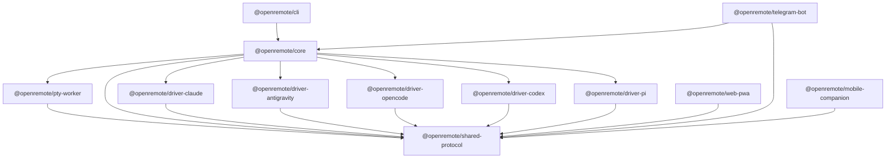

# 01. Project Structure & Monorepo Architecture

This document defines the monorepo topology, package boundaries, dependency graphs, and tooling setup for **OpenRemote**.

---

## 1. Monorepo Layout (pnpm + Turborepo)

```text
OpenRemote/
├── package.json                         # Root monorepo package.json
├── pnpm-workspace.yaml                  # pnpm workspace definition
├── turbo.json                           # Turborepo task pipeline
├── tsconfig.base.json                   # Shared TypeScript base configuration
├── .gitignore
├── goal.md                              # Vision & project goals
│
├── packages/                            # Core shared libraries and packages
│   ├── shared-protocol/                 # Shared Zod schemas, binary frame encoders & types
│   │   ├── src/
│   │   │   ├── binary/                  # 2-byte binary frame encoder/decoder
│   │   │   ├── events/                  # AgentEvent, ToolApproval, DiffCard Zod schemas
│   │   │   ├── rpc/                     # WebSocket RPC request/response schemas
│   │   │   └── index.ts
│   │   ├── package.json
│   │   └── tsconfig.json
│   │
│   ├── pty-worker/                      # Isolated PTY Child Process
│   │   ├── src/
│   │   │   ├── worker-process.ts        # Child entrypoint trapping ConPTY exceptions
│   │   │   ├── pty-instance.ts          # node-pty wrapper & dimension clamp
│   │   │   └── index.ts
│   │   ├── package.json
│   │   └── tsconfig.json
│   │
│   ├── core/                            # OpenRemote Master Daemon & Event Engine
│   │   ├── src/
│   │   │   ├── server/                  # HTTP / WebSocket server & auth filter
│   │   │   ├── events/                  # SQLite WAL monotonic event bus
│   │   │   ├── pty/                     # PTY worker manager & IPC channel
│   │   │   ├── parser/                  # Non-blocking heuristic AST stream parser
│   │   │   ├── workspace/               # Opaque workspace & Git worktree manager
│   │   │   ├── tunnels/                 # Cloudflare & Tailscale tunnel launcher
│   │   │   ├── supervisor/              # Watchdog & crash recovery
│   │   │   └── index.ts
│   │   ├── package.json
│   │   └── tsconfig.json
│   │
│   ├── driver-claude/                   # Claude Code Agent Adapter
│   ├── driver-antigravity/              # Antigravity Agent Adapter
│   ├── driver-opencode/                 # OpenCode Agent Adapter
│   ├── driver-codex/                    # OpenAI Codex Agent Adapter
│   └── driver-pi/                       # Pi / Oh My Pi ACP v1 Adapter
│
├── apps/                                # End-user client surfaces
│   ├── web-pwa/                         # Next.js 15 / React 19 Web PWA
│   │   ├── app/                         # App router (chat, terminal, diffs, settings)
│   │   ├── components/                  # xterm.js canvas, split diffs, approval cards
│   │   ├── hooks/                       # useTerminalStream, useEventReplay, useTouchSGR
│   │   ├── public/                      # PWA icons & manifest.json
│   │   └── package.json
│   │
│   ├── telegram-bot/                    # Grammy / Telegraf Telegram Bot Bridge
│   │   ├── src/
│   │   │   ├── bot.ts                   # Command routing & auth filter
│   │   │   ├── streaming/               # 2.0s draft streaming & typing loop
│   │   │   ├── topics/                  # Forum topics project manager
│   │   │   └── index.ts
│   │   └── package.json
│   │
│   └── mobile-companion/                # React Native (Expo) Mobile App
│       ├── app/                         # Expo Router screens
│       ├── components/                  # Mobile accessory bar, card streams
│       ├── native-android/              # Java HttpURLConnection background SSE service
│       └── package.json
│
├── tools/
│   └── cli/                             # Global `openremote` CLI runner
│       ├── src/
│       │   ├── commands/                # start, connect, status, token, tunnel
│       │   └── cli.ts
│       └── package.json
│
└── spec/                                # Architecture & Technical Specifications
    ├── 01_PROJECT_STRUCTURE_AND_MONOREPO.md
    ├── 02_CORE_DAEMON_SPEC.md
    ├── 03_AGENT_DRIVERS_SPEC.md
    ├── 04_PROTOCOL_AND_API_SPEC.md
    ├── 05_CLIENT_APPS_SPEC.md
    └── 06_IMPLEMENTATION_ROADMAP.md
```

---

## 2. Dependency Graph



---

## 3. Package Responsibilities

| Package | Role | Key Dependencies | Output Artifact |
| :--- | :--- | :--- | :--- |
| `@openremote/shared-protocol` | Shared types, Zod schemas, binary framing, RPC contracts | `zod` | Pure JS/D.TS (ESM/CJS) |
| `@openremote/pty-worker` | Isolated ConPTY/POSIX worker process | `@homebridge/node-pty-prebuilt-multiarch` | Standalone child script |
| `@openremote/core` | Daemon server, event bus, worktrees, tunnels | `ws`, `better-sqlite3`, `pino` | Node.js library & daemon |
| `@openremote/driver-*` | Agent runtime adapters | `@modelcontextprotocol/sdk` | Pluggable driver modules |
| `@openremote/cli` | Global command line binary (`openremote`) | `commander`, `chalk`, `ora` | Global CLI executable |
| `@openremote/web-pwa` | Web IDE & mobile PWA | `next`, `react`, `@xterm/xterm`, `tailwindcss` | Next.js build |
| `@openremote/telegram-bot` | Telegram bot service | `grammy` (or `telegraf`), `better-sqlite3` | Node.js daemon |
| `@openremote/mobile-companion` | Mobile companion app | `expo`, `react-native`, native Java | Android APK / iOS bundle |
