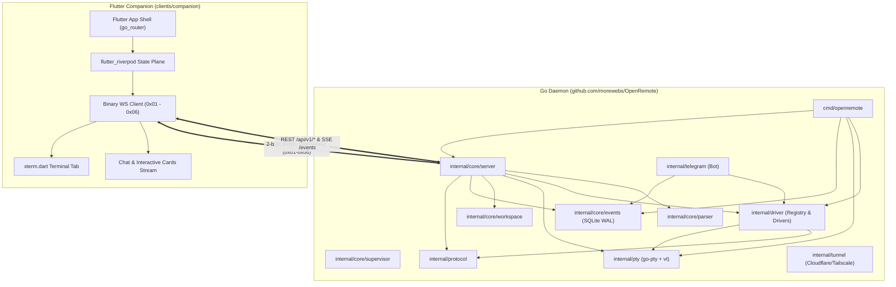

# 01. Project Structure & Monorepo Architecture

This document defines the repository topology, package boundaries, directory structures, and build workflows for **OpenRemote** — built as a high-performance Go daemon backend paired with a cross-platform Flutter companion client.

---

## 1. Repository Topology

```text
OpenRemote/
├── cmd/                                  # Go Executable Entrypoints
│   └── openremote/
│       ├── main.go                       # Master CLI & daemon entrypoint
│       ├── pty_worker.go                 # Isolated PTY child worker process mode
│       └── static_embed.go               # Embedded Flutter Web assets (go:embed)
│
├── internal/                             # Core Go Subsystems (Private Modules)
│   ├── core/
│   │   ├── auth/                         # Cryptographic 256-bit Bearer token engine
│   │   │   ├── auth.go
│   │   │   └── auth_test.go
│   │   ├── events/                       # Pure-Go SQLite WAL monotonic event bus
│   │   │   ├── bus.go
│   │   │   └── bus_test.go
│   │   ├── parser/                       # Non-blocking heuristic AST & regex stream parser
│   │   │   ├── parser.go
│   │   │   └── parser_test.go
│   │   ├── server/                       # HTTP/REST, WebSocket (coder/websocket) & SSE
│   │   │   ├── server.go
│   │   │   ├── files.go
│   │   │   ├── static.go                 # Flutter Web SPA file server handler
│   │   │   └── server_test.go
│   │   ├── supervisor/                   # Watchdog, heartbeat monitor & crash circuit-breaker
│   │   │   └── watchdog.go
│   │   └── workspace/                    # Opaque workspace ID & Git worktree manager
│   │       ├── workspace.go
│   │       └── workspace_test.go
│   │
│   ├── driver/                           # Multi-Agent Driver Interfaces & Registry
│   │   ├── driver.go                     # Driver, Session, Sink & Capabilities interfaces
│   │   ├── registry.go                   # Driver registry & lookup
│   │   ├── ptybase/                      # Shared PTY helper, bracketed paste & env setup
│   │   │   └── helper.go
│   │   ├── claude/                       # Claude Code runtime driver
│   │   │   └── driver.go
│   │   ├── antigravity/                  # Antigravity transcript.jsonl & PTY driver
│   │   │   └── driver.go
│   │   ├── opencode/                     # OpenCode HTTP/SSE bridge driver
│   │   │   └── driver.go
│   │   ├── codex/                        # OpenAI Codex JSON-RPC & rollout log driver
│   │   │   └── driver.go
│   │   └── pi/                           # Pi / Oh My Pi ACP v1 stdio driver
│   │       └── driver.go
│   │
│   ├── protocol/                         # Binary framing, JSON-RPC & event models
│   │   ├── frame.go                      # 2-byte binary WebSocket frame encoder/decoder
│   │   ├── events.go                     # Monotonic typed AgentEvent models
│   │   ├── rpc.go                        # JSON-RPC 2.0 request/response structures
│   │   └── protocol_test.go
│   │
│   ├── pty/                              # Cross-Platform PTY & Terminal Emulation
│   │   ├── instance.go                   # aymanbagabas/go-pty lifecycle wrapper
│   │   ├── manager.go                   # In-process / subprocess PTY manager
│   │   ├── ringbuffer.go                 # Bounded sliding ring buffer (4MB memory cap)
│   │   ├── worker.go                     # IPC worker protocol (stdin/stdout JSON-lines)
│   │   ├── screen.go                     # charmbracelet/x/vt terminal screen commit
│   │   └── pty_test.go
│   │
│   ├── telegram/                         # Pure-Go Telegram Bot Companion
│   │   ├── bot.go                        # Command routing & pairing filter
│   │   ├── streamer.go                   # 2.0s debounced draft streaming engine
│   │   └── topics.go                     # Forum topic project isolation
│   │
│   └── tunnel/                           # Zero-Port-Forwarding Ingress
│       ├── cloudflare.go                 # cloudflared subprocess manager
│       └── tailscale.go                  # Tailscale serve / Funnel integration
│
├── clients/
│   └── companion/                        # Unified Flutter Companion Client
│       ├── pubspec.yaml                  # Flutter dependencies (Riverpod, xterm.dart, etc.)
│       ├── analysis_options.yaml
│       ├── lib/
│       │   ├── main.dart                 # Flutter application entrypoint
│       │   ├── core/
│       │   │   ├── router/               # go_router declarative routing
│       │   │   ├── state/                # flutter_riverpod state providers
│       │   │   ├── theme/                # Zinc/Slate + Royal Purple Design System
│       │   │   └── ws/                   # Binary WebSocket & SSE client
│       │   ├── features/
│       │   │   ├── chat/                 # Chat-first UI, message bubbles, tool stream
│       │   │   ├── terminal/             # xterm.dart hardware-accelerated terminal tab
│       │   │   ├── approvals/            # Tool approval cards ([Allow], [Deny])
│       │   │   ├── questions/            # Multiple-choice disambiguation cards
│       │   │   ├── diffs/                # Split-view & unified Git diff inspector
│       │   │   ├── files/                # Sandboxed workspace file explorer
│       │   │   └── settings/             # Connection token, tunnels, agents config
│       │   └── shared/
│       │       └── widgets/              # Reusable buttons, badges, accessory bar
│       ├── assets/                       # Icons, audio chimes, fonts
│       ├── web/                          # Web PWA shell & manifest.json
│       ├── android/                      # Native Android manifest & background service
│       ├── ios/                          # iOS Runner project
│       └── windows/                      # Windows desktop runner
│
├── .github/
│   └── workflows/
│       ├── backend.yml                   # Go test, lint, and cross-platform matrix build
│       └── client.yml                    # Flutter test, web build, and Android/Windows release
│
├── docs/                                 # Architectural Specifications & Guides
│   ├── spec/                             # Numbered formal specifications (01 - 07)
│   │   ├── 01_PROJECT_STRUCTURE_AND_MONOREPO.md
│   │   ├── 02_CORE_DAEMON_SPEC.md
│   │   ├── 03_AGENT_DRIVERS_SPEC.md
│   │   ├── 04_PROTOCOL_AND_API_SPEC.md
│   │   ├── 05_CLIENT_APPS_SPEC.md
│   │   ├── 06_IMPLEMENTATION_ROADMAP.md
│   │   └── 07_DESIGN_SYSTEM.md
│   └── README.md
│
├── go.mod                                # Root Go module definition (go 1.24+)
├── go.sum
├── goal.md                               # Project vision & architecture pillars
└── .gitignore
```

---

## 2. Component Dependency Graph



---

## 3. Subsystem Responsibilities

| Subsystem | Location | Language / Framework | Key Dependencies | Primary Output |
| :--- | :--- | :--- | :--- | :--- |
| **Core Daemon** | `cmd/openremote`, `internal/core/*` | Go | `coder/websocket`, `modernc.org/sqlite` | Single native executable (`openremote` / `openremote.exe`) |
| **PTY & Terminal** | `internal/pty/*` | Go | `aymanbagabas/go-pty`, `charmbracelet/x/vt` | Virtual terminal stream & ConPTY supervisor |
| **Protocol & Schemas**| `internal/protocol/*` | Go | Standard library | Binary frame parser, JSON-RPC 2.0 & Event types |
| **Agent Drivers** | `internal/driver/*` | Go | Standard library, fsnotify | Pluggable driver adapters for 5 AI agents |
| **Telegram Companion**| `internal/telegram/*` | Go | Standard library (HTTP) | Embedded 2.0s streaming Telegram bridge |
| **Tunnel Manager** | `internal/tunnel/*` | Go | Standard library (os/exec) | Cloudflare / Tailscale zero-port tunnels |
| **Flutter Companion** | `clients/companion/*` | Dart / Flutter | `flutter_riverpod`, `xterm.dart`, `go_router` | Web SPA (embedded), Android APK, Windows exe, iOS |

---

## 4. Build & Distribution Workflows

### 1. Embedded Web Companion Pipeline
When packaging the daemon for distribution, the Flutter web companion is built and embedded directly into the Go binary:

```bash
# 1. Build Flutter Web Companion
cd clients/companion
flutter build web --release --base-href /

# 2. Copy web build into Go embed directory
# cmd/openremote/static_embed.go uses //go:embed all:static/*
cp -r build/web ../../cmd/openremote/static

# 3. Build single self-contained Go executable
cd ../..
go build -ldflags="-s -w" -o bin/openremote ./cmd/openremote
```

Running `./openremote` immediately serves the full Flutter Companion interface on `http://127.0.0.1:4097` with zero external dependencies.

### 2. Standalone Native Mobile & Desktop Builds
The Flutter codebase in `clients/companion` builds natively across all target platforms:
- **Android**: `flutter build apk --release` (produces standalone APK for mobile use).
- **Windows**: `flutter build windows --release` (produces native Win32 companion app).
- **macOS / Linux / iOS**: Built via standard `flutter build` targets.

### 3. Continuous Integration Matrix (`.github/workflows`)
- `backend.yml`: Runs `golangci-lint`, `go test -race ./...`, and builds multi-arch cross-compiled binaries (`linux/amd64`, `linux/arm64`, `windows/amd64`, `darwin/arm64`).
- `client.yml`: Runs `flutter test`, builds Flutter Web assets, and compiles release binaries.
