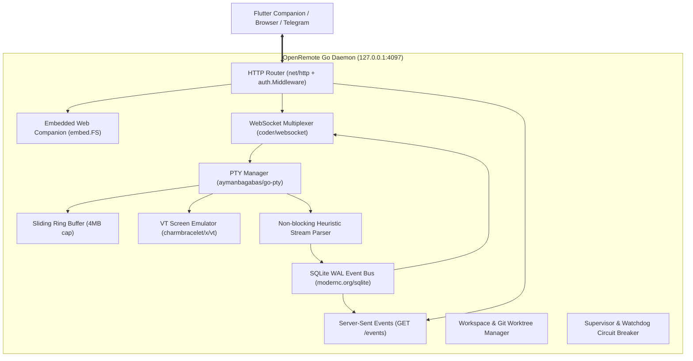
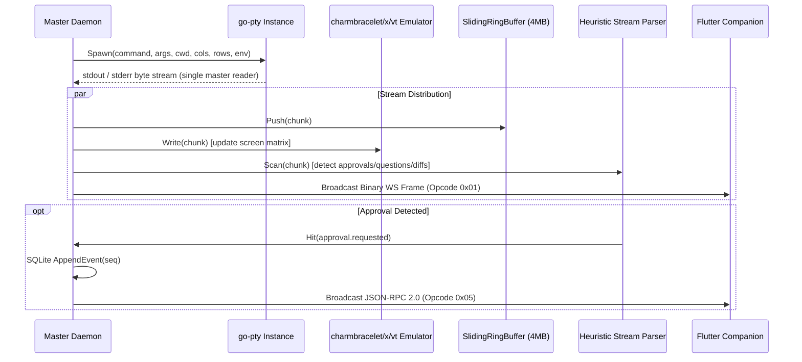
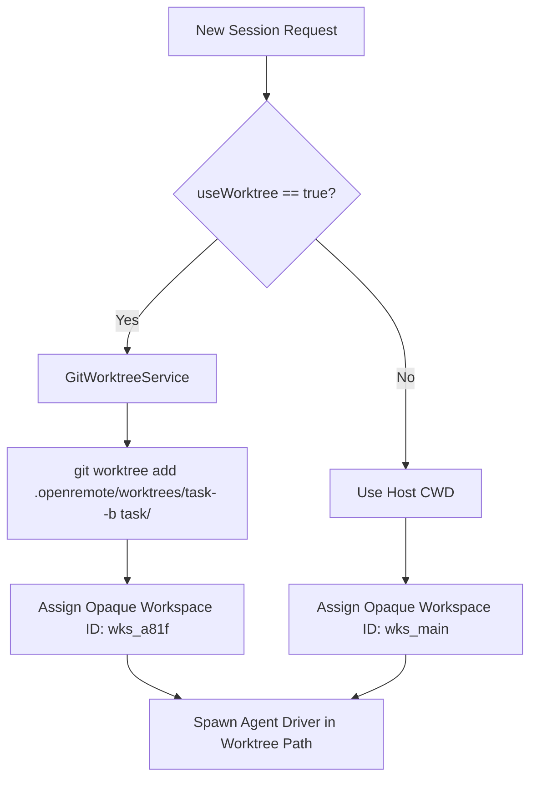

# 02. Core Daemon Specification

This document specifies the architecture, SQLite WAL event bus, PTY engine, virtual screen commit, workspace manager, and security subsystems of the **OpenRemote Go Daemon**.

---

## 1. Daemon Architecture & Master Server

The OpenRemote Daemon is compiled as a **single, self-contained Go executable** (`openremote` / `openremote.exe`) with zero external runtime dependencies (Node.js, Python, or CGO are not required).



### Transport & Route Endpoints:
- `GET /` — Serves embedded Flutter Web Companion SPA (`embed.FS`).
- `GET /ws` — High-speed 2-byte binary WebSocket multiplexer (`coder/websocket`).
- `GET /events` — Server-Sent Events (SSE) stream for lightweight / mobile clients with `?sessionId=` and `?lastSeq=` catchup.
- `GET /health` — Unauthenticated health probe (`{ "status": "ok", "uptime": 1420, "sessions": 2 }`).
- `POST /api/v1/sessions` — Create, launch, or attach to an agent session.
- `GET /api/v1/sessions` — List active and persisted sessions.
- `GET /api/v1/sessions/:id` — Query session status and fetch event catchup.
- `DELETE /api/v1/sessions/:id` — Terminate session, kill PTY, and prune worktree.
- `POST /api/v1/approval/:id` — Submit tool execution permission (`{ "approved": true/false }`).
- `POST /api/v1/question/:id` — Submit multiple-choice disambiguation answer.
- `GET /api/v1/files` — List workspace files within canonical sandbox boundaries.
- `GET /api/v1/diff/:sessionId` — Fetch accumulated unified git diff for active worktree.
- `GET /api/v1/agents` — Query supported and detected AI agent drivers.
- `GET /api/v1/tunnels` — Query Cloudflare / Tailscale tunnel status.
- `GET /api/v1/telegram/status` — Query Telegram bot status and paired chat IDs.

---

## 2. Cross-Platform PTY & Virtual Screen Engine

OpenRemote provides native pseudo-terminal management across Windows (ConPTY), Linux (openpty), and macOS using `github.com/aymanbagabas/go-pty`.



### PTY Subsystem Specifications:
1. **Dimension Clamping**: Enforces bounds (`cols`: 20–300, `rows`: 5–100) via `ClampDimensions()` to prevent buffer allocation panics.
2. **Sliding Ring Buffer**: Caps terminal history memory at 4MB per session. On client reconnection, `RingBuffer.ReadAll()` immediately hydrates the terminal scrollback without disk I/O.
3. **VT Screen Emulation (`charmbracelet/x/vt`)**:
   - Maintains an in-memory virtual terminal grid representing the current screen matrix, cursor position, text styling, and alternate screen buffers (`smcup`/`rmcup`).
   - Allows clients connecting mid-session to instantly render the full visual screen commit state rather than raw historical ANSI logs.
4. **ConPTY Worker Isolation Mode**:
   - For environments requiring fault isolation, the daemon can spawn PTY instances via `openremote pty-worker` subprocesses over stdin/stdout JSON-lines IPC, insulating the core daemon from native driver crashes.

---

## 3. Pure-Go SQLite WAL Monotonic Event Bus

All state transitions, tool approvals, user prompts, diff events, and agent outputs are stored in `~/.openremote/data/events.db` using `modernc.org/sqlite` (pure-Go, zero CGO).

```sql
PRAGMA journal_mode = WAL;
PRAGMA synchronous = NORMAL;
PRAGMA foreign_keys = ON;

-- Sessions Table
CREATE TABLE IF NOT EXISTS sessions (
    session_id TEXT PRIMARY KEY,
    workspace_id TEXT NOT NULL,
    agent_id TEXT NOT NULL,          -- 'claude-code', 'antigravity', 'opencode', 'codex', 'pi'
    cwd TEXT NOT NULL,
    worktree_path TEXT,
    branch_name TEXT,
    created_at INTEGER NOT NULL,     -- Unix milliseconds
    updated_at INTEGER NOT NULL,
    status TEXT NOT NULL             -- 'running', 'idle', 'waiting_approval', 'stopped'
);

-- Monotonic Events Table
CREATE TABLE IF NOT EXISTS events (
    seq INTEGER PRIMARY KEY AUTOINCREMENT,
    session_id TEXT NOT NULL,
    event_type TEXT NOT NULL,        -- 'chat.message', 'stream.chunk', 'approval.requested', 'question.asked', 'diff.generated', 'turn.completed'
    payload TEXT NOT NULL,           -- JSON serialized event payload
    created_at INTEGER NOT NULL,
    FOREIGN KEY(session_id) REFERENCES sessions(session_id) ON DELETE CASCADE
);

CREATE INDEX IF NOT EXISTS idx_events_session_seq ON events(session_id, seq);
```

### Reconnection Catchup Engine:
When any client disconnects (WiFi $\leftrightarrow$ 5G roaming, app backgrounding, or device reboot) and reconnects with `lastSeq = 1420`:

```go
func (b *Bus) GetEventsSince(sessionID string, lastSeq int64) ([]protocol.AgentEvent, error) {
    rows, err := b.db.Query(
        `SELECT seq, session_id, event_type, payload, created_at 
         FROM events 
         WHERE session_id = ? AND seq > ? 
         ORDER BY seq ASC`,
        sessionID, lastSeq,
    )
    if err != nil {
        return nil, err
    }
    defer rows.Close()

    var out []protocol.AgentEvent
    for rows.Next() {
        var ev protocol.AgentEvent
        var rawPayload string
        if err := rows.Scan(&ev.Seq, &ev.SessionID, &ev.Type, &rawPayload, &ev.Timestamp); err != nil {
            return nil, err
        }
        ev.Raw = json.RawMessage(rawPayload)
        out = append(out, ev)
    }
    return out, nil
}
```

---

## 4. Opaque Workspace & Git Worktree Manager

OpenRemote isolates concurrent agent tasks and protects the host working copy through **Opaque Workspaces** and **Ephemeral Git Worktrees**.



* **Filesystem Sandboxing**:
  - All file inspection endpoints (`/api/v1/files`) validate canonical paths via `filepath.Clean` and `filepath.Rel` to ensure requests cannot escape the designated workspace boundary (`ERR_PATH_TRAVERSAL`).
* **Conflict-Free Parallel Execution**:
  - Independent agents working on separate features run in dedicated worktree directories, eliminating `.git/index.lock` collisions.
* **Pruning & Merging**:
  - When a task is completed, OpenRemote can merge `task/<name>` back into the base branch and execute `git worktree remove --force`.

---

## 5. Non-Blocking Heuristic Stream Parser

The stream parser inspects incoming terminal output in real time without blocking the PTY pipeline, extracting structured events for the Chat Plane:

| Pattern / Signature | Detected Event | Client Action |
| :--- | :--- | :--- |
| `/(?:Do you want to run\|Allow)\s*[`"']([^`"']+)`?'?\s*\((?:y\/n\|yes\/no)\)/i` | `approval.requested` | Renders interactive `[Allow]` / `[Deny]` card |
| `/\?\s*Select an option:\s*\n((?:\s*\d+\)[^\n]+\n?)+)/i` | `question.asked` | Renders multiple-choice selection list |
| `/^---\s+a\/.*?\n\+\+\+\s+b\//m` | `diff.generated` | Opens split / inline syntax-highlighted diff viewer |
| `https:\/\/claude\.ai\/login\?[^\s]+` | `auth_url.detected` | Displays browser login button / QR code |
| `/(?:Done!\|Completed task\|Ready for next prompt)/i` | `turn.completed` | Triggers notification & audio chime |

---

## 6. Supervisor & Crash-Loop Circuit Breaker

The supervisor subsystem (`internal/core/supervisor`) ensures maximum daemon uptime:

1. **Watchdog Health Probe**: Periodically verifies internal subsystem responsiveness every 10 seconds.
2. **Automatic Session Recovery**: If an agent process exits unexpectedly, the session state is marked as `stopped` and the last terminal state is preserved in SQLite for review.
3. **Circuit Breaker**: If the daemon encounters $\ge 3$ consecutive fatal errors within a 15-minute window, the supervisor halts automatic restarts, preserves logs, and emits an alert to connected clients to prevent runaway CPU loops.

