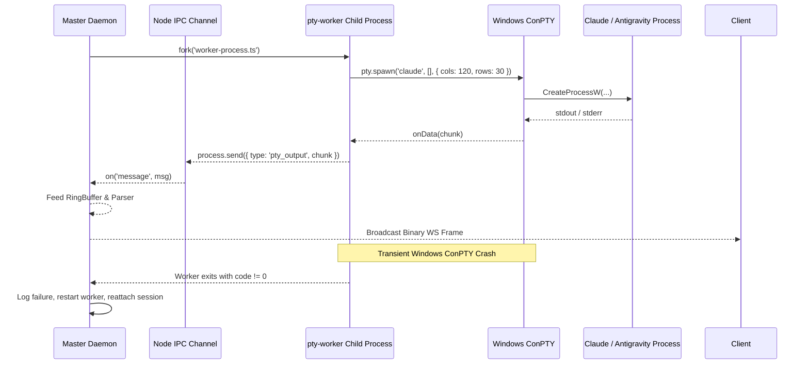
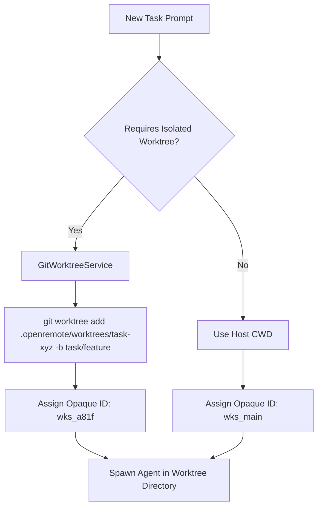

# 02. Core Daemon Specification (`@openremote/core`)

This document specifies the internal architecture, event bus, PTY supervisor, workspace isolation engine, and security subsystems of the **OpenRemote Core Daemon**.

---

## 1. Daemon Lifecycle & Master Server

* **Default Binding**: `127.0.0.1:4097`
* **Transport Layers**:
  - `GET /ws`: Multiplexed Binary & JSON RPC WebSocket endpoint
  - `GET /events`: Server-Sent Events (SSE) stream for lightweight / mobile clients
  - `POST /api/v1/sessions`: Create or attach to an agent session
  - `POST /api/v1/approval/:id`: Submit tool permission response
  - `POST /api/v1/question/:id`: Submit disambiguation answer
  - `GET /health`: Supervisor heartbeat probe (`{ "status": "ok", "uptime": 1420, "sessions": 2 }`)

---

## 2. Isolated PTY Worker Supervisor



### IPC Message Protocol:
1. `pty:spawn`: `{ sessionId: string, command: string, args: string[], cwd: string, cols: number, rows: number, env?: Record<string, string> }`
2. `pty:write`: `{ sessionId: string, data: string | Buffer }`
3. `pty:resize`: `{ sessionId: string, cols: number, rows: number }`
4. `pty:kill`: `{ sessionId: string, signal?: string }`
5. `pty:output`: `{ sessionId: string, chunk: Buffer }`
6. `pty:exit`: `{ sessionId: string, exitCode: number, signal?: number }`

---

## 3. SQLite WAL Event Bus Schema

All state transitions, tool invocations, approvals, and diff events are persisted in `~/.openremote/data/events.db` using SQLite with WAL (`Write-Ahead Logging`) mode.

```sql
PRAGMA journal_mode = WAL;
PRAGMA synchronous = NORMAL;
PRAGMA foreign_keys = ON;

-- Sessions Table
CREATE TABLE IF NOT EXISTS sessions (
    session_id TEXT PRIMARY KEY,
    workspace_id TEXT NOT NULL,
    agent_id TEXT NOT NULL,          -- 'claude-code', 'antigravity', 'opencode', 'codex', 'pi'
    cwd TEXT NOT NULL,
    worktree_path TEXT,
    branch_name TEXT,
    created_at INTEGER NOT NULL,
    updated_at INTEGER NOT NULL,
    status TEXT NOT NULL             -- 'running', 'idle', 'waiting_approval', 'stopped'
);

-- Monotonic Events Table
CREATE TABLE IF NOT EXISTS events (
    seq INTEGER PRIMARY KEY AUTOINCREMENT,
    session_id TEXT NOT NULL,
    event_type TEXT NOT NULL,        -- 'stream_chunk', 'approval_requested', 'diff_generated', 'question_asked', 'turn_completed'
    payload TEXT NOT NULL,           -- JSON serialized event body
    created_at INTEGER NOT NULL,
    FOREIGN KEY(session_id) REFERENCES sessions(session_id) ON DELETE CASCADE
);

CREATE INDEX IF NOT EXISTS idx_events_session_seq ON events(session_id, seq);
```

### Reconnection Catchup Engine:
When a client reconnects and sends `lastSeq = 1420`:
```typescript
export function getEventsSince(sessionId: string, lastSeq: number): AgentEvent[] {
  const stmt = db.prepare('SELECT seq, event_type, payload, created_at FROM events WHERE session_id = ? AND seq > ? ORDER BY seq ASC');
  const rows = stmt.all(sessionId, lastSeq);
  return rows.map(r => ({
    seq: r.seq,
    type: r.event_type,
    ...JSON.parse(r.payload),
    timestamp: r.created_at
  }));
}
```

---

## 4. Opaque Workspace & Git Worktree Manager



* **Clean Separation**:
  - Directory state (git branches, unstaged files) is shared only within the worktree.
  - Session state (prompts, undo history, tool approvals) is strictly isolated under `wks_<hex>`.
* **Merge & Cleanup**:
  - Upon task completion, the client UI provides a `[Merge to Main]` button that executes `git checkout main && git merge --no-ff task/feature`, followed by `git worktree remove --force`.

---

## 5. Non-Blocking Heuristic State Machine

The parser continuously scans incoming chunks without pausing the terminal stream:

| State Trigger | Regex / AST Signature | Emitted Event | Client UI Action |
| :--- | :--- | :--- | :--- |
| **Tool Approval** | `/(?:Do you want to run\|Allow)\s*[`"']([^`"']+)`?'?\s*\((?:y\/n\|yes\/no)\)/i` | `approval.requested` | Renders `[Allow]` / `[Deny]` action buttons |
| **Disambiguation Question** | `/\?\s*Select an option:\s*\n((?:\s*\d+\)[^\n]+\n?)+)/i` | `question.asked` | Renders selection radio list / sheet |
| **Unified Diff** | `/^---\s+a\/.*?\n\+\+\+\s+b\//m` | `diff.generated` | Opens side-by-side / inline syntax diff card |
| **OAuth Device Flow** | `https:\/\/claude\.ai\/login\?[^\s]+` | `auth_url.detected` | Displays clickable browser login banner |
| **Agent Turn Finished** | `/(?:Done!\|Completed task\|Ready for next prompt)/i` | `turn.completed` | Plays audio chime & fires push notification |

---

## 6. Watchdog & Crash-Loop Circuit Breaker

* **Heartbeat**: Watchdog polls `http://127.0.0.1:4097/health` every 10 seconds.
* **Failure Window**: If 3 consecutive health checks fail, the watchdog:
  1. Sends a `SIGTERM` followed by `SIGKILL` to unresponsive PID.
  2. Inspects SQLite WAL database integrity (`PRAGMA integrity_check`).
  3. Restarts the daemon with session recovery.
* **Circuit Breaker**: If the daemon crashes $\ge 3$ times within 15 minutes, auto-restart is halted and an emergency alert is pushed to Telegram / Webhook to prevent CPU/battery runaway.
