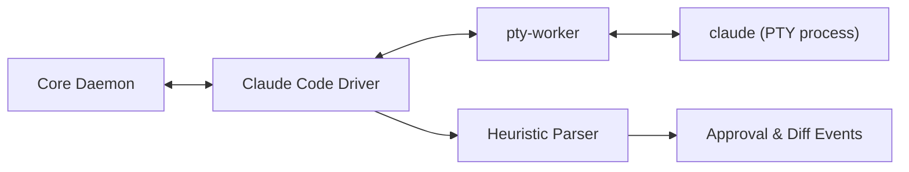
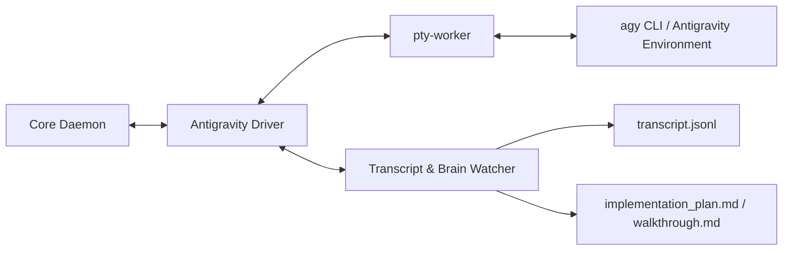
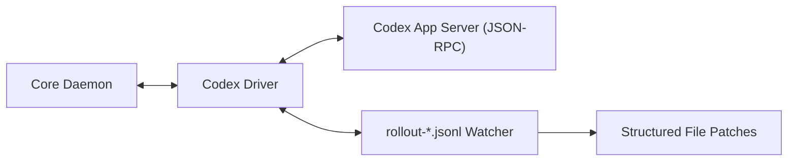
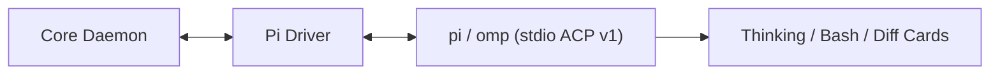

# 03. Agent Drivers Specification (`@openremote/driver-*`)

This document details the interface contracts, command invocations, input injection strategies, and stream hooks for the 5 target AI coding assistants.

---

## 1. Unified Driver Interface (`IAgentDriver`)

Every agent driver implements the following TypeScript interface:

```typescript
import { EventEmitter } from 'events';
import { AgentCapabilities, SessionConfig, SessionHandle, AgentEvent } from '@openremote/shared-protocol';

export interface IAgentDriver extends EventEmitter {
  readonly agentId: 'claude-code' | 'antigravity' | 'opencode' | 'codex' | 'pi';
  readonly displayName: string;
  readonly capabilities: AgentCapabilities;

  // Lifecycle
  startSession(config: SessionConfig): Promise<SessionHandle>;
  stopSession(sessionId: string): Promise<void>;
  restartSession(sessionId: string): Promise<SessionHandle>;

  // Input & Approvals
  sendPrompt(sessionId: string, prompt: string): Promise<void>;
  sendRawInput(sessionId: string, data: Buffer | string): Promise<void>;
  sendApproval(sessionId: string, approvalId: string, approved: boolean): Promise<void>;
  sendAnswer(sessionId: string, questionId: string, answer: string | number): Promise<void>;

  // Viewport & Terminal
  resizeViewport(sessionId: string, cols: number, rows: number): Promise<void>;

  // Event Hooks
  on(event: 'stream', listener: (sessionId: string, chunk: Buffer) => void): this;
  on(event: 'event', listener: (sessionId: string, event: AgentEvent) => void): this;
  on(event: 'exit', listener: (sessionId: string, code: number) => void): this;
}
```

---

## 2. Driver 1: Claude Code (`@openremote/driver-claude`)



* **Target Binary**: `claude` (auto-located via `PATH`, `~/.npm-global/bin`, or `AppData/Roaming/npm/claude.cmd` on Windows).
* **Launch Arguments**:
  - Default: `["--no-auto-updater"]`
  - Dual Mode (Terminal + Claude.ai): `["--remote-control", sessionTitle]`
* **Input Strategy**:
  - Uses **Bracketed Paste Mode** (`\x1b[200~` + `prompt` + `\x1b[201~\n`) to prevent line-by-line interpretation on multi-line prompts.
* **Specialized Hooks**:
  - Intercepts `can_use_tool` / bash confirmation dialogs.
  - Automatically resolves OAuth device-flow URLs (`https://claude.ai/login?...`).
  - Holds stdin open to preserve background tool executions across turns.

---

## 3. Driver 2: Antigravity (`@openremote/driver-antigravity`)



* **Target Binary**: `agy` CLI or environment runner.
* **Integration Strategy**:
  - **Dual Channel**: High-speed PTY console paired with real-time file watching on `<appDataDir>/brain/<conversation-id>/.system_generated/logs/transcript.jsonl`.
* **Specialized Hooks**:
  - Parses structured subagent invocations (`invoke_subagent`), status transitions, and planning mode artifacts (`implementation_plan.md`).
  - Emits native `artifact.updated` events with markdown diffs directly to the client UI.

---

## 4. Driver 3: OpenCode (`@openremote/driver-opencode`)


* **Target Binary**: `opencode serve --port <port> --hostname 127.0.0.1`.
* **Port Allocation**: Dynamic range `14097`–`14200`.
* **Communication Channel**:
  - Loopback HTTP + Server-Sent Events (`/event`).
  - Streams `message.part.updated`, `session.idle`, `session.error`.
* **Specialized Hooks**:
  - Translates `permission.asked` events to OpenRemote approval cards and posts response to `/permission/:id/reply`.
  - Translates `question.asked` to OpenRemote question cards and posts response to `/question/:id/reply`.
  - Injects `x-opencode-directory: <path>` header for multi-workspace isolation on a single daemon.

---

## 5. Driver 4: OpenAI Codex (`@openremote/driver-codex`)



* **Target Binary**: `codex` in App Server mode.
* **Communication Channel**: JSON-RPC 2.0 over Unix domain socket or loopback TCP.
* **Specialized Hooks**:
  - Reads `~/.codex/sessions/**/rollout-*.jsonl` with read-sharing mode to stream tool outputs without locking out active threads.
  - Formats structured tool execution steps into visual collapsible widgets.

---

## 6. Driver 5: Pi / Oh My Pi (`@openremote/driver-pi`)



* **Target Binary**: `pi` or `omp`.
* **Communication Channel**: Agent Client Protocol (ACP v1) framing over stdio pipes.
* **Specialized Hooks**:
  - Negotiates tool call permissions over ACP JSON-RPC.
  - Maps native ACP stream deltas to OpenRemote's universal event bus.
