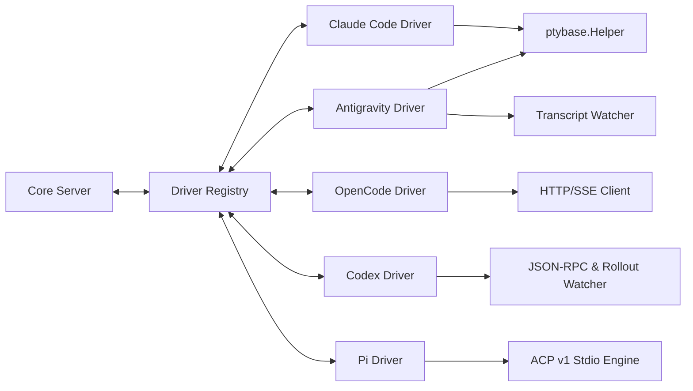
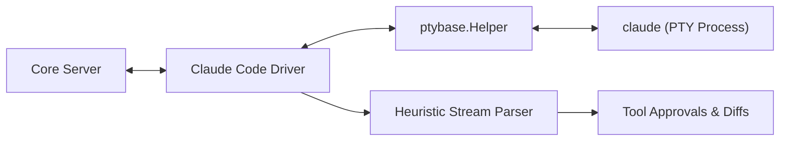
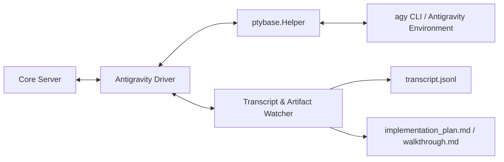
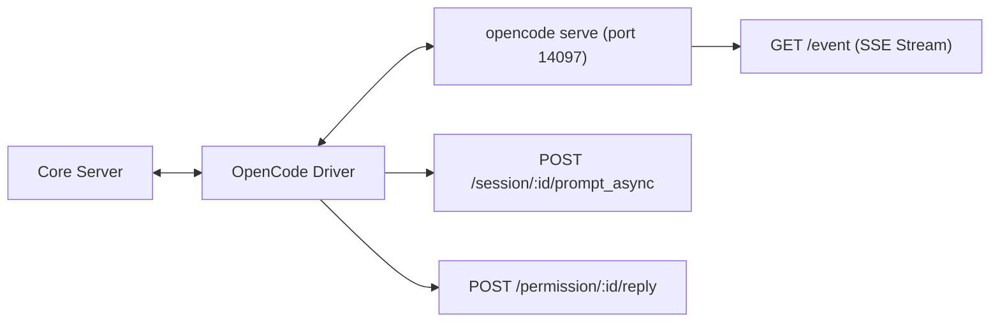
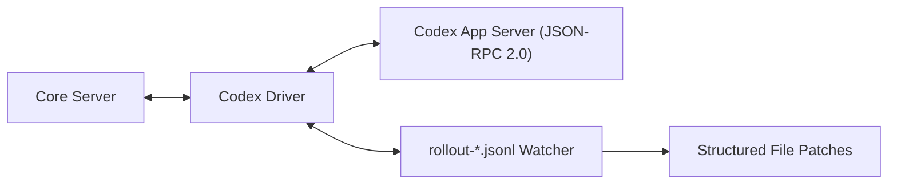
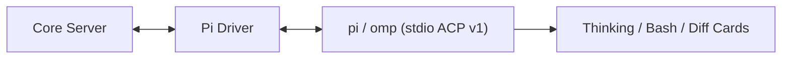

# 03. Agent Drivers Specification

This document details the interface contracts, command invocations, input injection strategies, and stream hooks for the 5 target AI coding assistants in the **OpenRemote Go Daemon**.

---

## 1. Unified Go Driver Architecture (`internal/driver`)

All agent adapters in OpenRemote implement a unified set of Go interfaces designed for high concurrency, zero memory leakage, and clean lifecycle management.



### Core Interface Contracts:

```go
package driver

import (
    "context"
    "github.com/morewebs/OpenRemote/internal/protocol"
)

// Sink receives stream deltas and structured events from active sessions.
type Sink interface {
    OnChunk(sessionID string, chunk []byte)
    OnEvent(sessionID string, event protocol.AgentEvent)
    OnExit(sessionID string, code int, signal string)
}

// Capabilities declares features supported by an agent runtime.
type Capabilities struct {
    SupportsWorktrees      bool `json:"supportsWorktrees"`
    SupportsApprovals      bool `json:"supportsApprovals"`
    SupportsDisambiguation bool `json:"supportsDisambiguation"`
    SupportsDiffStreams    bool `json:"supportsDiffStreams"`
    SupportsACP            bool `json:"supportsACP"`
}

// Driver manages the lifecycle of an AI coding agent runtime.
type Driver interface {
    AgentID() protocol.AgentID
    DisplayName() string
    Capabilities() Capabilities

    StartSession(ctx context.Context, cfg SessionConfig, sink Sink) (Session, error)
    StopSession(sessionID string) error
}

// Session represents an active, interactive agent session.
type Session interface {
    SessionID() string
    WorkspaceID() string
    WorktreePath() string
    Status() protocol.SessionStatus

    SendPrompt(prompt string) error
    SendRawInput(data []byte) error
    SendApproval(approvalID string, approved bool) error
    SendAnswer(questionID string, answer any) error
    ResizeViewport(cols, rows int) error

    StreamCh() <-chan []byte
    EventCh() <-chan protocol.AgentEvent
    ExitCh() <-chan int
    Close() error
}
```

### Shared PTY Helper (`internal/driver/ptybase`):
The `ptybase.Helper` struct provides standard functionality for PTY-driven agents:
- Cross-platform binary path resolution (`PATH`, npm global prefixes, Win32 `.cmd` stubs).
- Environment sanitization (`TERM=xterm-256color`, `COLORTERM=truecolor`, UTF-8 encoding).
- **Bracketed Paste Mode** wrapping: `\x1b[200~` + prompt + `\x1b[201~\n` to prevent terminal line-buffering truncation on multiline inputs.
- Sliding ring buffer (4MB memory cap) and `charmbracelet/x/vt` screen state capture.

---

## 2. Driver 1: Claude Code (`internal/driver/claude`)



* **Target Binary**: `claude` (auto-located via `PATH`, `~/.npm-global/bin`, `%APPDATA%\npm\claude.cmd`, `/usr/local/bin/claude`).
* **Launch Arguments**:
  - Default: `["--no-auto-updater"]` (prevents unexpected background CLI updates during active turns).
  - Dual Mode (Terminal + Claude.ai): `["--remote-control", sessionTitle]`.
* **Input Strategy**:
  - Encapsulates multi-line prompts in **Bracketed Paste Mode** sequences to guarantee atomic submission.
  - Keeps standard input open continuously to preserve background tool executions across turns.
* **Specialized Hooks**:
  - Intercepts `can_use_tool` / bash confirmation dialogs and synthesizes `approval.requested` events.
  - Automatically resolves OAuth device-flow URLs (`https://claude.ai/login?...`) and emits clickable login action events.

---

## 3. Driver 2: Antigravity (`internal/driver/antigravity`)



* **Target Binary**: `agy` CLI or environment runner.
* **Dual-Channel Integration**:
  - **Console Plane**: Real-time interactive PTY console for CLI execution.
  - **Structured Log Plane**: `fsnotify` file watcher monitoring `<appDataDir>/brain/<conversation-id>/.system_generated/logs/transcript.jsonl`.
* **Specialized Hooks**:
  - Parses structured subagent invocations (`invoke_subagent`), tool step transitions, and planner thinking states directly from JSONL lines.
  - Watches `<appDataDir>/brain/<conversation-id>/implementation_plan.md` and `walkthrough.md`, emitting `artifact.updated` events with live unified diffs to the client UI.

---

## 4. Driver 3: OpenCode (`internal/driver/opencode`)



* **Target Binary**: `opencode serve --port <port> --hostname 127.0.0.1`.
* **Port Allocation**: Dynamic allocation range `14097`–`14200`.
* **Communication Channel**: Loopback HTTP REST + Server-Sent Events (`GET /event`).
* **Specialized Hooks**:
  - Maps `permission.asked` events directly to OpenRemote `approval.requested` cards and dispatches user responses to `POST /permission/:id/reply`.
  - Maps `question.asked` to OpenRemote `question.asked` cards and dispatches answers to `POST /question/:id/reply`.
  - Injects `x-opencode-directory: <path>` header for multi-workspace directory isolation on a single daemon instance.

---

## 5. Driver 4: OpenAI Codex (`internal/driver/codex`)



* **Target Binary**: `codex` in App Server mode.
* **Communication Channel**: JSON-RPC 2.0 over loopback TCP or Unix domain socket.
* **Specialized Hooks**:
  - Streams tool execution steps and thought traces via non-blocking read-sharing on `~/.codex/sessions/**/rollout-*.jsonl`.
  - Formats structured tool execution outputs into collapsible interactive widgets.

---

## 6. Driver 5: Pi / Oh My Pi (`internal/driver/pi`)



* **Target Binary**: `pi` or `omp`.
* **Communication Channel**: Agent Client Protocol (ACP v1) JSON-RPC framing over standard I/O pipes.
* **Specialized Hooks**:
  - Probe-gated capability negotiation during initial session handshake.
  - Negotiates tool call permissions over ACP JSON-RPC channels and maps stream deltas to OpenRemote's monotonic event bus.

