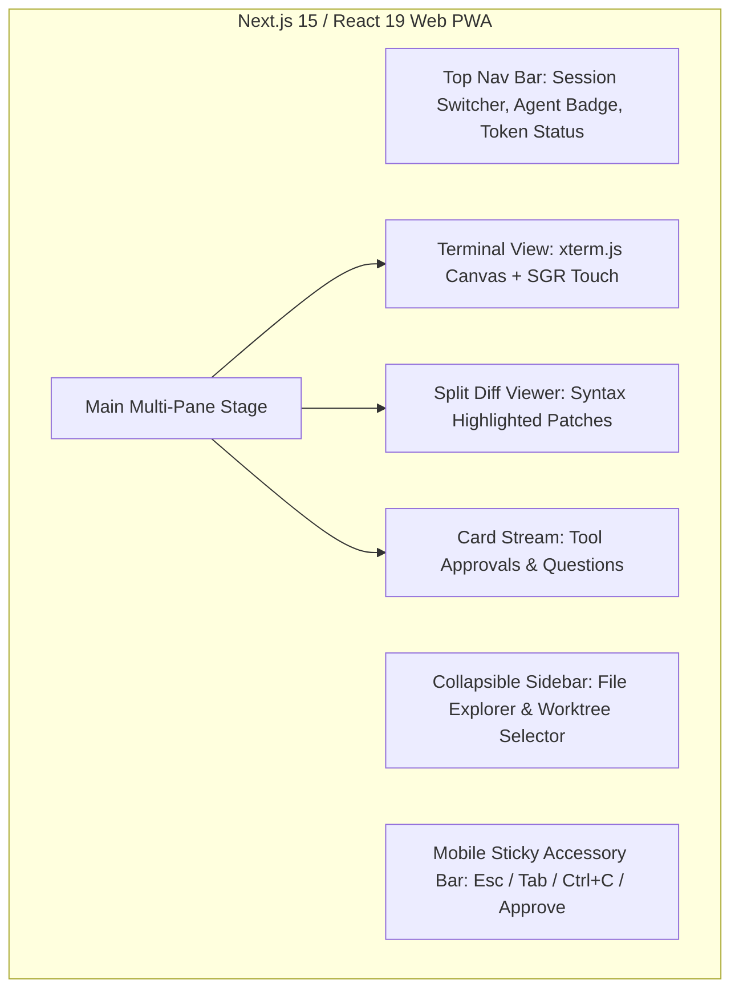
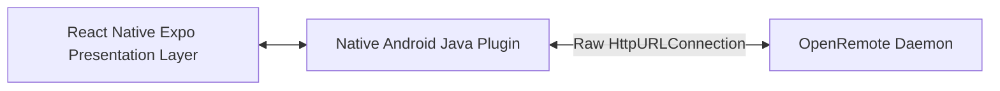

# 05. Client Applications Specification (`apps/*`)

This document defines the user interface layouts, interaction flows, offline resilience, and implementation details for the three client applications: **Web PWA**, **Telegram Bot**, and **Mobile Companion**.

---

## 1. Client App 1: Web PWA (`apps/web-pwa`)



### Key Technical Specs:
* **Framework**: Next.js 15 (App Router) + React 19 + Tailwind CSS + Lucide Icons.
* **Terminal Engine**: `@xterm/xterm` with `@xterm/addon-canvas`, `@xterm/addon-fit`, and `@xterm/addon-web-links`.
* **State Preservation**: Tabs (Chat / Terminal / Diffs) remain mounted in the React DOM with CSS `display: none` (`hidden`) toggles, preserving terminal cursor position, scroll offsets, and active form input states during tab switching.
* **Touch-to-SGR Translation**: Intercepts touch swipes on mobile viewports and synthesizes `\x1b[<64;1;1M` / `\x1b[<65;1;1M` SGR mouse wheel sequences for native scrolling in `tmux` and full-screen TUIs.
* **PWA Capabilities**: Offline caching of static assets, Web App Manifest (`manifest.json`), service worker for Web Push notification delivery upon agent task completion.

---

## 2. Client App 2: Telegram Bot Companion (`apps/telegram-bot`)

```mermaid
graph LR
    User[Telegram Mobile / Desktop] <--> BotAPI[Telegram Cloud API]
    BotAPI <--> BotService[OpenRemote Telegram Bridge]
    BotService <--> Core[OpenRemote Core Daemon (127.0.0.1:4097)]
```

### Key Technical Specs:
* **Framework**: Node.js 22 + `grammy` (or `telegraf`) + `better-sqlite3`.
* **2.0s Draft Streaming Throttler**:
  - Accumulates incoming token chunks from the daemon event bus.
  - Edits the active Telegram placeholder message at throttled intervals of $\ge 2.0\text{s}$ to eliminate `429 Too Many Requests` flood limits.
  - Runs a background `TypingIndicator` loop calling `sendChatAction("typing")` every 4.5 seconds.
  - Automatically seals messages at newline boundaries when crossing 4,000 characters.
* **Interactive Approval Keyboards**:
  - Emits inline keyboard buttons (`✅ Approve`, `❌ Deny`, `✏️ Edit`) for tool confirmation events.
* **Forum Topic Multi-Tenancy**:
  - Automatically maps each active project or task worktree to a dedicated Telegram Forum Topic (`message_thread_id`), providing clean conversation isolation.
* **Document Auto-Upload**:
  - Detects files modified by the agent and auto-uploads them as downloadable Telegram `.md` or `.patch` documents.

---

## 3. Client App 3: Mobile Companion (`apps/mobile-companion`)



### Key Technical Specs:
* **Framework**: React Native 0.81+ with Expo Router + Native Android Java Plugin (`LiveEventsPlugin.java`).
* **Native Background SSE Engine**:
  - Uses raw Java `HttpURLConnection` on an `ExecutorService` with `setReadTimeout(0)` and infinite keep-alive.
  - Immune to Android WebView sleep, Doze mode, and JavaScript background event loop throttling.
* **Mobile Keyboard Accessory Toolbar**:
  - Fixed toolbar anchored directly above the software keyboard providing terminal modifier keys (`Esc`, `Tab`, `Ctrl+C`, `Ctrl+D`, `/approve`, `/stop`).
* **Touch-vs-Pointer Enter Key Inversion**:
  - On touch devices (`pointer: coarse`), pressing **Enter** inserts a newline, while **Ctrl+Enter** or the on-screen **Send** button submits the prompt.
* **Zero-Latency Audio Priming**:
  - Pre-warms HTML5 audio upon prompt submission touch gesture so turn completion audio (`audio/chime.aac`) plays without mobile browser autoplay blocking.
