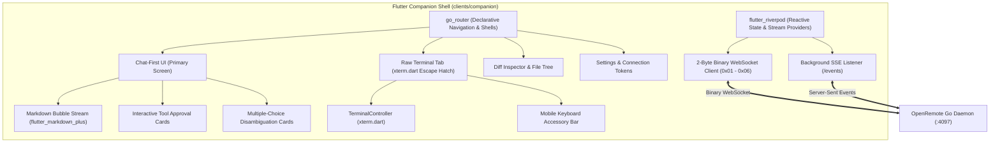
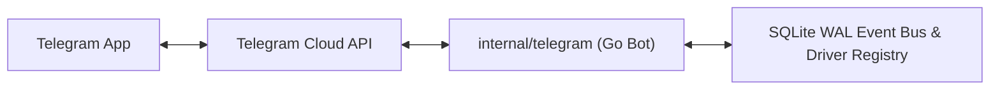

# 05. Client Applications Specification

This document defines the architecture, user experience, and technical implementations for the **Flutter Companion** multi-platform client and the embedded **Go Telegram Bot**.

---

## 1. Unified Flutter Companion (`clients/companion`)

OpenRemote provides a **single, unified Flutter codebase** targeting **Web** (embedded in the Go binary and standalone PWA), **Android**, **iOS**, **Windows**, **macOS**, and **Linux**.



### Core Flutter Architecture & Packages:
- **State Plane**: `flutter_riverpod` (v2.6+) manages scoped stream providers for WebSocket frames, session collections, approval queues, and connectivity state.
- **Routing & Shells**: `go_router` (v14+) provides declarative URL routing (`/session/:id`, `/settings`), deep linking, responsive side rail for desktop, and bottom navigation for mobile.
- **Terminal Rendering**: `xterm.dart` (pure Dart hardware-accelerated VT100 / ANSI terminal emulator) with touch gesture support, custom color themes, and selection handles.
- **Rich Text & Markdown**: `flutter_markdown_plus` renders markdown responses, syntax-highlighted code blocks, tool executions, and collapsible thinking traces.

---

## 2. Chat-First UI & Interactive Cards

The primary interaction surface in OpenRemote is a **conversational chat stream**:

```text
┌─────────────────────────────────────────────────────────────┐
│ ⚡ OpenRemote  [ses_9a81f • Claude Code]  🟢 Connected   [⚙] │
├─────────────────────────────────────────────────────────────┤
│ 👤 User                                       14:20:10     │
│ Refactor the authentication subsystem to verify Bearer      │
│ tokens using constant-time comparison.                      │
├─────────────────────────────────────────────────────────────┤
│ 🤖 Claude Code                                14:20:15     │
│ I'll inspect `internal/core/auth/auth.go` and update the    │
│ token comparison logic.                                     │
│                                                             │
│ ┌─ ⚠️ Tool Approval Requested ────────────────────────────┐ │
│ │ Tool: Bash                                              │ │
│ │ Command: `go test -v ./internal/core/auth`              │ │
│ │ Auto-deny in 04:52                                      │ │
│ │                                                         │ │
│ │ [  ✅ Allow  ]    [  ❌ Deny  ]    [  🛡️ Always Allow ]  │ │
│ └─────────────────────────────────────────────────────────┘ │
├─────────────────────────────────────────────────────────────┤
│ [Esc] [Tab] [Ctrl+C] [Ctrl+D] [↑] [↓] [/approve] [/stop]     │
├─────────────────────────────────────────────────────────────┤
│ [ Enter prompt or terminal command...               ] [ 🚀 ] │
└─────────────────────────────────────────────────────────────┘
```

### 1. Interactive Tool Approval Cards
- Emitted upon `approval.requested` events.
- Displays tool name chip (`Bash`, `FileEdit`, `Browser`), full command in monospace typography, and optional description.
- Action Buttons: `[✅ Allow]` (emerald-600), `[❌ Deny]` (rose-600), `[🛡️ Always Allow for Session]` (zinc-700).
- Visual countdown progress bar for `autoDenyTimeoutMs`.

### 2. Disambiguation Question Cards
- Emitted upon `question.asked` events.
- Displays question prompt with selectable radio options (single-select) or checkbox items (multi-select).
- Includes write-in text field for custom instructions.
- Submits response payload directly via REST `POST /api/v1/question/:id` or WebSocket RPC.

### 3. Split & Unified Git Diff Inspector
- Shows accumulated modified files and hunks in the active task worktree.
- Syntax-highlighted additions (green `#10B981`) and deletions (red `#F43F5E`).

---

## 3. Secondary Terminal Escape Hatch (`xterm.dart`)

For workflows requiring full ANSI terminal interactions (e.g., interactive curses menus, `htop`, raw debugger shells, or CLI login prompts), users can switch to the **Terminal Tab**:

- **Zero-Copy Streaming**: Raw PTY output bytes arriving on WebSocket Opcode `0x01` are piped directly into `xterm.dart`'s buffer.
- **Keystroke Passthrough**: Keystrokes are captured and dispatched via Opcode `0x02`.
- **Mobile Keyboard Accessory Bar**:
  - Sticky modifier row anchored directly above the software keyboard providing: `Esc`, `Tab`, `Ctrl+C`, `Ctrl+D`, `↑`, `↓`, `/approve`, `/stop`.
- **Touch Enter Key Inversion**:
  - On touch viewports, pressing **Enter** inserts a newline in multiline prompts, while the on-screen **Send** button or **Ctrl+Enter** submits the turn.

---

## 4. Pure-Go Telegram Bot Companion (`internal/telegram`)

OpenRemote embeds a zero-dependency Telegram bot bridge directly inside the Go daemon binary:



### Key Technical Specs:
1. **2.0s Debounced Draft Streaming**:
   - Buffers incoming stream tokens from the agent.
   - Throttles message edits to $\ge 2.0\text{s}$ intervals to strictly avoid Telegram `429 Too Many Requests` rate limits.
   - Maintains a background `sendChatAction("typing")` heartbeat every 4.5s while the agent is generating.
   - Auto-chunks messages at paragraph/line boundaries when approaching the 4,096-character limit.
2. **Inline Approval Keyboards**:
   - Renders interactive Telegram inline keyboard buttons (`✅ Approve`, `❌ Deny`, `✏️ Edit`) for pending approvals.
3. **Forum Topic Isolation**:
   - Automatically allocates a separate Telegram Forum Topic (`message_thread_id`) per active session/worktree, keeping project conversations cleanly organized.
4. **Document Auto-Upload**:
   - Detects modified code files and uploads them directly to the Telegram chat as downloadable attachments.

---

## 5. Offline Resilience & Reconnection Protocol

1. **Monotonic Sequence Replay (`seq`)**:
   - When the Flutter app or mobile service reconnects after network loss (e.g., subway, elevator, or WiFi-to-Cellular handover), it transmits `OpcodeCatchup` (`0x04`) with `lastSeq`.
   - The Go daemon immediately replays missing events from SQLite WAL, ensuring zero dropped approvals or messages.
2. **Sliding Ring Buffer Terminal Hydration**:
   - The 4MB in-memory sliding ring buffer delivers the full recent terminal scrollback upon reconnecting to the terminal tab without blocking disk I/O.

