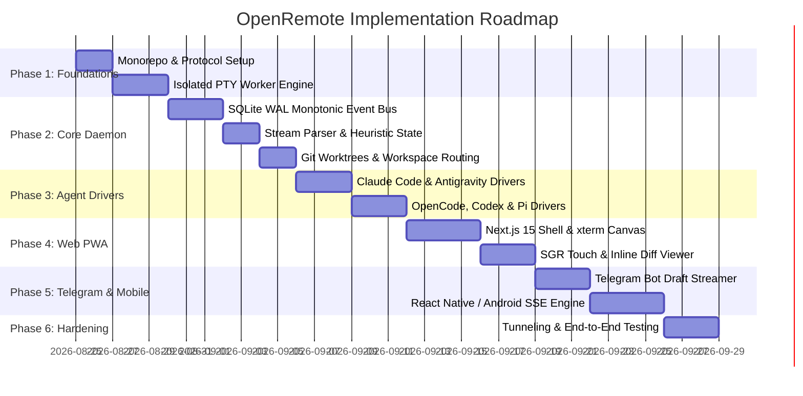

# 06. Implementation Roadmap & Execution Phases

This document lays out the step-by-step development roadmap for implementing **OpenRemote** from the foundational protocol layer up to the multi-client user surfaces.

---

## 1. Roadmap Overview & Timeline

---

## 2. Phase-by-Phase Deliverables

### Phase 1: Monorepo Foundation & Protocol (`@openremote/shared-protocol`, `@openremote/pty-worker`)
* [ ] Initialize pnpm workspace and Turborepo configuration (`package.json`, `pnpm-workspace.yaml`, `turbo.json`).
* [ ] Implement `@openremote/shared-protocol`:
  - 2-byte binary WebSocket framing encoders/decoders (`[Opcode, Slot, Payload]`).
  - Zod schemas for all event types (`StreamChunk`, `ApprovalRequested`, `QuestionAsked`, `DiffGenerated`, `TurnCompleted`).
* [ ] Implement `@openremote/pty-worker`:
  - Child process entrypoint trapping Windows ConPTY C++ exceptions.
  - Viewport dimension clamping and bounded sliding ring buffer (4MB).

### Phase 2: Core Daemon Engine (`@openremote/core`)
* [ ] Master HTTP & WebSocket server binding to `127.0.0.1:4097`.
* [ ] Cryptographic 256-bit bearer token generation with `0o600` permissions.
* [ ] SQLite WAL monotonic event bus (`events.db`) with `lastSeq` reconnection catchup.
* [ ] Non-blocking heuristic regex stream parser for approvals, questions, and diffs.
* [ ] Opaque workspace manager (`wks_<hex>`) and ephemeral Git worktree manager (`git worktree add task/<hash>`).
* [ ] Out-of-band dead-man watchdog and crash-loop circuit breaker.

### Phase 3: Multi-Agent Driver Suite (`@openremote/driver-*`)
* [ ] `@openremote/driver-claude`: Claude Code bracketed paste injection, held stdin stream, OAuth login detector.
* [ ] `@openremote/driver-antigravity`: Antigravity brain/transcript.jsonl watcher, artifact sync, planning mode hooks.
* [ ] `@openremote/driver-opencode`: `opencode serve` daemon supervision, `/event` SSE listener, and permission reply REST bridge.
* [ ] `@openremote/driver-codex`: Codex App Server JSON-RPC channel and rollout JSONL reader.
* [ ] `@openremote/driver-pi`: Pi ACP v1 stdio protocol adapter.

### Phase 4: Web PWA Client (`apps/web-pwa`)
* [ ] Next.js 15 (App Router) + React 19 + Tailwind CSS setup.
* [ ] Hardware-accelerated terminal using `@xterm/xterm` (Canvas Addon) and binary WebSocket streaming.
* [ ] SGR mouse touch translation for mobile scrollback in `tmux`/alternate screen buffers.
* [ ] Split-view and inline git diff visualizer for file patch reviews.
* [ ] Interactive card streams for human-in-the-loop tool approvals (`[Allow]` / `[Deny]`).
* [ ] Web Push service worker and PWA manifest.

### Phase 5: Telegram Bot & Mobile Companion (`apps/telegram-bot`, `apps/mobile-companion`)
* [ ] `@openremote/telegram-bot`:
  - 2.0s streaming debouncer with background `TypingIndicator` loop.
  - Inline keyboard buttons for tool approvals and plan confirmations.
  - Forum Topic mapping per active project/worktree.
  - Modified document auto-uploader.
* [ ] `@openremote/mobile-companion`:
  - React Native / Expo application shell.
  - Native Android Java SSE service with `setReadTimeout(0)`.
  - Mobile soft-keyboard accessory toolbar (`Esc`, `Tab`, `Ctrl+C`, `Ctrl+D`, `/approve`).
  - Touch Enter key inversion (Enter = newline, Send button = submit).

### Phase 6: CLI Tooling, Tunneling & Verification (`tools/cli`)
* [ ] Global `openremote` CLI runner (`openremote start`, `openremote connect`, `openremote token`, `openremote tunnel`).
* [ ] Cloudflare Tunnel (`cloudflared`) and Tailscale mesh VPN auto-launchers.
* [ ] End-to-end integration testing across Windows, macOS, and Linux.
* [ ] Documentation walkthrough and developer quickstart guide.
