# 07. Design System & UI Specifications

This document defines the visual design system, color tokens, typography scales, interactive component states, and responsive layout guidelines for the **OpenRemote Flutter Companion** and Web interfaces.

---

## 1. Design Philosophy

- **High-Contrast Dark Mode First**: Engineered for developer focus during long debugging and coding sessions.
- **Immediate Visual Hierarchy**: Critical human-in-the-loop decision points (tool permissions, multiple-choice questions, fatal alerts) demand immediate optical salience.
- **True Multi-Platform Consistency**: Identical token semantics and component ergonomics across Web SPA, Mobile (Android / iOS), and Desktop (Windows / macOS / Linux).

---

## 2. Color System & Design Tokens

```text
┌────────────────────────────────────────────────────────────────────────┐
│  Zinc-950 Canvas (#09090B)                                            │
│  ┌──────────────────────────────────────────────────────────────────┐  │
│  │  Zinc-900 Surface Card (#18181B)                                 │  │
│  │  Border: Zinc-800 (#27272A)                                      │  │
│  │                                                                  │  │
│  │  Primary Accent: Royal Purple (#7C3AED / Violet-600)             │  │
│  │  Success: Emerald (#10B981)   Danger: Rose (#F43F5E)             │  │
│  │  Warning: Amber (#F59E0B)     Info: Sky (#0EA5E9)                │  │
│  └──────────────────────────────────────────────────────────────────┘  │
└────────────────────────────────────────────────────────────────────────┘
```

### 1. Neutral Palette (Zinc / Slate)

| Token | Hex Code | Usage |
| :--- | :---: | :--- |
| `bg-canvas` | `#09090B` | Root application background and raw terminal background |
| `bg-surface` | `#18181B` | Chat container, sidebar, bottom navigation, and cards |
| `bg-elevated` | `#27272A` | Inset code blocks, hover states, modals, and tooltips |
| `border-subtle` | `#27272A` | Default component borders and list dividers |
| `border-strong` | `#3F3F46` | Active input borders, focused cards, and divider bars |
| `text-primary` | `#F4F4F5` | Primary headings, message body text, and active labels |
| `text-secondary`| `#A1A1AA` | Timestamps, agent role chips, and metadata badges |
| `text-muted` | `#71717A` | Placeholder inputs, disabled controls, and icons |

### 2. Primary Brand Accent (Royal Purple / Violet)

| Token | Hex Code | Usage |
| :--- | :---: | :--- |
| `accent-primary` | `#7C3AED` | Primary buttons, active navigation indicator, user chat bubble |
| `accent-hover` | `#6D28D9` | Hover state for accent buttons and active toggles |
| `accent-subtle` | `#2E1065` | User message bubble background (tinted), active item selection |
| `accent-glow` | `rgba(124, 58, 237, 0.35)` | Focus ring elevation and active turn pulse effect |

### 3. Semantic & Feedback Colors

| Semantic Token | Hex Code | Usage |
| :--- | :---: | :--- |
| `color-success` | `#10B981` | `[✅ Allow]` tool approval button, git patch additions, online badge |
| `color-danger` | `#F43F5E` | `[❌ Deny]` button, git patch deletions, crash alerts, kill session |
| `color-warning` | `#F59E0B` | Pending approval indicator, countdown timers, agent busy state |
| `color-info` | `#0EA5E9` | Thinking trace badges, file link anchors, OAuth login URL cards |

### 4. Terminal ANSI 16-Color Theme (`xterm.dart`)

```text
Black:   #18181B    Bright Black:   #52525B
Red:     #F43F5E    Bright Red:     #FB7185
Green:   #10B981    Bright Green:   #34D399
Yellow:  #F59E0B    Bright Yellow:  #FBBF24
Blue:    #38BDF8    Bright Blue:    #60A5FA
Magenta: #A855F7    Bright Magenta: #C084FC
Cyan:    #06B6D4    Bright Cyan:    #22D3EE
White:   #E4E4E7    Bright White:   #FFFFFF
```

---

## 3. Typography Hierarchy

OpenRemote employs two dedicated typefaces:
- **UI Sans**: **Inter** (or system font stack `-apple-system, BlinkMacSystemFont, Segoe UI, Roboto`) for user interface chrome, messages, and settings.
- **Monospace**: **JetBrains Mono** for raw terminal viewports, code diffs, command previews, and JSON payloads.

| Style Role | Font Family | Size / Line-Height | Weight | Tracking |
| :--- | :--- | :--- | :---: | :---: |
| **Display Title** | Inter | `22px` / `28px` | Bold (700) | `-0.02em` |
| **Section Header**| Inter | `16px` / `22px` | SemiBold (600) | `-0.01em` |
| **Body Regular** | Inter | `14px` / `20px` | Regular (400) | `0em` |
| **Body Medium** | Inter | `14px` / `20px` | Medium (500) | `0em` |
| **Caption / Meta**| Inter | `12px` / `16px` | Medium (500) | `+0.01em` |
| **Micro Badge** | Inter | `11px` / `14px` | SemiBold (600) | `+0.02em` |
| **Terminal / Code**| JetBrains Mono | `13px` / `18px` | Regular (400) | `0em` |
| **Command Preview**| JetBrains Mono | `12px` / `16px` | Medium (500) | `0em` |

---

## 4. Component Specifications

### 1. Chat Bubbles

```text
┌────────────────────────────────────────────────────────┐
│                                   ┌──────────────────┐ │
│                                   │ User Prompt Bubble│ │
│                                   │ #7C3AED (Violet) │ │
│                                   └──────────────────┘ │
│ ┌────────────────────────────────────────────────────┐ │
│ │ 🤖 Agent Response Card (#18181B)                   │ │
│ │ • Markdown formatted body text                     │ │
│ │ • Syntax highlighted code snippets                 │ │
│ │ • Metadata footer: 14:20:15 • Claude Code (3.2s)   │ │
│ └────────────────────────────────────────────────────┘ │
└────────────────────────────────────────────────────────┘
```

- **User Bubble**: Right-aligned, max-width 80% (mobile) / 70% (desktop), background `#7C3AED` with `#FFFFFF` text, border-radius `14px 14px 2px 14px`.
- **Agent Bubble**: Left-aligned, max-width 95% (mobile) / 85% (desktop), background `#18181B`, border `1px solid #27272A`, border-radius `14px 14px 14px 2px`.
- **Collapsible Thinking Trace**: Enclosed in a `#27272A` container with a pulsating violet indicator dot; expands to show agent internal thoughts without cluttering the main conversation stream.

---

### 2. Tool Approval Cards

```text
┌─────────────────────────────────────────────────────────────┐
│ ⚠️ Tool Approval Requested                      [Bash]     │
├─────────────────────────────────────────────────────────────┤
│ $ go test -v ./internal/core/...                            │
│                                                             │
│ Run full unit test suite for core packages                  │
├─────────────────────────────────────────────────────────────┤
│ ⏱️ Auto-deny in 04:52                                        │
│ [  ✅ Allow  ]        [  ❌ Deny  ]      [  🛡️ Always Allow ]│
└─────────────────────────────────────────────────────────────┘
```

- **Container**: Background `#18181B`, border `1px solid #F59E0B` (amber highlight), border-radius `12px`, padding `16px`.
- **Command Box**: Inset `#09090B`, border `1px solid #27272A`, font `JetBrains Mono 12px`, with copy-to-clipboard button.
- **Action Buttons**:
  - `[✅ Allow]`: Background `#10B981` (Emerald-600), text `#FFFFFF`, font-weight 600.
  - `[❌ Deny]`: Background `transparent`, border `1px solid #F43F5E`, text `#F43F5E`.
  - `[🛡️ Always Allow]`: Background `#27272A`, text `#A1A1AA`.

---

### 3. Disambiguation Question Cards

```text
┌─────────────────────────────────────────────────────────────┐
│ ❓ Decision Required                                        │
│ Which database driver should be utilized for the event bus? │
├─────────────────────────────────────────────────────────────┤
│ ( ) modernc.org/sqlite (Pure-Go, Zero CGO) [Recommended]    │
│ ( ) mattn/go-sqlite3 (Requires CGO GCC toolchain)           │
│ [ Other...                                                ] │
├─────────────────────────────────────────────────────────────┤
│ [ Submit Answer ]                                           │
└─────────────────────────────────────────────────────────────┘
```

- **Options**: Interactive radio items / checkboxes with violet `#7C3AED` active state.
- **Write-In Input**: Embedded text field (`#09090B` background, `#27272A` border) for custom user responses.

---

### 4. Mobile Soft-Keyboard Accessory Bar

Anchored directly above the software keyboard on mobile touch devices:

```text
┌─────────────────────────────────────────────────────────────┐
│ [Esc]  [Tab]  [Ctrl+C]  [Ctrl+D]  [↑]  [↓]  [/approve] [/stop]│
└─────────────────────────────────────────────────────────────┘
```

- **Height**: `42px` fixed.
- **Background**: `#18181B`, top border `1px solid #27272A`.
- **Buttons**: `#27272A` capsule buttons with haptic feedback on touch.

---

## 5. Responsive Layout Specifications

```mermaid
graph TD
    subgraph MobileLayout ["Compact (< 640px)"]
        TopBarM["Top Bar (Agent Status & Session Picker)"]
        ChatStreamM["Single Column Chat Stream"]
        AccessoryBarM["Sticky Modifier Accessory Bar"]
        InputM["Chat Input + Bottom Nav (Chat / Terminal / Files)"]
        
        TopBarM --> ChatStreamM
        ChatStreamM --> AccessoryBarM
        AccessoryBarM --> InputM
    end

    subgraph DesktopLayout ["Expanded (>= 1024px)"]
        SideRail["Navigation Rail (Sessions / Tunnels / Settings)"]
        ChatStage["Left Stage: Chat & Cards (45% - 55% width)"]
        DraggableSplitter["Draggable Splitter Bar"]
        RightStage["Right Stage: xterm.dart Terminal / Diff Inspector"]

        SideRail --> ChatStage
        ChatStage --> DraggableSplitter
        DraggableSplitter --> RightStage
    end
```



### Breakpoints Table:

| Breakpoint | Window Width | Layout Mode | Navigation Pattern |
| :--- | :---: | :--- | :--- |
| **Compact (Mobile)** | `< 640px` | Single-column chat stream | Bottom navigation bar + modal bottom sheets |
| **Medium (Tablet)** | `640px` – `1024px` | Single-column with collapsible drawer | Sidebar drawer + split view toggle |
| **Expanded (Desktop)** | `> 1024px` | Two-pane split workspace | Left navigation rail + resizable split panes |
